# Recon

* 通过`fping`定位靶机IP地址
    
* `nmap`进行全端口扫描
    

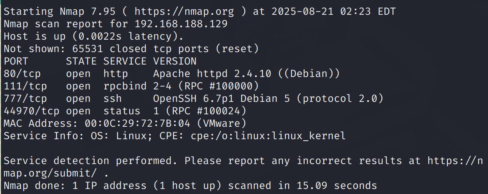

通过对主机开放的端口分析进行攻击建模

* 80/tcp → web渗透
    
    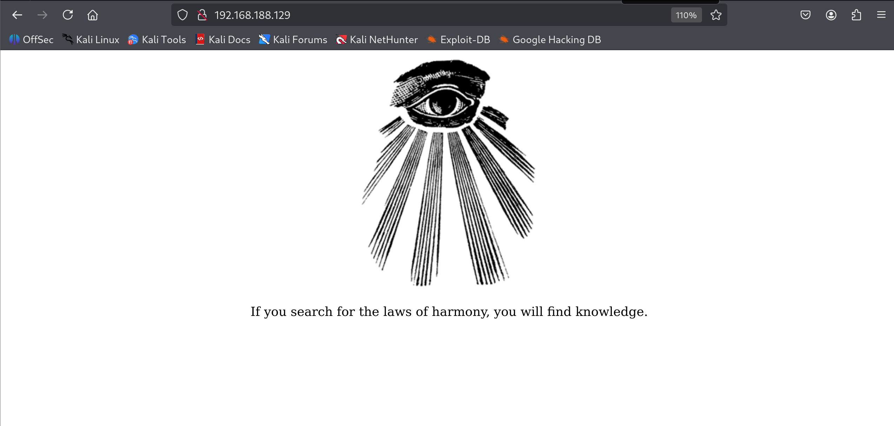
    
    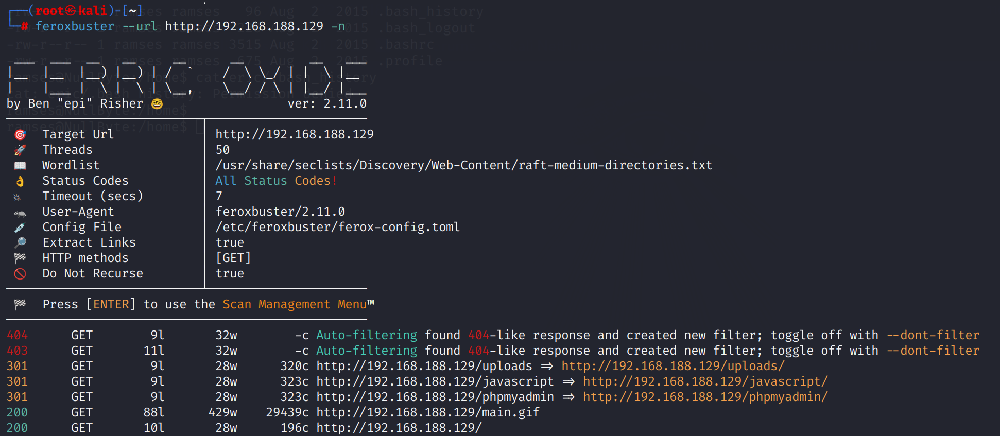
    
    通过`feroxbuster`对目录进行扫描，`-n`告诉工具不进行递归扫描
    
    得到了`phpmyadmin`、`uploads`等关键目录
    
* 111/tcp → rpcbind服务 可能存在nfs未授权
    
    测试无果
    
    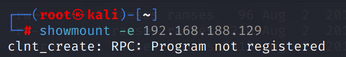
    
* 777/tcp → 指纹识别为OpenSSH
    
* 44970/tcp → rpcbind 用作与rpcbind服务交互
    

# Exif → burp → sqli → shell as ramses

## phpmyadmin & uploads

通过对phpmyadmin进行弱口令尝试无果，暂时不开展进一步渗透，认为不存在已知漏洞

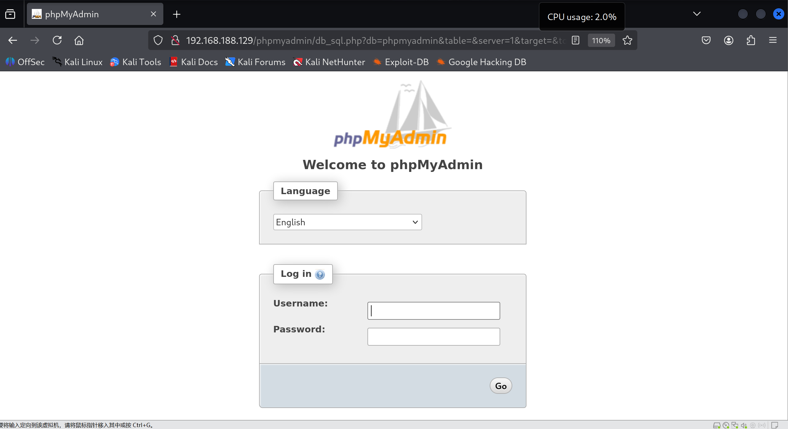

而uploads目录下似乎也没有任何内容，暂时不进行递归扫描

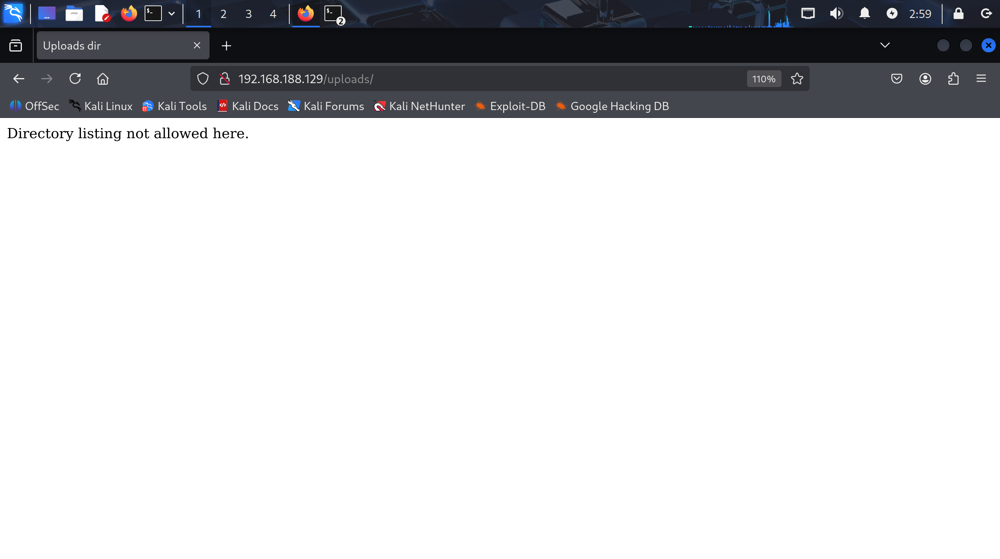

## main.gif

在目录扫描的结果中除开`phpmyadmin`与`uploads`外就只有网站主页显示的main.gif了，根据打靶经验认为直接从phpmyadmin作为跳板渗透的几率很小，那么对`main.gif`开展一波信息收集

> exiftool是一款开源的元数据（Metadata）读写工具
> 
> 元数据就是“描述数据的数据”，比如一张照片，照片内容主体就是它数据本身，而它的元数据就是拍摄这种照片的相机型号、拍摄地点、拍摄时间等信息。

在`Comment`注释中发现一串有意思的字符，这串字符可能是一串密文、一串密码、一个路径

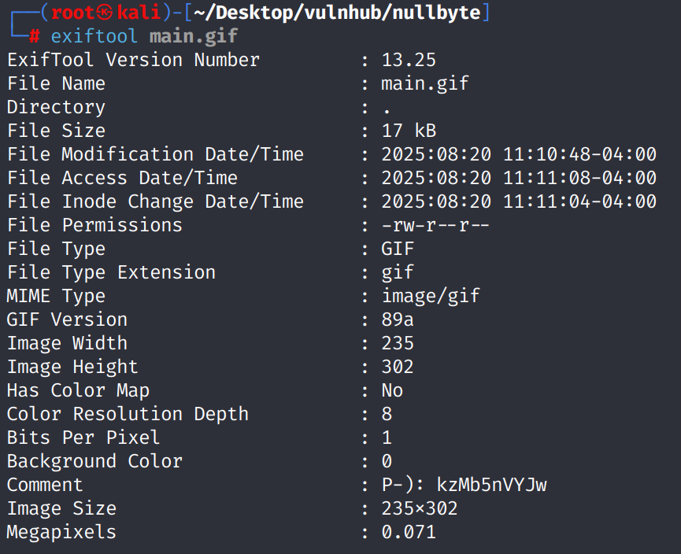

## crack key

从验证时间复杂度最低的网页路径拼接开始尝试，在该路径下得到一个输入Key的功能点，输入后提交数据会发起一个POST请求

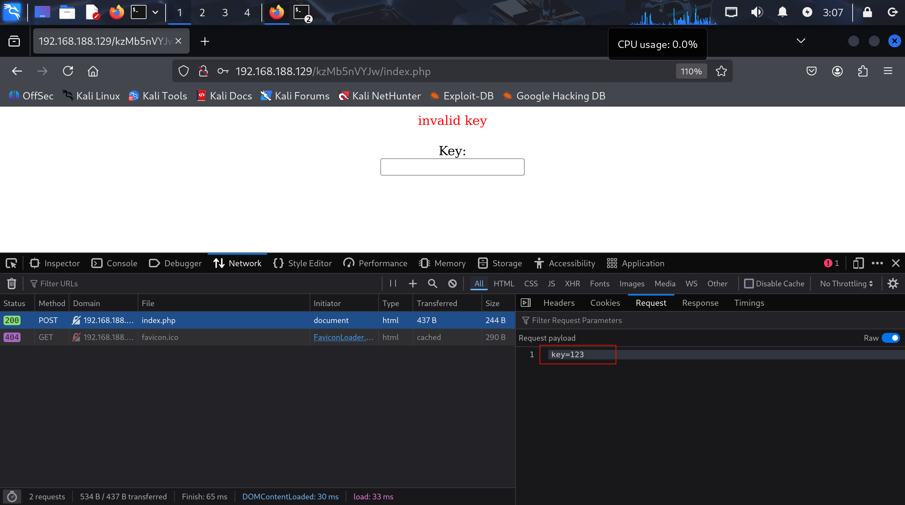

对该参数进行fuzz爆破，得到`elite`

## sqli

访问后得到一个输入用户名进行查找的功能点，双引号报错，开始sql注入

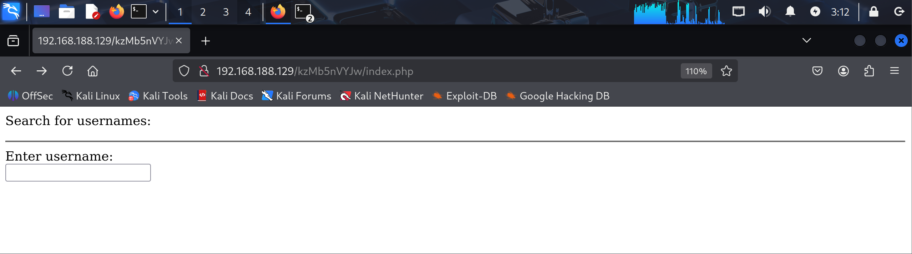

`order by`判断注入点查询字段数为`3`，通过`union select`查询得到当前使用`seth`数据库，注入点权限为`root@localhost`，Mysql版本为`5.5.44`

`0" union select database(),user(),version() --`

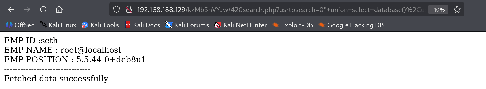

查询`seth`库中表格，发现只有1个`users`表

`0" union select null,null,group_concat(table_name) from information_schema.tables where table_schema=database() --`

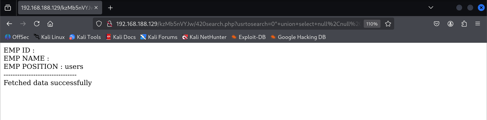

查询`users`表字段名，得到`id`、`user`、`pass`、`position`

`0" union select 1,2,group_concat(column_name) from information_schema.columns where table_name='users' and table_schema=database() --`

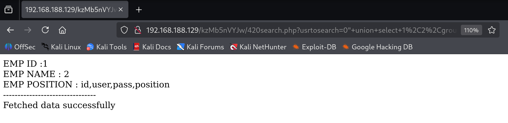

查询数据，发现有1个有效用户`ramses`

`0" union select id,user,pass from seth.users --`

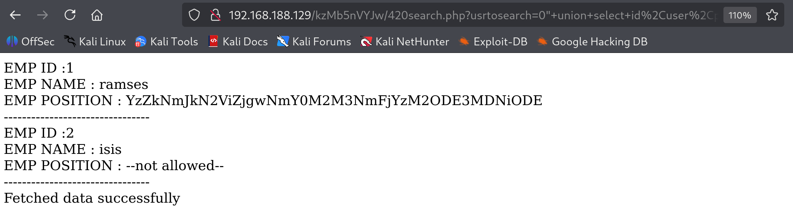

密码看起来像`base64`，解码得到`hash`

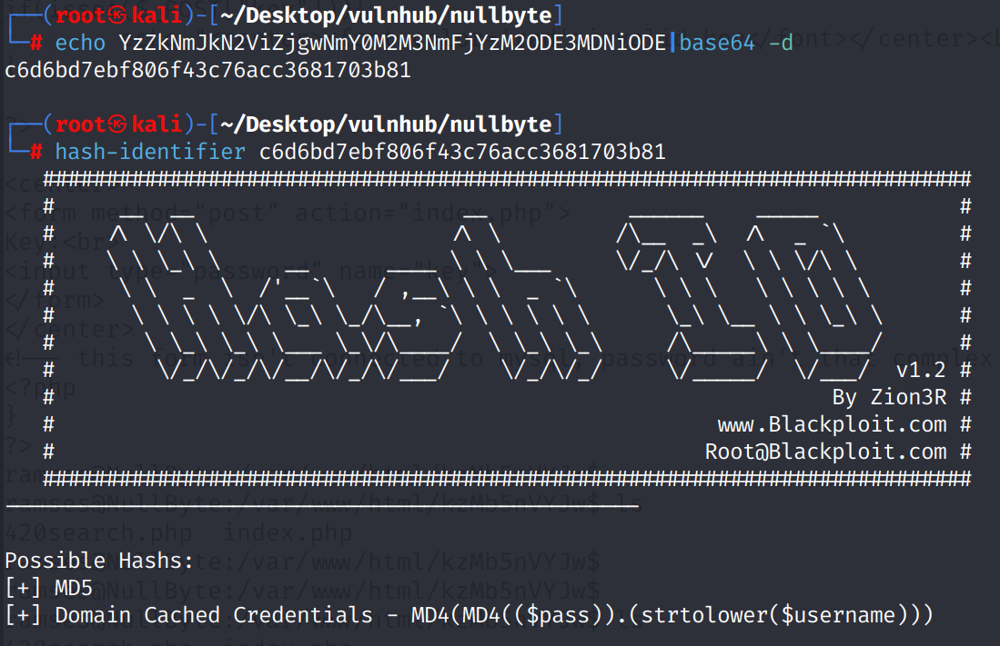

通过`crackstation.net`破解得到`omega`

## shell as ramses

使用ramses/omega尝试phpmyadmin登录无果，尝试777端口登录ssh得到用户权限

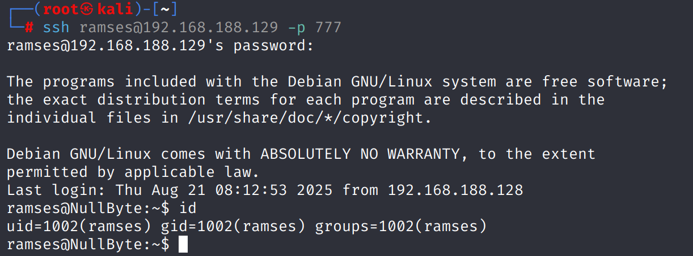

# suid → env hijack → shell as root

## find

通过`find / -user root -perm -4000 -print 2>/dev/null`查找具有suid粘滞位权限的二进制文件

其中`/var/www/backup/procwatch`很特别，尝试执行发现结果类似`ps`命令的执行结果

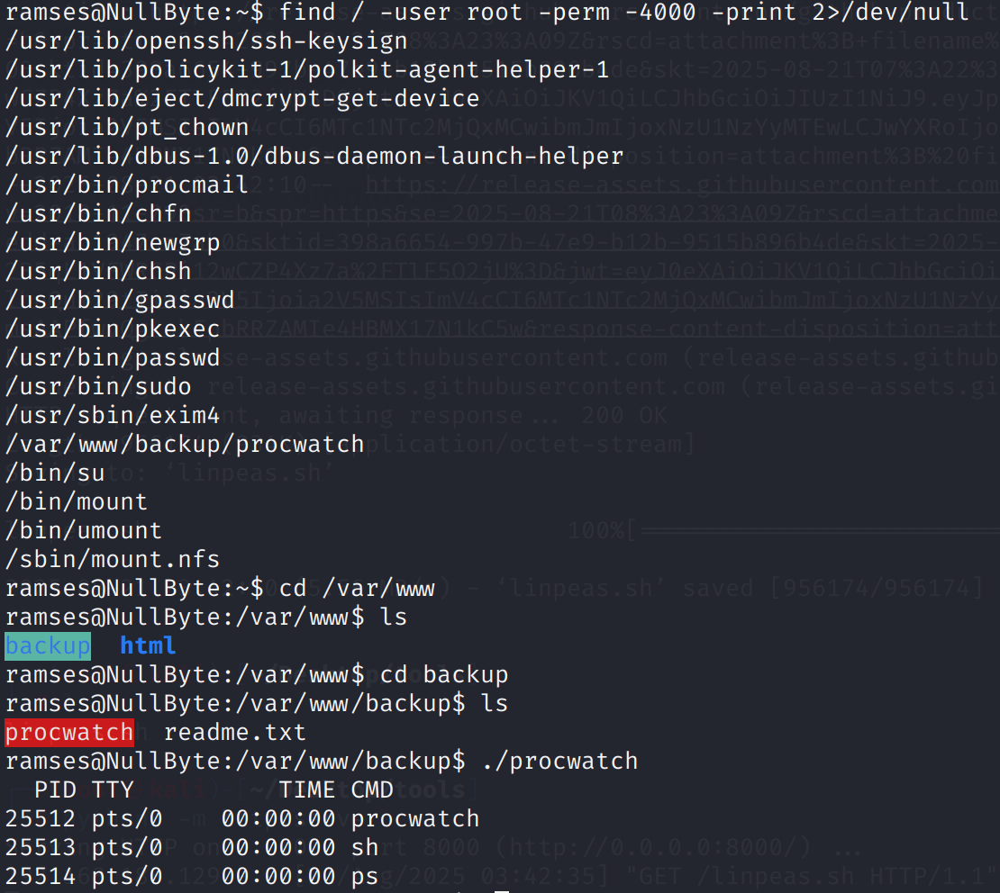

通过`scp`命令将`procwatch`文件copy到本地进行分析，需要注意的是与`ssh`不同，scp指定端口需要使用大写`-P`参数

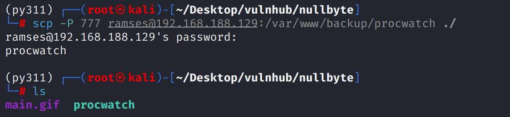

程序内容很简单：

* 创建一个大小为54字节名为`command`的字符型变量
    
* 将`ps`字符放入`command`变量中
    
* 执行`command`变量中的命令
    

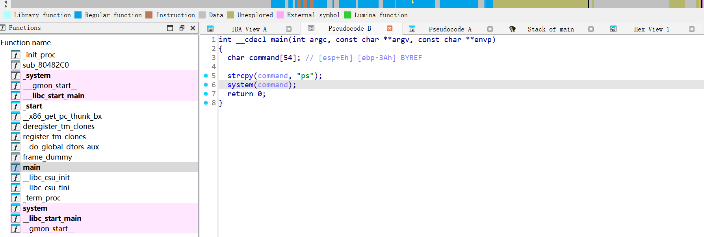

## env hijack

此处可以使用的环境变量劫持关乎到环境变量优先级的问题:

环境变量是使用冒号分割的有序目录列表：如`/usr/local/bin/:/usr/bin/`

在这种情况下假设执行`ps`命令，那么会先寻找`/usr/local/bin/ps`，如果不存在则寻找`/usr/bin/ps`

那么该程序执行的`ps`命令在默认环境变量时执行的是`/bin/ps`，一旦篡改环境变量则会执行我写入的恶意`./malware/ps'`用于生成交互式`sh`

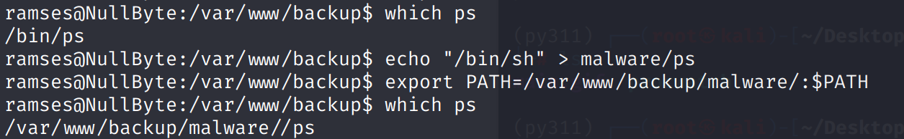

此时再度执行`./watchproc`，提权成功

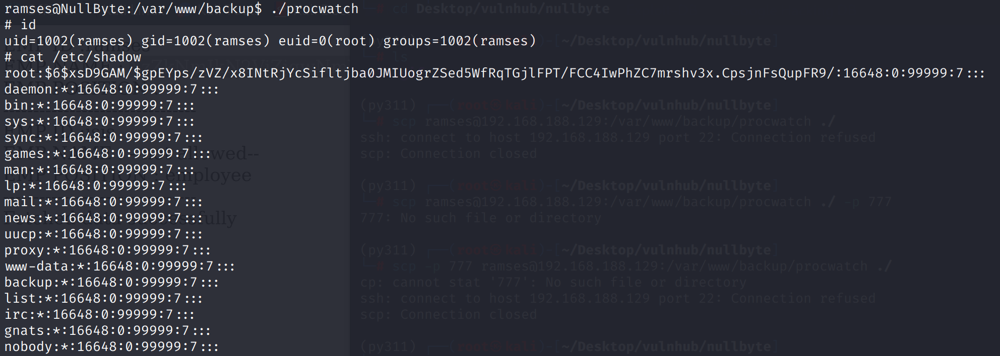

# Some thinking

> 1.为什么在suid提权时无法使用bash？

* 在suid提权时曾发现由带有suid权限的命令派生一个/bin/bash时，这个shell环境将不会继承suid该有的root权限
    

这是由于bash这样的现代化shell内置了一个安全机制。当它启动时会检查自己的真实用户ID(Real User ID, ruid)和有效用户ID(Effective User ID, euid)

* RUID:用于在一个系统中标识一个用户是谁，当用户成功登录时，系统就已经确定了他的唯一RUID
    
* EUID:用于系统决定用户对系统资源的访问权限
    

在提权的场景中，以普通用户权限`ramses`执行带有suid权限的二进制文件，这时ruid为ramses。

而`procwatch`程序有SUID权限且属于root，所以它启动的子进程的euid是root

**当Bash检测到ruid和euid不一致时处于安全考虑，它会自动放弃由SUID获得的更高权限(euid=root)，将自己的有效用户ID降级回真实用户ID(euid=ramses)。**

**bypass:/bin/bash -p → privileges进入特权模式，阻止bash自动放弃由SUID获得的特权**

> 2.在真实环境中是否有export命令设置环境变量的条件？

先说结论：**绝对有**

这涉及到linux系统中`外部命令`与`shell内建命令`的内容

* 外部命令：它们是独立的可执行文件，存在于文件系统的某个目录中，例如`/bin/cat`,`/bin/ls`
    
    当执行一个外部命令时，Shell会在`$PATH`环境变量指定的目录列表中去查找这个文件，然后创建一个新的`子进程(child process)`来执行它
    
* Shell内建命令(shell builtins)：它们不是独立的文件，而是Shell程序本身的一部分它们的实现代码被编译进了Shell的二进制文件(比如/bin/bash)中
    
    当执行一个内建命令时，Shell不会去磁盘上查找文件，也不会创建新的子进程。它会直接在当前Shell进程内部执行相应的功能
    

如何验证一个命令时内建的？

可以通过`type`这个内建命令查看一个命令的类型：

```bash
ramses@NullByte:~$ type export
export is a shell builtin
ramses@NullByte:~$ type cd
cd is a shell builtin
ramses@NullByte:~$ type ls
ls is aliased to `ls --color=auto'
```

所以在提权场景中使用`export`命令来设置环境变量的权限条件一定会有，即使是web打点得到的`www-data`之类的权限，因为shell的编写也使用到了`system`函数来创建一个shell，所以不会影响`export`命令的执行。