# fix network

使用`vmware workstation`部署这台机器的过程中发现它获取不到ip

按照以往的`网卡漂移`解决方案发现没有奏效，转而寻找更多寻找方案最后曲线救国

## 未奏效的方案

按照以往的经验，这类无法获取ip的机器是由于网卡配置文件中的网卡命名与实际网卡名称不一致导致无法获取ip地址，这类情况一般称之为网卡漂移，解决方案也很简单只需要进入`单用户模式`修改配置文件网卡名称即可

* 开启机器的过程中按住`shift`
  
* 出现选择内核界面时键入字母`e`
  
* 将`ro quiet`修改为`rw init=/bin/bash quiet`
  
* `ctrl + x`保存并重启机器
  
* 将会进入root权限的shell，在这个模式下完成网卡命名或配置文件网卡命名问题的修复
  
* 重启
  

以往的机器到这里即可解决问题，但这台机器不太一样

## virtualbox & vmware → bridge network YES!!

在`vulnhub`的`Description`中看到作者有说这台机器只在`VirtualBox`中进行过测试，其可能无法在`VMware`中运行

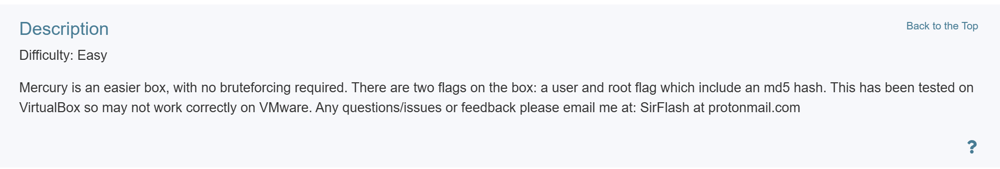

笔者对`VirtualBox`不太熟悉，经过一番了解，知道其有一套专门的虚拟网络方案，不会也无法与`vmware`共享虚拟网卡

由于kali部署在vmware，也并没有意愿去virtualbox中部署一套kali，思路转向为让vm虚拟机与vb虚拟机通信

那么先假设这台机器在VirtualBox能正常运行并获取到IP地址

* 将`Vmware kali`虚拟机网卡设置为`仅主机模式` → Vm使用`Vmnet0`作为仅主机模式虚拟网卡
  
* 将`VirtualBox Mercury`虚拟机网卡设置为仅主机模式 → VB使用`VirtualBox Host Only Ethernet`作为虚拟网卡
  

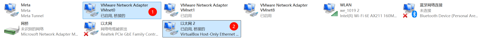

通过`Ctrl`同时选中两张网卡，右键选择`桥接`

将会得到`网桥`网卡，对其配置静态IP，使用`Vmware虚拟网络编辑器`中对`仅主机模式`配置的`子网范围`内IP

（vmware dhcp默认主机号从128开始，设置小于128的主机地址都不会有冲突风险）

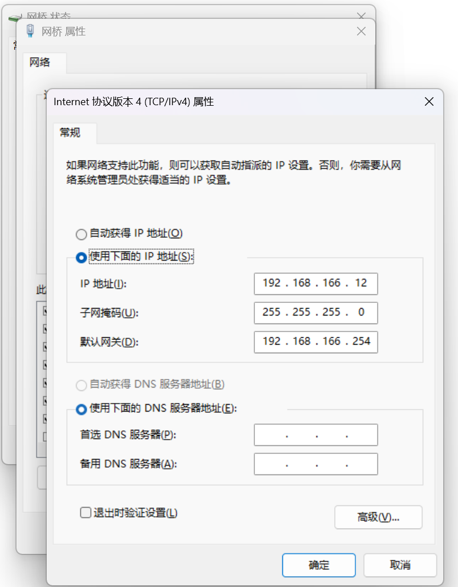

## **have fun**

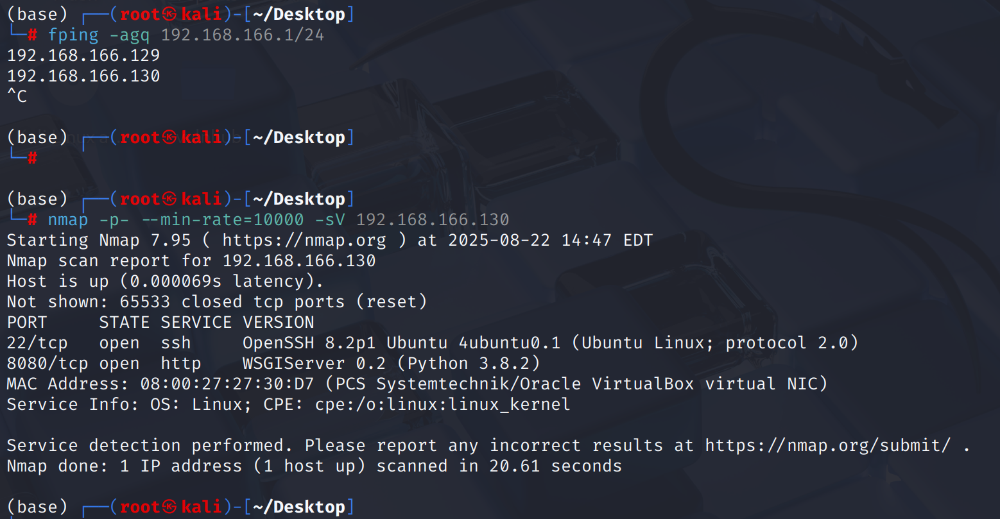

# Recon

在上面的侦察中发现这台机器`8080/tcp`开放了`WSGIServer`，python为`3.8.2`

通过`ferosbuster`扫描发现存在`robots.txt`但访问后没有有效信息

测试一波`WSGIServer debug`信息泄露，访问一个不存在的网页，得到了一些关键信息

站点是使用Django进行的架设，并且存在一个`mercuryfacts`目录

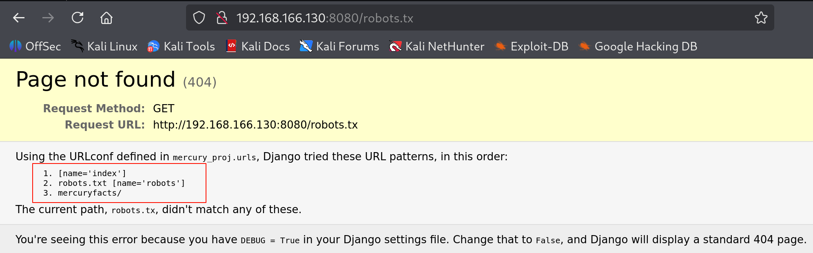

# shell as webmaster by sqli

访问`mercuryfacts`目录，出现了两个功能点

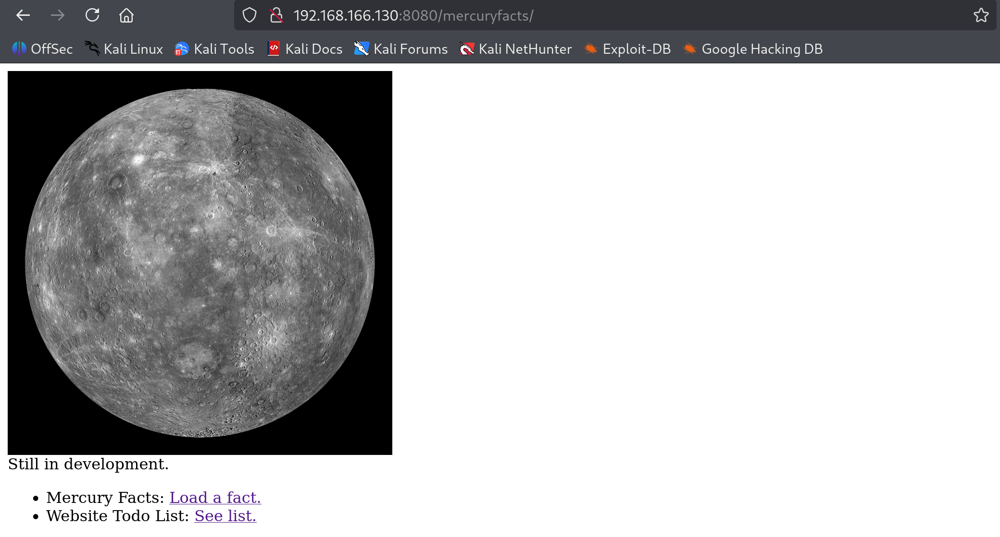

`Load a fact`功能点进入后url中携带了路径`1`,网页主体告诉我这是一个id，那么大概率是`伪静态`注入

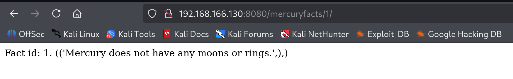

尝试了一下确实是 那么交给`sqlmap`

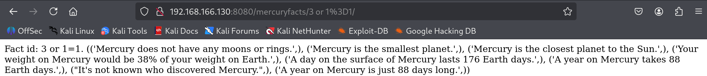

同时存在报错注入、时间盲注和联合注入

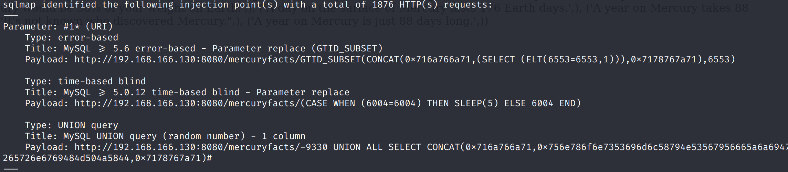

选择时间复杂度最低的报错注入导出`mercury`数据库的数据，发现有users表包含了账号密码

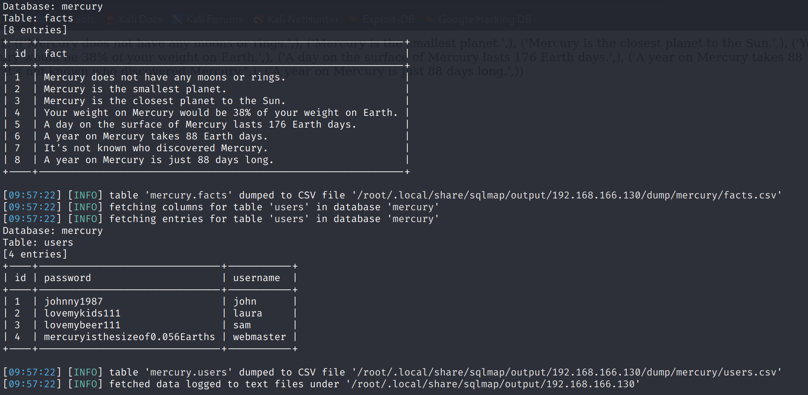

那么使用这些用户数据尝试登录一下ssh？

不出所料只有`webmaster`可以登录

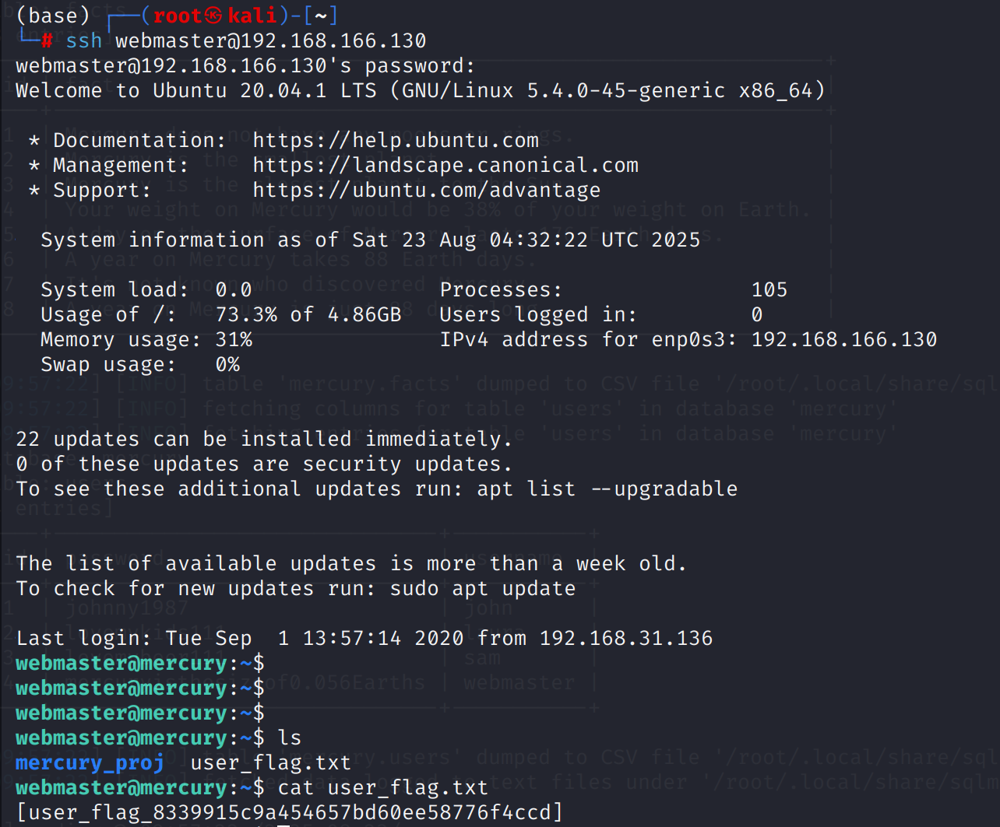

# shell as linuxmaster

进入`mercury_proj`目录，发现`notes.txt`，其中存放了`webmaster`和`linuxmaster`用户密码，经过`base64 decode`后`su`到`linuxmaster`用户

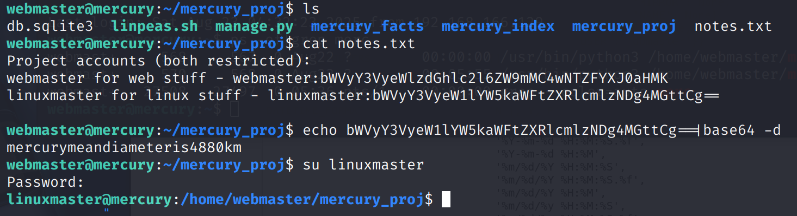

# shell as root by env hijack

对`linuxmaster`用户权限环境做信息收集过程中发现可以通过`sudo`执行`/usr/bin/check_syslog_.sh`，最重要的是`SETENV`表示允许用户在执行命令时自定义环境变量

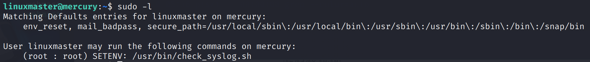

可以看到`check_syslog.sh`是一个使用`tail`命令打印`/var/log/syslog`的脚本

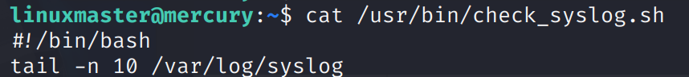

那么只需要通过劫持环境变量写入恶意`tail`命令后设置环境变量，然后通过`sudo --preserver-env`执行脚本即可，这里的参数告诉sudo在执行命令时保留当前shell进程中的`PATH`环境变量

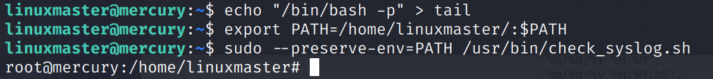

# Some thinking

> 什么是wsgi？与django有什么关系

* WSGI是一套规范标准，不是一个软件也不是一种框架，而是一种由python官方定义的技术规范和协议
  
* 在没有WSGI前，python web应用需要`nginx`、`apache`等中间件来完成web应用建设
  
* django就是一个遵循WSGI标准的web应用框架