# Recon

机器开放`ssh`、`mysql`和两个`web server`

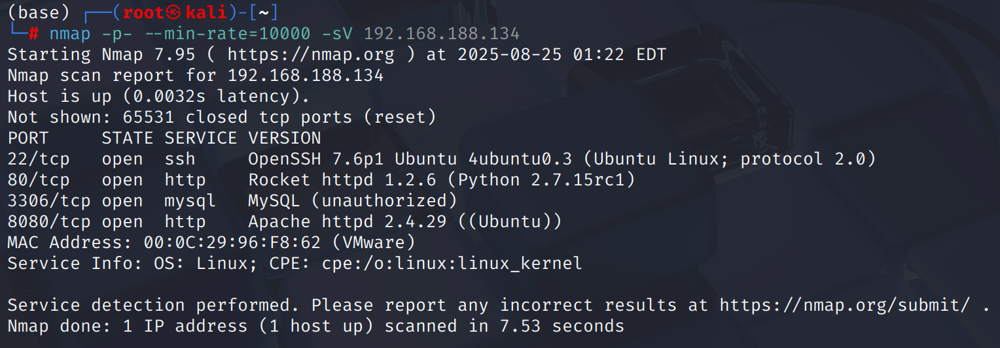

## 80/tcp → EVote → web2py

80端口在`nmap`扫描结果中能看到是`python`架设的应用，访问后在底部`banner`中发现是`web2py`

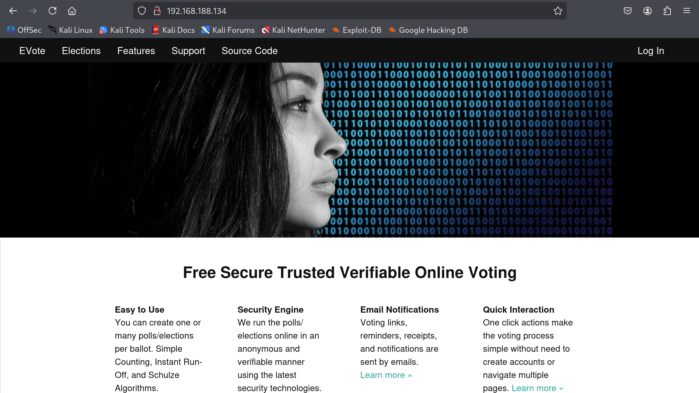

从网页主体内容发现这是一个`EVote`电子投票系统，`Source Code`指向[https://github.com/mdipierro/evote](https://github.com/mdipierro/evote)

整体的功能点都需要登陆后访问

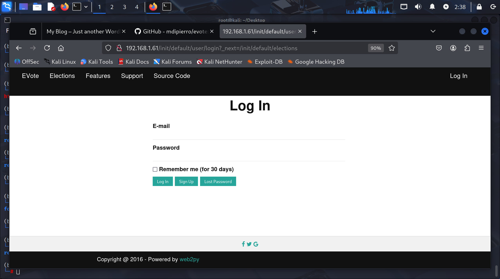

## 8080/tcp → wordpress

从`feroxbuster`对`8080`端口的目录扫描结果来看，存在一个`wordpress`，但是访问后页面显示异常，`network`中能发现是因为服务器从`192.168.1.61:8080`请求`css`，但机器ip并非这个，可能是出题人在初始化`wordpress`的时候有硬编码

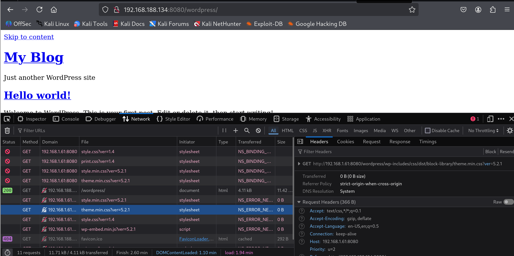

为了能够顺畅的打这台机器，把`VmNet8`子网段改为`192.168.1.0`，分配ip起始为`192.168.1.61`

然后记得一定要先开启`misdirection`机器再打开攻击机

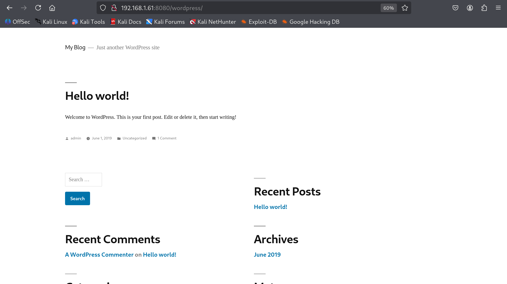

`feroxbuster -n`关闭递归扫描，发现了一些关键目录

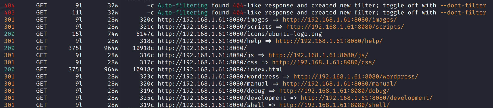

`/debug`给了一个`www-data`权限的`webssh`

通过`find . -maxdepth 3 -path './wordpress' -prune -o -ls`排除`wordpress`目录递归3级列出

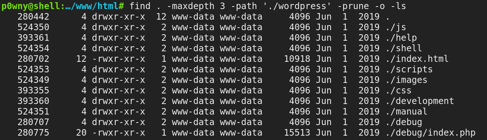

---

根据以上信息整理思路：

* `8080/tcp`使用`apache`运行`wordpress`，`www-data`权限通过`/debug`目录已交付
  
* `80`端口通过`python`运行一个`web2py`框架的`EVote`电子投票系统，权限位置
  

# wp-config.php → mysql ← error

既然`8080/tcp`运行的用户权限已取得，可以通过`wp-config.php`查看数据库信息，连接后寻找`80/tcp`开放的应用账号

```php
/** MySQL database username */
define( 'DB_USER', 'blog' );
/** MySQL database password */
define( 'DB_PASSWORD', 'abcdefghijklmnopqrstuv' );
```

但实际上不允许远程连接，通过`webssh`发现也没有权限

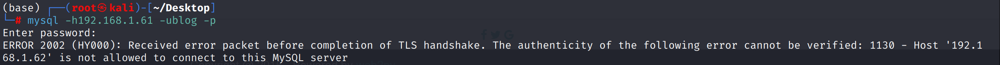

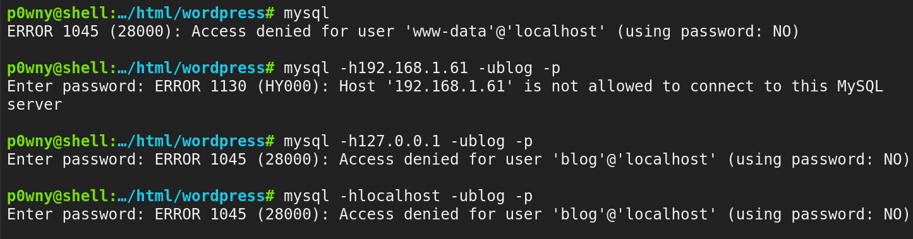

# shell as brexit by sudo

查看`/etc/passwd`文件，发现存在一个有效普通用户`brexit`，其`/home`目录存在`user.txt`，说明是作者设计的一环

`80/tcp`的服务就是以`brexit`用户权限运行

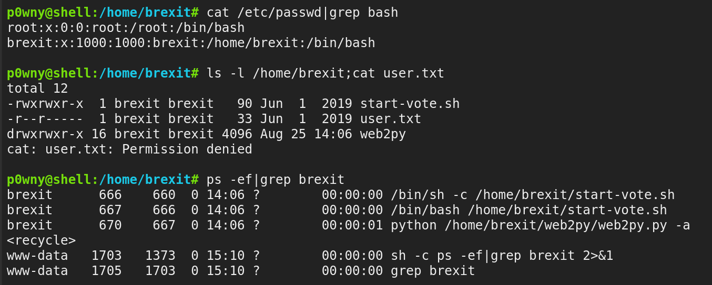

在这个webssh中不太好交互，反弹到`pwncat`执行`linpeas`

发现`www-data`有免密通过`brexit`权限执行`/bin/bash`指令的功能，意味着可以直接切换到`brexit`用户

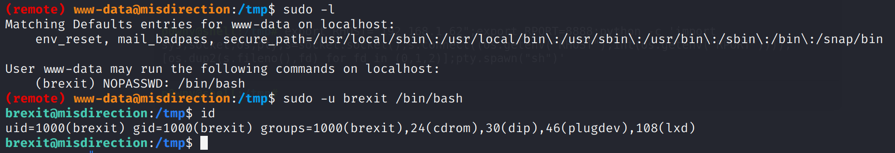

# shell as root by /etc/passwd

在`brexit`用户跑一下`linpeas`，发现`/etc/passwd`可写

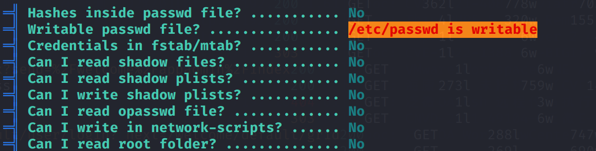

那么直接把`brexit`用户`uid`和`gid`改为`0`就行

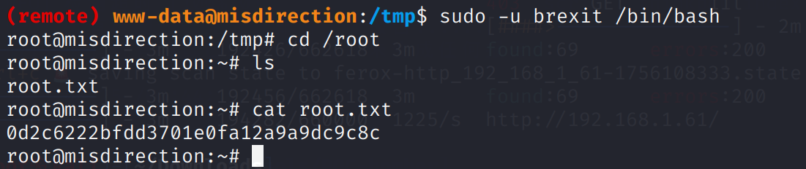