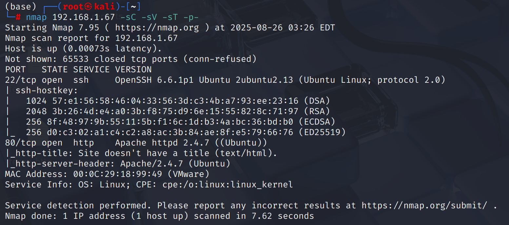
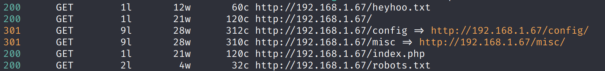
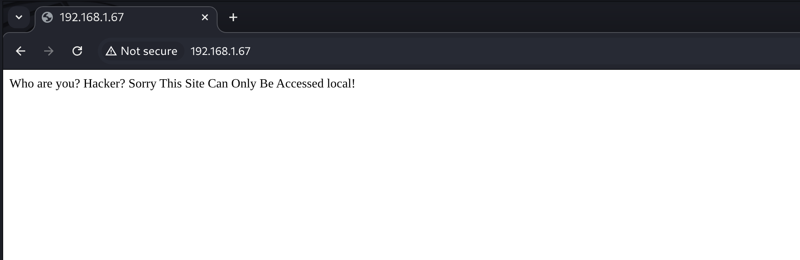
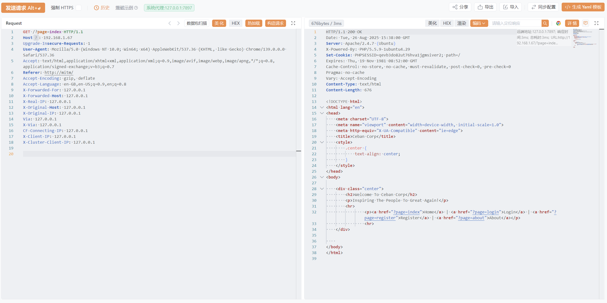
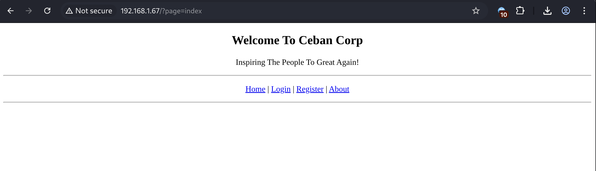
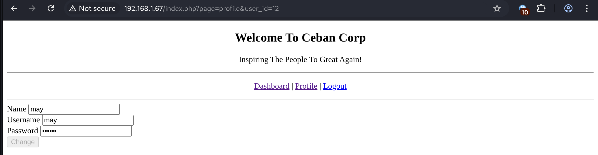
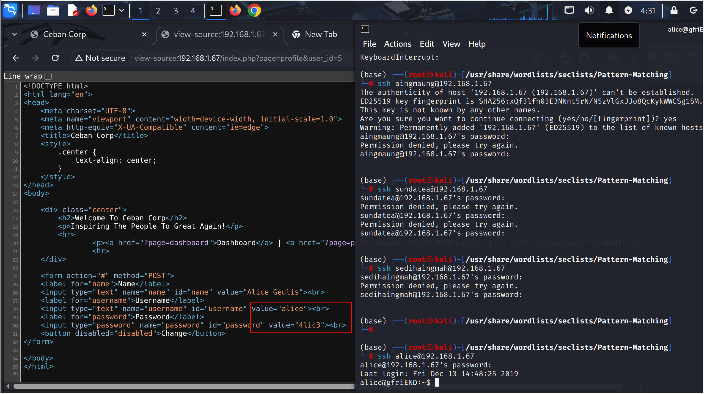
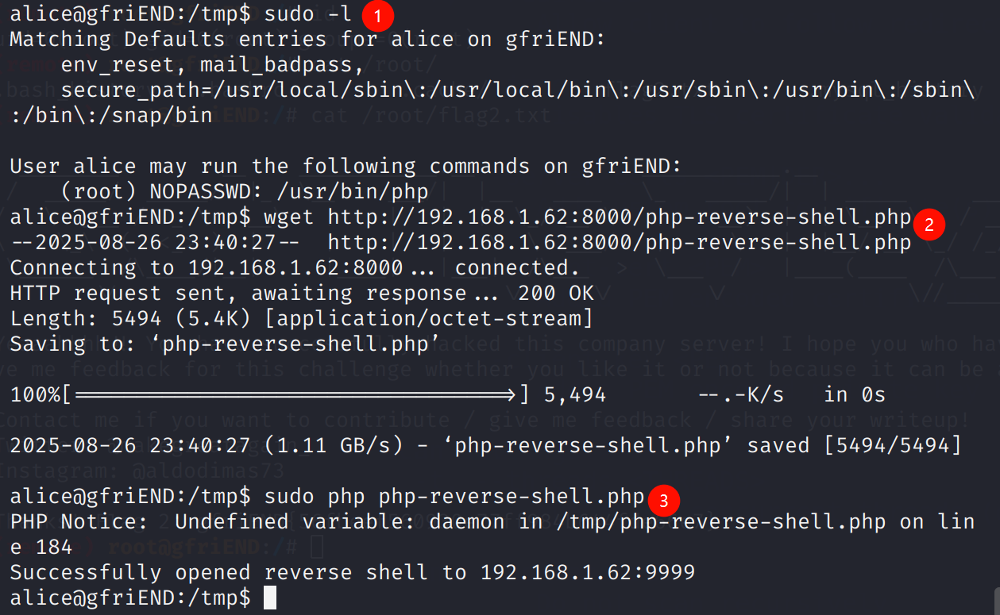

# Recon

这台机器只开放ssh和web

看看`feroxbuster`结果，有一些攻击向量

`robots.txt`泄露`heyhoo.txt`路径

`heyhoo.txt`回显`Great! What you need now is reconn, attack and got the shell`

`config/`目录遍历存在`config.php`文件，打开后被解析无回显

`misc/`目录遍历存在`process.php`文件，打开后被解析无回显

# shell as alice by user\_id enum

网页前端回显`Who are you? Hacker? Sorry This Site Can Only Be Accessed local!`，似乎在指示`XFF`伪造

携带一系列源ip伪造的header

经测试，目标识别`X-Forwarded-For`

注册一个账号，登陆后发现传递了`user_id=12`，尝试遍历`user_id`

由于`password`控件被`auto-fill`了，可以通过源代码直接查看到明文密码，并且通过尝试使用遍历得到的用户名密码登录ssh，在尝试到`user_id=5`时，发现`alice`用户可以正常登录

# shell as root by sudo-php

基本的信息收集发现可以免密执行`php`，那么直接`php-reverse-shell.php`就行

