# Recon

这台机器叫`FileServer`，从扫描结果来看开启了`ftp`、`nfs`、`samba`的确比较具象

除此以外还开放了`ssh`以及`web`

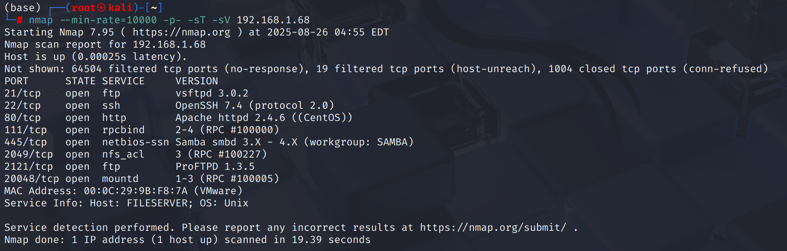

## ftp - anonymous login - leak logs

ftp存在匿名登陆，存在`pub/log`目录，通过`mget *`指令下载所有文件

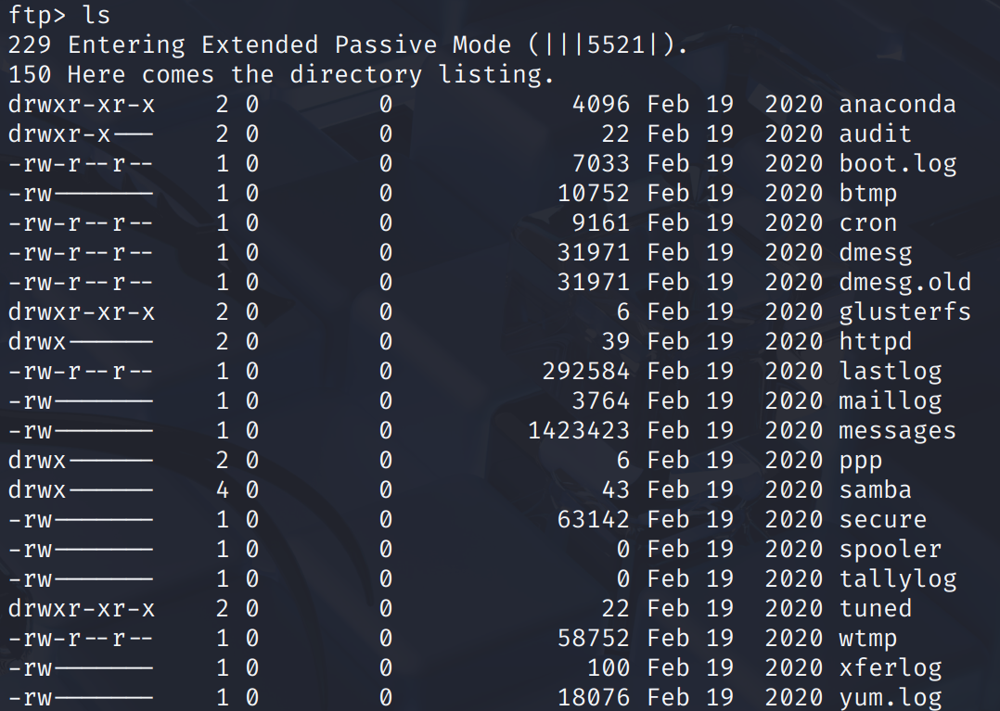

存在一些没有权限下载的文件

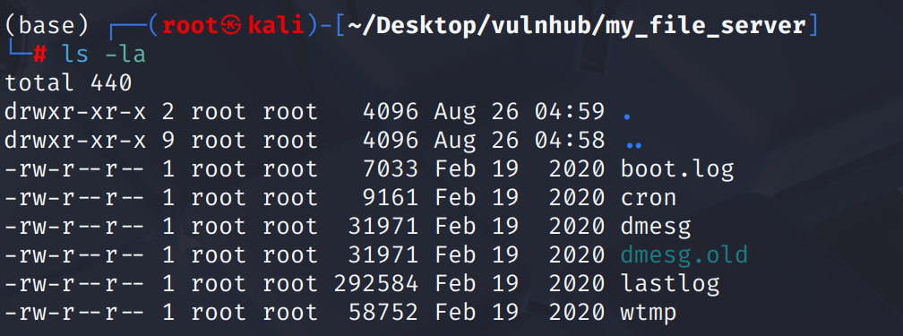

## nfs → smb

发现存在`smbdata`目录，但只允许`192.168.56.0/24`网段范围内IP挂载

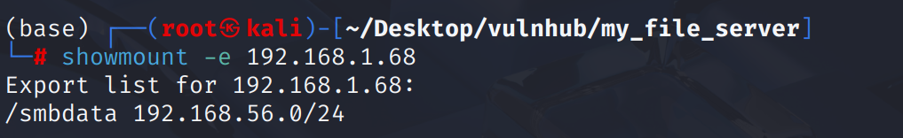

根据`smbdata`命令能猜测`samba`服务可能有访问权限

使用`smbmap`扫描，并使用`smbclient`连接发现需要密码

`smbuser`应该是运行`samba`服务的用户名

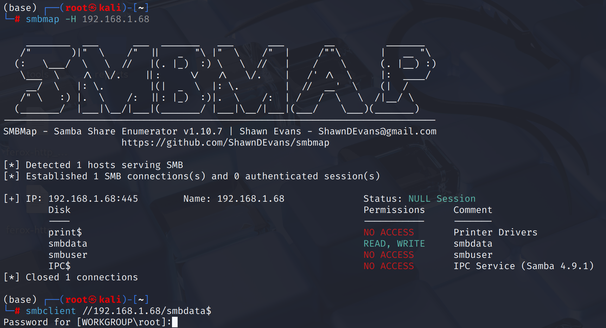

## 80 → web

web前端只有一个外链`href`,目录扫描看一下

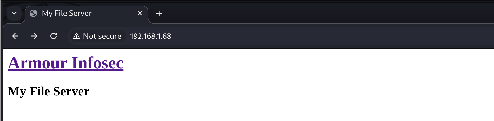

`feroxbuster`发现`readme.txt`

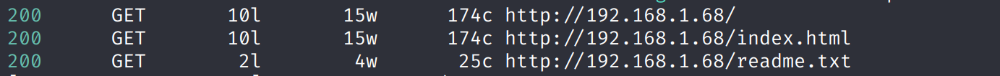

# shell as smbuser by readme.txt

`/readme.txt`返回了密码`rootroot1`，可能是上文收集到的`smbuser`用户密码

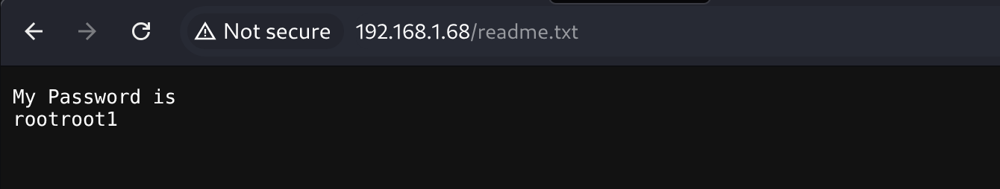

发现这个用户可以登录ftp，但无法登录ssh

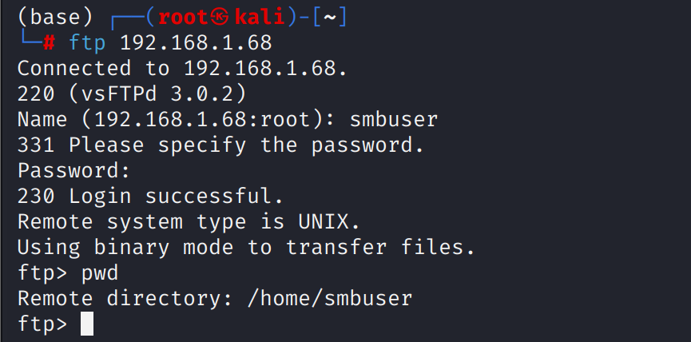

因为ssh配置关闭了密码登录而只允许私钥登录

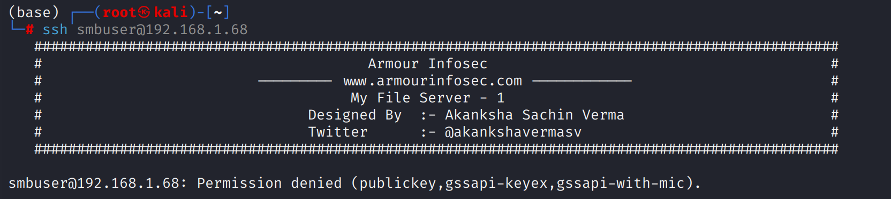

那么就登录ftp创建`.ssh`文件夹，然后上传公钥到`authorized_keys`实现免密登录

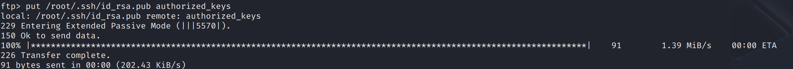

使用`id_rsa`进行私钥登录

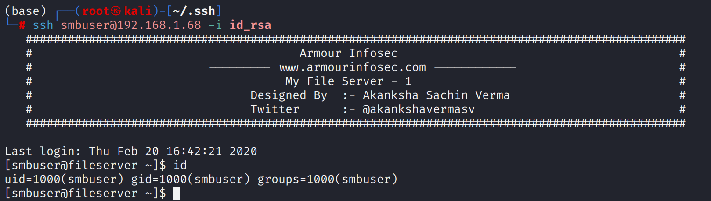

# shell as root by dirtyCow

`40616.c` 提权失败….不玩了 内核提权没意思

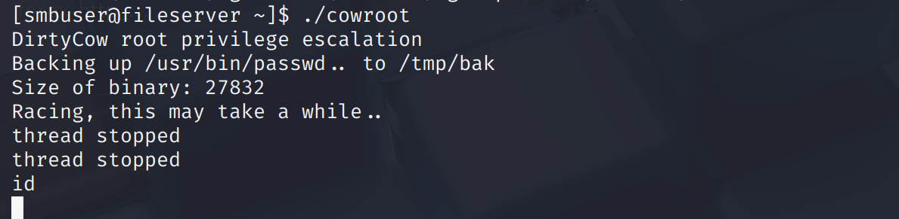