# Recon

这台机器开放了ftp、web、nfs和ssh

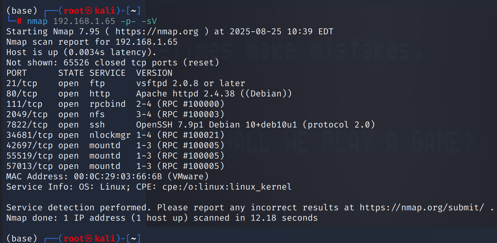

挂载nfs目录，发现存在`Templates`目录，目录下没有任何内容，`home`目录文件没有权限

但这个路径给了一个合法用户名`morris`

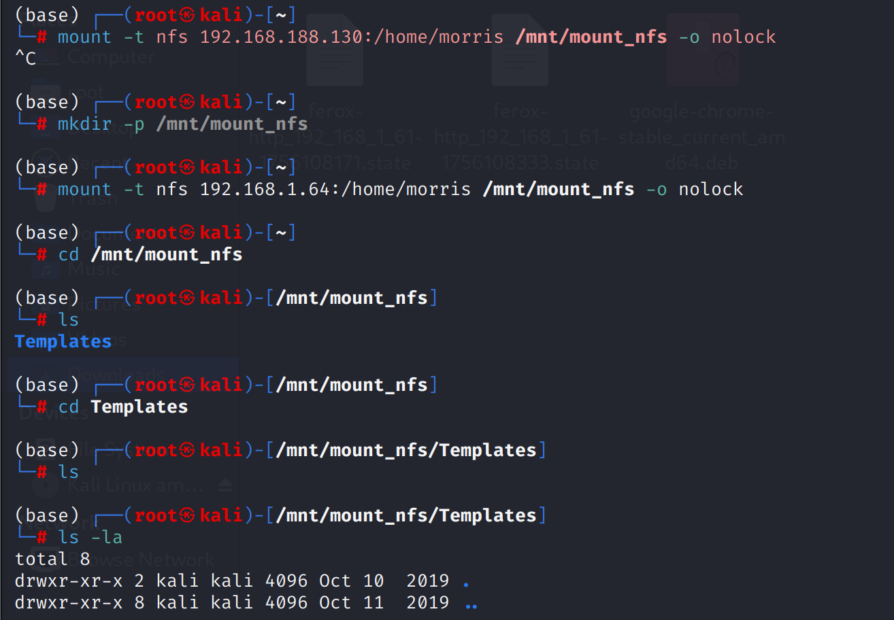

`feroxbuster`目录扫描有一些攻击向量

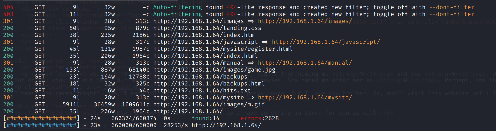

`mysite/register.html`存在注册页面

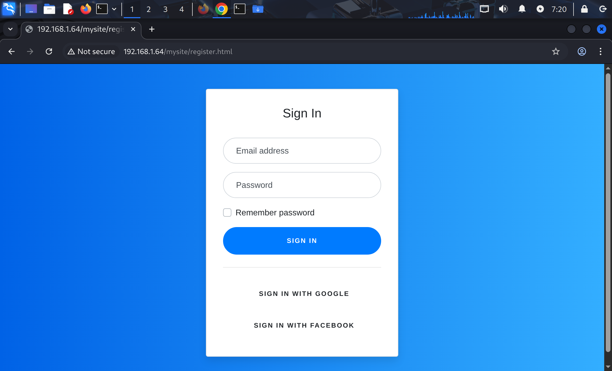

# shell as norris by jsfuck

web站点首页有`<href index="index.htm"` 指向`http://192.168.1.64/index.htm`

web站点一般使用`index.html`作为首页，而`.htm`也是前端可解析文件，所以点击会感觉没反应

实际上网页源代码已经发生变化，在注释中泄露了用户名`norris`

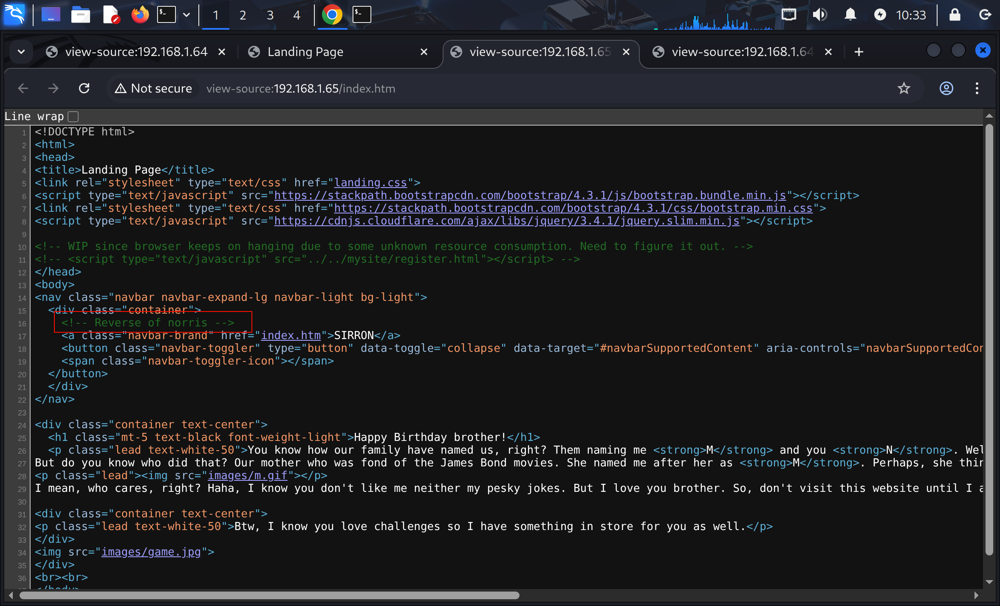

`http://192.168.1.64/mysite/bootstrap.min.cs`泄露了`jsfuck`，解密需要删除所有非`jsfuck`字符

解密后得到`You're smart enough to understand me. Here's your secret, TryToGuessThisNorris@2k19`

尝试ssh登录

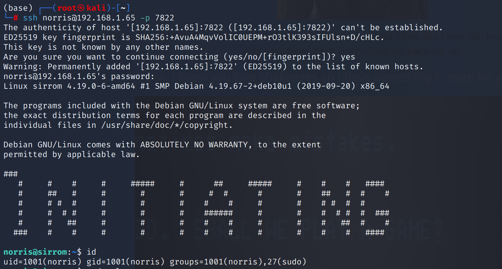

# get root.txt by tar

使用`linpeas`收集信息，发现`capabilities`信息，其中`tar`命令引人关注

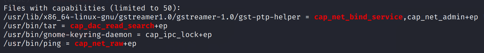

其中`/usr/bin/tar`具有`cap_dac_read_search`权限向量，这意味着`tar`命令被赋予了绕过常规文件权限机制读取任意文件和遍历任意目录的权限，而`ep`是权限有效性的标志，分别代表`effective`和`permitted`，即生效和许可

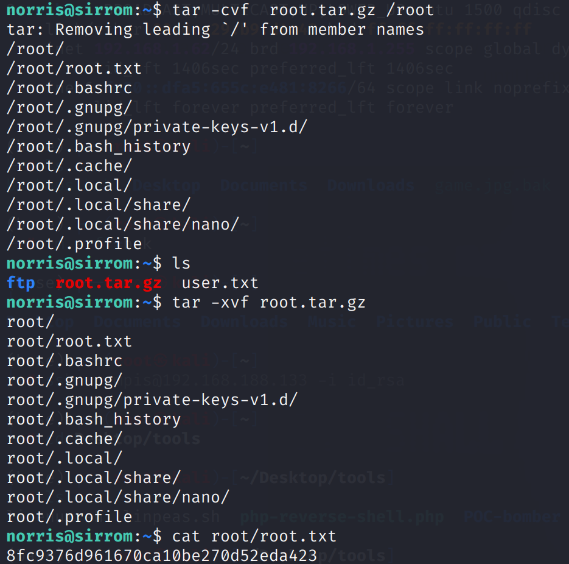

# shell as root by polkit

仅仅通过`capabilities`读取到`/root.txt`还不够，获得`root`身份权限的目标还没有达成

通过寻找`suid`命令文件，发现`/usr/lib/policykit-1/polkit-agent-helper-1`存在suid

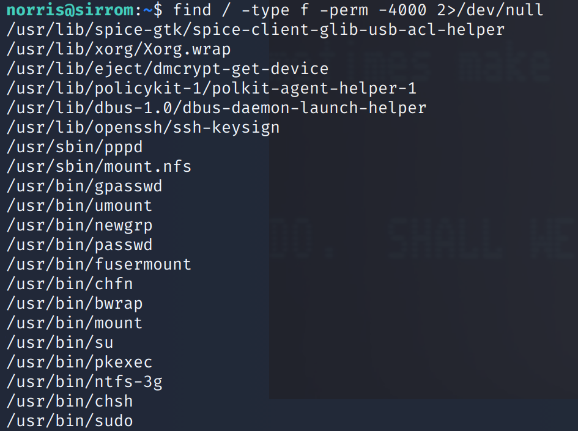

`polkit-agent-helper-1`并不是一个被用于直接执行以实现某种功能的命令，而是用于辅助`policy kit`执行的一个工具

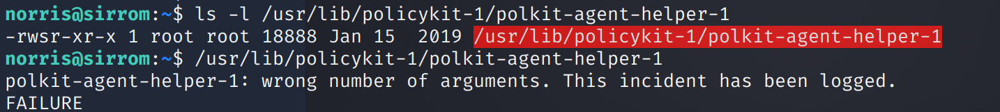

`policy kit`是一个应用程序级的权限控制框架，简单来说，当一个用户执行需要管理员权限的某种操作时（如挂载设别，安装软件等），`polkit`就会介入

`polkit -agent-helper-1`就是`polkit`调用过程中用于安全的处理密码输入及身份认证的组件

通过`systemd-run -t /bin/sh`调用`polkit`权限生成一个shell实现提权

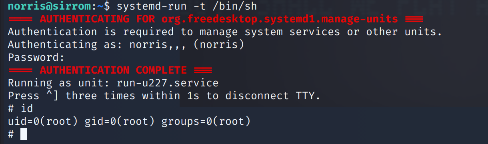