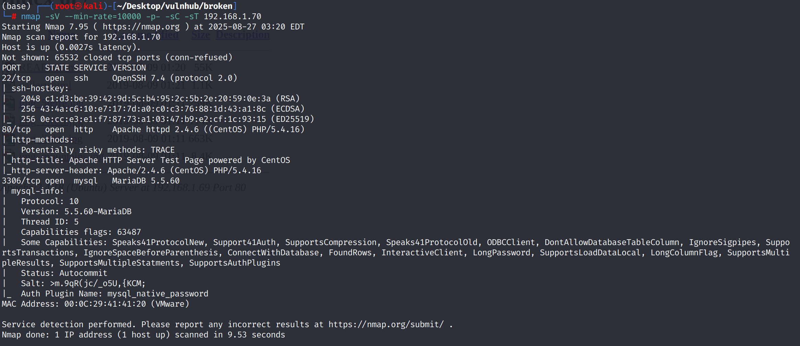
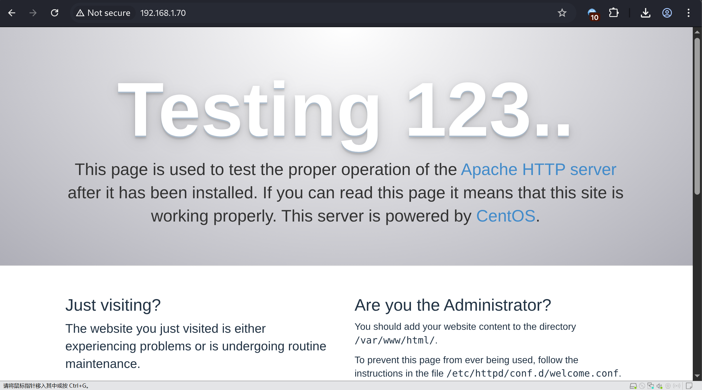
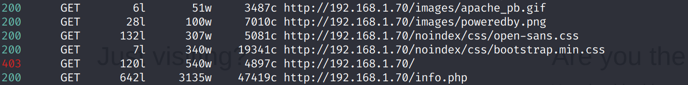
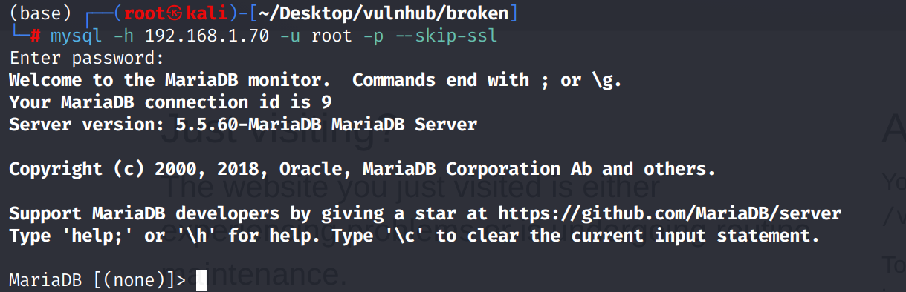
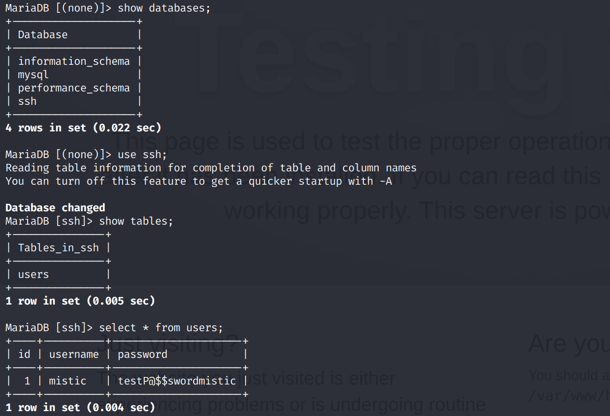
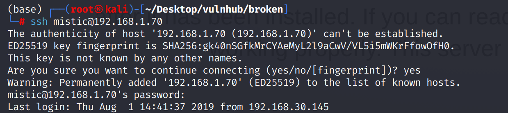
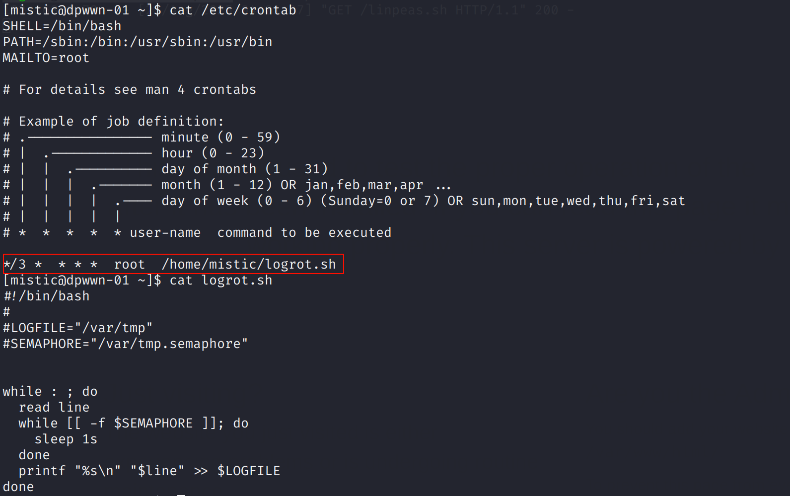
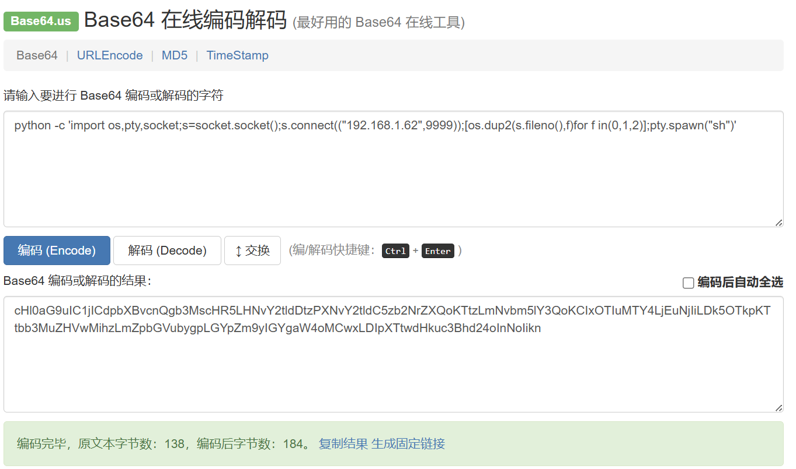
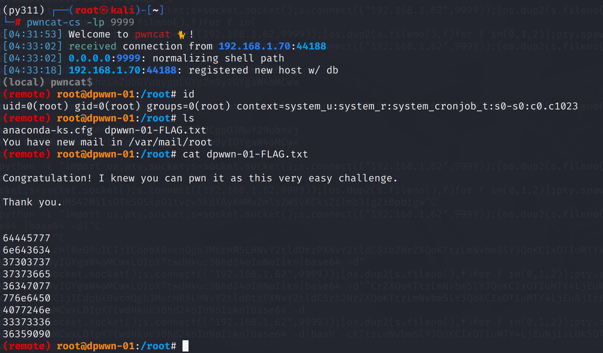

# Recon

机器开放了ssh、web和mysql，除了web似乎没有其它初始攻击向量

网页前端是一个`apache default page`,源代码中也没有有效信息

`feroxbuster`目录扫描得到`info.php`

`info.php`是`phpinfo`，没有发现有效信息

# shell as mistic by mysql

把目标给`yakit`弱口令爆破，发现`mysql`密码为空，登录一定要使用`--skip-ssl`忽略证书问题

在`ssh`库`users`表得到一个用户名

ssh登录得到`mistic`用户权限

# shell as root by crontab

例行检查，发现存在`root`权限运行的计划任务

`crontab`执行脚本`reverse shell`的场景要尽量避免多层引号及特殊字符

把python的`payload`base64编码

然后通过`echo "echo {payload}|base64 -d|bash" > logrot.sh`写入脚本

