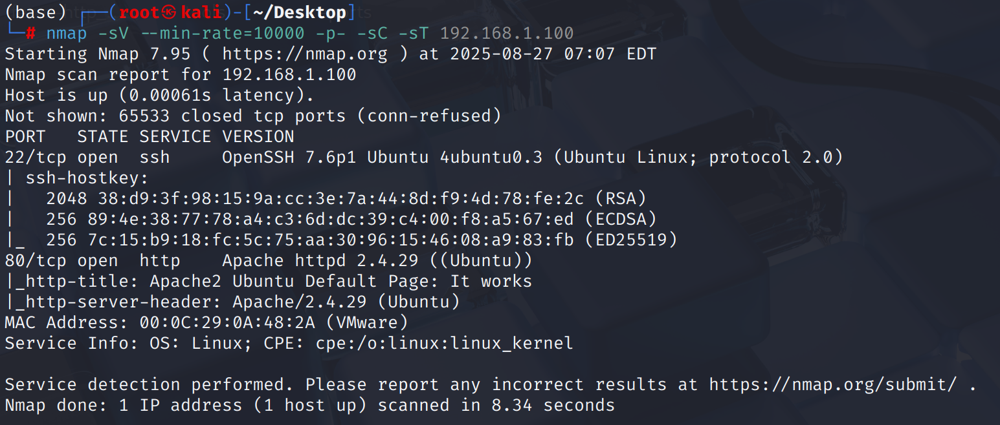
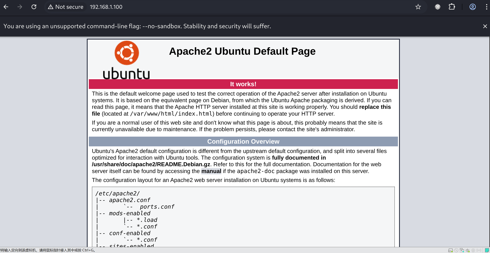
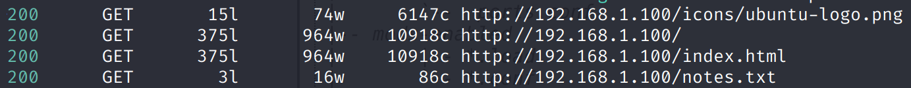
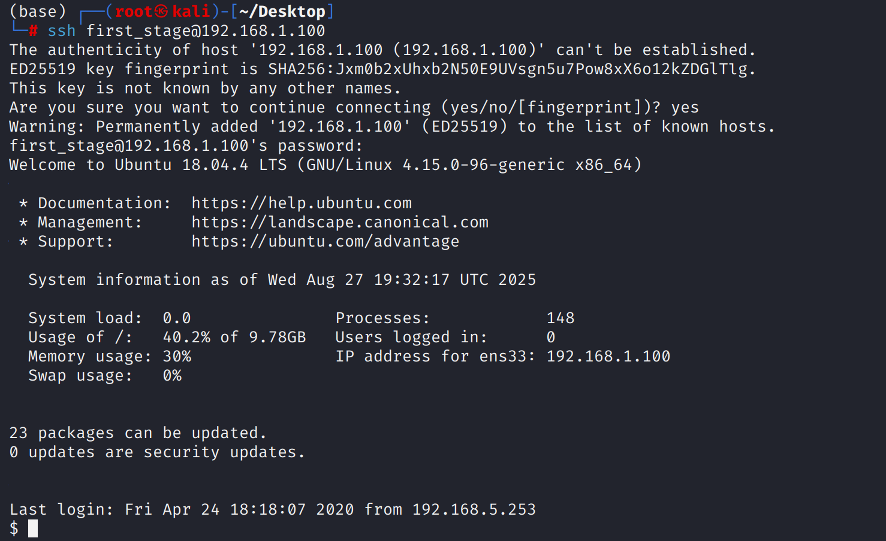
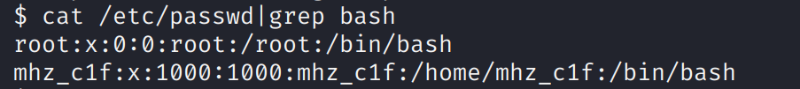
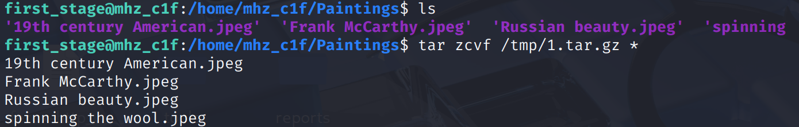
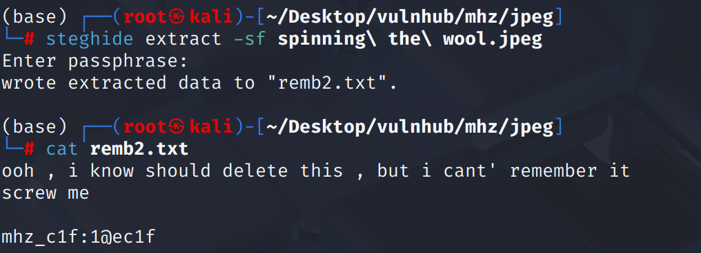
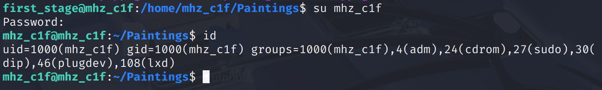
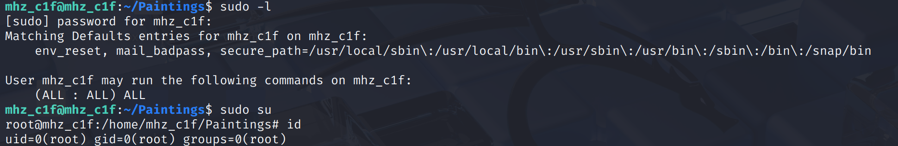

# Recon

这台机器仅开放`ssh`和`web`



web前端是`apache default page`



# shell as first\_stage by remb.txt

`feroxbuster`扫描得到`notes.txt`



`notes.txt`回显的内容中包含了`remb.txt`和`remb2.txt`

```php
1- i should finish my second lab 
2- i should delete the remb.txt file and remb2.txt
```

`remb.txt`回显`first_stage:flagitifyoucan1234`，`remb2.txt`访问不存在

将`remb.txt`回显内容作为登录凭证取得`first_stage`用户权限



# shell as mhz\_c1f by steghide

例行检查，发现存在`mhz_c1f`普通用户



在`mhz_c1f`的`home`目录下发现四张图片，打包出来分析



逐一使用`steghide extract -sf`分析，在`spinning the wool.jpeg`中提取出`remb2.txt`



# shell as root by sudo

其中包含`mhz_c1f`用户口令，`su`切换用户



例行检查，发现可直接`sudo`提权


