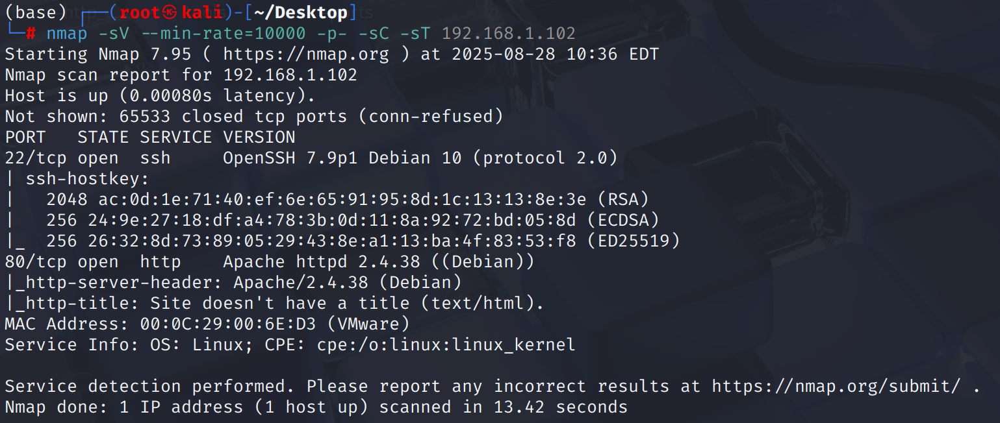
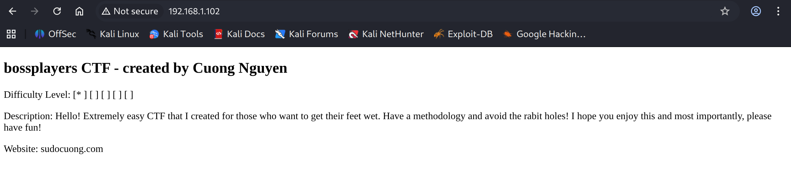
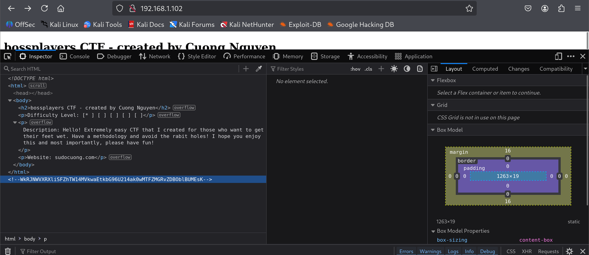
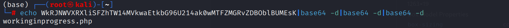
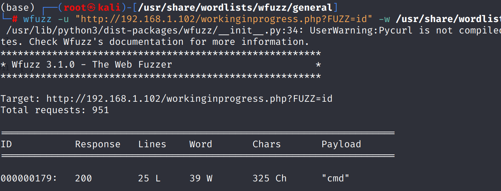
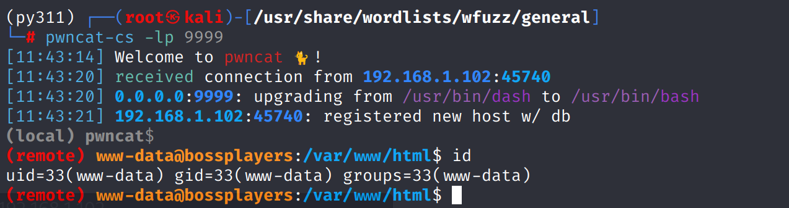
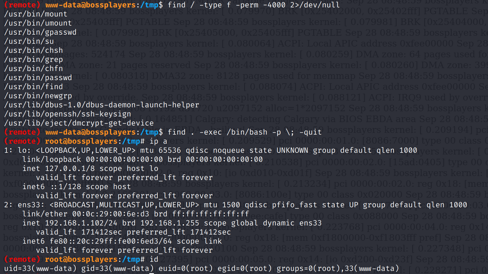

# Recon

机器仅开放`ssh`和`web`

# shell as www-data by rce

网页前端有一些信息

在渲染后的源代码中发现一串字符，看起来像`base64`

存在多层`base64`，解码3次后得到`workinginprogress.php`

页面只有一些状态信息，其中`Test ping command`隐含了命令执行漏洞，通过`fuzz`参数得到`cmd`

通过`python`反弹shell

# shell as root by suid

例行检查发现`find`存在`suid`，直接提权即可

