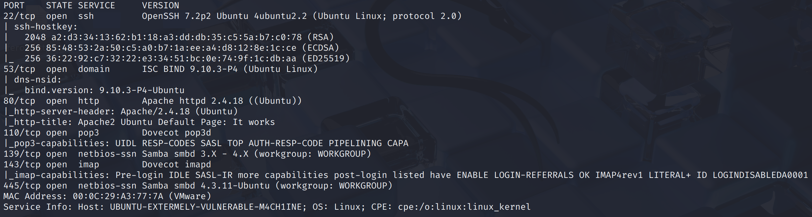
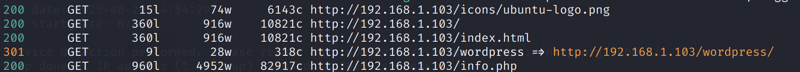
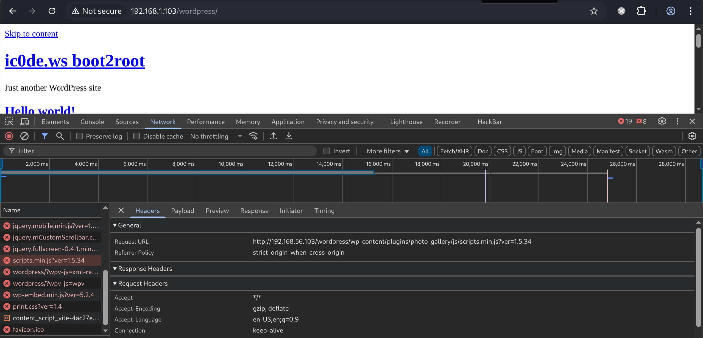
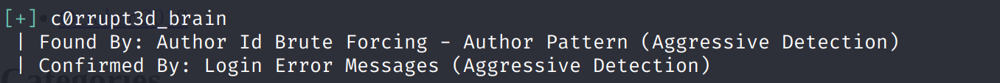
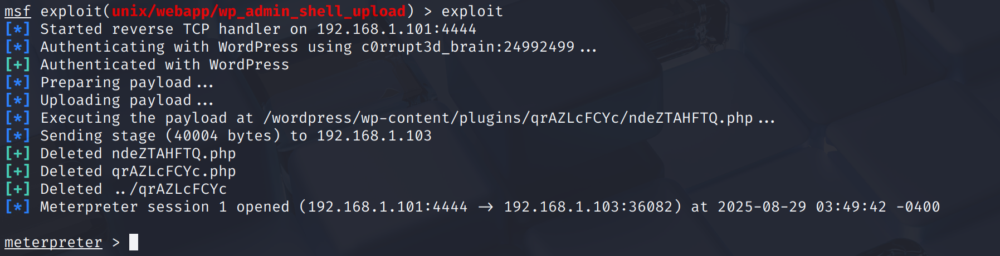
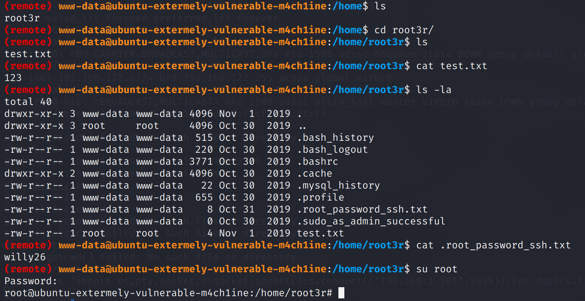

# Recon

机器开放`ssh`、`dns`、`web`、`mail`、`445`

网页前端是`apache default page`，目录扫描存在`wordpress`和`info.php`

`wordpress`访问发现css无法加载，因为其向`192.168.56.103`发起的静态资源请求，但这并不是我们的ip

# shell as www-data by wordpress

前端资源文件的加载异常不影响渗透工作的进行，直接上`wpscan`扫描

`wpscan -eu`参数可以通过对可观测前端信息进行用户枚举，得到`c0rrupt3d_brain`用户

继续使用`wpscan`进行密码爆破 → `wpscan --url {} --usernames {} --password{}`

\[SUCCESS\] - c0rrupt3d\_brain / 24992499

使用`wp_admin_shell_upload`Getshell

`meterpreter`的`shell`不好用，弹给`pwncat-cs`开展后续渗透

# shell as root by password leak

例行检查中发现`/home/root3r/.root_password_ssh.txt`文件，尝试`su`到`root`，发现密码正确

