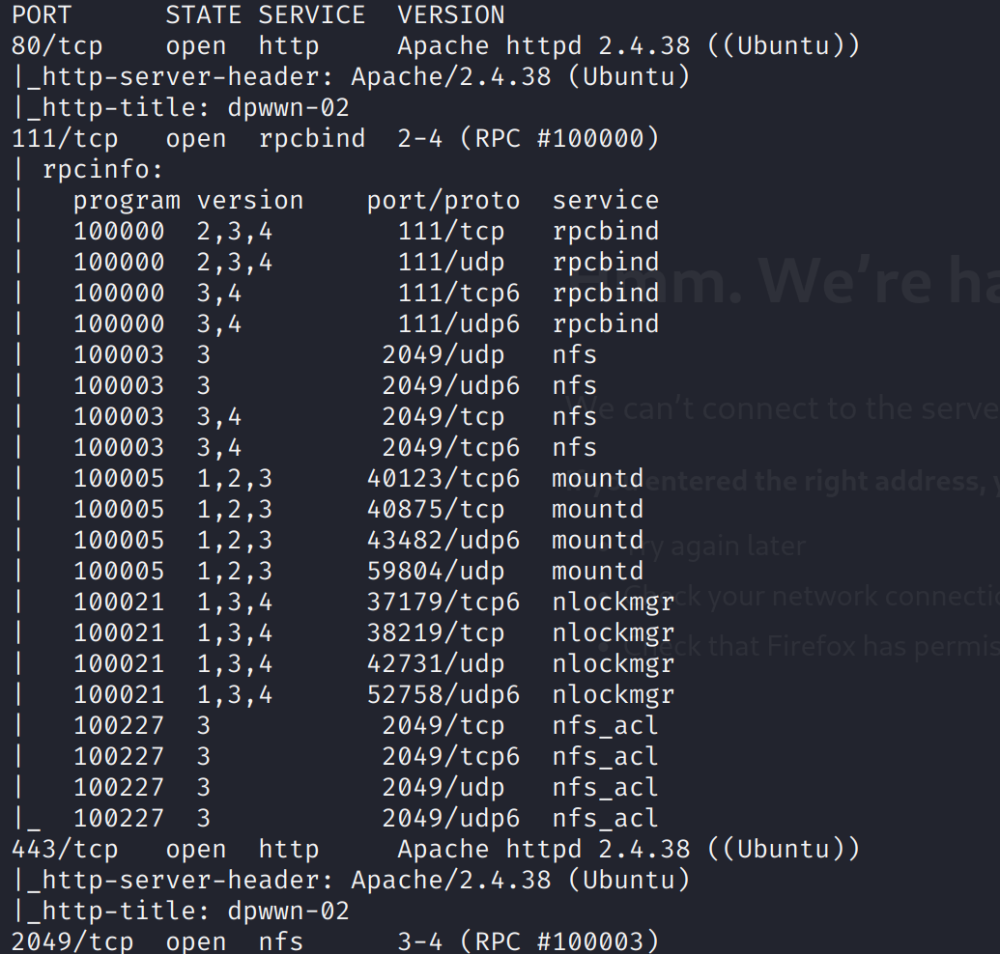
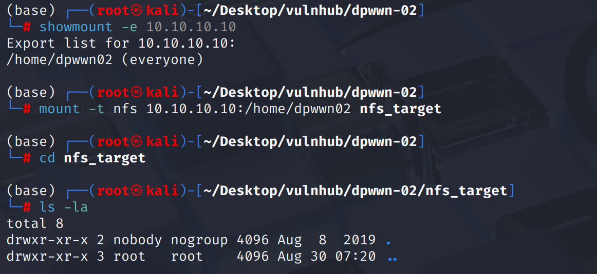
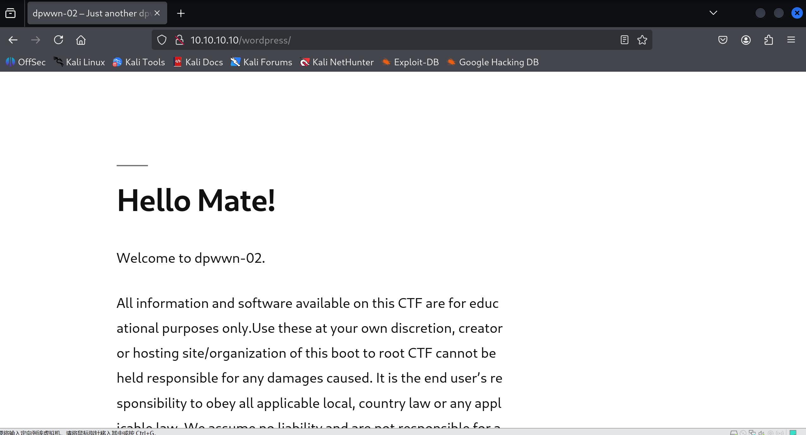
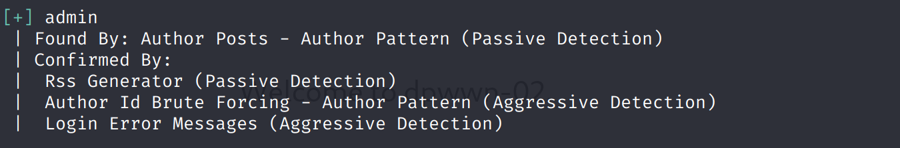
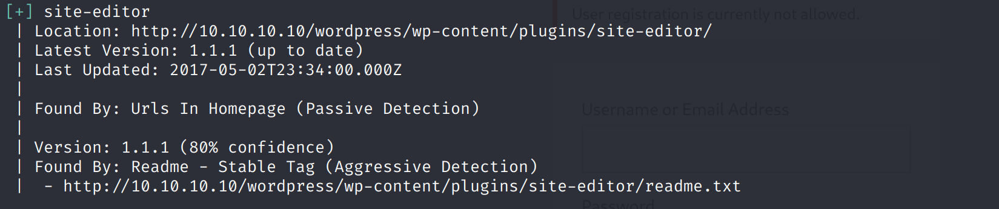
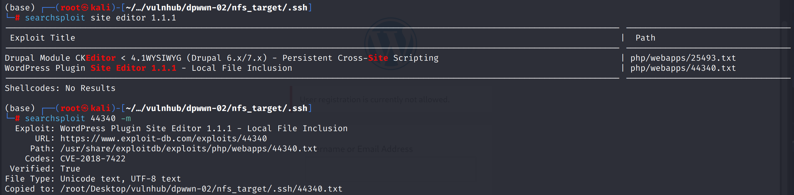
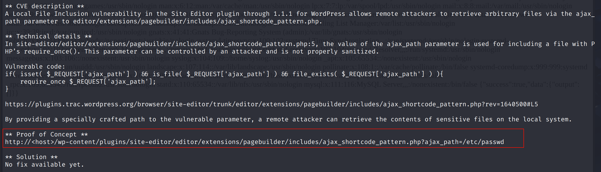
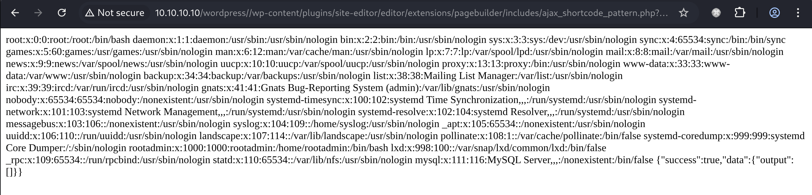
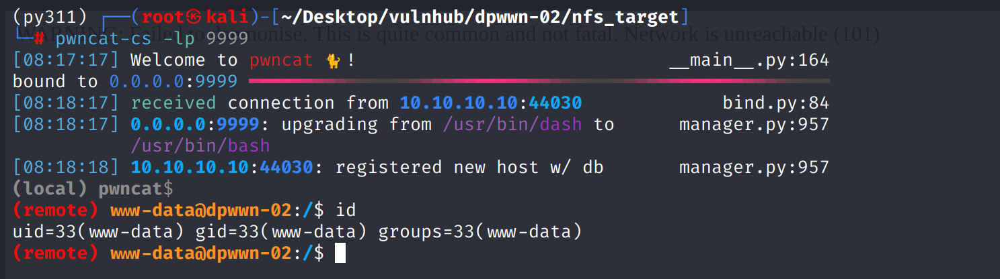
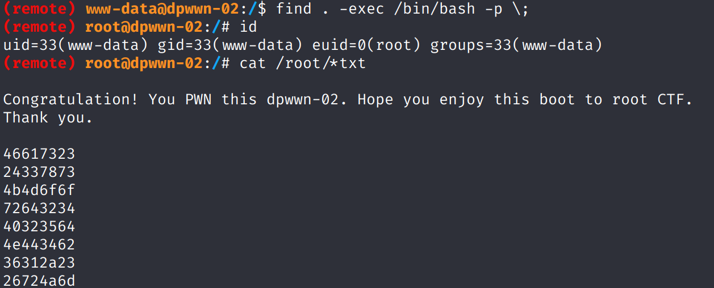

> 这台机器使用静态地址`10.10.10.10`，需要保证攻击机使用同网段地址
> 
> 其次在导入机器后启动可能发生“当前硬件版本不支持设备sata。”报错
> 
> 需要右击虚拟机选择“更改硬件兼容性”，将版本设置到vmware workstation 16.\*即可解决

# Recon

机器开放了`web`、`nfs`，其中包括`https`

## nfs

`nfs`目录下没有任何文件，有`write`权限，后面再考虑

## web

目录扫描发现这是一个`wordpress`

`wpscan`枚举得到`admin`用户，爆破无果

# shell as www-data by wp-plugins

使用`wpscan --url http://10.10.10.10/wordpress -e p`枚举插件，发现`site-editor`

使用`searchsploit`找找有没有漏洞，发现一个文件包含漏洞

验证一下`poc`，漏洞存在

通过nfs向`/home/dpwwn02`目录写入`php-reverse-shell.php`，文件包含后反弹`shell`

# shell as root by suid

例行检查，发现`find`命令存在`suid`，直接`exec`提权

