# Recon

机器开放了`ssh`和4个`web`

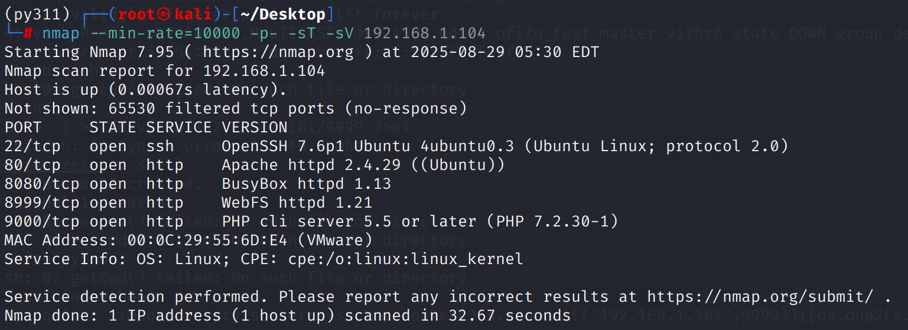

## 80/tcp

网页前端返回`No configuration file found and no installation code available. Exiting…`

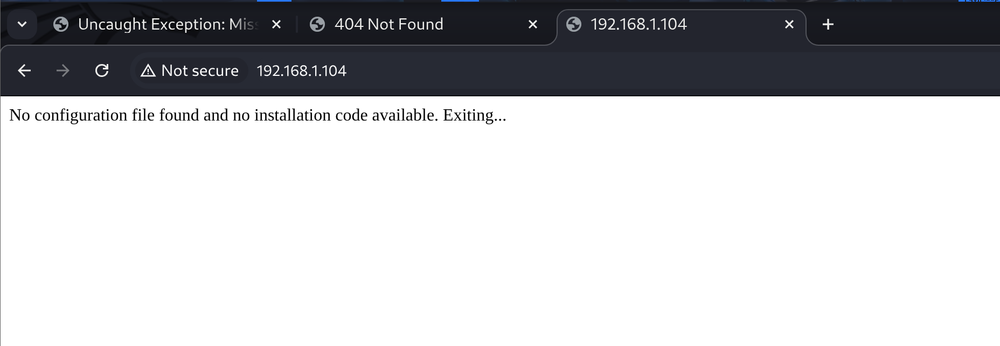

从目录扫描结果上来有一些引导性质的攻击向量，其中`file.php`存在，返回空，可能需要传参

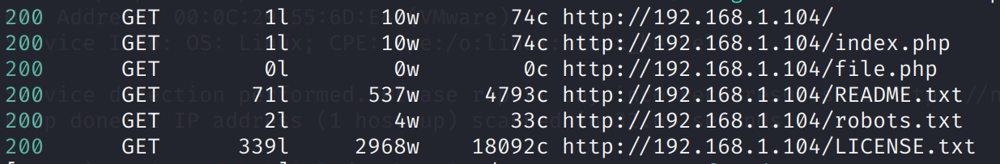

从`README.txt`来看，这台服务器运行着一个`Joomla!`，而`robots.txt`暴露了一个`h@ck3rz!`的关键字，可能是密码

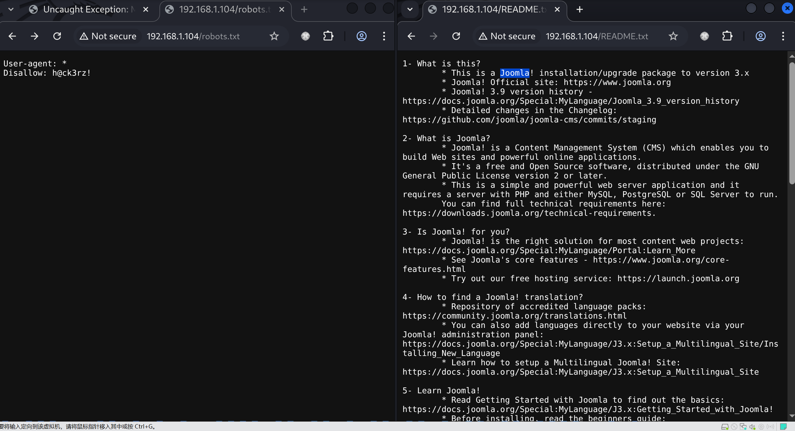

## 8080/tcp

目录扫描同样发现一些有趣的路径，其中`passwords.txt`返回`Hahahaha...Try Harder!`

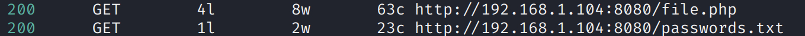

而`file.php`访问不被中间件解析而直接下载，其中是一段文件包含代码，估计可以从`80/file.php`入手

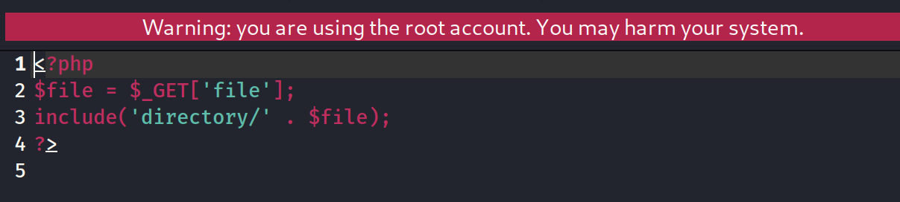

使用`dirb/big.txt`扫描得到了几个敏感文件

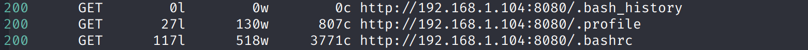

## 8999/tcp

这是一个使用`webfs/1.21`

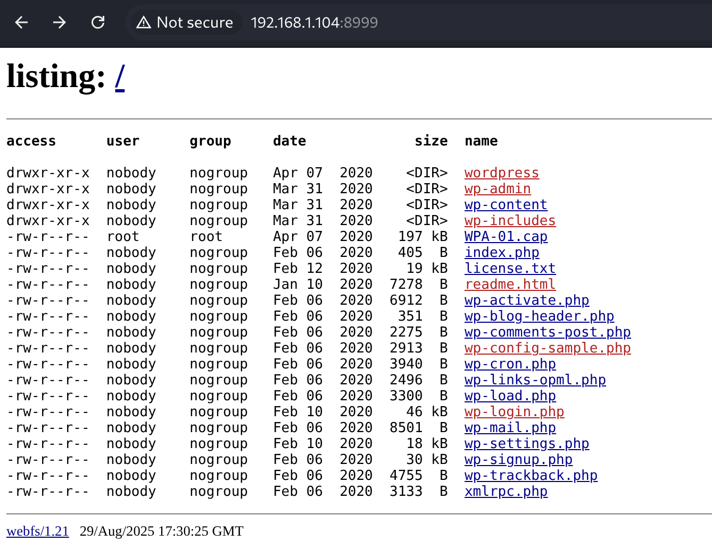

## 9000/tcp

似乎是一个bolt.cms

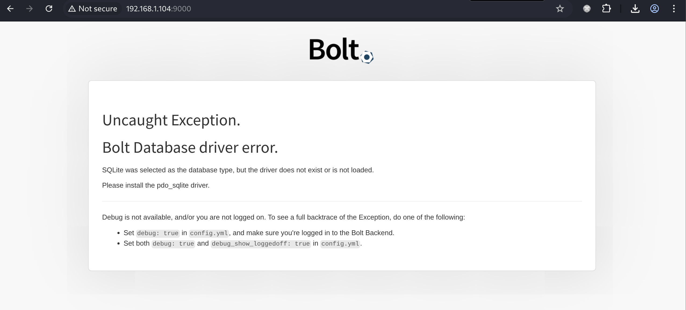

---

感觉这台机器业务很多：

80/tcp : joomla cms

8080/tcp : lead some interesting

8999/tcp : webfs → wordpress

9000/tcp : bolt cms

# shell as dlink by aircrack

`webfs`下有一个`WPA-01.cap`，根据名称能判断是wifi的数据包

通过`aircrack-ng -w /usr/share/wordlists/rockyou.txt WPA-01.cap`破解密码

得到`wifi ssid`为`dlink`，密码`p4ssword`

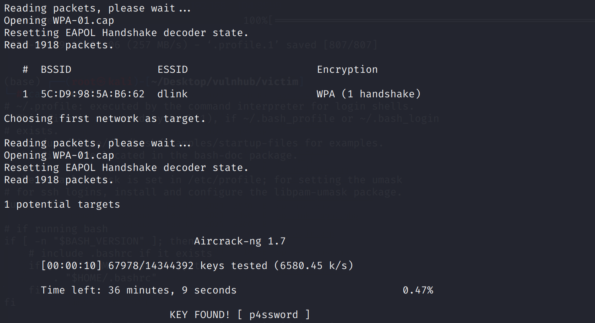

尝试使用ssh登录

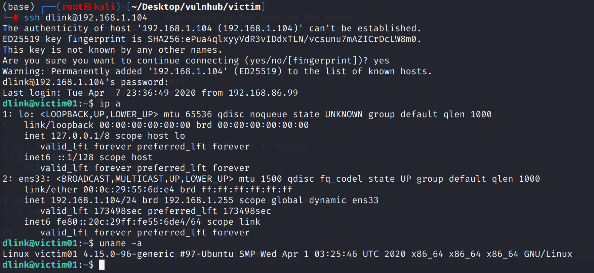

# shell as root by suid

例行检查 发现`nohup`具有suid，遂提权

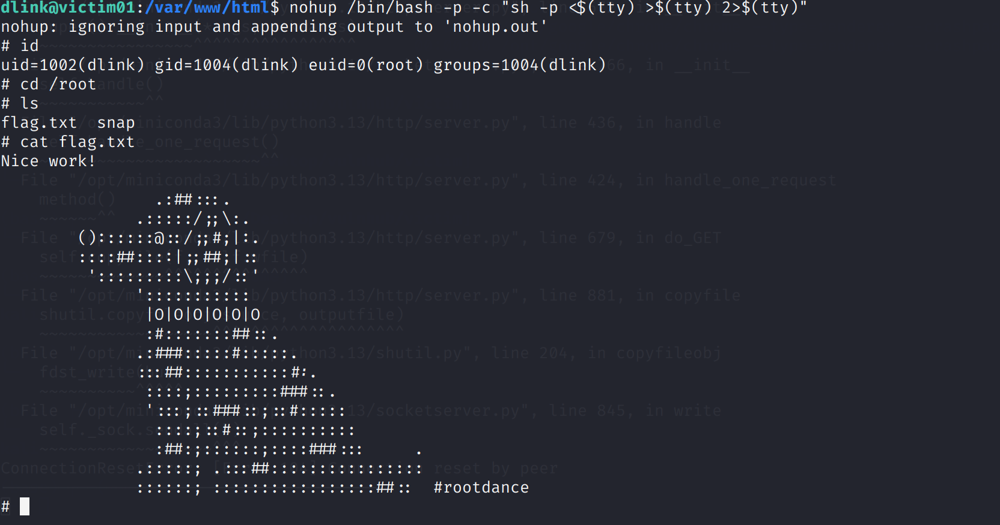
