# Recon

这台机器开放`ssh`、`web`和`mysql`

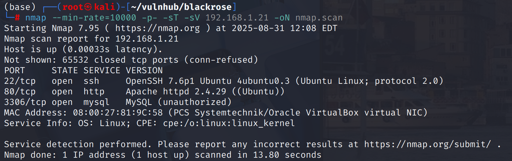

网页前端为登陆界面，存在注册点

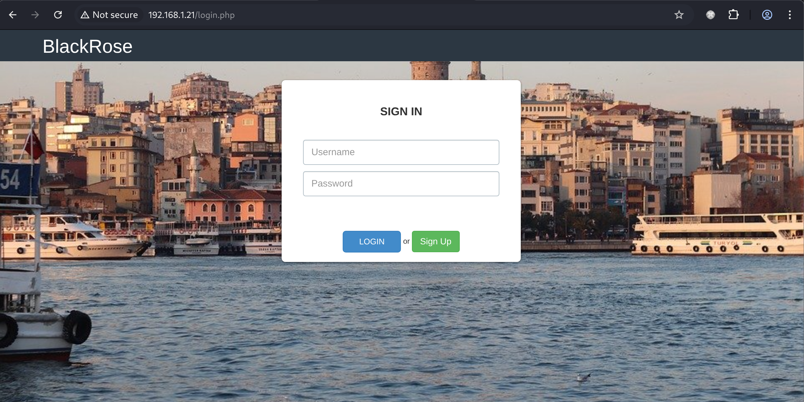

---

测试小记：

* 用户名可以xss → 未接收到admin cookie
    
* admin用户爆破无果
    
* 登录、注册输入框注入无果
    
* `Rx.php`注入无果\\
    
* `password`字段使用`strcmp`函数猜测 → 成功绕过
    

# Access admin by strcmp vul

将登陆包`password=`改为`password[]=`即可绕过登录

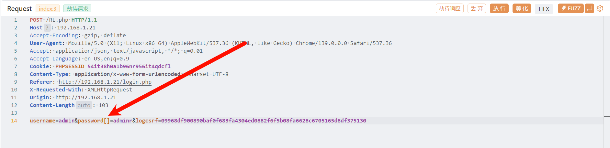

登陆后有一串`Signature`，还有一个命令执行，但是执行会报`invalid signature`，可能这串`sign`与特定命令进行了绑定，所以没有权限执行其它命令

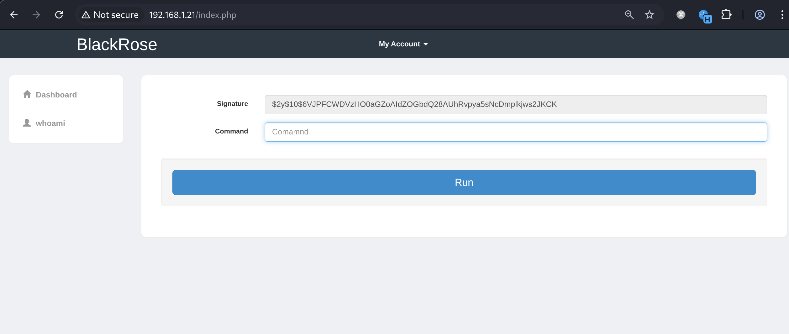

尝试爆破，得到`whoami`，说明这个位置可以执行`whoami`命令

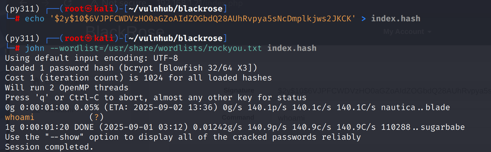

# shell as www-data by signature command

现在知道命令执行与`sign`值挂钩，这串看起来像`bcrypt`加密

尝试手动加密`sign`值执行命令，发现思路可行

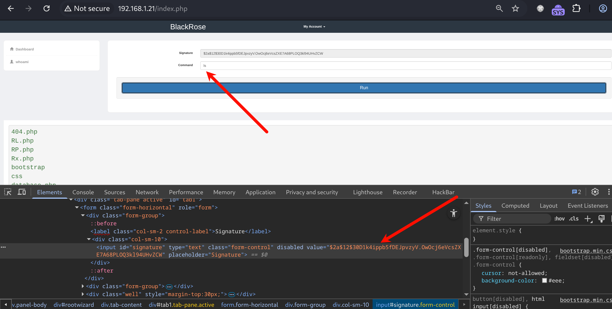

那么生成python反弹shell命令后加密替换`sign`，命令执行后获得shell

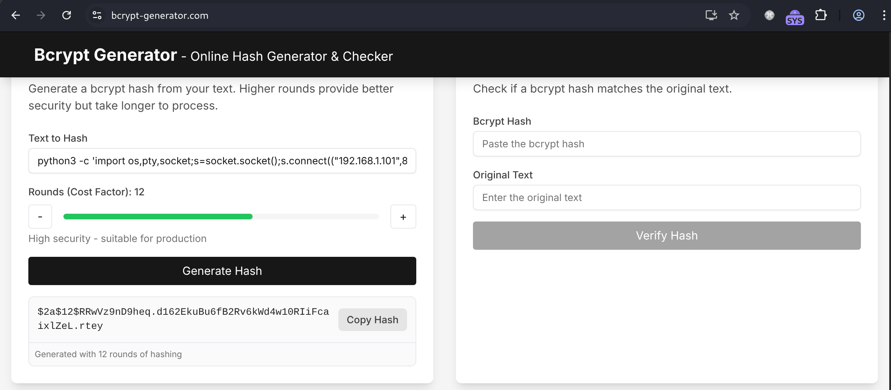

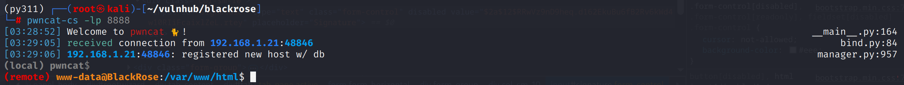

# shell as delx by ld.so

例行检查，发现能以`delx`用户权限执行`/bin/ld.so`

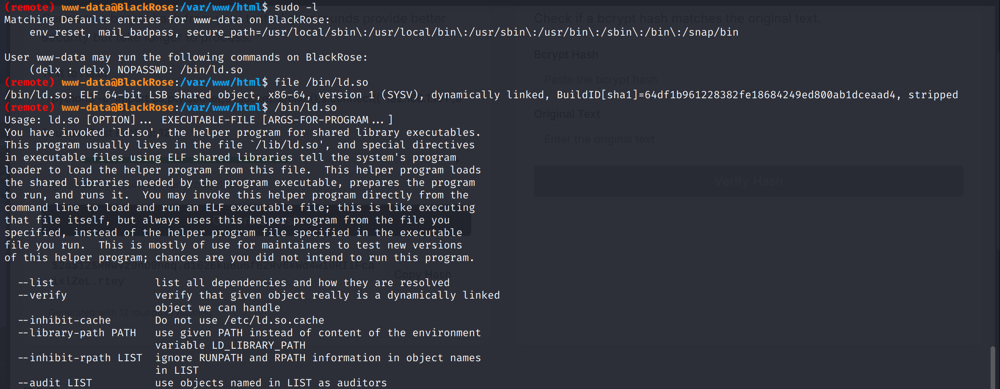

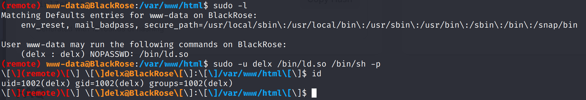

# shell as yourname by misc

例行检查发现一个有意思的文件

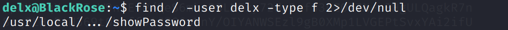

这个文件执行后看起来拥有了`root`权限，实际上无法执行命令

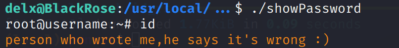

通过`ida`分析这个程序 整体来说是一个密钥验证的程序 通过逆向得到`gqSFGqAJ`

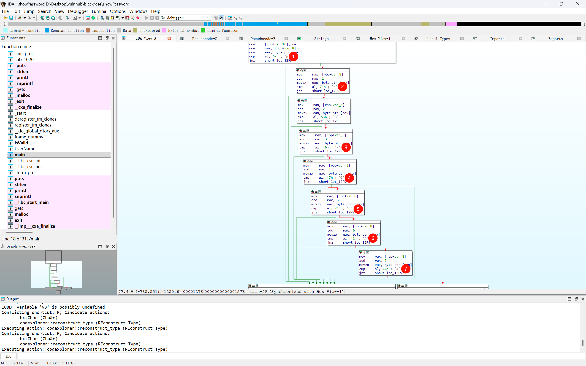

通过验证，但无事发生

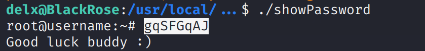

在`strings`中看到一串像`base64`的字符，解密无果，那么就是`aes`了

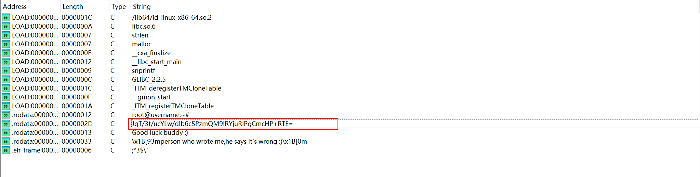

解密得到`RkZiPVkvxykJVOmxBmitBPeJXqFuxM`

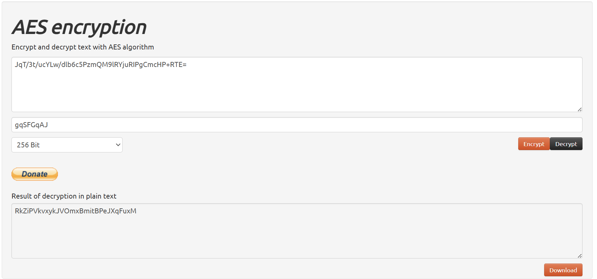

这串密文是web首页`background-image.jpg`的隐写密码 得到一个`password`文件 看起来没有规律

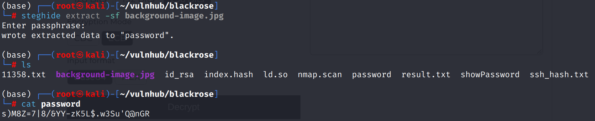

交给随波逐流一键解码得到`DX|g+lfMg^U**\Kzd{S]Hb$FV"o?v#`

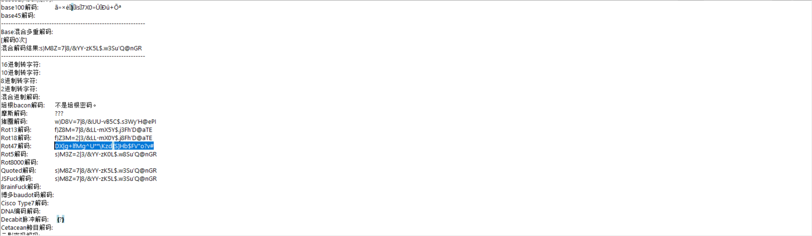

例行检查时发现存在`yourname`用户，尝试登录

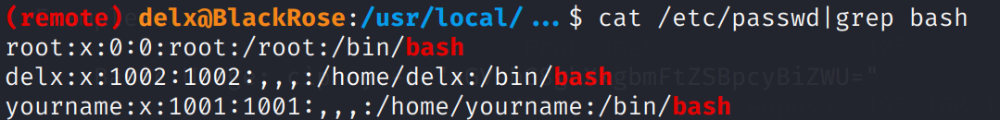

# shell as root by /usr/bin/blackrose

例行检查 发现能以root权限执行`/usr/bin/blackrose`

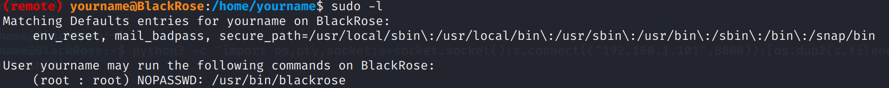

经过测试 发现可以执行php文件 但是危险函数被禁用

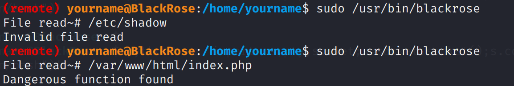

不出意料`php-reverse-shell.php`也无法执行

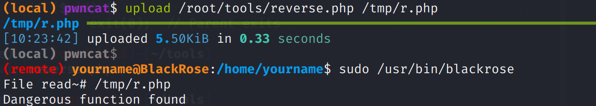

php反弹shell文件太大了不好bypass，用简短的方式执行`/bin/sh`即可

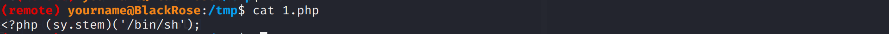

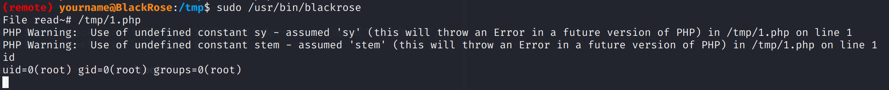
