# Recon

机器开放了`ftp` 、`ssh`、`http`三个标准端口

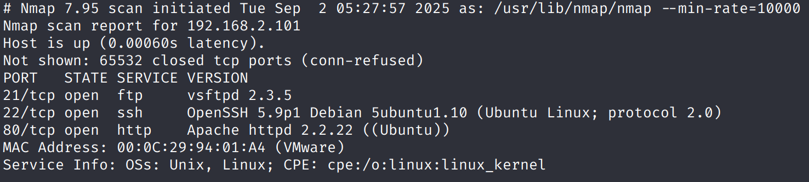

## ftp

`ftp`存在匿名登陆，`public`目录下有`users.txt.bk`文件

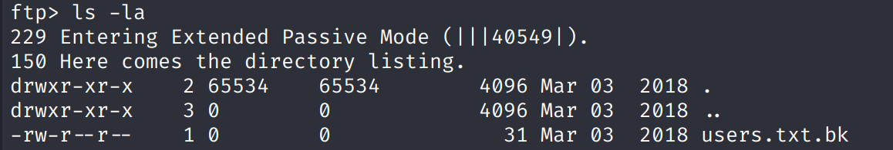

其内容是备份的用户名，获取用作`ssh`的爆破或`web`爆破

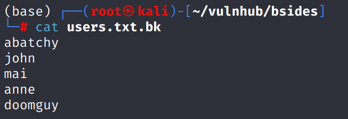

## Web

# shell as www-data by wordpress

`feroxbuster`目录扫描发现`robots.txt`，其中包含`backup_wordpress`路径，访问后是一个标准的`wordpress`

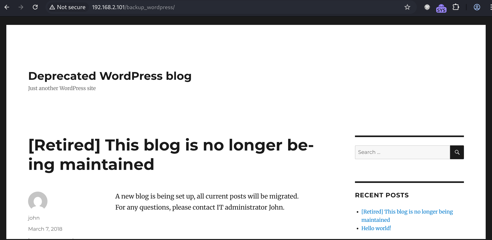

通过`wpscan -e u`枚举用户只得到`john`和`admin`，那么先只爆破这两个用户

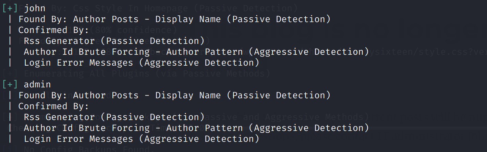

爆破得到`john / enigma`

登陆后发现有权限更改`admin`用户密码

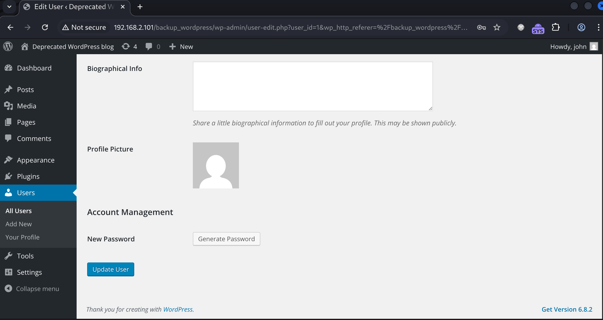

更改密码后用`msfconsole` `getshell`

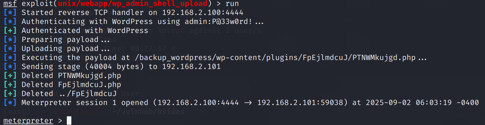

# shell as root by crontab

例行检查，发现存在root权限的`crontab`，并且目标文件有`写`权限

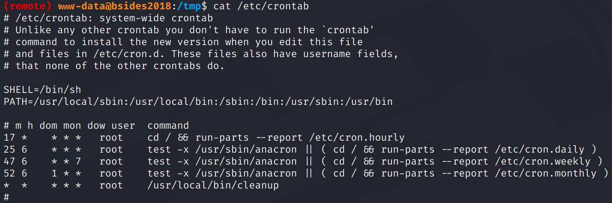

这个文件的`shebang`是`/bin/sh`，它可能无法解析`bash`反弹shell中的语法而导致反弹shell失败

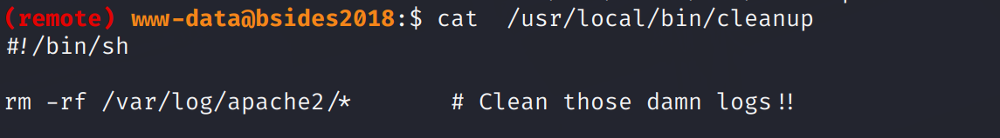

通过`printf`命令修改`shebang`为`/bin/bash`

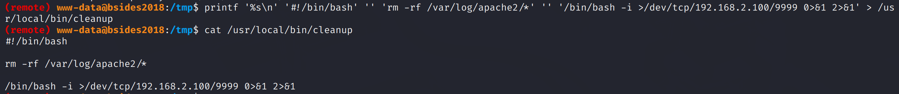

反弹shell成功

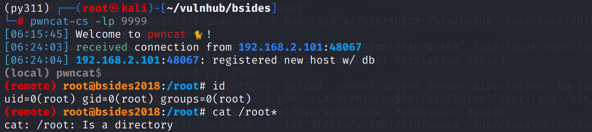

# Some thinking

> `shebang`的修改为什么是`printf`而不是更易用的`sed`

其实最开始就在使用`sed -i`做尝试，发现都无法执行

这是由于`sed`的工作原理是在目标目录创建一个临时文件先写入内容，写入完成后再将内容替换到目标文件

在这个过程中如果没有权限就会发生如图的报错

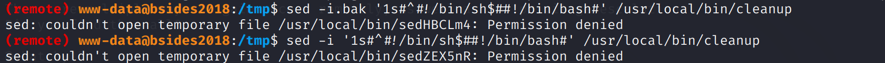

而`echo`写入文件则不会创建临时文件，它会直接对目标文件完成修改，自然也没有权限问题

所以需要一个原理与`echo`类似，又能完成内容编辑的工具，就是`printf`

`print '%s\n' '...' '...'`命令会把`\n`加在后面每一行的内容后，这就很简单完成了文件的多行写入从而达到修改文件的目的
