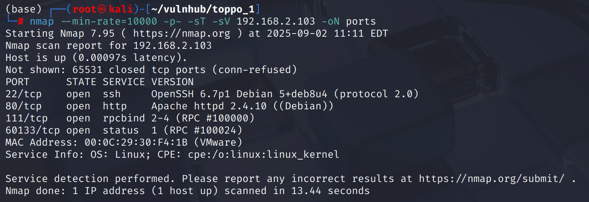
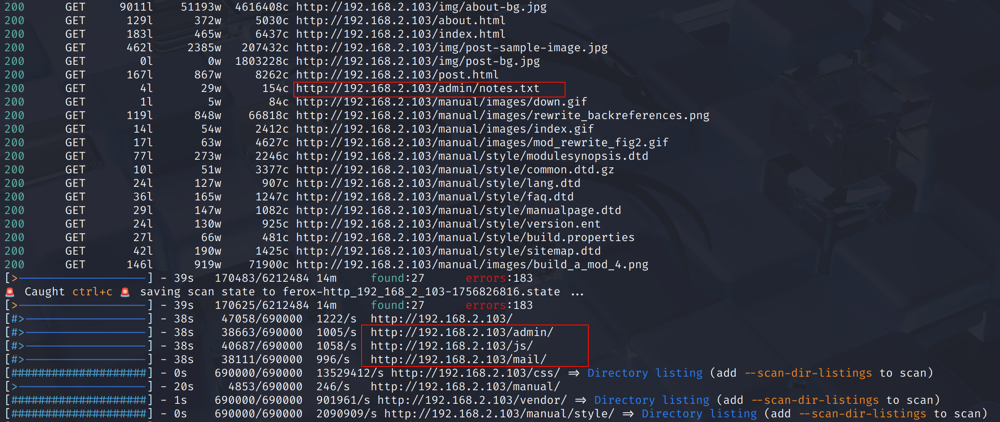
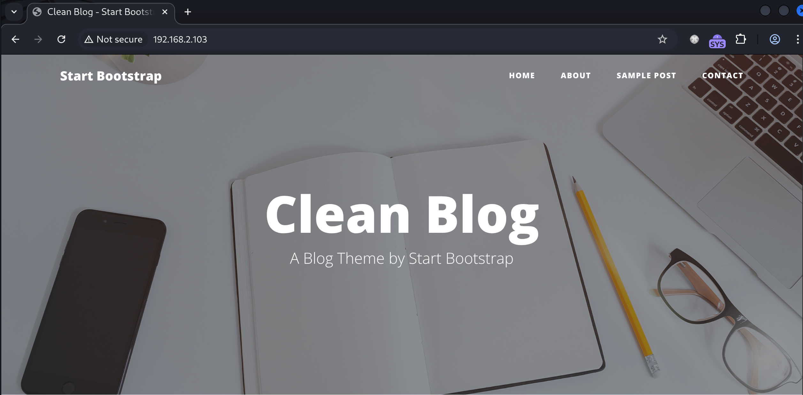
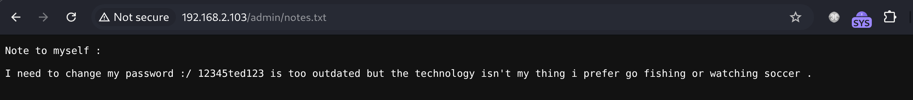
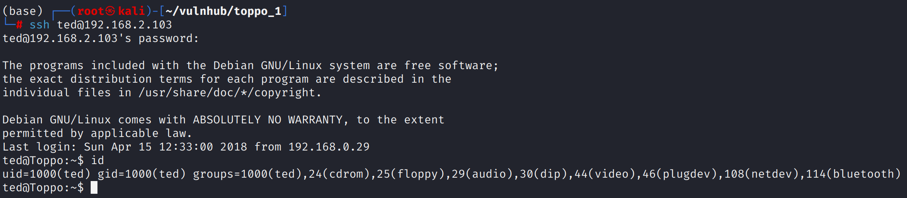
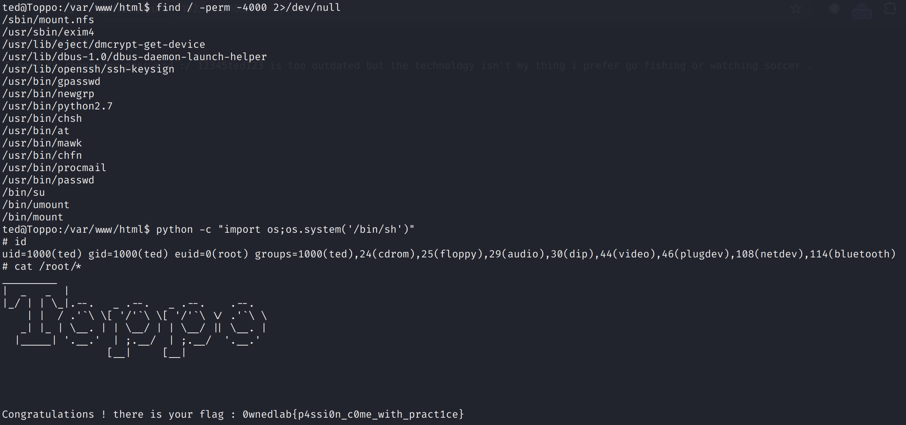

# Recon

这台机器开放了标准端口的`ssh`、`http`和`nfs`

测试优先级放在第一位的`nfs`似乎无法连接，无论是`showmount -d`的检测还是`nmap`相关`script`都没有结果

`feroxubuster`扫描得到了一些可能存在攻击向量的路径

网页前端显示这是一个博客

`admin/notes.txt`中泄露了一个密码`12345ted123`，而`/admin/`目录本身是一个`index of`

# shell as ted by leak password

各种交互点都尝试了一番没有收获，回过头看泄露的密码，尝试`ted:12345ted123`登录ssh

# shell as root by suid

嗯…极boring的一台机器

