# Recon

这台机器开放了`ssh`、`samba`和`web`，其中还有少见的`113/tcp` ident服务

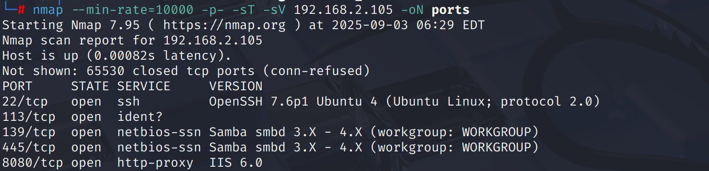

## 113/tcp → ident

通过`ident-user-enum`工具枚举，得到`ident`用户名

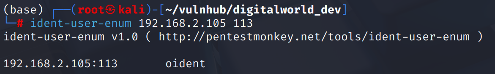

## 8080/http

网页前端能收集到一些信息

* `/html-pages`路径
    
* `patrick@goodtech@.com.sg`邮箱
    

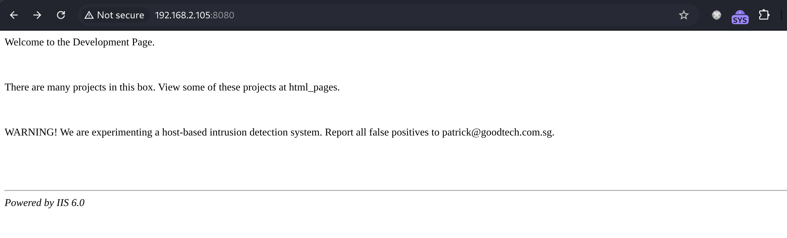

`/html_pages`目录展示了一些文件名，但未必是全面的

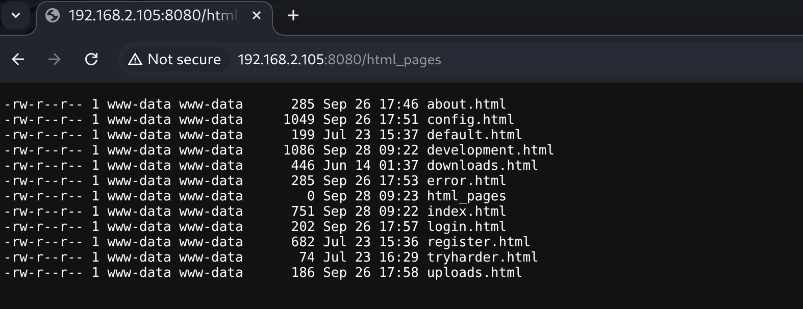

目录扫描得到一个关键的`test.pcap`文件

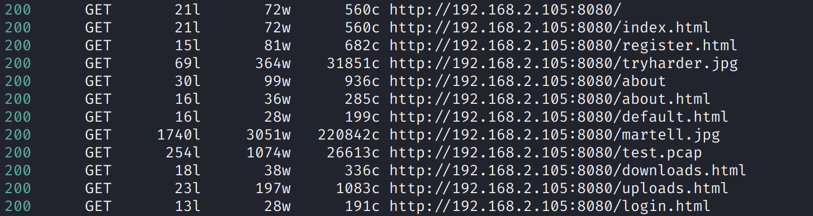

在其中得到了两个关键路径

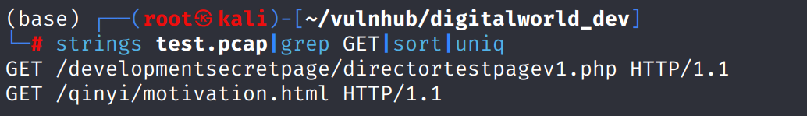

`developmentsecretpage/directortestpagev1.php`在说这是用来向主任实时更新信息的页面

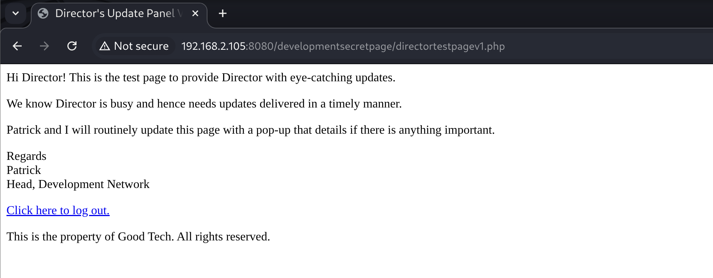

在源代码注释中是主任和`patrick`的对话，主任对这种推送更新的方式表示不认可，并且说可以使用留言板来实现

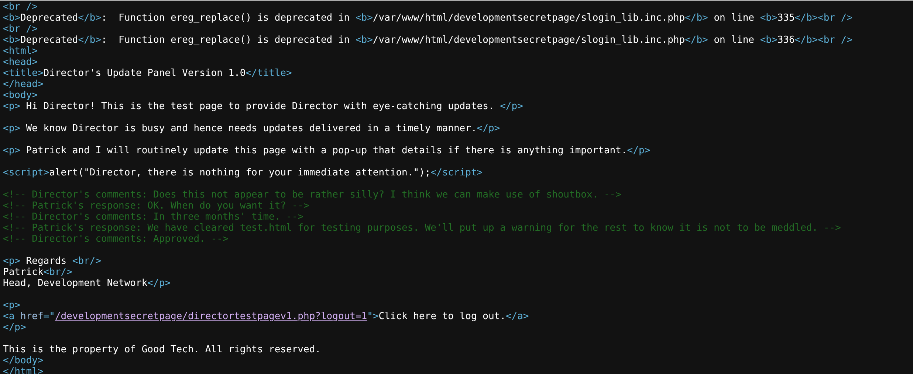

# shell as intern by password leak

点击`log out`后跳转登录界面，但发现任意用户名密码多能登录成功

`development.html`源代码中发现路径`/developmentsecretpage`

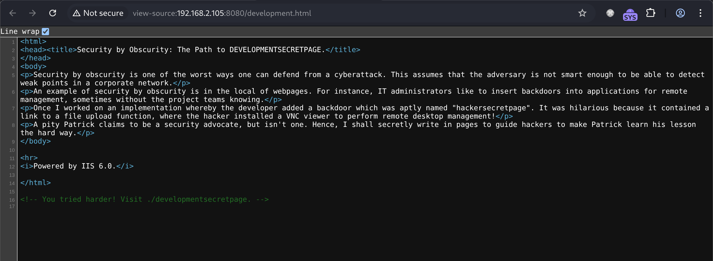

在登陆后的页面中都有两行报错

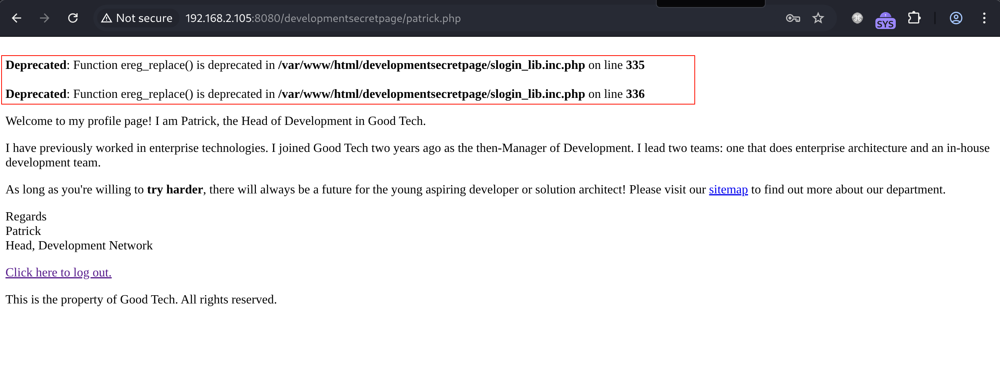

通过搜索报错关键字找到`SiTeFiLo`组件漏洞，该组件脚本包含一个敏感的文件`slog_users.txt`，会存储用户名和密文密码

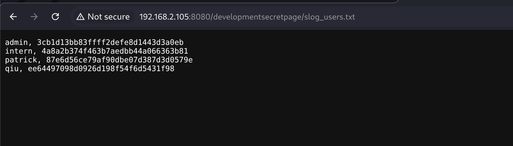

在线爆破后得到两个明文，尝试ssh登录

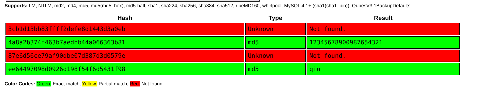

`intern`登录成功

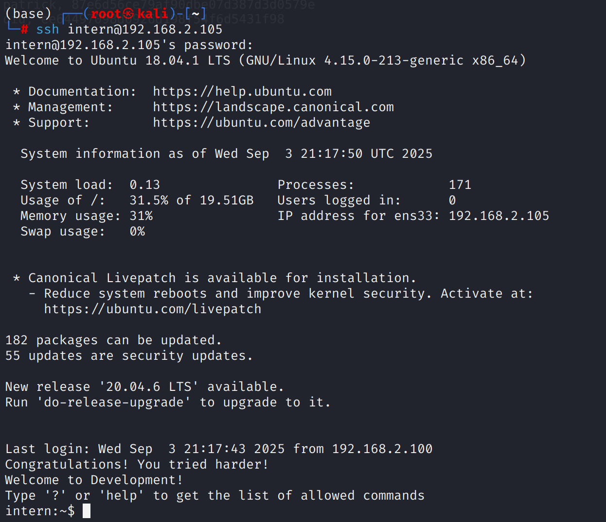

经过检查，`intern`用户的`shell`为`lshell`，这是一个受限的shell只允许执行几个白名单命令

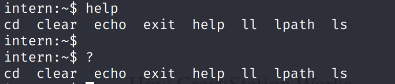

可以通过`echo os.system('/bin/sh')`绕过`lshell`

通过`hashes.com`破解了`patrick`用户密码

`su`到`patrick`用户后`vim`提权即可

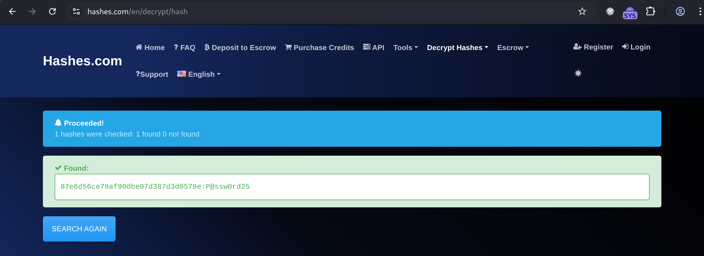
