# Recon

机器仅开放了`ssh`和`http`服务

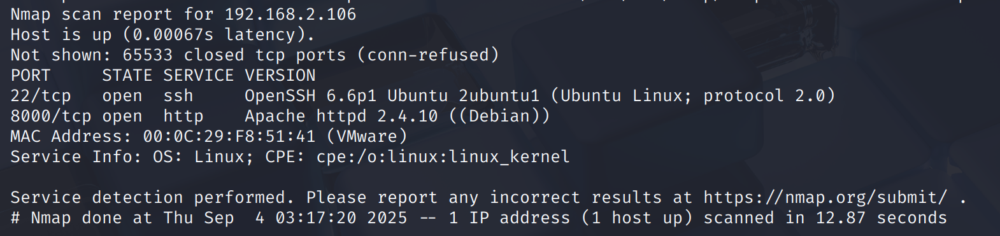

# web

`web`从前端和源代码中能看出来是`wordpress`，那么直接上`wpscan`枚举用户

枚举得到`bob`用户，然后爆破密码得到`Welcome1`

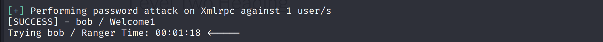

# shell as www-data by wordpress

通过后台`getshell`方式反弹shell给`pwncat-cs`

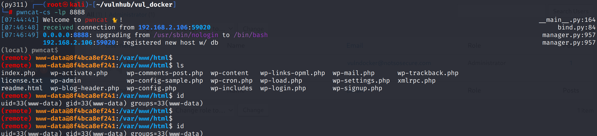

# shell as another-container-root by pivoting

简单的信息收集能发现这是一个容器，为了docker逃逸，需要先提取到容器root权限

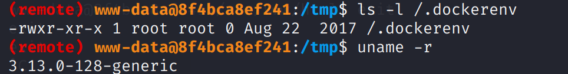

这个`root`权限可以是当前容器`root`权限，也可以是可达网段的容器`root`权限

通过对当前容器的检查，发现没有可利用的点，那么着手寻找可达网段的容器

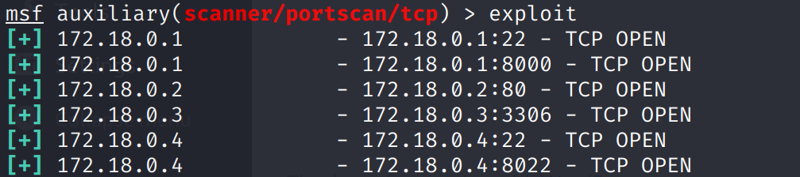

发现`172.18.0.4:8022`资产比较有意思，可能是一个webshell

在建立`socks5`隧道之前，需要使用`autoroute`模块来自动化的从`session`中读取网段并添加到路由表

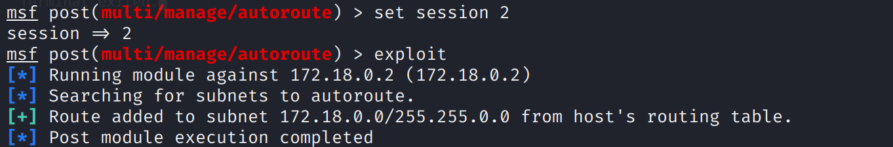

然后使用`socks_proxy`模块来建立`socks5`隧道

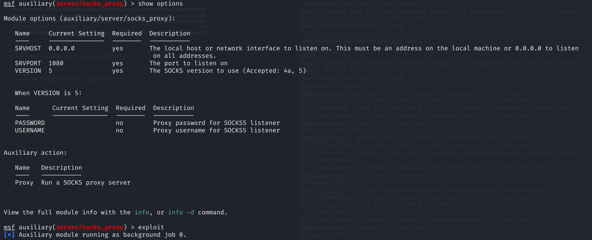

通过浏览器插件配置代理，访问发现为`root`权限的shell

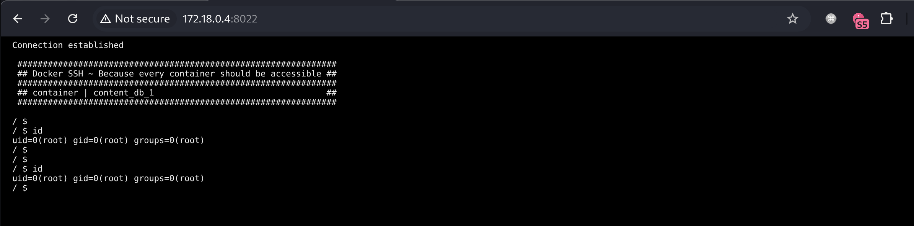

反弹shell给kali

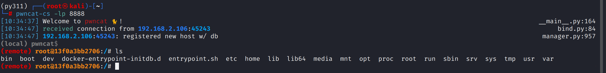

# shell as root by docker escape

这台机器有`docker.sock`，说明可以通过`mount`逃逸

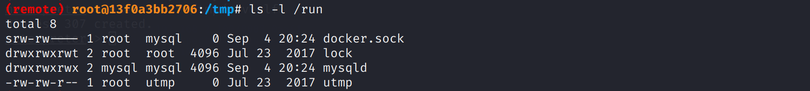

[`https://download.docker.com/linux/static/stable/x86_64/`](https://download.docker.com/linux/static/stable/x86_64/)下载`docker-ce`，并上传`docker`二进制文件到目标机器

通过`docker -H unix:///var/run/docker.sock images`来与宿主机的`docker api`通信，查看镜像

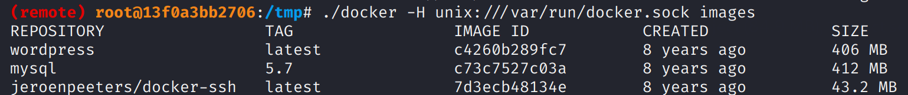

得知了当前应用大概率就是`wordpress`镜像的容器，那么api通信将宿主机根目录挂载到容器`/host`目录，然后通过`chroot`命令切换根目录

写入公钥后，完成宿主机`getshell`

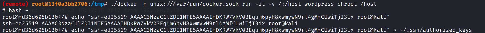

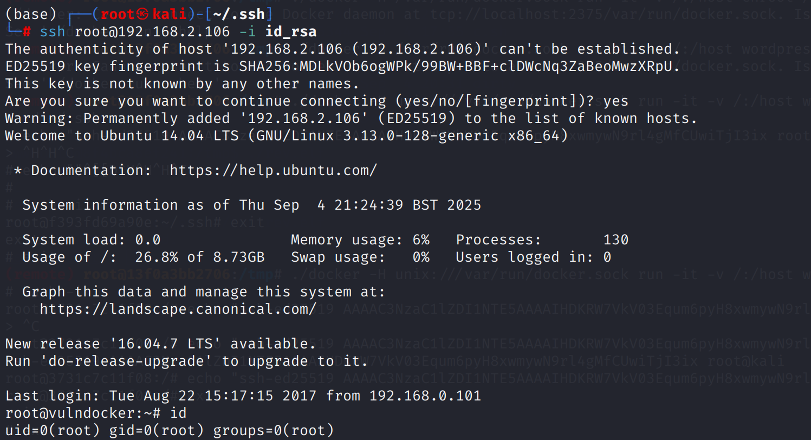

# Some thinking

> 在`shell as www-data by wordpress`时，我通过`wordpress_admin_upload`模块得到了`meterpreter`会话，但此时将它作为`autoroute`模块的`session`发现无法得到路由信息

在这种攻击向量的利用中，存在三个层面的限制

* Web服务器的限制
  
    Apache或Nginx对每个连接的持续时间、超时、并发数都有严格的限制。它们被设计用来处理大量短暂的HTTP请求，而不是维持一个单一的、长期的、双向的TCP隧道
    
* PHP解释器的限制
  
    PHP脚本的执行时间也受到max\_execution\_time等配置的限制
    
* 协议封装
  
    整个通信被包裹在Web服务器和PHP的处理逻辑中，就像这中间被隔了好几层逻辑的对话，会导致信道很重
    

怎么解决？

核心在于如何从这样的`脏信道`升级成为干净的`tcp信道`

思路很简单，通过`msfvenom`生成`elf`进行二次反弹shell即可

同时msfconsole使用`exploit/multi/handler`接收`shell`，这时候`background`放到`session`，`autoroute`就可以正确识别了，因为此时的`meterpreter`是一个干净的tcp信道
