# Recon

这台机器开放标准端口的`web`和`mysql`，其次还有不常见的`33060`

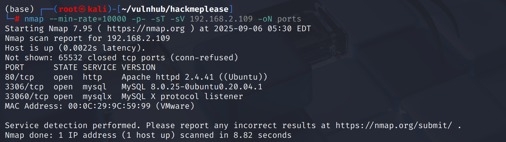

# shell as www-data by seeddms

从前端来看像一个`cms`，从前端源代码信息没发现是什么cms

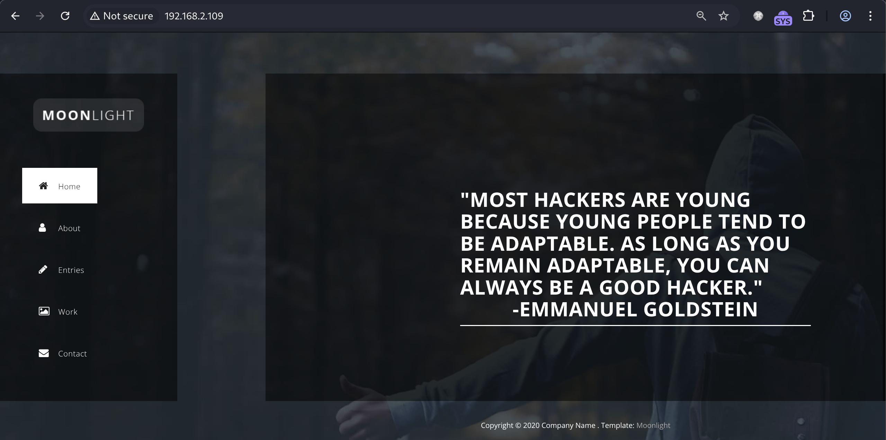

目录扫描只得到了`css`、`front`、`js`等静态资源路径，没发现有动态交互的功能点

那么只能从`js`路径作为着力点，在`/js/main.js`注释中发现一个路径`/seeddms51x/seeddms-5.1.22/`

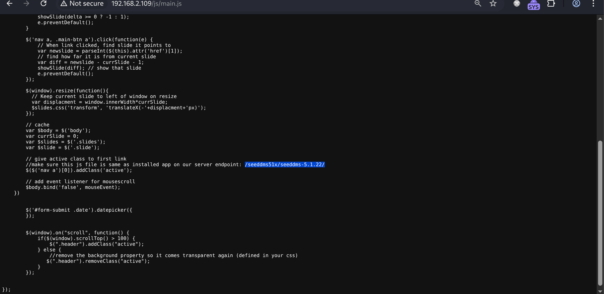

访问后是一个登录界面，并且得到指纹为`SeedDMS` → DMS → Document Management System 文档管理系统

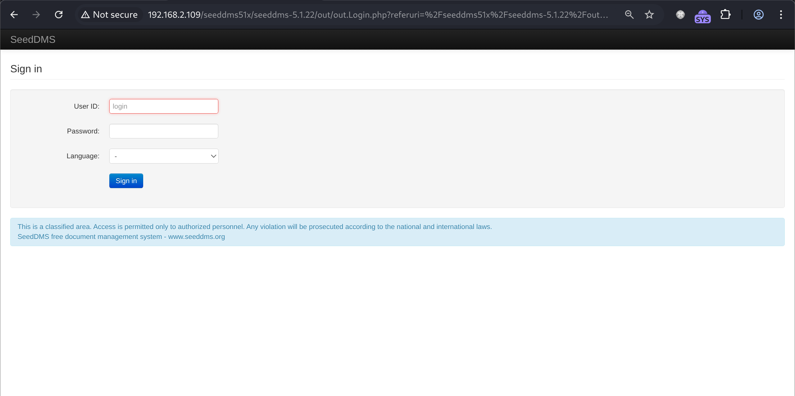

`searchsploit seeddms`寻找`exp`，有两个`RCE`，但都是登陆后的，经测试不是默认密码

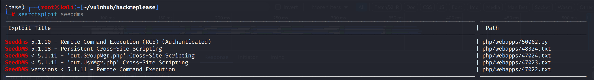

对一级目录扫描发现存在`conf`目录

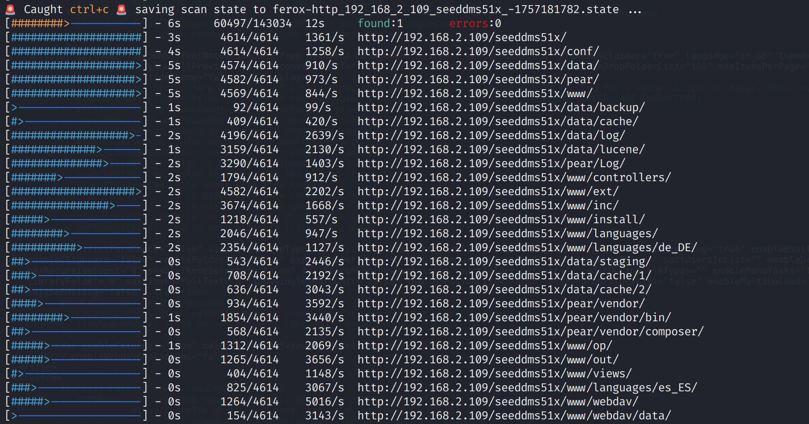

查看开源项目源代码，发现存在`settings.xml.template`

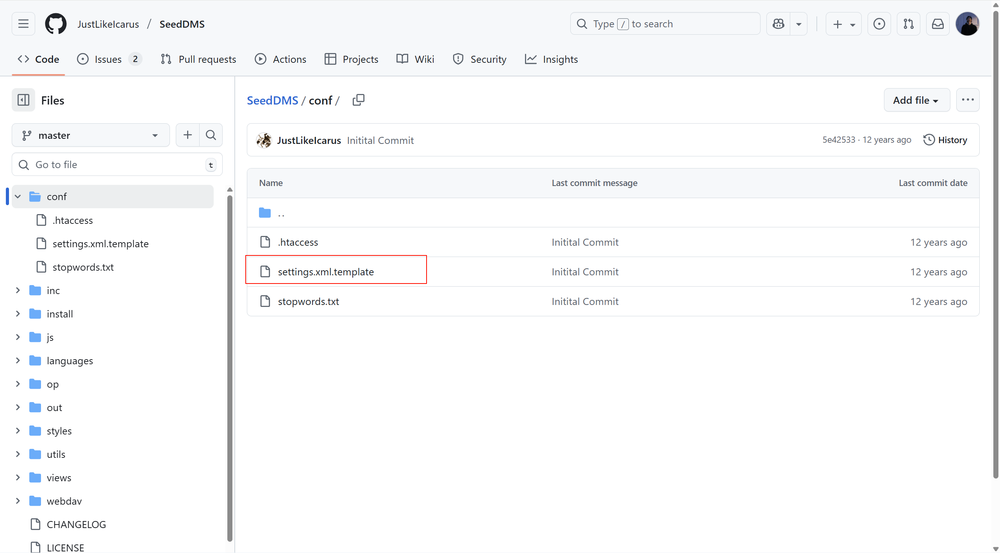

指定目录和文件后缀扫描，得到`settings.xml`

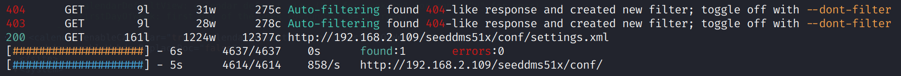

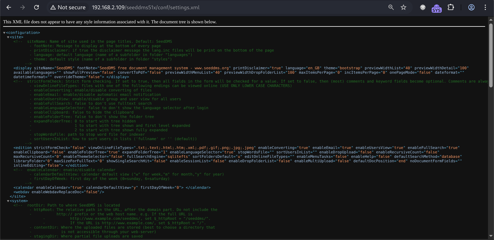

在其中得到`mysql`账号密码`seeddms:seeddms`

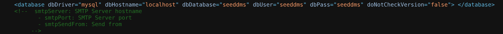

连接`mysql`，查看`seeddms.tblUsers`表，发现`admin`用户`password` hash爆破不了

查看开源项目`/SeedDMS/blob/master/op/op.Login.php` 发现密码为标准`md5`不加盐

那么手动写入一条数据添加admin用户`may`，或者更改admin密码

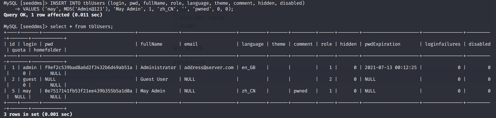

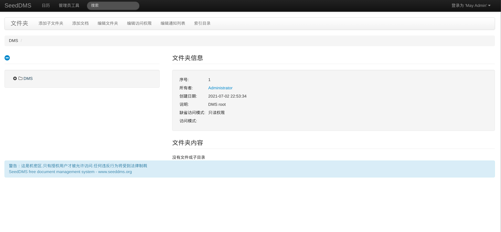

添加文档，在本地文件处上传`php-reverse-shell.php`

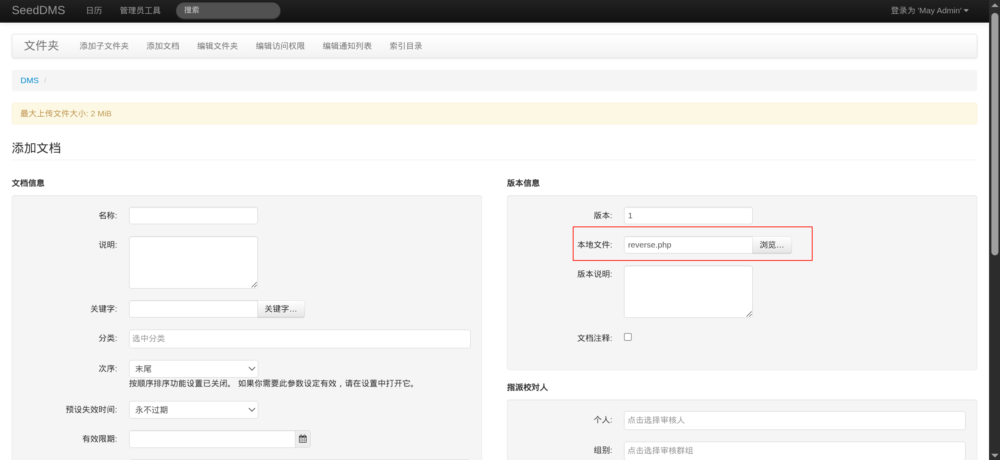

确认添加后可能发生`http 500`报错，但文件已上传

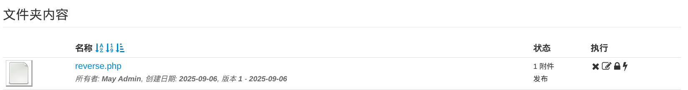

在`searchsploit`给的poc中发现访问`/data/1048576/$document_id/1.php`即可

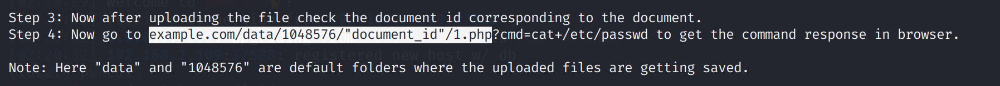

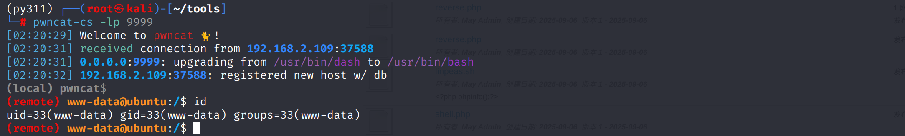

# shell as saket by attack-mysql

例行检查，发现存在`saket`用户，记起上文得到mysql权限时存在`users`表，其中存放了`saket`密码`Saket@#$1337`

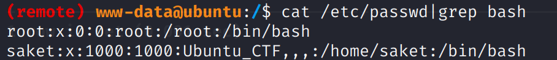

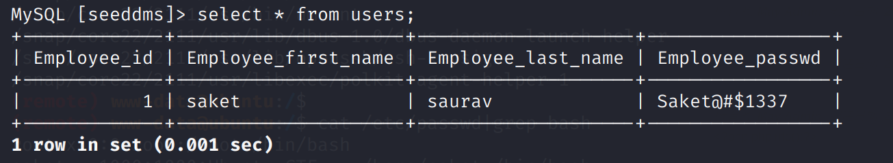

# shell as root by sudo

`su`到`saket`用户，然后直接`sudo su`到`root`用户

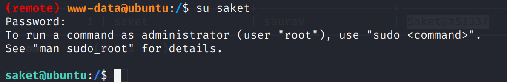

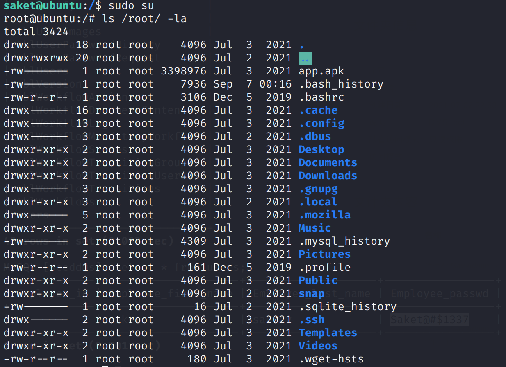
