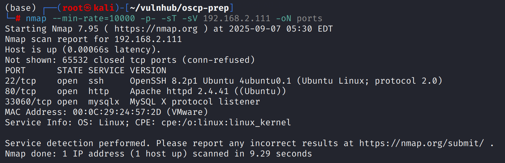
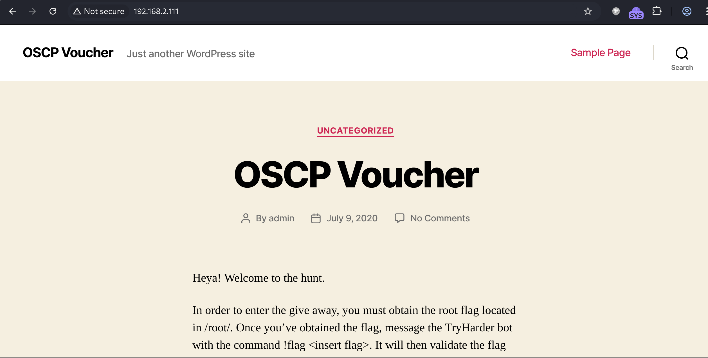
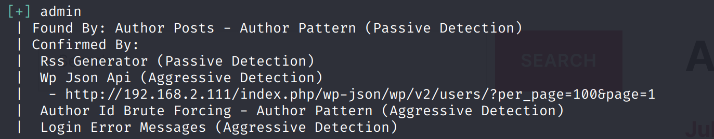
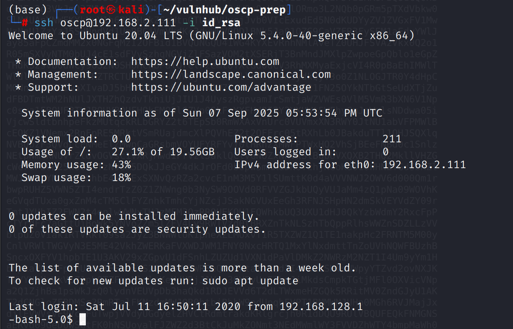

# Recon

机器开放了标准端口的`ssh`、`web`和`mysql x`

## Web

web是一个`wordpress`

`wpscan -e u`用户枚举只得到`admin`

# shell as oscp by id\_rsa

在`robots.txt`下发现`/secret.txt`，其中存放了`base64`内容，解码后发现是`ssh`私钥

通过对私钥主体解码得到用户名`oscp`

# shell as root by suid

例行检查，发现`bash`具有`suid`,`/bin/bash -p`即可
