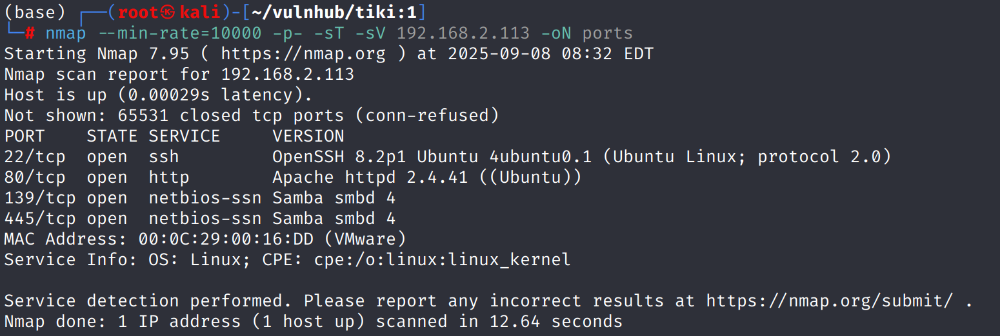
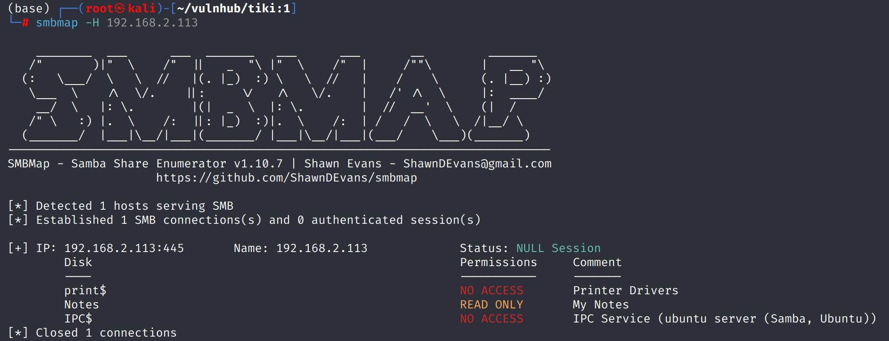
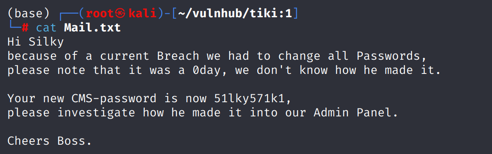
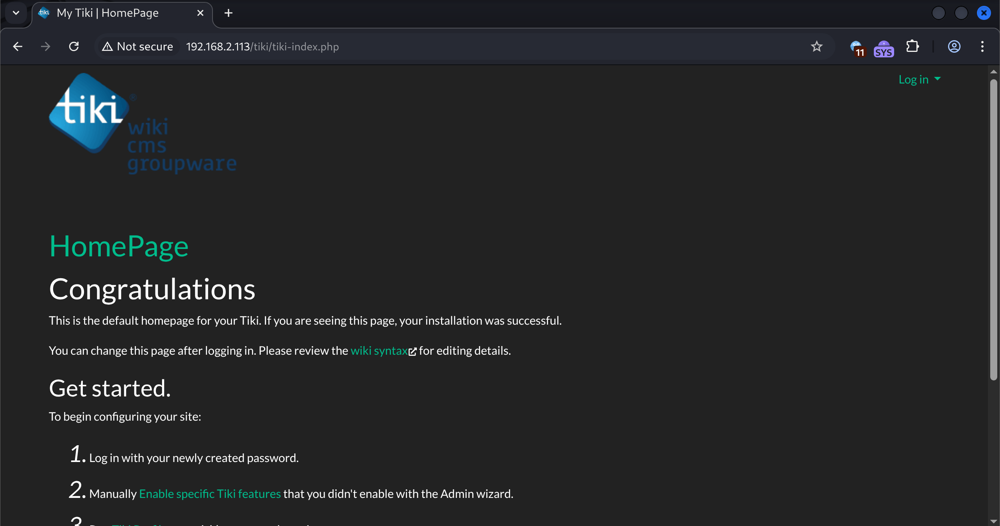
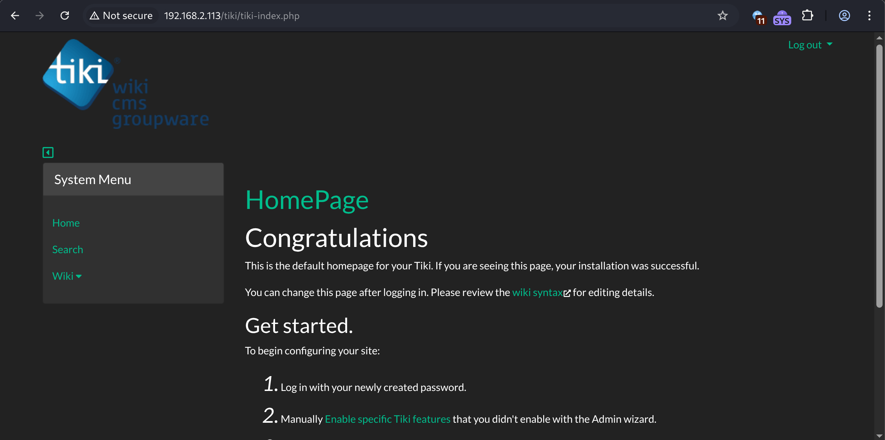
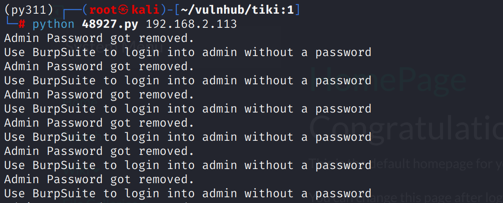
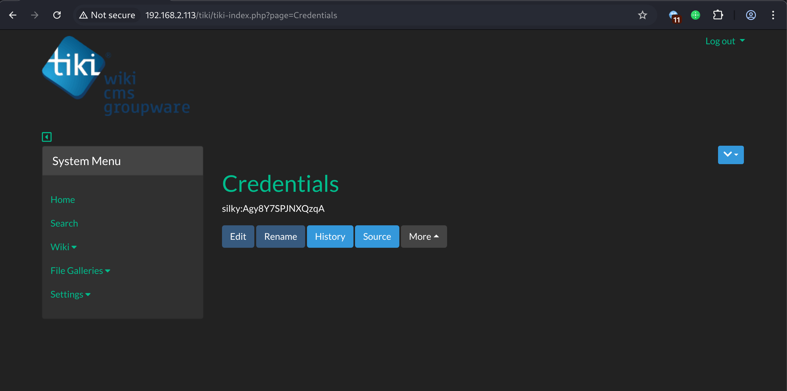
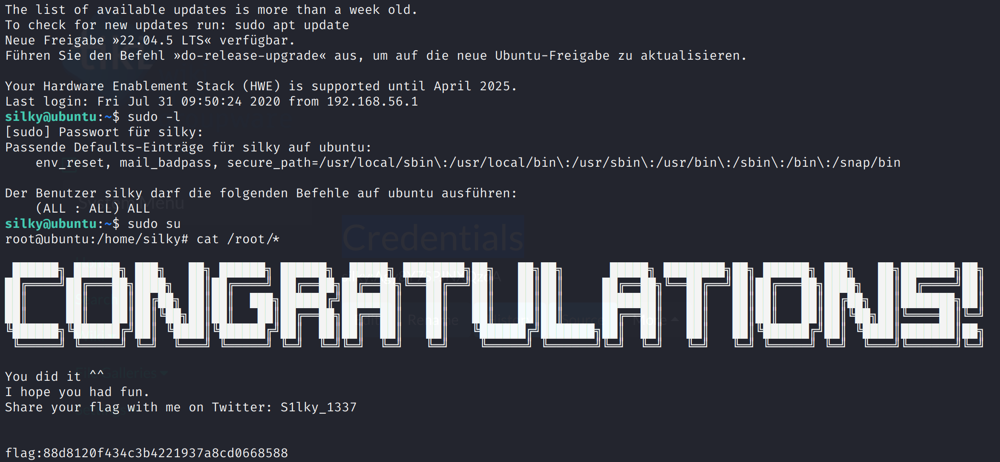

# Recon

这台机器开放标准端口的`ssh`、`web`和`samba`

## samba

`smbmap`查看发现`Notes`挂载

其内容泄露了一对凭据`Silky:51lky571k1`

# shell as root by vul

`robots.txt`中泄露`/tiki`路径，访问后是一个`cms`

使用`smbclient`收集到的凭证能直接登录`/tiki/admin`后台

`searchsploit`发现`tiki`存在登录验证绕过漏洞，使用poc，发现提示抓包将密码置为空

利用漏洞登录`admin`用户后在`Credentials`处发现一对凭证

ssh登陆后`sudo su`获得了root权限

