# Recon

这台机器开放了标准端口的`ftp`、`ssh`、`http`

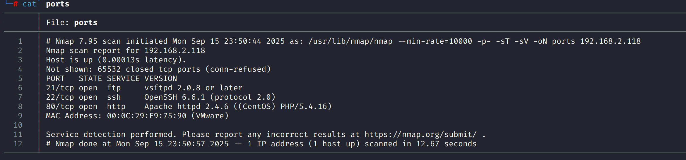

## web

目录扫描得到一个`/w`路径

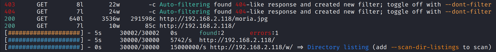

访问后回显内容`Nain:"Will the human get the message?"`

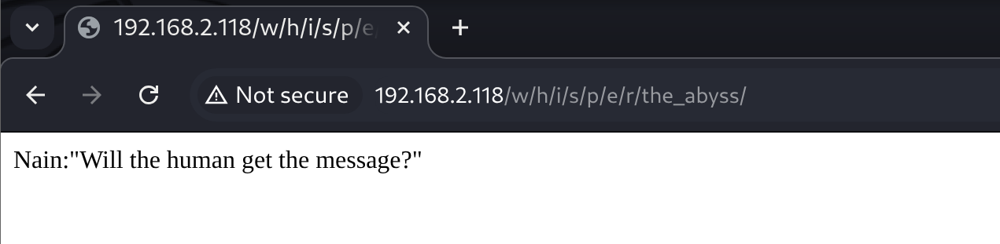

进一步扫描该目录，得到`random.txt`

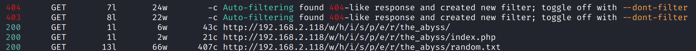

访问后是一段故事情节的对话，其中的”Knock”关键字能联想到”Port Knocking”技术，对话人也可能关联到一些用户名

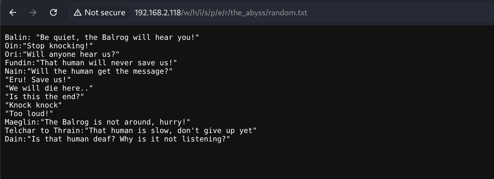

# shell as Ori by Portknocking → ftp → hydra

通过`wireshark`抓包，能发现靶机从`tcp/1337`端口在向`kali`发送`Port Knocking`

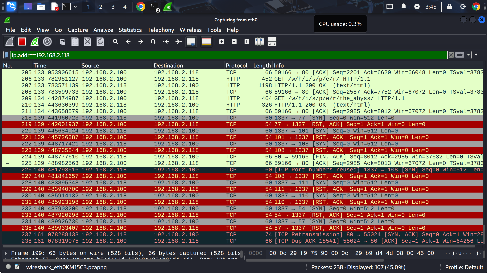

`Port Knocking`的目标端口可能隐藏着某种信息

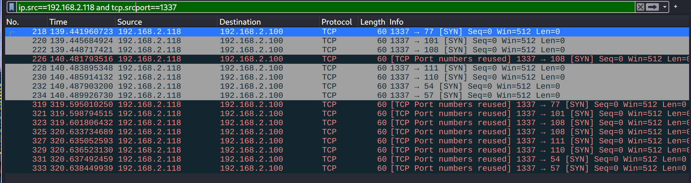

通过[`https://www.rapidtables.com/convert/number/ascii-hex-bin-dec-converter.html`](https://www.rapidtables.com/convert/number/ascii-hex-bin-dec-converter.html)解密得到`Mellon69`，可能是个密码

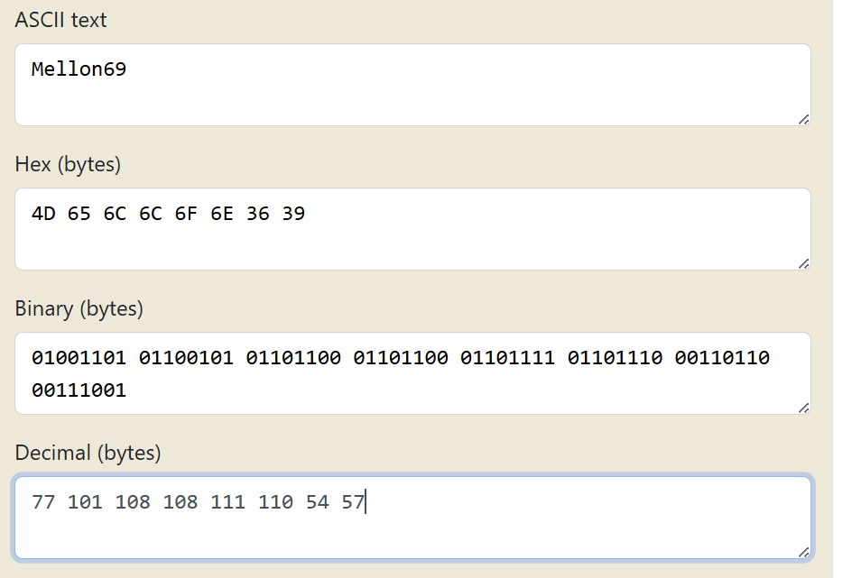

爆破得到ftp凭据`Balrog:Mellon69`

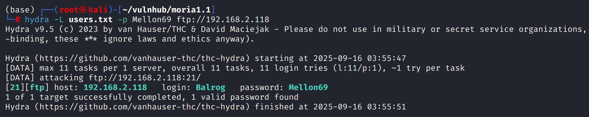

ftp登陆后发现是空目录，`pwd`发现位于`/prison`目录，具有切换目录权限

在`/var/www/html`发现存在`QlVraKW4fbIkXau9zkAPNGzviT3UKntl`目录

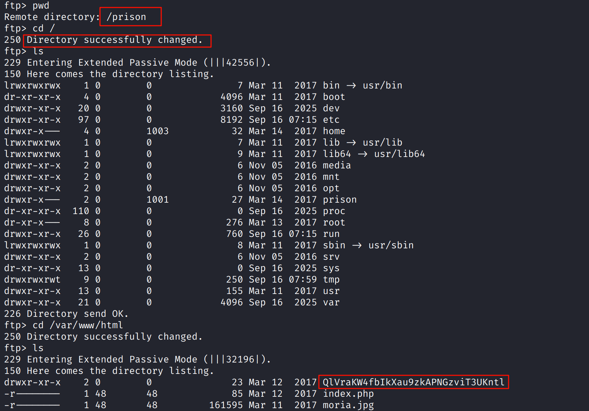

访问后发现提供了`Prisoner`囚犯姓名和密码

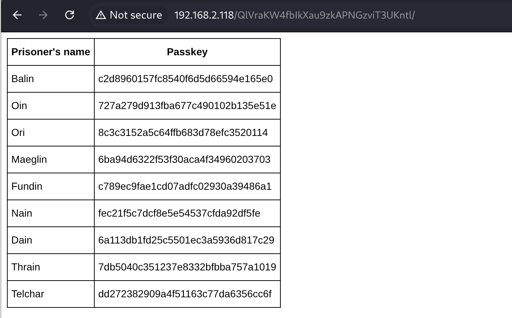

`crackstation`解密失败

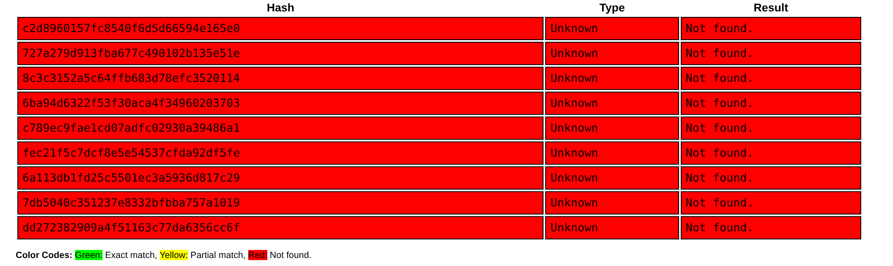

源代码中发现存在`salt`

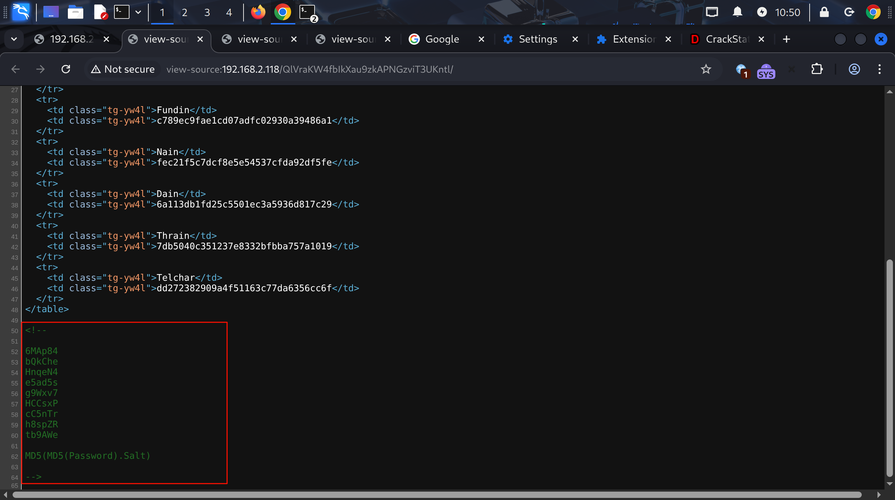

构造`hashes.txt`，交给`john`爆破

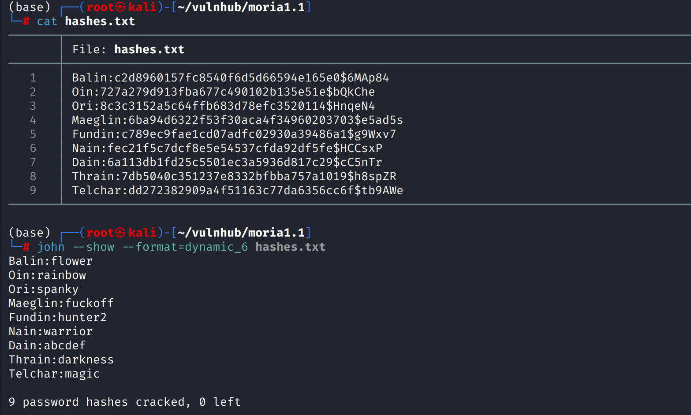

将爆破得到的凭证写入文件，交给`hydra`快速验证，得到有效凭证`Ori:spanky`

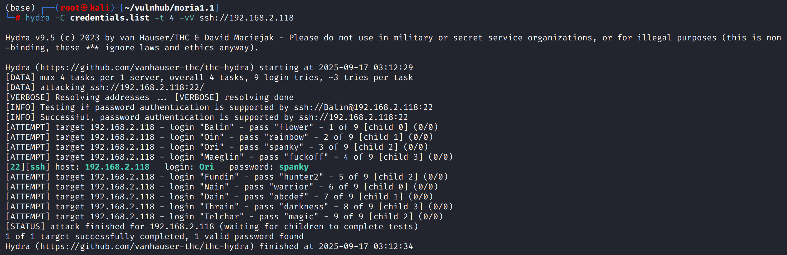

# shell as root by id\_rsa

进入`/home/Oia/.ssh`目录通过`ssh root@127.0.0.1 -i id_rsa`直接登录到`root`

由于`Oia`用户公钥存在于`/root/.ssh/authorized_keys`文件，所以可以私钥登录

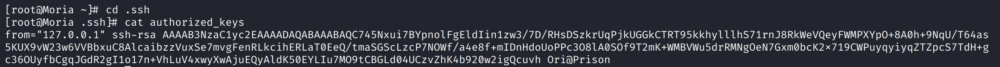
