# Recon

这台机器只开放了标准端口的`ssh`和`web`

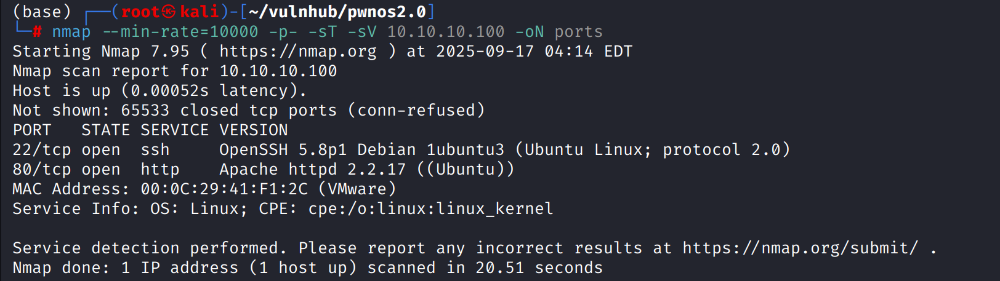

# shell as www-data by Simple PHP Blog 0.4.0

访问web前端，存在注册和登陆页面

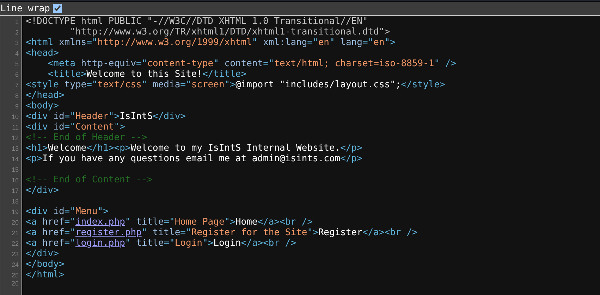

存在`/blog`一级目录，扫描也发现了一些有趣的内容

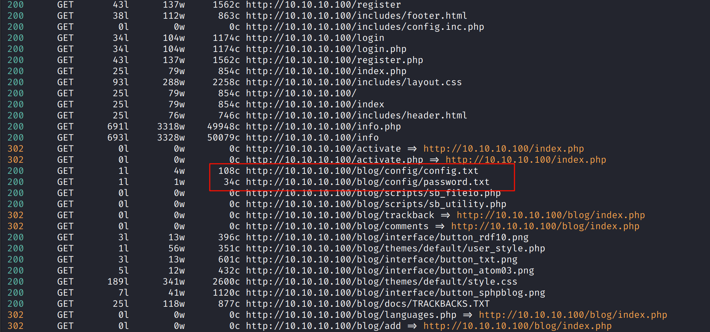

`/blog`页面时一个有年代感的博客系统

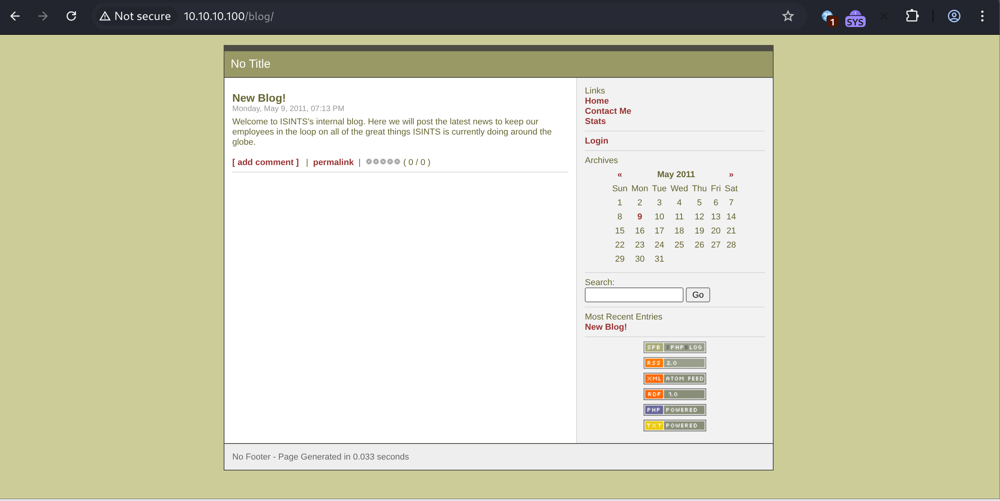

在网页源代码中能得到`Simple PHP Blog 0.4.0`指纹

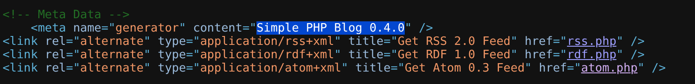

通过`searchsploit`查找也有直接命中的`exp`

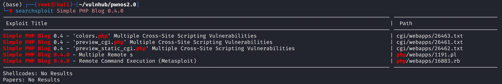

使用`1191.pl`创建新用户，登陆后手动上传`reverse.php`，访问`/blog/images/reverse.php`反弹shell

(perl 1191.pl执行的过程中可能报错 需要`apt-get install libswitch-perl`)

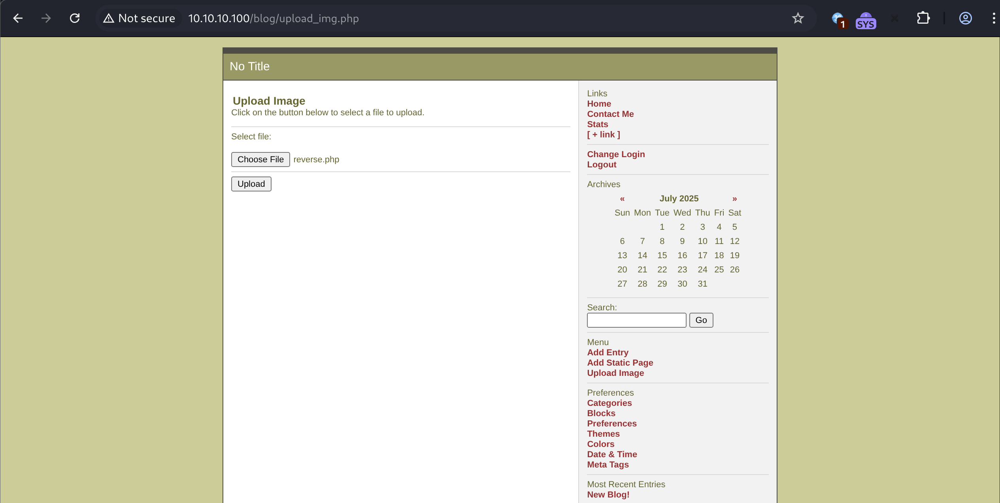

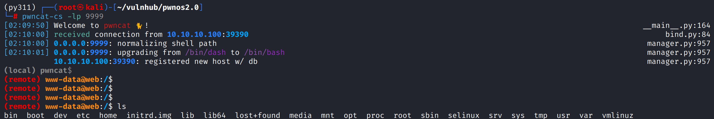

# shell as root by password reuse

例行检查，发现`root`以外的两个有效用户`mysql`和`dan`

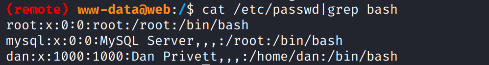

在`/var/www`目录下发现`mysqli_connect.php`，使用其中的密码却无法登录

通过`find`查找发现`/var/`目录下存在另一个`mysqli_connect.php`

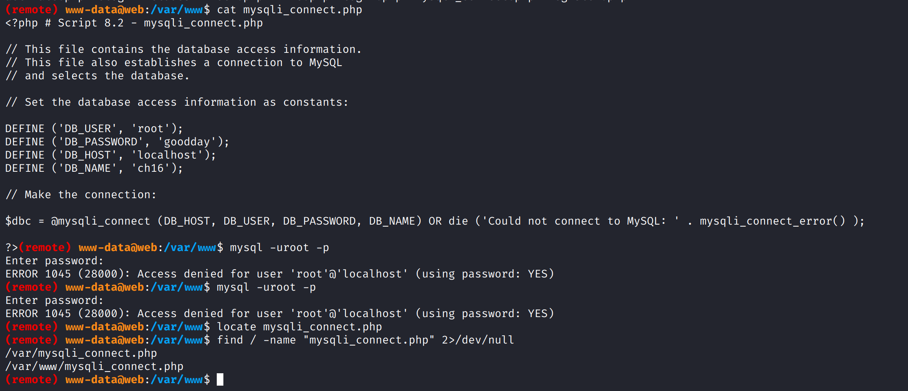

使用其中泄露的凭证成功登录`mysql`

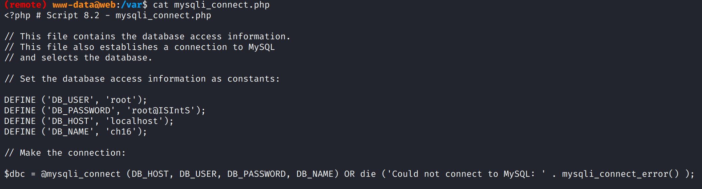

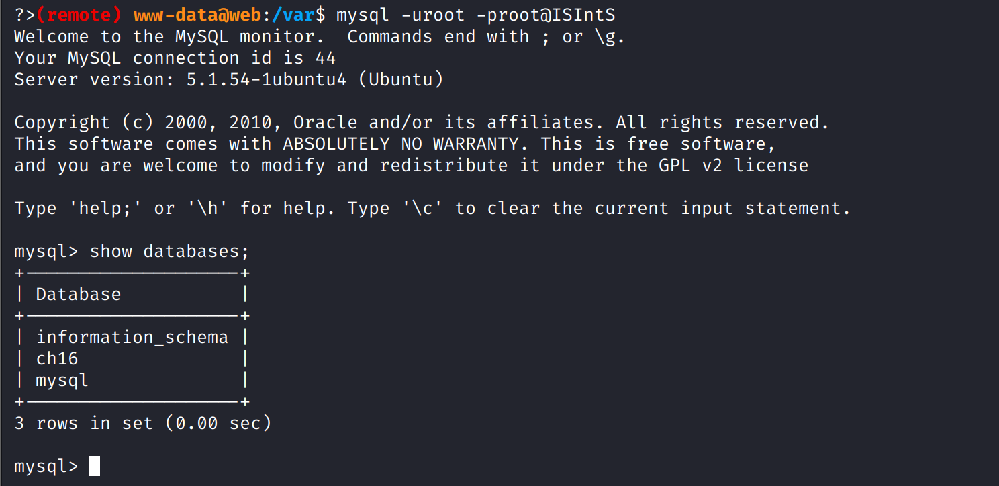

其`users`表中包含了用户`dan`和`admin`的密码`hash`

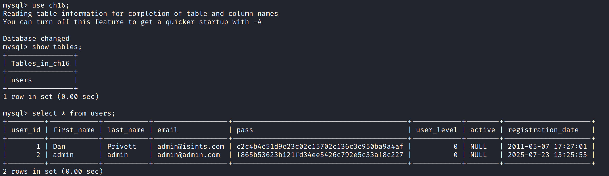

通过`hashes.com`爆破得到用户`dan`密码`killerbeesareflying`

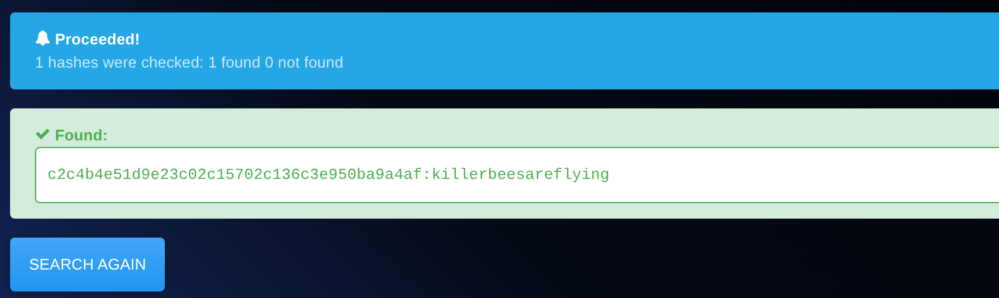

经过一番尝试，发现数据库中的密码似乎没什么用，最后通过密码碰撞发现`/var/mysqli_connect.php`中的数据库密码就是root密码

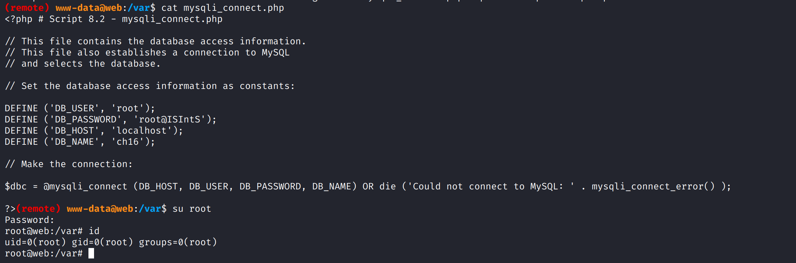
