# Recon

这台机器开放了标准端口的`ssh`和`http`

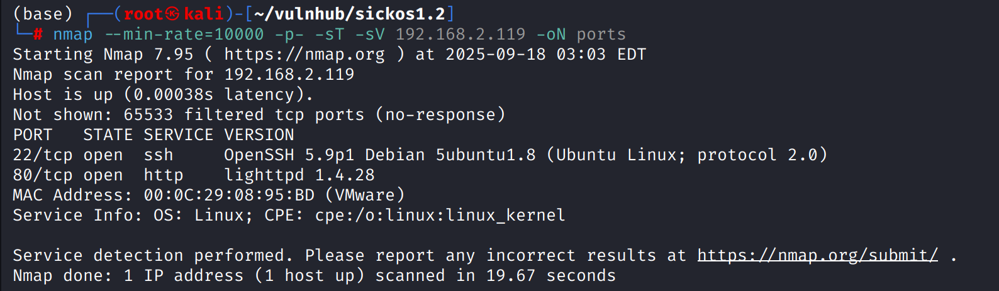

# shell as www-data by put method file-upload

目录扫描发现`test`目录遍历，不存在文件泄露但能发现这是一个`lighttpd/1.4.28`

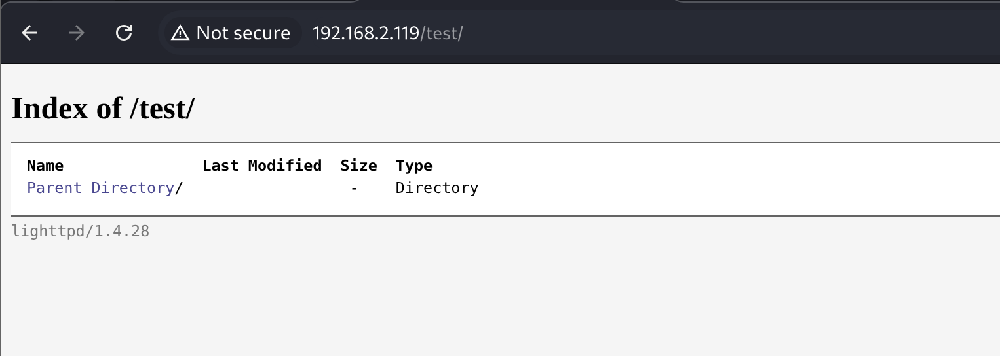

使用`nikto`进一步检测`test`目录，发现允许`PUT`请求

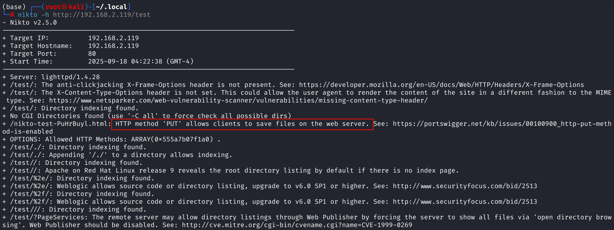

使用`curl -X PUT http://{IP}/test/ --upload-file cmd.php`上传文件，发现可以执行

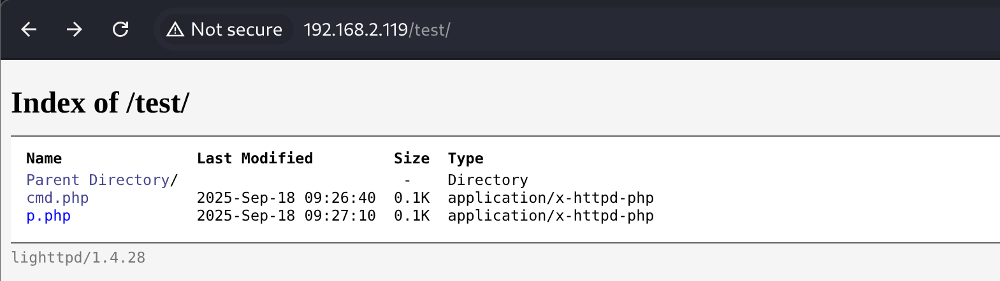

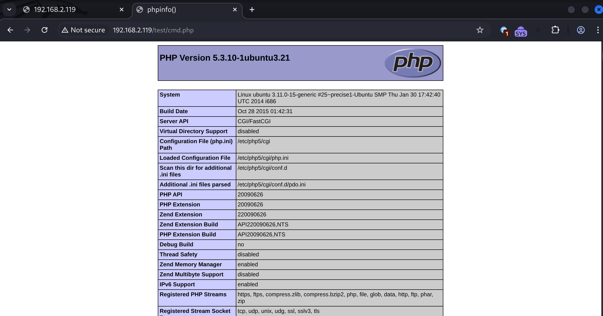

理论上直接反弹shell即可，`phpinfo`是成功执行的，但是发现构造的`reverse.php`反弹不到shell

这意味着这台机器有防火墙策略不允许对外的连接

编写shell脚本实现允许对外连接的端口检测

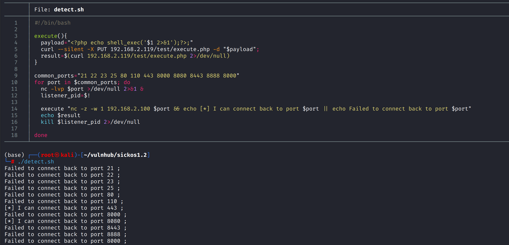

通过监听`tcp/443`端口完成反弹shell

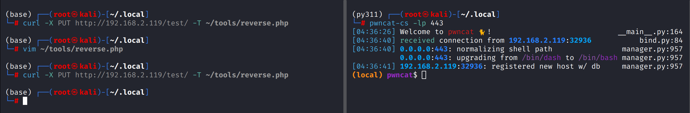

# shell as root by chkrootkit

例行检查没有发现存在利用点的`suid`文件、敏感信息泄露等

使用`dpkg -l`查看安装的应用，发现存在`chkrootkit`，并且是存在漏洞的版本

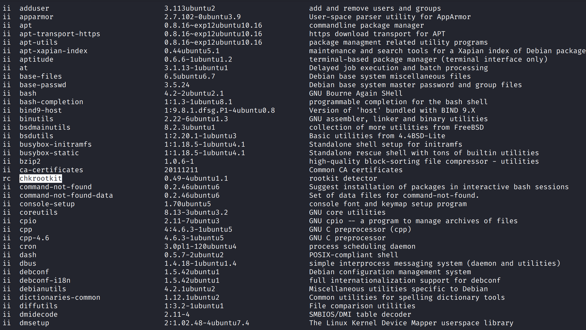

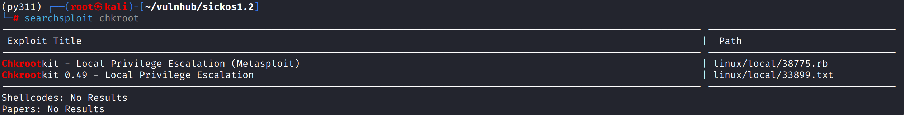

`chkrootkit`本质上是一个`shellscript`，其中的`slapper`在处理临时文件时存在条件竞争漏洞导致其会执行`/tmp/update`文件

查看对应的`poc`提示在`/tmp`目录下创建`update`文件，其中包含要执行的提权命令即可

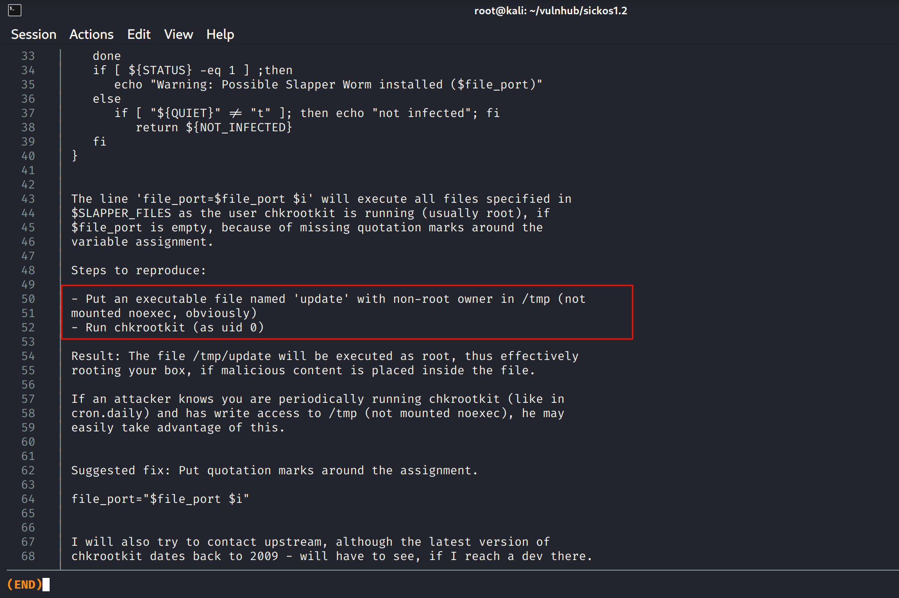

查看`cron.daily`系列计划任务，发现`chkrootkit`将按天执行

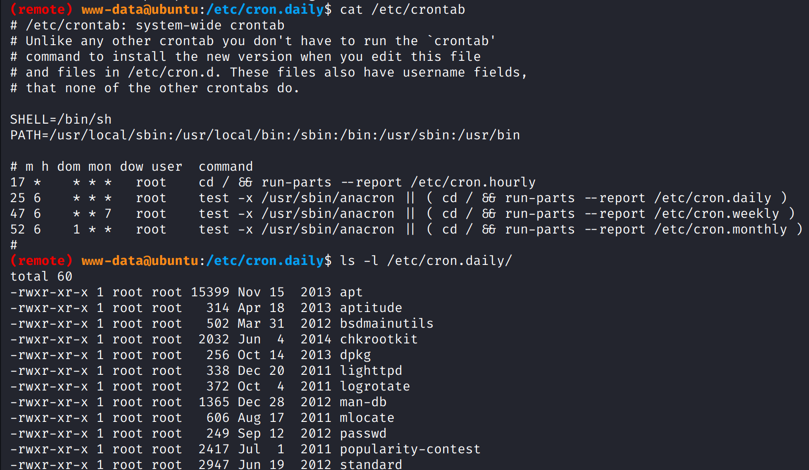

将反弹shell命令写入`/tmp/update`，并赋予可执行权限，等待反弹shell即可

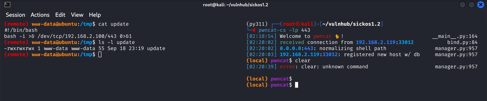

# Some Thinking

> chkrootkit不是每天次啊执行一次吗？

* 在`www-data`权限视角下是的，但题目作者考虑到打靶实际，在`/etc/cron.d`增加了一个`chkrootkit`计划任务，让其每分钟执行一次
    

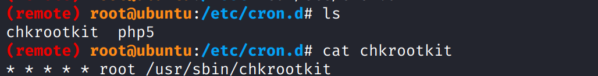
