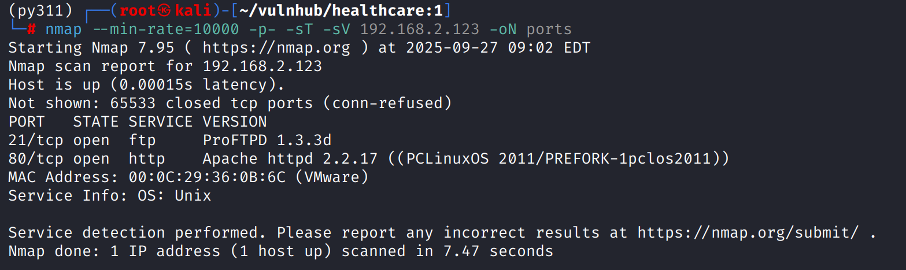
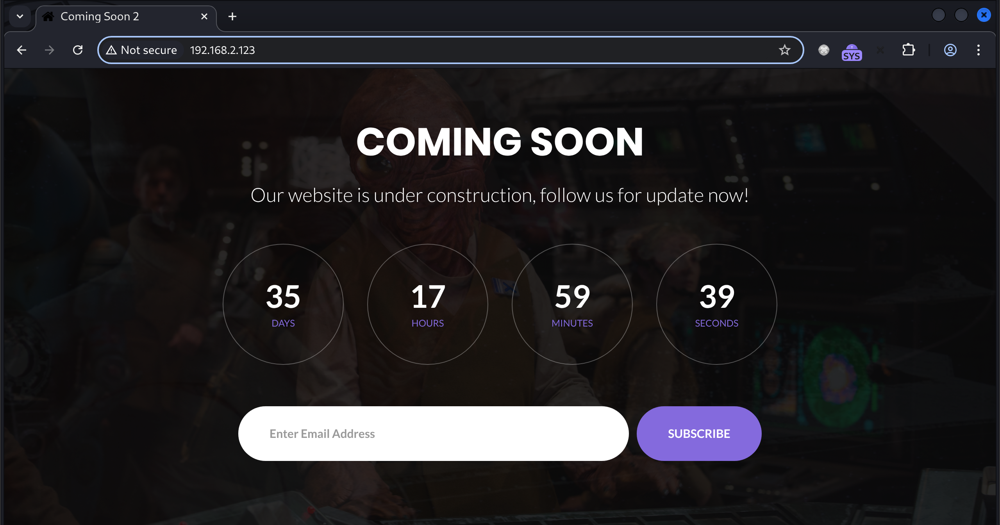
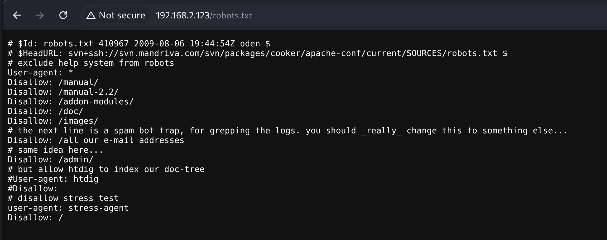
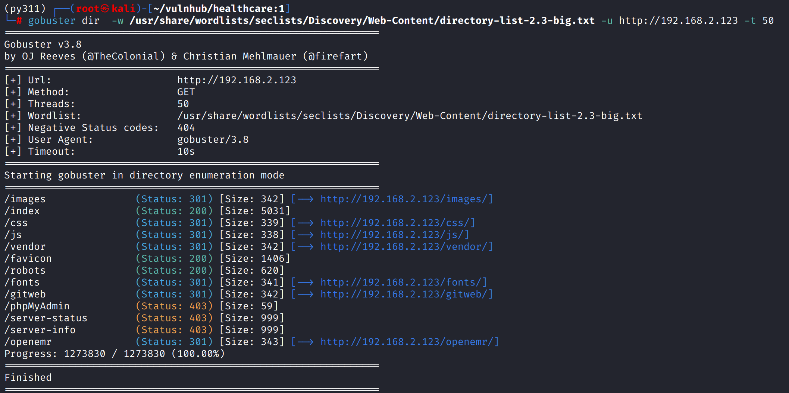
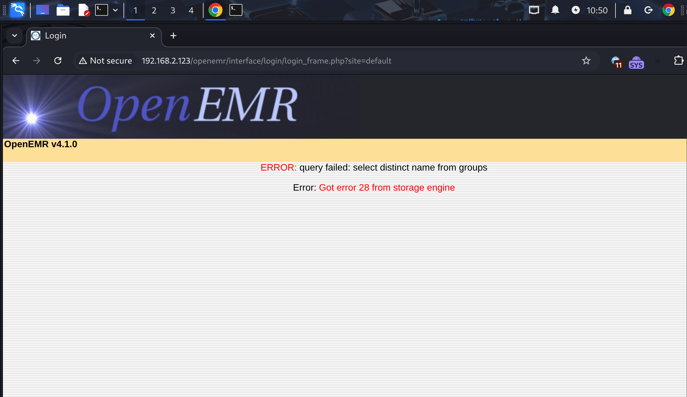
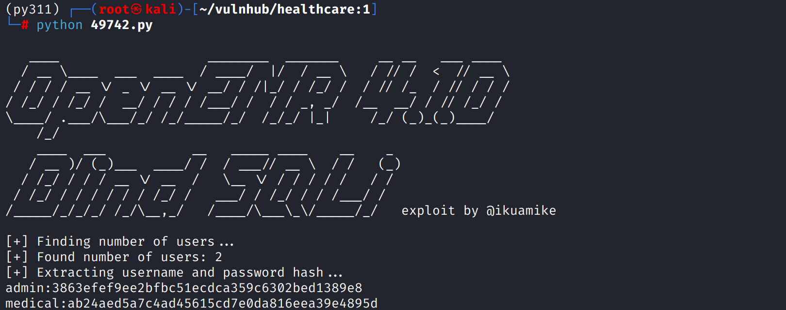
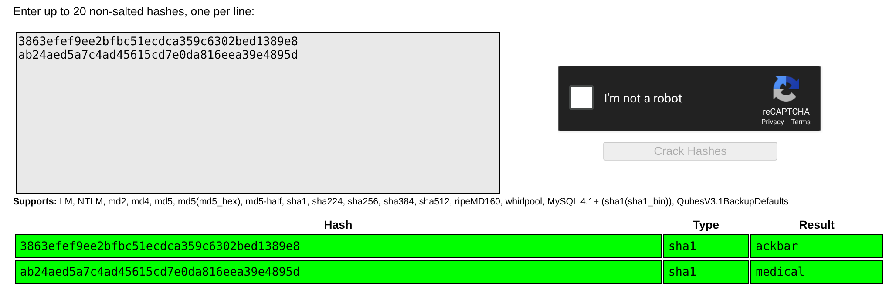

# Recon

这台机器开放标准端口的`ftp`、`web`，需要注意的是其ftp使用的是`ProFTPD`而不是更常见的`Vsftpd`

## 21/tcp

## 80/tcp

网页前端是一个发布页，不存在交互点

目录扫描发现`robots.txt`但路径基本不存在，无有效攻击向量

`gobuster`使用`directory-list-2.3-big.txt`扫描得到`/openemr`路径

这里测试了`feroxbuster`使用同样的字典扫不出来，可能是`timeout`原因

访问后发现指纹`OpenMer v4.1.0`，`searchhsploit openemr`发现存在大量漏洞

使用exp`49742.py`，sqli获得账号和密码hash

crackstation得到`admin:ackbar`和`medical:medical`

# Error

打到这里发现机器运行有问题，由于`mysqld`服务未启动导致`OpenEMR`异常，做到这里就没法往下了

未完的部分如下

- 使用破解得到的账号密码登录`OpenEMR`后台，通过类似`wordpress`后台getshell的方式反弹shell（编辑.php文件加入反弹shell代码）
- `find / -perm -4000 2>/dev/null`发现`/usr/bin/healthcare`存在`suid`，`strings`查看可打印字符，发现它运行了`fdisk -l`
- 通过`env hijack`，写入恶意`fdisk`，`export`环境变量后执行`healthcare`提权