# Recon

这台机器开放标准端口的`ftp`、`ssh`和`http`

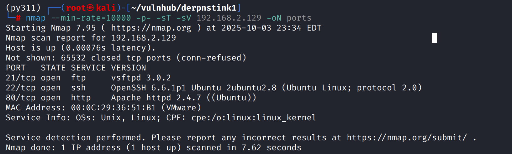

# shell as www-data by wordpress

web前端是一个静态页面

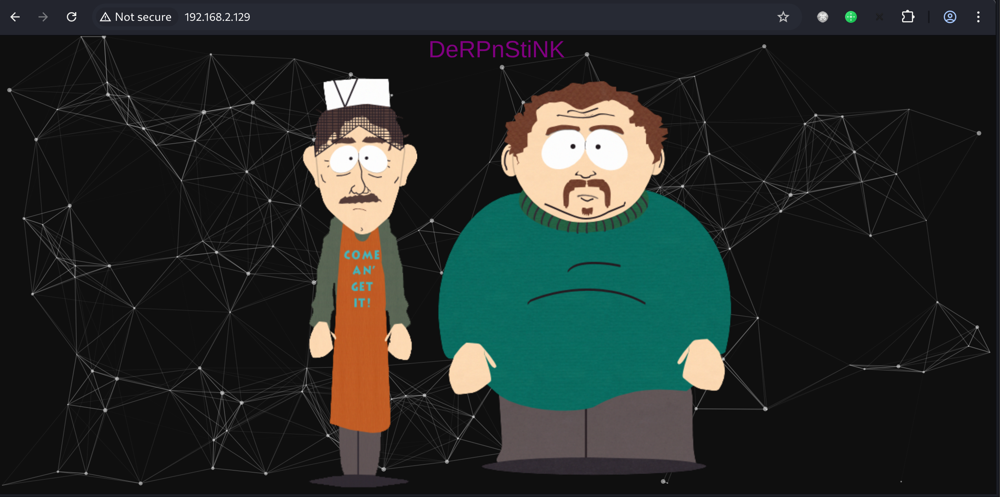

源代码中有`webnotes/notes.txt`提示，内容提示要进行host绑定

<-- @stinky, make sure to update your hosts file with local dns so the new derpnstink blog can be reached before it goes live --> 

目录扫描存在`weblog`目录

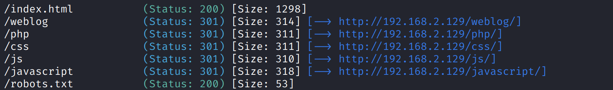

访问`weblog`目录跳转`derpnstink.local`，写入`/etc/hosts`

能看出来是wordpress

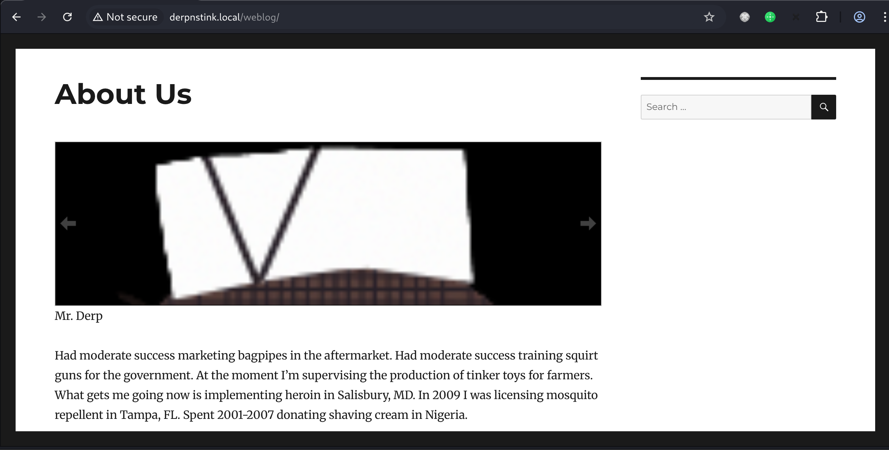

`nuclei`扫一下发现使用弱口令

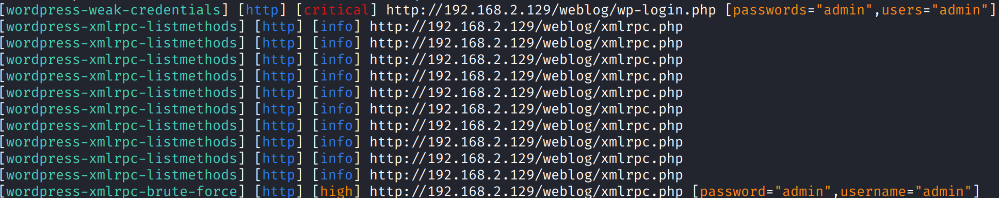

登录后台getshell

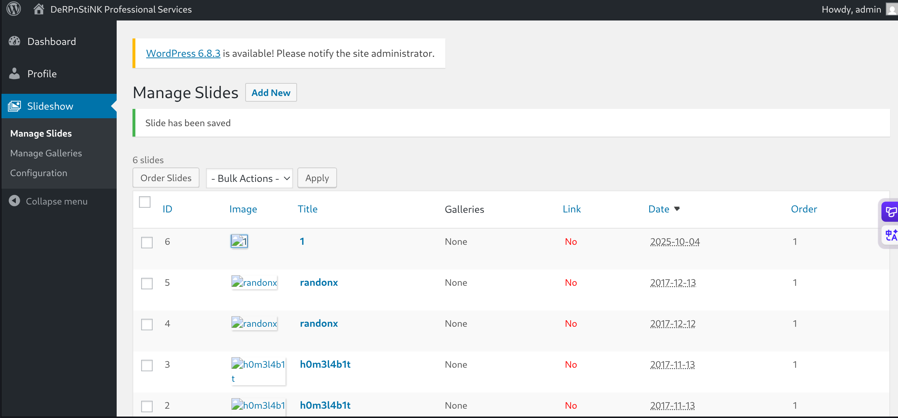

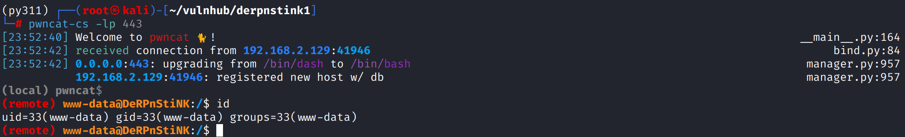

通过`/var/www/html/weblog/wp-config.php`得到mysql凭证`root:mysql`

发现`wp.users`表中存在`unclestinky`用户，应该对应上系统`stinky`用户

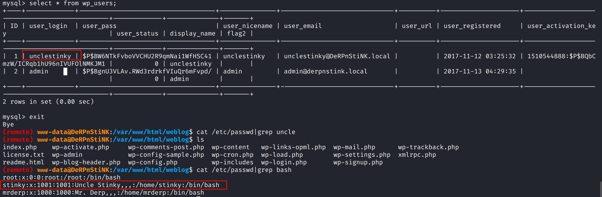

使用`hashcat`破解得到`wedgie57`

`hashcat -m 400 hash.txt --wordlist /usr/share/wordlists/rockyou.txt`

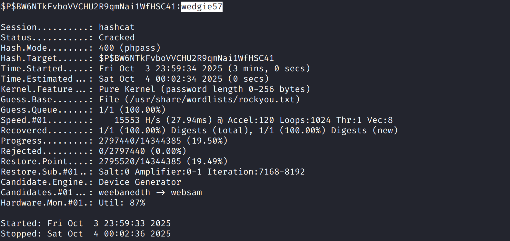

# shell as stinky

使用破解得到的密码登录`stinky`用户运行`linpeas.sh`

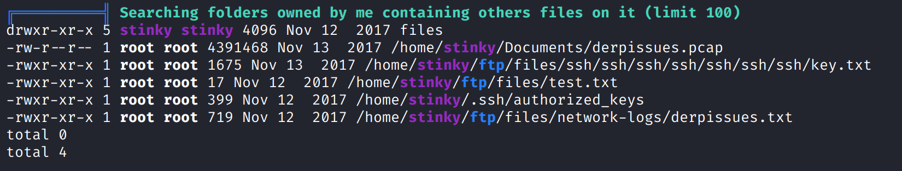

例行检查，发现一些有趣的文件

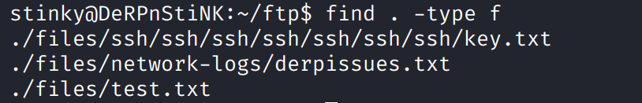

`derpissues.txt`内容，stinky说它需要抓包看看情况

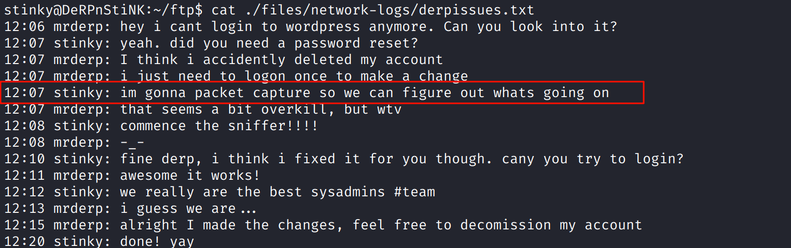

`key.txt`是一个私钥

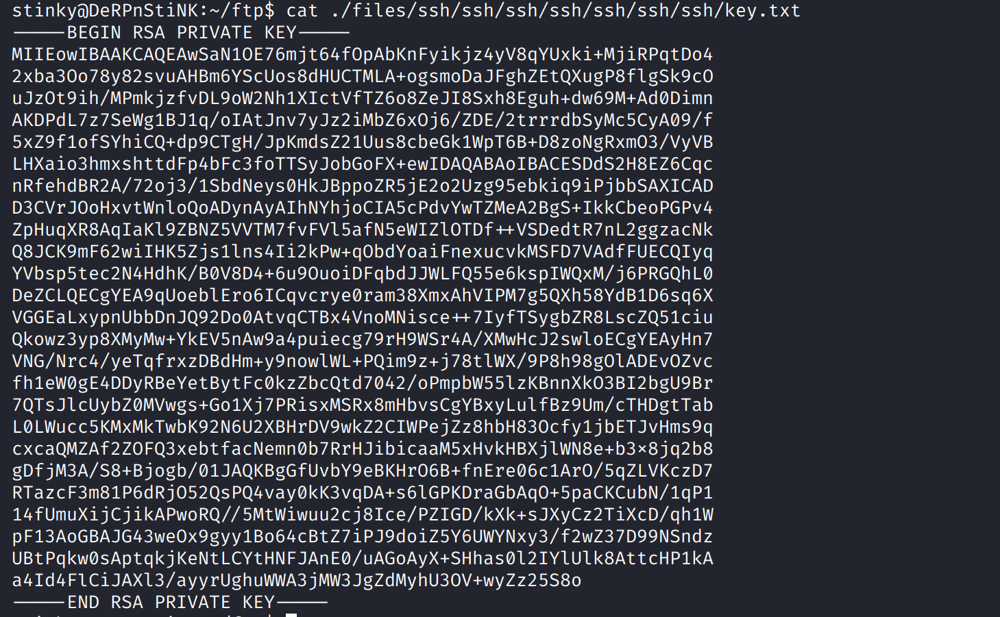

# shell as mrderp

`Documents`目录下发现`derpissues.pcap`，下载下来数据分析

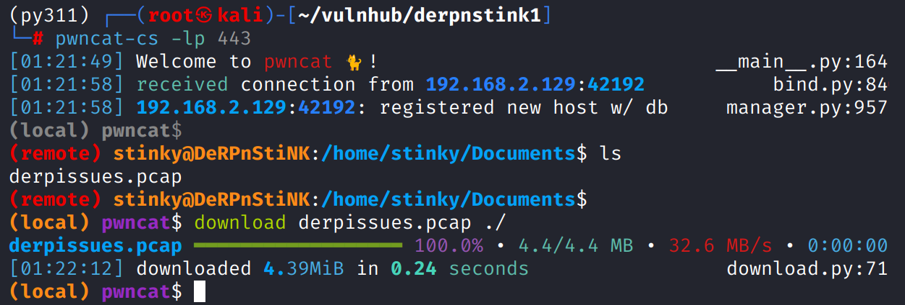

过滤http，查看wordpress登录包，得到`mrderp:derpderpderpderpderpderpderp"`

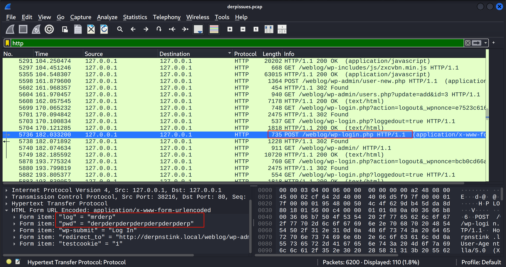

# shell as root by sudo

登录后发现其有root权限执行`/home/mrderp/binaries/derpy*`的能力

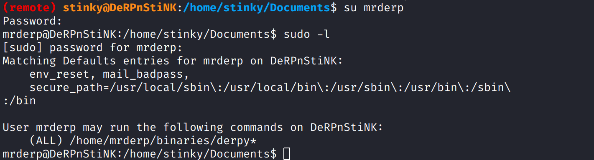

但是发现`/home/stinky/`下 并没有`binaries`目录，那么自己创建

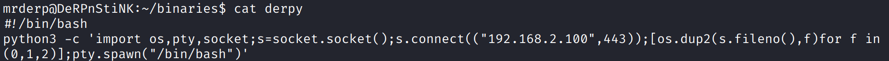

执行后获得root权限

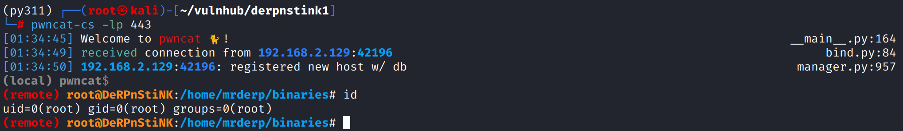
