# Recon

这台机器开放了标准端口的`ssh`、`http`和`8585/tcp`的Golang web

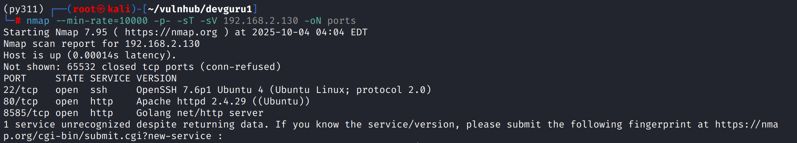

## Web

80端口是一个官网

8585端口是`Gitea`

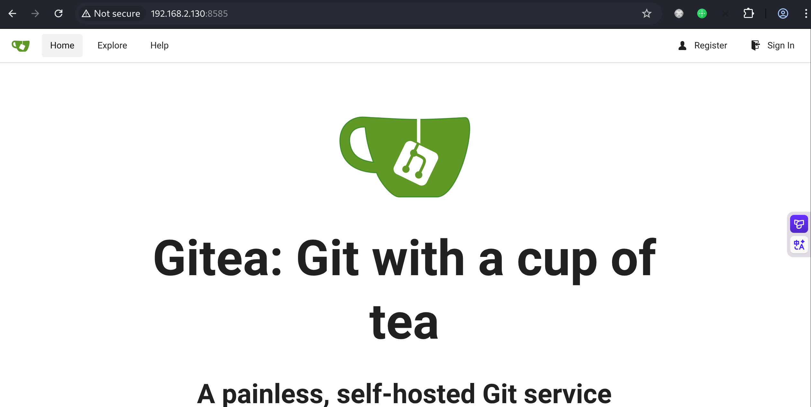

对80端口目录扫描，发现存在`.git`泄露以及`/backend`后台

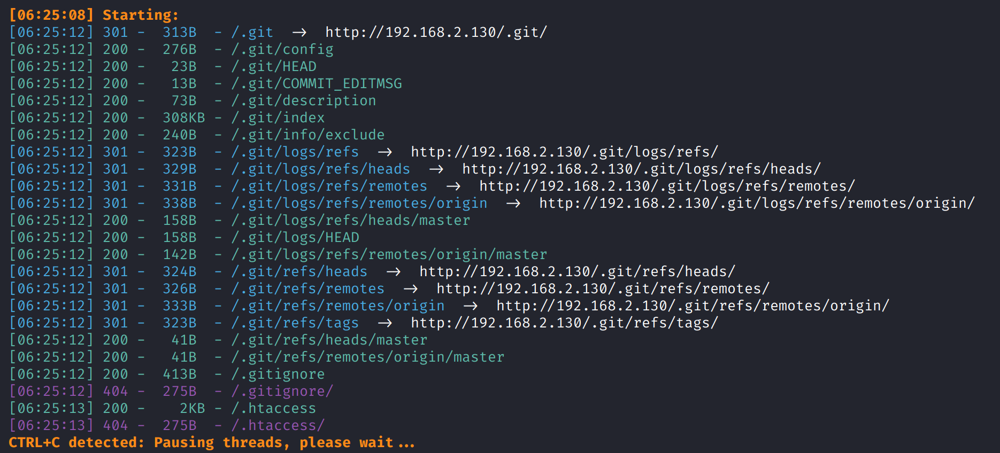

使用`git-dumper`转储，发现存在`adminer.php`

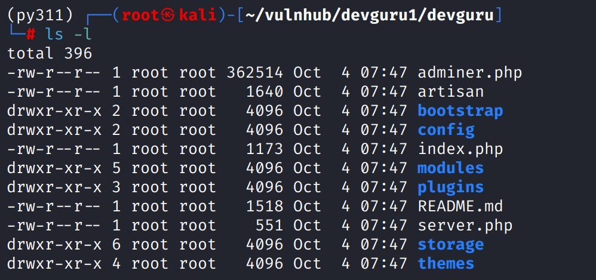

在`conf/database.php`中得到数据库凭证

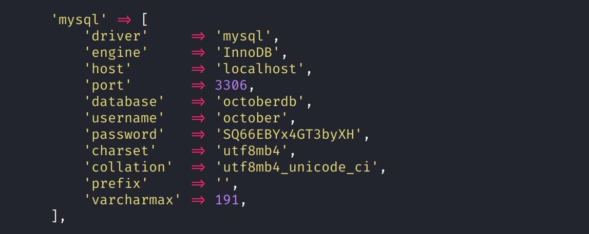

登录`adminier`，查询数据得到`Frank`密码hash

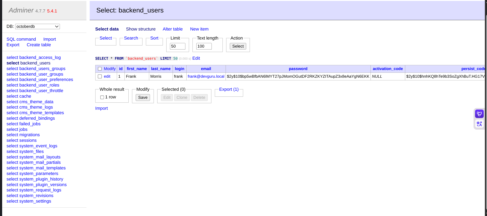

使用`https://www.tunnelsup.com/hash-analyzer/`判定为`bcrypt`

使用`https://bcrypt-generator.com/`生成bcrypt，修改密码hash为已知密码hash进行登录

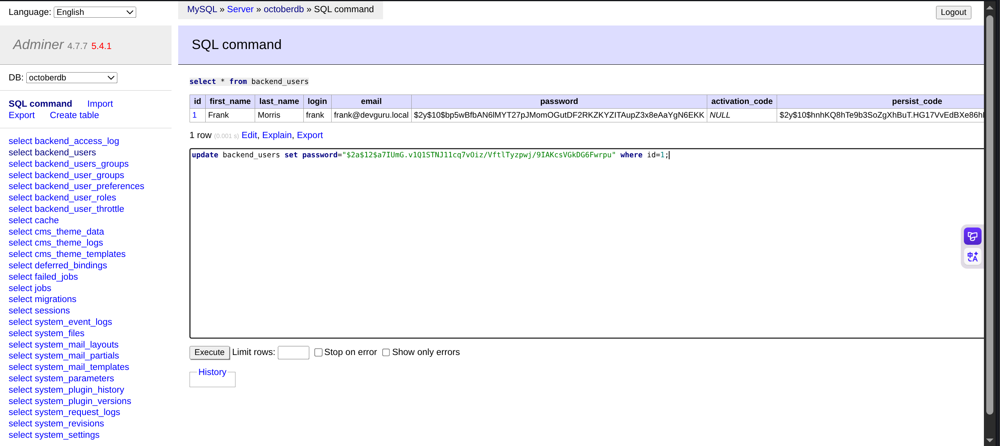

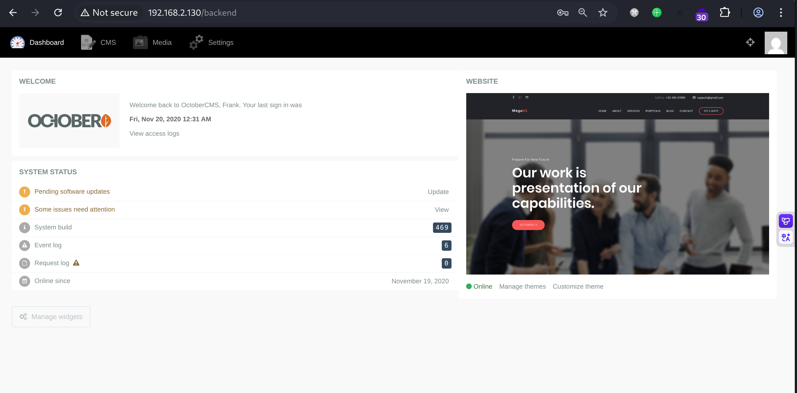

# shell as www-data by october-cms

根据页面内容能发现这是`october-cms`

编辑`Home page`，在`code`中写入`onStart()`生命周期函数，写入`myVar`变量一句话木马

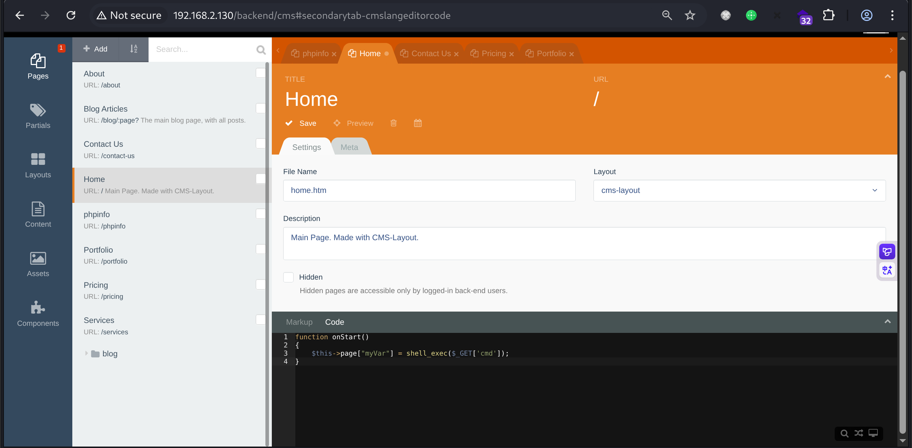

在`markup`中添加模板标签调用`myVar`

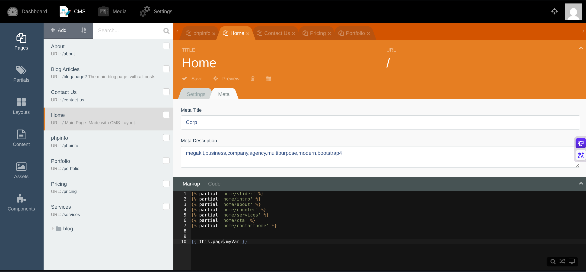

传递`?cmd`参数执行命令，使用`wget`落地`reverse.php`反弹shell

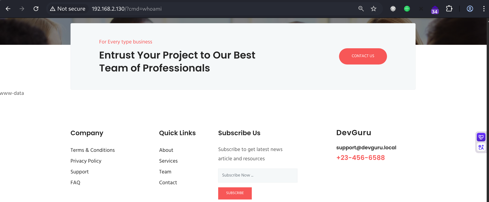

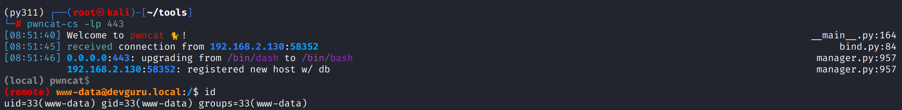

# shell as frank by gitea

例行检查，发现`frank`系统用户，8585的`gitea`是以用户`frank`身份启动

那么当前的重点就是通过`gitea` getshell

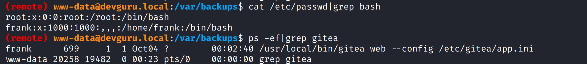

查看`/etc/gitea/app.ini`，没有权限

通过`find`命令发现`/var/backups/app.ini.bak`

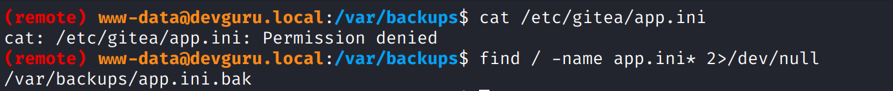

得到数据库账号密码

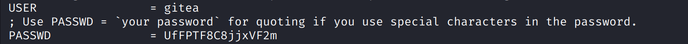

得到`frank`密码hash，此处使用的是`pdkdf2`

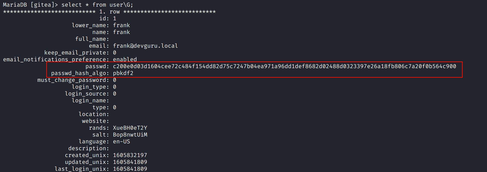

修改密码hash和加密算法，使用`bcrypt`

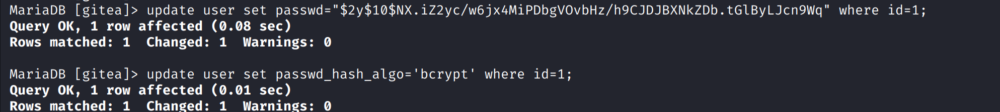

登录成功

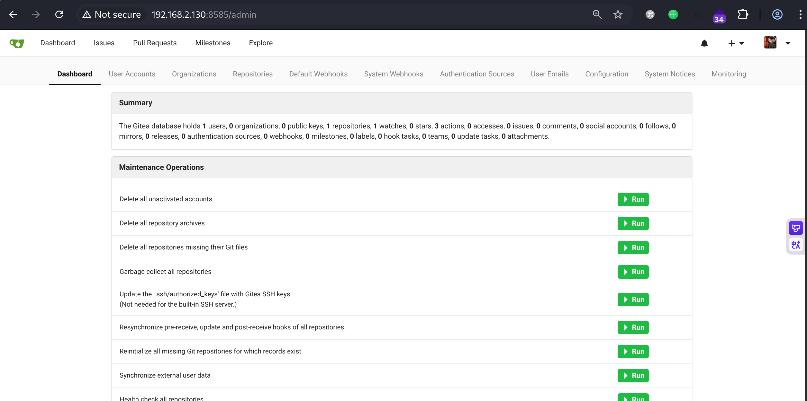

`gitea`版本为`1.12.5`，存在后台RCE

在`Git Hooks`中添加反弹shell代码

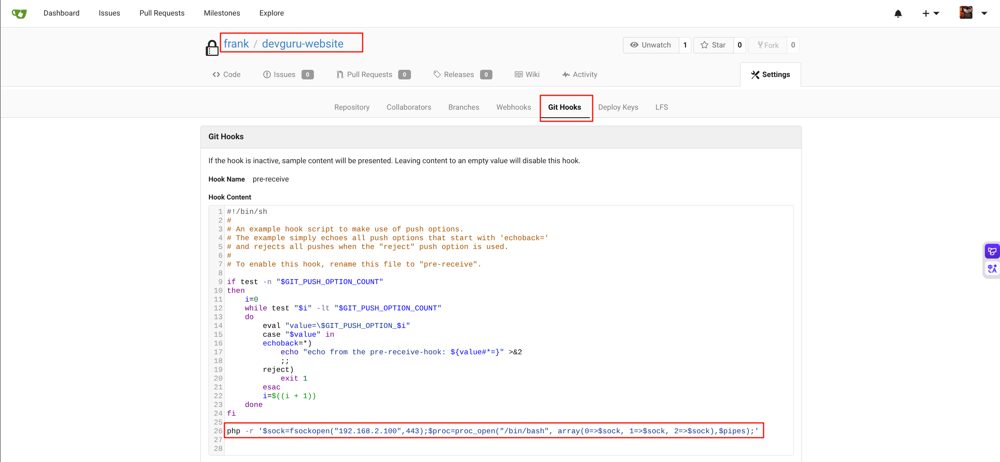

然后修改仓库`Readme.md`后提交，会触发`git commit`然后被`git hooks`捕获触发反弹shell代码

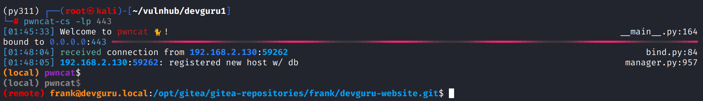

# shell as root by sudo

例行检查发现能sudo执行`/usr/bin/sqlite3`，但是只能使用非root权限

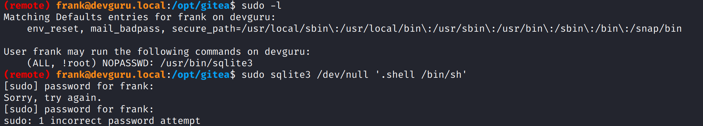

`sudo -V`查看版本，能对应上一个`bypass`漏洞`https://www.exploit-db.com/exploits/47502`

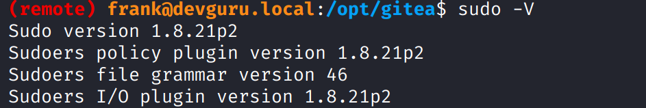

使用poc getshell

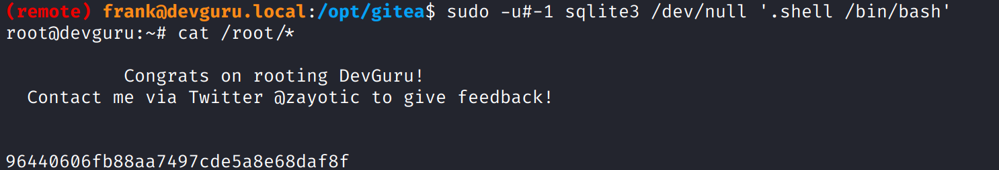
