# Recon

这台机器仅开放http服务

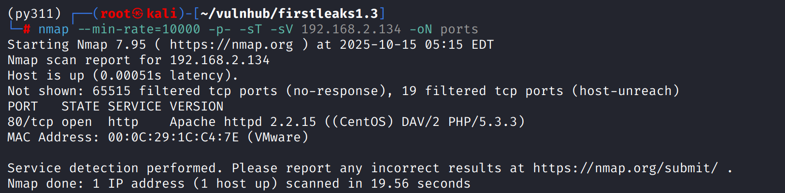

## http

目录扫描无果，尝试访问靶机名称路径`/fristi`，发现一个登录页面

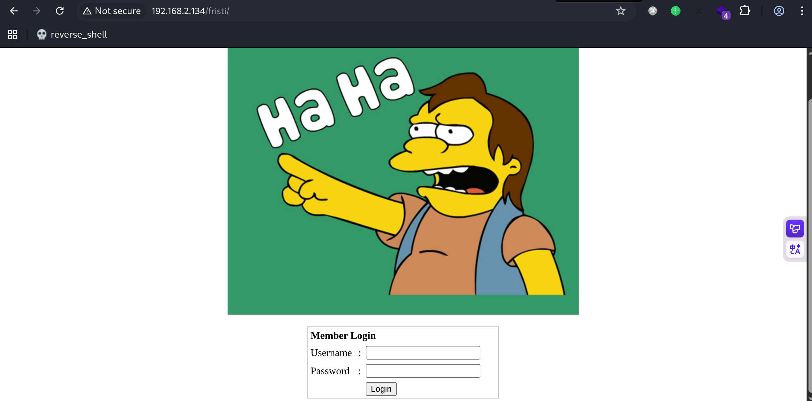

源代码中有一段注释，其中`eezeepz`可能是用户名

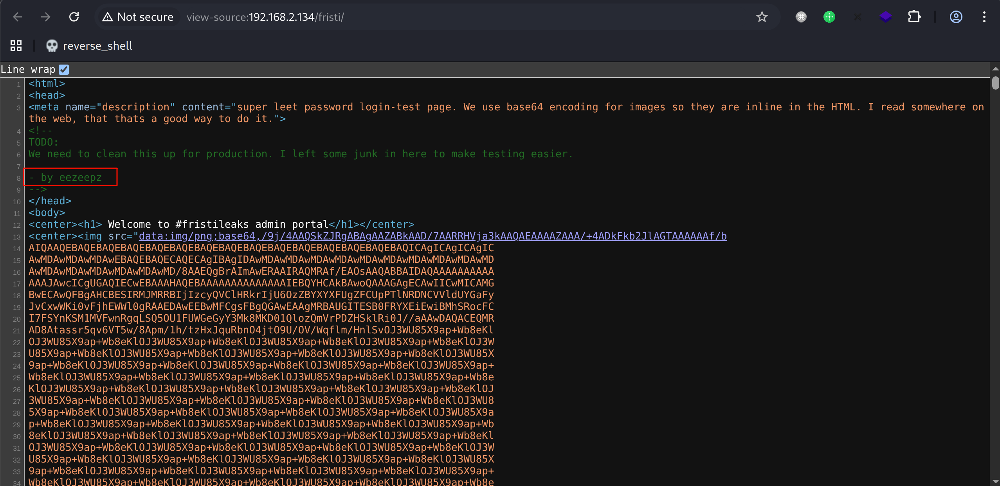

还有一段`base64`，解码发现是图片二进制

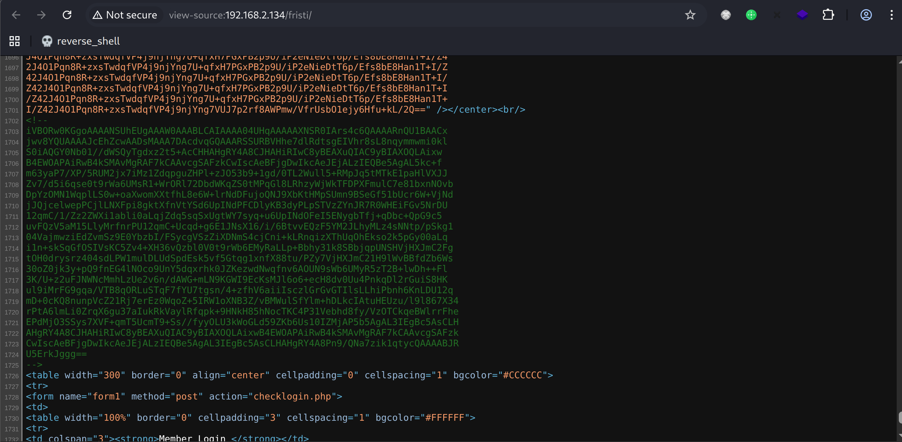

解码后写入文件，打开图片得到一串字符`keKkeKKeKKeKkEkkEk`

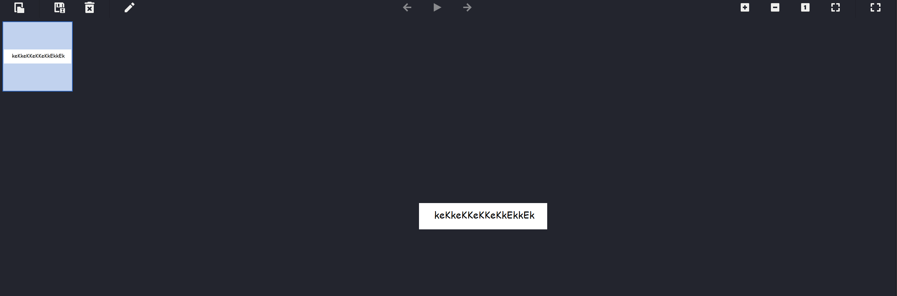

使用`eezeepz:keKkeKKeKKeKkEkkEk`登录

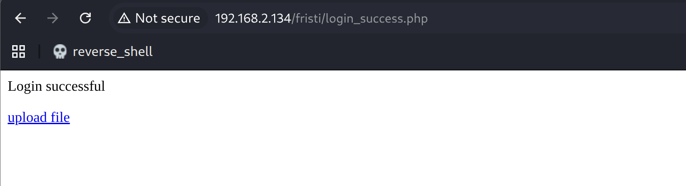

存在文件上传功能点

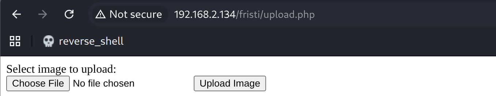

# shell as apache by file-upload

测试上传点，MIME与文件头都无法单独绕过上传限制，通过更改后缀名增加`.jpg`上传

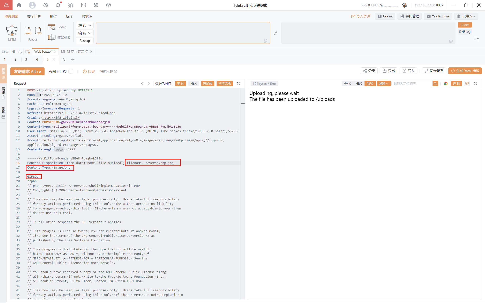

奇怪的是直接访问`/uploads/reverse.php.jpg`能被解析反弹到shell

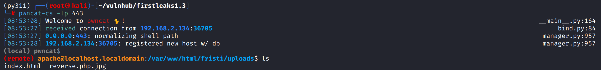

# shell as admin by crontab

例行检查发现`/home/eezeepz/notes.txt`，其内容表明允许当前用户以`admin`用户身份执行`/usr/bin/`目录下所有命令

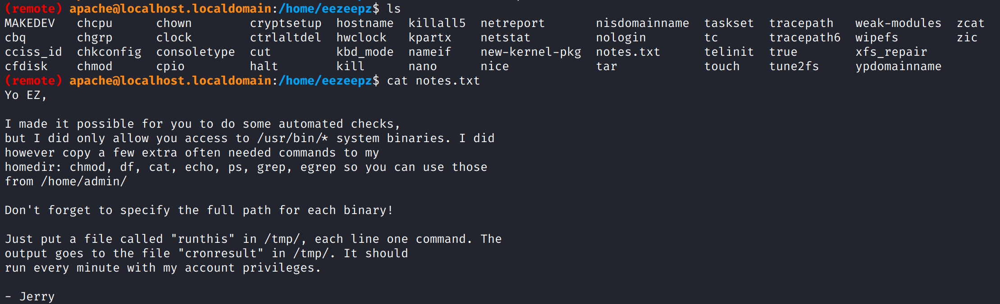

只需要把执行的命令写入`/tmp/runthis`，结果会在`/tmp/cronresult`显示

使用`/usr/bin/perl`反弹shell，将命令写入`/tmp/runthis`

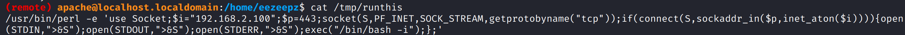

反弹shell成功，得到admin权限

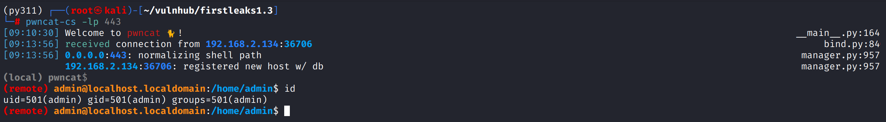

# shell as fristigod by crypto

例行检查在`/home/admin`下发现`cryptedpass.txt`和`cryptpass.py`

已知密文和加密方式那么很好逆

python代码能看出来通过`base64 -> reverse -> rot13`进行的加密

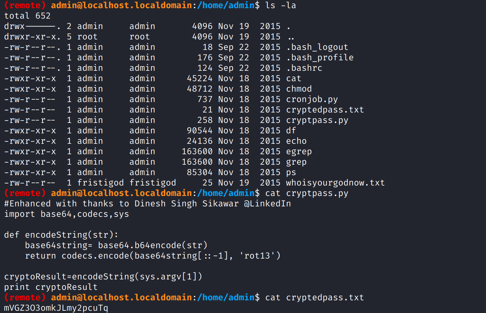

那么反过来解密即可

`mVGZ3O3omkJLmy2pcuTq` -> `zITM3B3bzxWYzl2cphGd` -> `dGhpc2lzYWxzb3B3MTIz` -> `thisisalsopw123`

得到的密码通过`sudo -l`测试发现密码正确，但没什么用

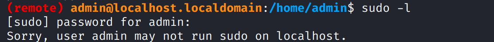

继续枚举，发现`whoisyourgodnow.txt`，其所属于`fristigod`用户创建

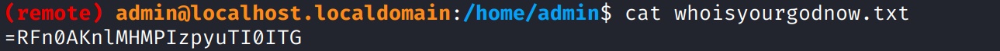

使用同样的算法解密

`=RFn0AKnlMHMPIzpyuTI0ITG` -> `=ESa0NXayZUZCVmclhGV0VGT` -> `TGV0VGhlcmVCZUZyaXN0aSE=` -> `LetThereBeFristi!`

得到密码后`su fristigod`

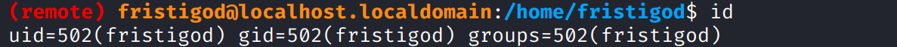

# shell as root by sudo

例行检查，发现能以`fristi`用户身份执行`/var/fristigod/.secret_admin_stuff/doCom`

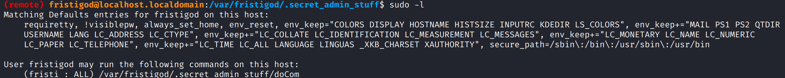

sudo执行，发现uid为0，等同于root权限

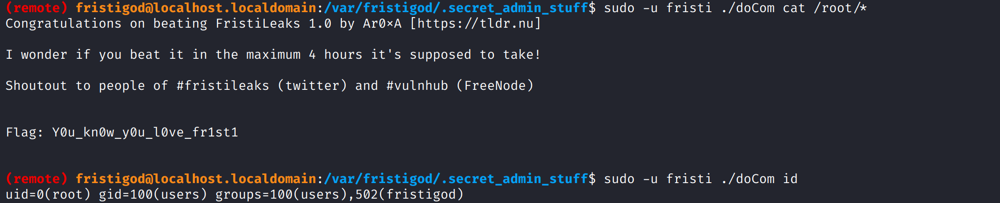
