# Recon

这台机器仅开放`ssh`和`http`

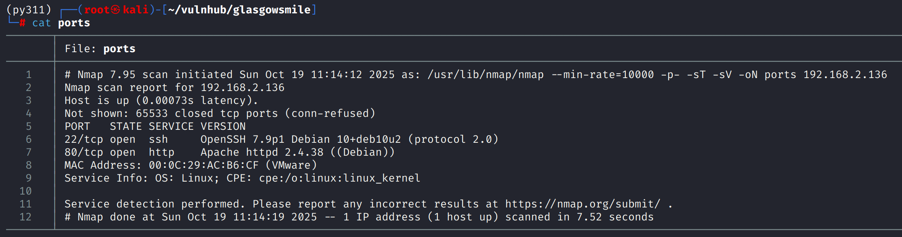

## web

网页前端是一张图片，源代码中不存在任何信息

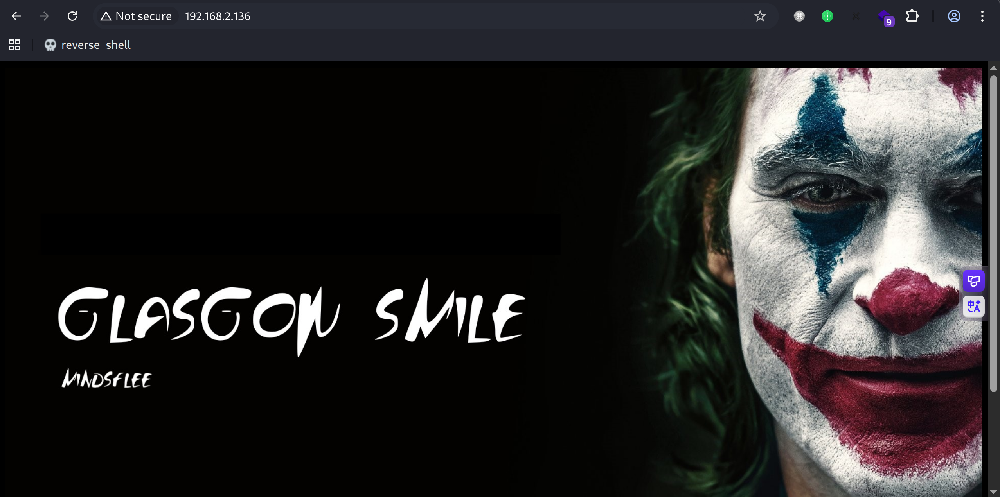

目录扫描发现`joomla`和`how_to.txt`

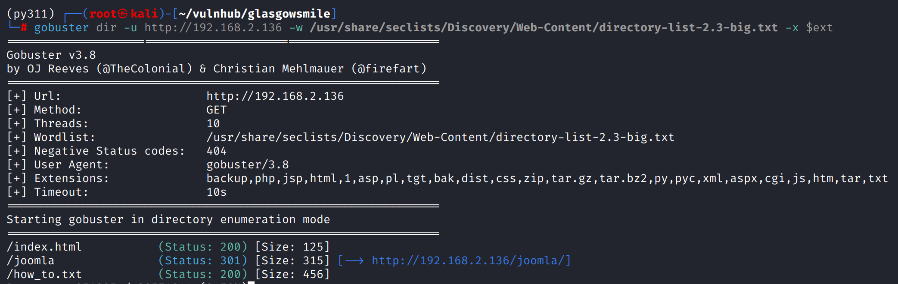

`how_to.txt`中似乎也不含有效信息

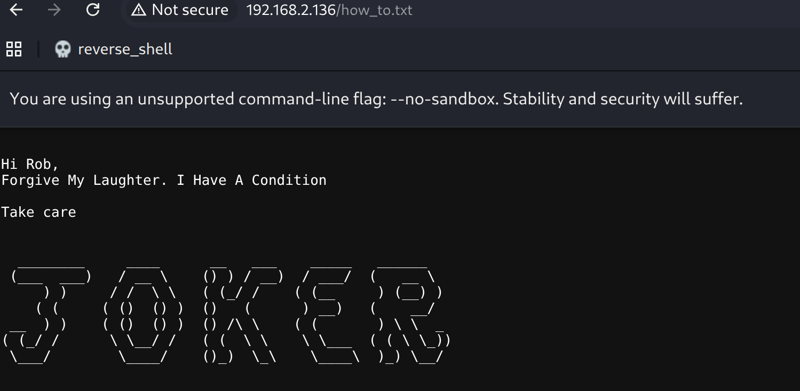

`/joomla`路径是标准的`Joomls Cms`，不存在弱口令

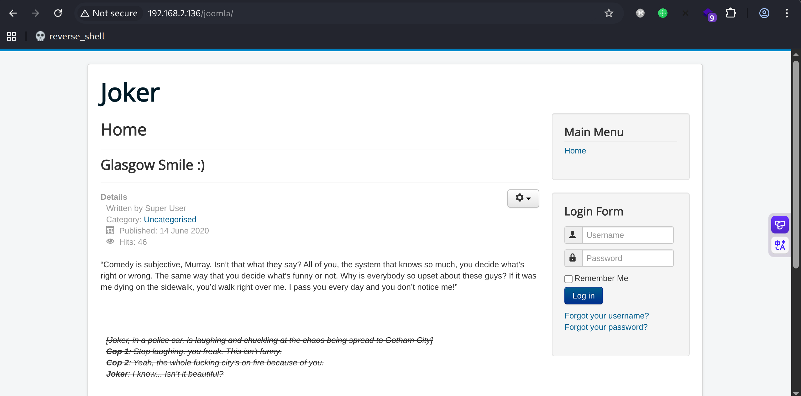

使用`cewl -m 5 http://192.168.2.136/joomla/`爬取网页前端有意义的字符，限定最小长度5为，作为密码字典

爆破joomla管理员用户`joomla`，响应大小降序，第一个响应包变大的就是正确密码，注意yakit需要配置webfuzzer允许重定向

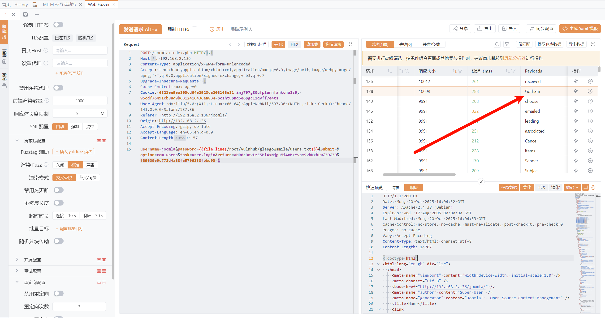

# shell as www-data by joomla

通过`templates`getshell，在当前使用的模板`Protostar` index.php写入`reverse-shell.php`

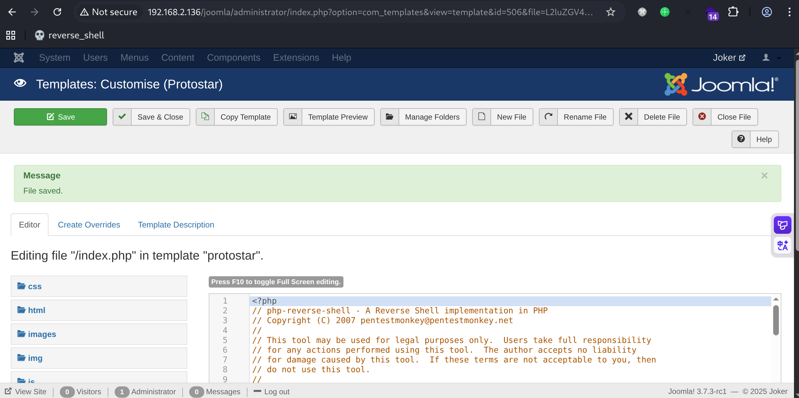

随后访问`/joomla/templates/protostar/index.php`反弹shell

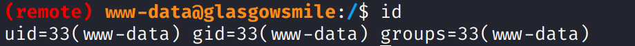

# shell as rob

例行枚举，存在`rob`有效用户

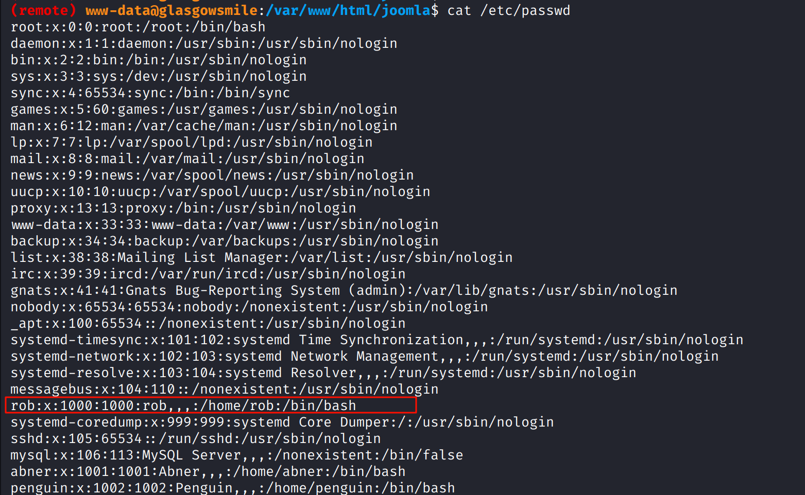

读取joomla配置文件得到mysql凭证`joomla:babyjoker`

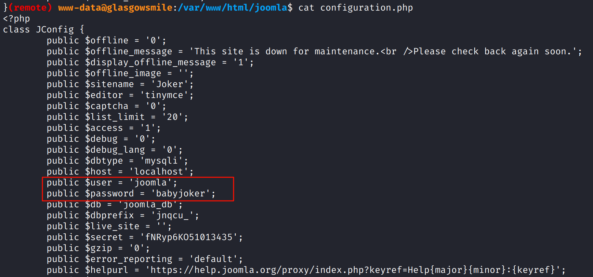

mysql登录后在`batjoke.taskforce`表中得到一些密码数据，base64解码rob用户密码得到`???AllIHaveAreNegativeThoughts???`

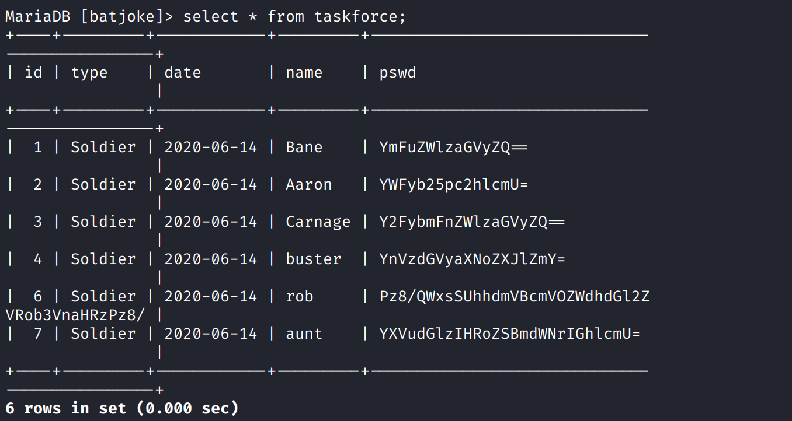

使用ssh连接

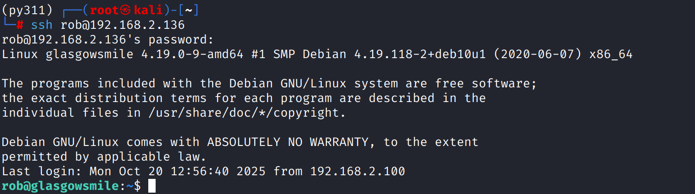

# shell as abner

在主目录下发现`Abnerineedyourhelp`文件，内容看起来可能是凯撒

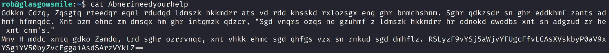

使用工具枚举偏移量https://ctf.bugku.com/tool/caesar，解密后如下

```

Hello Dear, Arthur suffers from severe mental illness but we see little sympathy for his condition. This relates to his feeling about being ignored. You can find an entry in his journal reads, "The worst part of having a mental illness is people expect you to behave as if you don't."
Now I need your help Abner, use this password, you will find the right way to solve the enigma. STMzaG9wZTk5bXkwZGVhdGgwMDBtYWtlczQ0bW9yZThjZW50czAwdGhhbjBteTBsaWZlMA==
```

其内容主要是说希望使用密码去拯救亚瑟，账户为`abner`，密码在最后

最后的base64解码后得到`I33hope99my0death000makes44more8cents00than0my0life0`，登录`abner`用户

# shell as penguin

这是最难横向提权到的一个用户了 因为横向用户的提权基本不会考虑来到`/var/www`目录下

在`/var/www/joomla2`目录下查找隐藏文件，发现`.dear_penguins.zip`压缩包

此处应该早点想到通过`find / -name "\*penguins\*"`来查找文件名有关`penguins`的文件

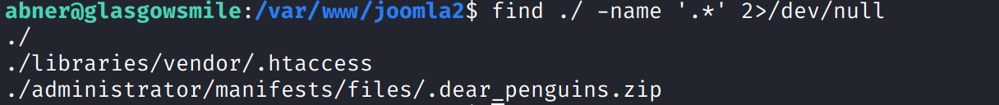

将隐藏压缩包复制到/tmp目录下 使用`abner`用户密码解压 得到`dear_penguins`文件

查看文件内容 最后一行应该是`penguin`用户密码

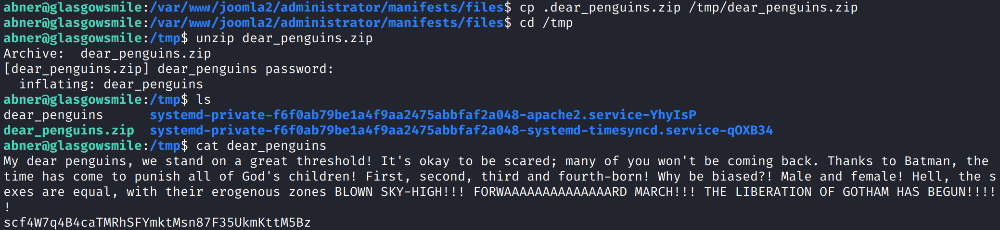

su切换即可

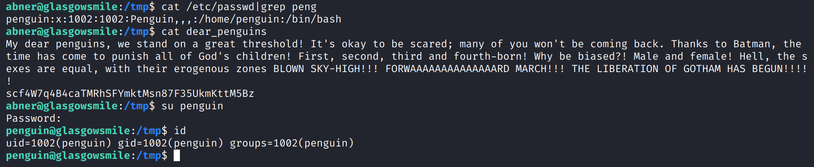

# shell as root by suid

例行枚举，在主目录下发现带有suid的find二进制文件，但其所属者为当前用户，不存在提权向量

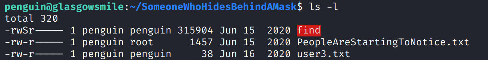

`PeopleAreStartingToNotice.txt`中说明存在一个提权文件

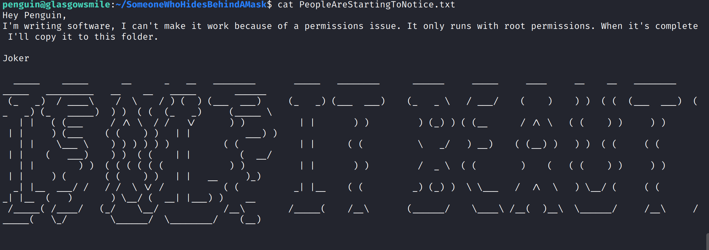

存在`.trash_old`隐藏文件，看起来是一个shell脚本，有可写权限

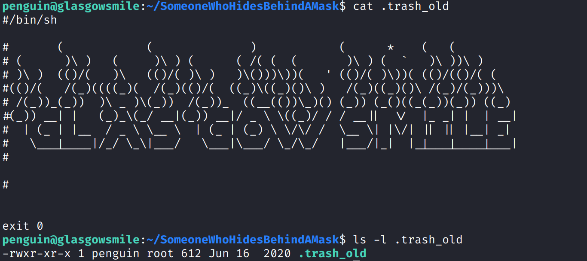

但这个文件必须被root权限执行才可以提权到root，此前的枚举未发现crontab

这里学习到了一个工具`pspy`，它能在没有root权限的条件下查看其他用户运行的命令、计划任务

https://github.com/DominicBreuker/pspy

运行pspy发现存在root权限的计划任务会执行`.trash_old`文件，那么思路就清晰了

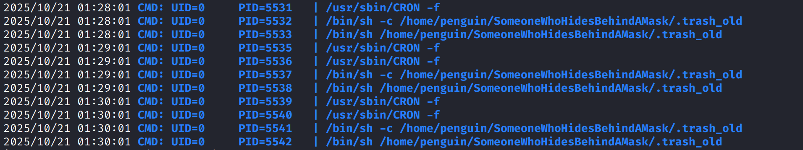

像`.trash_old`文件写入反弹shell命令即可，注意这个文件默认开头的`shebang`书写不正确，需要将#改为#!

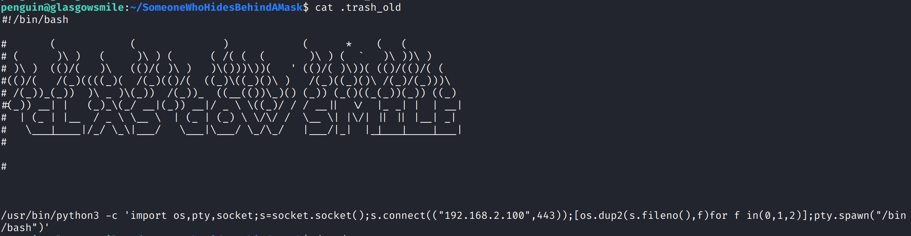

使用pspy观察命令是否被执行

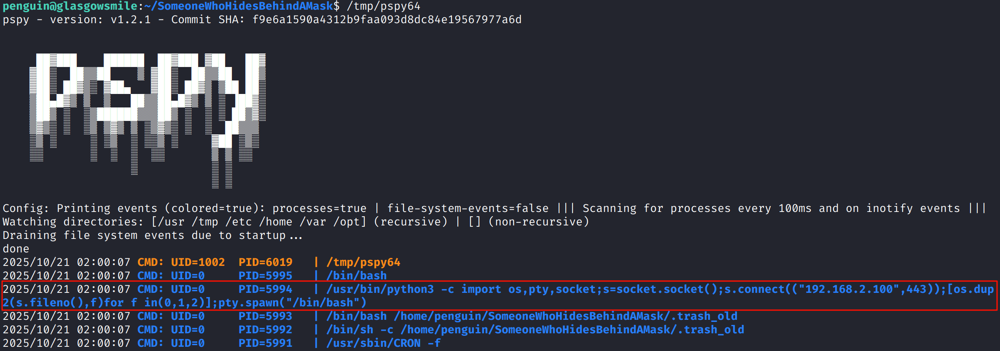

反弹shell成功

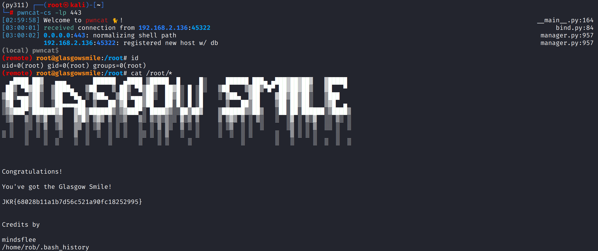
