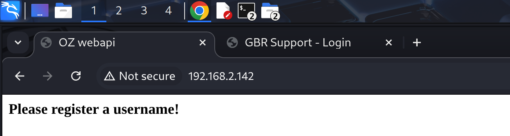

# Recon

这台机器开放了两个web

```shell
(py311) ┌──(kali㉿kali)-[~/vulnhub/oz]
└─$ sudo nmap --min-rate 10000 -sT -sV -A -p- -n 192.168.2.142 -oN ports
Starting Nmap 7.95 ( https://nmap.org ) at 2025-10-29 22:54 EDT
Nmap scan report for 192.168.2.142
Host is up (0.0010s latency).
Not shown: 65533 filtered tcp ports (no-response)
PORT     STATE SERVICE VERSION
80/tcp   open  http    Werkzeug httpd 0.14.1 (Python 2.7.14)
|_http-trane-info: Problem with XML parsing of /evox/about
|_http-title: OZ webapi
8080/tcp open  http    Werkzeug httpd 0.14.1 (Python 2.7.14)
| http-open-proxy: Potentially OPEN proxy.
|_Methods supported:CONNECTION
|_http-server-header: Werkzeug/0.14.1 Python/2.7.14
| http-title: GBR Support - Login
|_Requested resource was http://192.168.2.142:8080/login
MAC Address: 00:0C:29:19:FD:DB (VMware)
Warning: OSScan results may be unreliable because we could not find at least 1 open and 1 closed port
Aggressive OS guesses: Linux 3.10 - 4.11 (97%), Linux 3.2 - 4.14 (97%), Linux 3.13 - 4.4 (95%), Linux 3.16 - 4.6 (95%), Linux 3.8 - 3.16 (95%), Linux 4.4 (95%), Linux 3.13 (94%), OpenWrt Chaos Calmer 15.05 (Linux 3.18) or Designated Driver (Linux 4.1 or 4.4) (91%), Linux 4.10 (91%), Android 8 - 9 (Linux 3.18 - 4.4) (91%)
No exact OS matches for host (test conditions non-ideal).
Network Distance: 1 hop

TRACEROUTE
HOP RTT     ADDRESS
1   1.04 ms 192.168.2.142

OS and Service detection performed. Please report any incorrect results at https://nmap.org/submit/ .
Nmap done: 1 IP address (1 host up) scanned in 28.77 seconds
```

80端口是webapi，8080端口有一个登录界面


