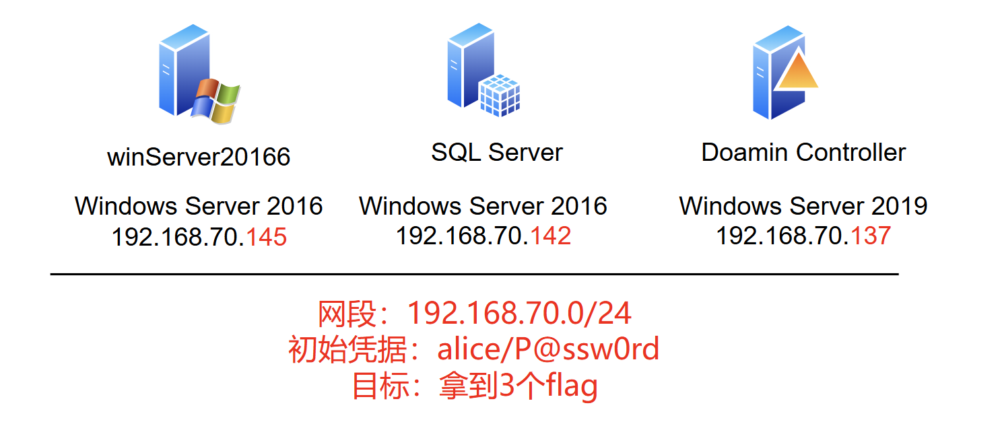
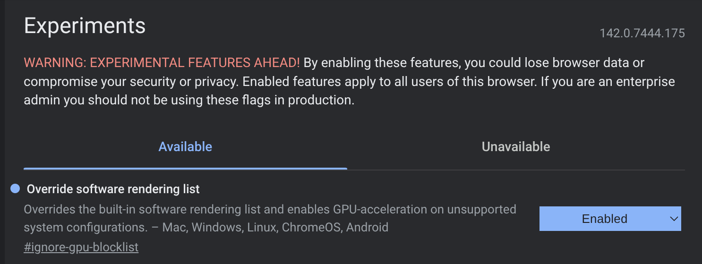

# Description

NoCVE Range系列靶场来自“[信益安信息安全研究院](https://mp.weixin.qq.com/s/1HBTWZuUjToMTob5SReVyA)” ，拓扑如下



# Recon

## 定位域控

> 192.168.70.145

```shell
# Nmap 7.95 scan initiated Mon Dec  8 02:40:39 2025 as: /usr/lib/nmap/nmap --min-rate 20000 -sT -sV -A -p- -n -Pn -oN 20166.145 192.168.70.145
Warning: 192.168.70.145 giving up on port because retransmission cap hit (10).
Nmap scan report for 192.168.70.145
Host is up (0.00047s latency).
Not shown: 65239 closed tcp ports (conn-refused), 283 filtered tcp ports (no-response)
PORT      STATE SERVICE      VERSION
135/tcp   open  msrpc        Microsoft Windows RPC
139/tcp   open  netbios-ssn  Microsoft Windows netbios-ssn
445/tcp   open  microsoft-ds Microsoft Windows Server 2008 R2 - 2012 microsoft-ds
5985/tcp  open  http         Microsoft HTTPAPI httpd 2.0 (SSDP/UPnP)
|_http-server-header: Microsoft-HTTPAPI/2.0
|_http-title: Not Found
47001/tcp open  http         Microsoft HTTPAPI httpd 2.0 (SSDP/UPnP)
|_http-server-header: Microsoft-HTTPAPI/2.0
|_http-title: Not Found
49664/tcp open  msrpc        Microsoft Windows RPC
49665/tcp open  msrpc        Microsoft Windows RPC
49666/tcp open  msrpc        Microsoft Windows RPC
49667/tcp open  msrpc        Microsoft Windows RPC
49668/tcp open  msrpc        Microsoft Windows RPC
49669/tcp open  msrpc        Microsoft Windows RPC
49670/tcp open  msrpc        Microsoft Windows RPC
49675/tcp open  msrpc        Microsoft Windows RPC
MAC Address: 00:0C:29:3E:C4:B8 (VMware)
Device type: general purpose
Running: Microsoft Windows 2016|2019
OS CPE: cpe:/o:microsoft:windows_server_2016 cpe:/o:microsoft:windows_server_2019
OS details: Microsoft Windows Server 2016 or Server 2019
Network Distance: 1 hop
Service Info: OSs: Windows, Windows Server 2008 R2 - 2012; CPE: cpe:/o:microsoft:windows

Host script results:
|_nbstat: NetBIOS name: WIN-TPO2C33O7I7, NetBIOS user: <unknown>, NetBIOS MAC: 00:0c:29:3e:c4:b8 (VMware)
| smb-security-mode: 
|   account_used: guest
|   authentication_level: user
|   challenge_response: supported
|_  message_signing: disabled (dangerous, but default)
| smb2-time: 
|   date: 2025-12-08T07:41:48
|_  start_date: 2025-12-08T07:36:44
| smb2-security-mode: 
|   3:1:1: 
|_    Message signing enabled but not required

TRACEROUTE
HOP RTT     ADDRESS
1   0.47 ms 192.168.70.145

OS and Service detection performed. Please report any incorrect results at https://nmap.org/submit/ .
# Nmap done at Mon Dec  8 02:41:53 2025 -- 1 IP address (1 host up) scanned in 74.14 seconds

```
从扫描结果来看开放了基本的samba、netbios等服务，以及5985/tcp的HTTPAPI

> 192.168.70.142

```shell
# Nmap 7.95 scan initiated Mon Dec  8 02:41:03 2025 as: /usr/lib/nmap/nmap --min-rate 20000 -sT -sV -A -p- -n -Pn -oN sqlserver.142 192.168.70.142
Warning: 192.168.70.142 giving up on port because retransmission cap hit (10).
Nmap scan report for 192.168.70.142
Host is up (0.00054s latency).
Not shown: 65301 closed tcp ports (conn-refused), 220 filtered tcp ports (no-response)
PORT      STATE SERVICE      VERSION
135/tcp   open  msrpc        Microsoft Windows RPC
139/tcp   open  netbios-ssn  Microsoft Windows netbios-ssn
445/tcp   open  microsoft-ds Microsoft Windows Server 2008 R2 - 2012 microsoft-ds
1433/tcp  open  ms-sql-s     Microsoft SQL Server 2019 15.00.2000.00; RTM
| ms-sql-info: 
|   192.168.70.142:1433: 
|     Version: 
|       name: Microsoft SQL Server 2019 RTM
|       number: 15.00.2000.00
|       Product: Microsoft SQL Server 2019
|       Service pack level: RTM
|       Post-SP patches applied: false
|_    TCP port: 1433
| ms-sql-ntlm-info: 
|   192.168.70.142:1433: 
|     Target_Name: XYA
|     NetBIOS_Domain_Name: XYA
|     NetBIOS_Computer_Name: WIN-M8TL4JEGCEM
|     DNS_Domain_Name: xya.com
|     DNS_Computer_Name: WIN-M8TL4JEGCEM.xya.com
|     DNS_Tree_Name: xya.com
|_    Product_Version: 10.0.14393
| ssl-cert: Subject: commonName=SSL_Self_Signed_Fallback
| Not valid before: 2025-12-08T07:37:03
|_Not valid after:  2055-12-08T07:37:03
|_ssl-date: 2025-12-08T07:42:17+00:00; 0s from scanner time.
5985/tcp  open  http         Microsoft HTTPAPI httpd 2.0 (SSDP/UPnP)
|_http-title: Not Found
|_http-server-header: Microsoft-HTTPAPI/2.0
47001/tcp open  http         Microsoft HTTPAPI httpd 2.0 (SSDP/UPnP)
|_http-server-header: Microsoft-HTTPAPI/2.0
|_http-title: Not Found
49664/tcp open  msrpc        Microsoft Windows RPC
49665/tcp open  msrpc        Microsoft Windows RPC
49666/tcp open  msrpc        Microsoft Windows RPC
49667/tcp open  msrpc        Microsoft Windows RPC
49668/tcp open  msrpc        Microsoft Windows RPC
49669/tcp open  msrpc        Microsoft Windows RPC
49670/tcp open  msrpc        Microsoft Windows RPC
49671/tcp open  msrpc        Microsoft Windows RPC
MAC Address: 00:0C:29:58:FE:C5 (VMware)
Device type: general purpose
Running: Microsoft Windows 2016|2019
OS CPE: cpe:/o:microsoft:windows_server_2016 cpe:/o:microsoft:windows_server_2019
OS details: Microsoft Windows Server 2016 or Server 2019
Network Distance: 1 hop
Service Info: OSs: Windows, Windows Server 2008 R2 - 2012; CPE: cpe:/o:microsoft:windows

Host script results:
| smb2-time: 
|   date: 2025-12-08T07:42:12
|_  start_date: 2025-12-08T07:36:51
| smb-security-mode: 
|   account_used: guest
|   authentication_level: user
|   challenge_response: supported
|_  message_signing: disabled (dangerous, but default)
| smb2-security-mode: 
|   3:1:1: 
|_    Message signing enabled but not required
|_nbstat: NetBIOS name: WIN-M8TL4JEGCEM, NetBIOS user: <unknown>, NetBIOS MAC: 00:0c:29:58:fe:c5 (VMware)

TRACEROUTE
HOP RTT     ADDRESS
1   0.54 ms 192.168.70.142

OS and Service detection performed. Please report any incorrect results at https://nmap.org/submit/ .
# Nmap done at Mon Dec  8 02:42:17 2025 -- 1 IP address (1 host up) scanned in 74.42 seconds

```
与149基本一致 多开放了1433的mssql

> 192.168.70.137

```shell
# Nmap 7.95 scan initiated Mon Dec  8 02:48:21 2025 as: /usr/lib/nmap/nmap --min-rate 20000 -sT -sV -A -p- -n -Pn -oN dc.137 192.168.70.137
Warning: 192.168.70.137 giving up on port because retransmission cap hit (10).
Nmap scan report for 192.168.70.137
Host is up (0.00060s latency).
Not shown: 65215 closed tcp ports (conn-refused), 294 filtered tcp ports (no-response)
PORT      STATE SERVICE       VERSION
53/tcp    open  domain        Simple DNS Plus
88/tcp    open  kerberos-sec  Microsoft Windows Kerberos (server time: 2025-12-08 07:48:42Z)
135/tcp   open  msrpc         Microsoft Windows RPC
139/tcp   open  netbios-ssn   Microsoft Windows netbios-ssn
389/tcp   open  ldap          Microsoft Windows Active Directory LDAP (Domain: xya.com, Site: Default-First-Site-Name)
|_ssl-date: 2025-12-08T07:49:45+00:00; +1s from scanner time.
| ssl-cert: Subject: 
| Subject Alternative Name: DNS:WIN-7OAE2TANIRG.xya.com
| Not valid before: 2025-09-13T04:27:02
|_Not valid after:  2026-09-13T04:27:02
445/tcp   open  microsoft-ds?
464/tcp   open  kpasswd5?
593/tcp   open  ncacn_http    Microsoft Windows RPC over HTTP 1.0
636/tcp   open  ssl/ldap      Microsoft Windows Active Directory LDAP (Domain: xya.com, Site: Default-First-Site-Name)
|_ssl-date: 2025-12-08T07:49:45+00:00; +1s from scanner time.
| ssl-cert: Subject: 
| Subject Alternative Name: DNS:WIN-7OAE2TANIRG.xya.com
| Not valid before: 2025-09-13T04:27:02
|_Not valid after:  2026-09-13T04:27:02
3268/tcp  open  ldap          Microsoft Windows Active Directory LDAP (Domain: xya.com, Site: Default-First-Site-Name)
|_ssl-date: 2025-12-08T07:49:45+00:00; +1s from scanner time.
| ssl-cert: Subject: 
| Subject Alternative Name: DNS:WIN-7OAE2TANIRG.xya.com
| Not valid before: 2025-09-13T04:27:02
|_Not valid after:  2026-09-13T04:27:02
3269/tcp  open  ssl/ldap      Microsoft Windows Active Directory LDAP (Domain: xya.com, Site: Default-First-Site-Name)
|_ssl-date: 2025-12-08T07:49:45+00:00; +1s from scanner time.
| ssl-cert: Subject: 
| Subject Alternative Name: DNS:WIN-7OAE2TANIRG.xya.com
| Not valid before: 2025-09-13T04:27:02
|_Not valid after:  2026-09-13T04:27:02
5985/tcp  open  http          Microsoft HTTPAPI httpd 2.0 (SSDP/UPnP)
|_http-title: Not Found
|_http-server-header: Microsoft-HTTPAPI/2.0
9389/tcp  open  mc-nmf        .NET Message Framing
47001/tcp open  http          Microsoft HTTPAPI httpd 2.0 (SSDP/UPnP)
|_http-title: Not Found
|_http-server-header: Microsoft-HTTPAPI/2.0
49664/tcp open  msrpc         Microsoft Windows RPC
49665/tcp open  msrpc         Microsoft Windows RPC
49666/tcp open  msrpc         Microsoft Windows RPC
49667/tcp open  msrpc         Microsoft Windows RPC
49669/tcp open  msrpc         Microsoft Windows RPC
49670/tcp open  ncacn_http    Microsoft Windows RPC over HTTP 1.0
49671/tcp open  msrpc         Microsoft Windows RPC
49673/tcp open  msrpc         Microsoft Windows RPC
49676/tcp open  msrpc         Microsoft Windows RPC
49681/tcp open  msrpc         Microsoft Windows RPC
49717/tcp open  msrpc         Microsoft Windows RPC
49764/tcp open  msrpc         Microsoft Windows RPC
MAC Address: 00:0C:29:C4:CC:07 (VMware)
Device type: general purpose
Running: Microsoft Windows 2019
OS CPE: cpe:/o:microsoft:windows_server_2019
OS details: Microsoft Windows Server 2019
Network Distance: 1 hop
Service Info: Host: WIN-7OAE2TANIRG; OS: Windows; CPE: cpe:/o:microsoft:windows

Host script results:
| smb2-security-mode: 
|   3:1:1: 
|_    Message signing enabled and required
|_nbstat: NetBIOS name: WIN-7OAE2TANIRG, NetBIOS user: <unknown>, NetBIOS MAC: 00:0c:29:c4:cc:07 (VMware)
| smb2-time: 
|   date: 2025-12-08T07:49:37
|_  start_date: N/A

TRACEROUTE
HOP RTT     ADDRESS
1   0.60 ms 192.168.70.137

OS and Service detection performed. Please report any incorrect results at https://nmap.org/submit/ .
# Nmap done at Mon Dec  8 02:49:44 2025 -- 1 IP address (1 host up) scanned in 82.89 seconds
```

开放了dns、kerberos sec的kdc服务，大概率为域控

## nxc basic recon

使用smb协议进行匿名枚举 得到了xya.com域名

```shell
(py311) ┌──(kali㉿kali)-[~/NoCVe-Range-A]
└─$ netexec smb 192.168.70.0/24
SMB         192.168.70.142  445    WIN-M8TL4JEGCEM  [*] Windows 10 / Server 2016 Build 14393 x64 (name:WIN-M8TL4JEGCEM) (domain:xya.com) (signing:False) (SMBv1:True) 
SMB         192.168.70.137  445    WIN-7OAE2TANIRG  [*] Windows 10 / Server 2019 Build 17763 x64 (name:WIN-7OAE2TANIRG) (domain:xya.com) (signing:True) (SMBv1:False) 
SMB         192.168.70.145  445    WIN-TPO2C33O7I7  [*] Windows 10 / Server 2016 Build 14393 x64 (name:WIN-TPO2C33O7I7) (domain:xya.com) (signing:False) (SMBv1:True) 
Running nxc against 256 targets ━━━━━━━━━━━━━━━━━━━━━━━━━━━━━━━━━━━━━━━━ 100% 0:00:00
```

使用初始凭据alice:P@ssw0rd喷洒看一下，发现三台机器的smb都可以登录

```shell
(py311) ┌──(root㉿kali)-[/home/kali/NoCVe-Range-A]
└─# nxc smb 192.168.70.0/24 -u alice -p 'P@ssw0rd'
SMB         192.168.70.145  445    WIN-TPO2C33O7I7  [*] Windows 10 / Server 2016 Build 14393 x64 (name:WIN-TPO2C33O7I7) (domain:xya.com) (signing:False) (SMBv1:True) 
SMB         192.168.70.137  445    WIN-7OAE2TANIRG  [*] Windows 10 / Server 2019 Build 17763 x64 (name:WIN-7OAE2TANIRG) (domain:xya.com) (signing:True) (SMBv1:False) 
SMB         192.168.70.142  445    WIN-M8TL4JEGCEM  [*] Windows 10 / Server 2016 Build 14393 x64 (name:WIN-M8TL4JEGCEM) (domain:xya.com) (signing:False) (SMBv1:True) 
SMB         192.168.70.145  445    WIN-TPO2C33O7I7  [+] xya.com\alice:P@ssw0rd 
SMB         192.168.70.137  445    WIN-7OAE2TANIRG  [+] xya.com\alice:P@ssw0rd 
SMB         192.168.70.142  445    WIN-M8TL4JEGCEM  [+] xya.com\alice:P@ssw0rd 
Running nxc against 256 targets ━━━━━━━━━━━━━━━━━━━━━━━━━━━━━━━━━━━━━━━━ 100% 0:00:00
```

导出bloodhound

```shell
(py311) ┌──(root㉿kali)-[~/.nxc/logs]                                                                                                                       
└─# nxc ldap 192.168.70.137 -u alice -p 'P@ssw0rd' --bloodhound -c All                              
LDAP        192.168.70.137  389    WIN-7OAE2TANIRG  [*] Windows 10 / Server 2019 Build 17763 (name:WIN-7OAE2TANIRG) (domain:xya.com)                        
LDAP        192.168.70.137  389    WIN-7OAE2TANIRG  [+] xya.com\alice:P@ssw0rd         
LDAP        192.168.70.137  389    WIN-7OAE2TANIRG  Resolved collection methods: rdp, localadmin, container, acl, objectprops, dcom, trusts, session, group, psremote
LDAP        192.168.70.137  389    WIN-7OAE2TANIRG  Done in 00M 01S
LDAP        192.168.70.137  389    WIN-7OAE2TANIRG  Compressing output into /root/.nxc/logs/WIN-7OAE2TANIRG_192.168.70.137_2025-12-08_095426_bloodhound.zip
```

## bloodhound

安装neo4j和bloodhound，kali下都可以使用apt直接安装

安装好后运行bloodhound完成初始化，过程中会neo4j密码，更改后修改/etc/bhapi/bhapi.json中neo4j元素的secret值

```shell
(py311) ┌──(root㉿kali)-[~/.nxc/logs]
└─# cat /etc/bhapi/bhapi.json -p
{
  "database": {
    "addr": "localhost:5432",
    "username": "_bloodhound",
    "secret": "bloodhound",
    "database": "bloodhound"
  },
  "neo4j": {
    "addr": "localhost:7687",
    "username": "neo4j",
    "secret": "Neo4j@toor"
  },
  "default_admin": {
    "principal_name": "admin",
    "password": "admin",
    "first_name": "Bloodhound",
    "last_name": "Kali"
  }
}
                                       
```

然后重新运行bloodhound，将会开放本地8080端口的监听，但访问后可能出现WebGL Not Supported的提示，可以访问chrome://flags搜索override后打开如图的选项来启用WebGL支持



由于neo4j的渲染极其依赖GPU并且很占内存，虚拟机下使用可能操作不是很流畅

可以通过ssh转发端口出来通过宿主机访问

```
ssh -L 8080:127.0.0.1:8080 root@kaliIP
```

