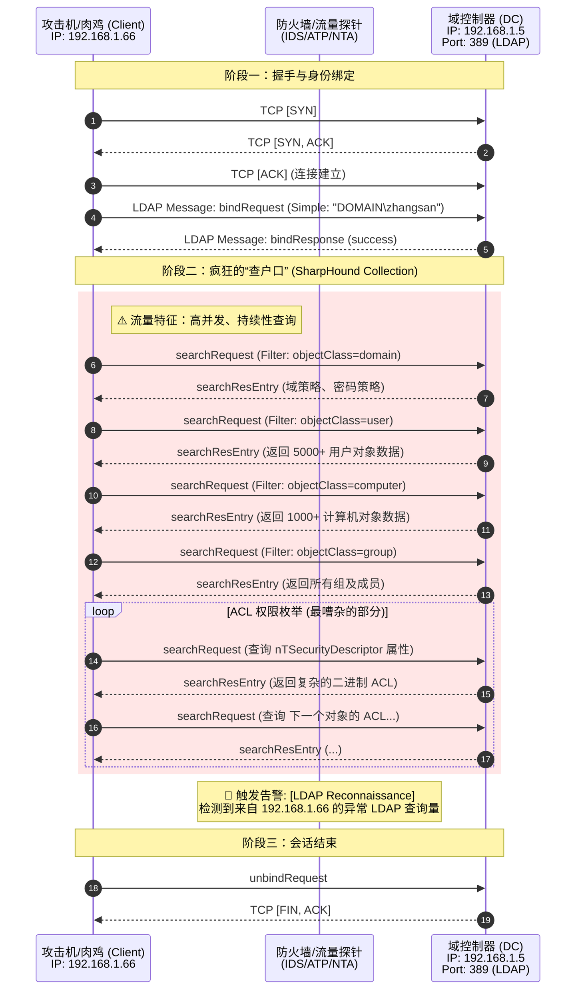

> 域渗透指的是内网环境下的Windows域体系渗透，在windows的认证体系中，涵盖有用户直接操作计算机登录（本地认证winlogin.exe->lsass.exe）、通过网络连接到工作组中的一台设备（网络认证）、通过域连接到域内的一台设备（域认证）
>
> 常言的PTH哈希传递、PTT票据传递、委派攻击等技术，都是基于windows域环境认证技术的攻击行为，这也是为什么在深入学习域渗透前要了解windows认证的原因。

# Active Directory

> 在以攻防为上下文的交流语境中会把AD和域一概而论，造成了AD渗透等于域渗透的混淆。
>
> 而在大型内网的场景下，区分这两个概念对攻击路径的规划其实至关重要。

当我们在谈论域渗透时，重心其实在于域内攻击，关注点是域管理员权限

而AD渗透的重心则放大到了跨域/林攻击，目标是控制整个AD的服务实现

为了能够更顺畅的学习AD渗透，这里把AD有关的概念和技术稍作了解

---

## AD
Active Directory是一种目录服务，它是一个技术体系，基于LDAP(轻量级目录访问协议)标准。

它包含了数据库（NTDS.dit）、认证协议(Kerberos/NTLM)、复制机制（Replication）以及名称解析服务（DNS）

其功能实质是提供身份验证、授权和资源审计

### 域

域是AD的一个逻辑管理单元和安全边界

它是AD架构中的一个容器，用于组织对象（用户、计算机、组）

管理员权限是它的默认边界，域管默认只管理当前

### 域树

域具有域名，比如may.com，由一个或多个子域组成域树

### 域林

由多个域树组成域林

## NTDS.dit

NTDS的全称是NT Directory Services，dit后缀的全称为directory information Tree

它位于域控的%SystemRoot%\NTDS\ntds.dit

它存储了Active Directory中的所有数据，包括架构、配置、域三大分区的数据

其最核心的内容是存储了所有域用户的NTLM Hashes、Kerberos Keys以及历史密码记录

但它被内核级的文件锁保护着，无法直接复制，其数据也是加密的，解密它需要PEK（Password Encryption Key），而PEK被存储在域控的注册表中

## LDAP

上文中有描述到AD是一种基于LDAP协议的技术体系，但AD完全不是唯一基于LDAP的东西，LDAP甚至都不是微软开发的。

- LDAP(Lightweight Directory Access Protocol)是一种通讯协议，它规定了如何查询、搜索、修改目录数据库
- AD是微软开发的一个目录服务产品，它听得懂LDAP语言，所以可以用LDAP协议去操作AD

LDAP是一个工业标准(IEFT RFC 4511)，在非Windows的世界里它同样被广泛使用

LDAP在企业架构中的用途主要围绕集中式查询和集中式认证

- Linux服务器的统一登录
- 应用系统的后台认证 如VPN、Jenkins

在AD渗透过程中使用的SharpHound、BloodHound，它的采集器本质上就是在疯狂的发送LDAP查询，它不进行漏洞利用，只是不停地使用合法LDAP语法询问Domain  controller

# 域认证体系

- 域认证体系 - Kerberos

  Kerberos是一种网络认证协议，其设计目标是通过密钥系统为客户机/服务器应用程序提供强大的认证服务。该认证过程的实现不依赖于主机操作系统的认证，无需基于主机地址的信任，不要求网络上所有主机的物理安全，并假定网络上传送的数据包可以被任意的读取、修改和插入数据。在以上情况下，Kerberos作为一种可信任的第三方认证服务，是通过传统的密码技术执行认证服务的

- 域认证所参与的角色

  Client

  Server

  KDC(Key Distribution Center) = DC -> Domain Controller

- KDC

  AD(Account database):存储所有client的白名单，只有存在于白名单的client才能顺利申请到TGT

  Authentication Service：为client生成TGT的服务

  Ticket Granting Service：为client生成某个服务的ticket

从物理层面看，AD与KDC均为域控

- 域认证粗略流程
  - client向Kerberos服务请求，希望获取访问server的权限。kerberos得到了这个消息，首先得判断client是否是可信赖的，也就是白名单黑名单的说法。这就是AS服务完成的工作，通过在AD中存储黑名单和白名单来区分client。成功后，AS返回TGT给client
  - client得到了TGT后，继续向kerberos请求，希望获取访问server的权限。kerberos又得到了这个消息，这时候通过client消息中的TGT，判断出来client拥有这个权限，给了client访问server的权限ticket。
  - client得到ticket，终于可以成功访问server。这个ticket只是针对server，其他server需要向TGS申请。

-

