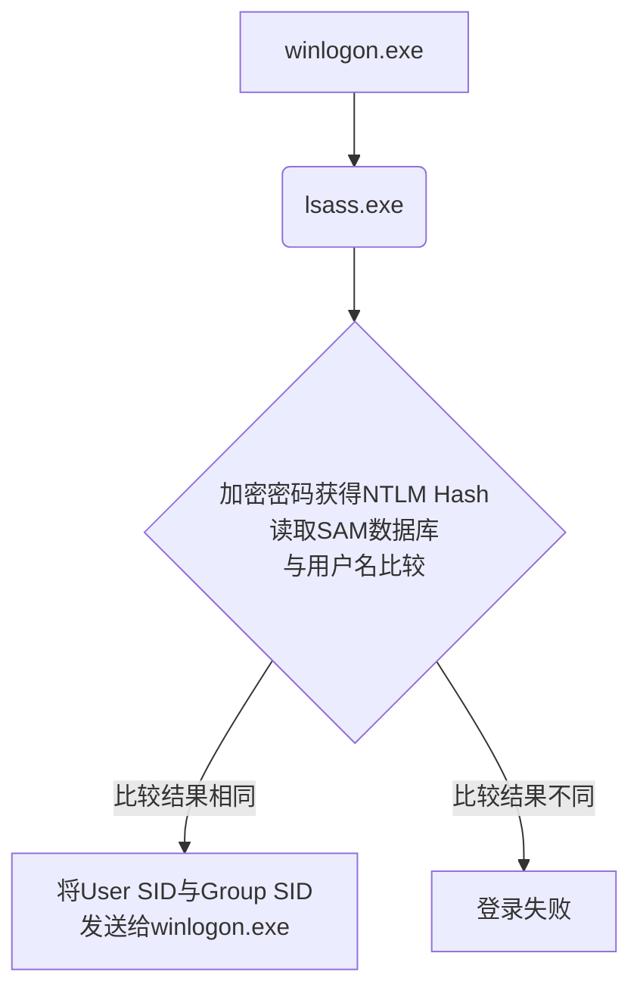
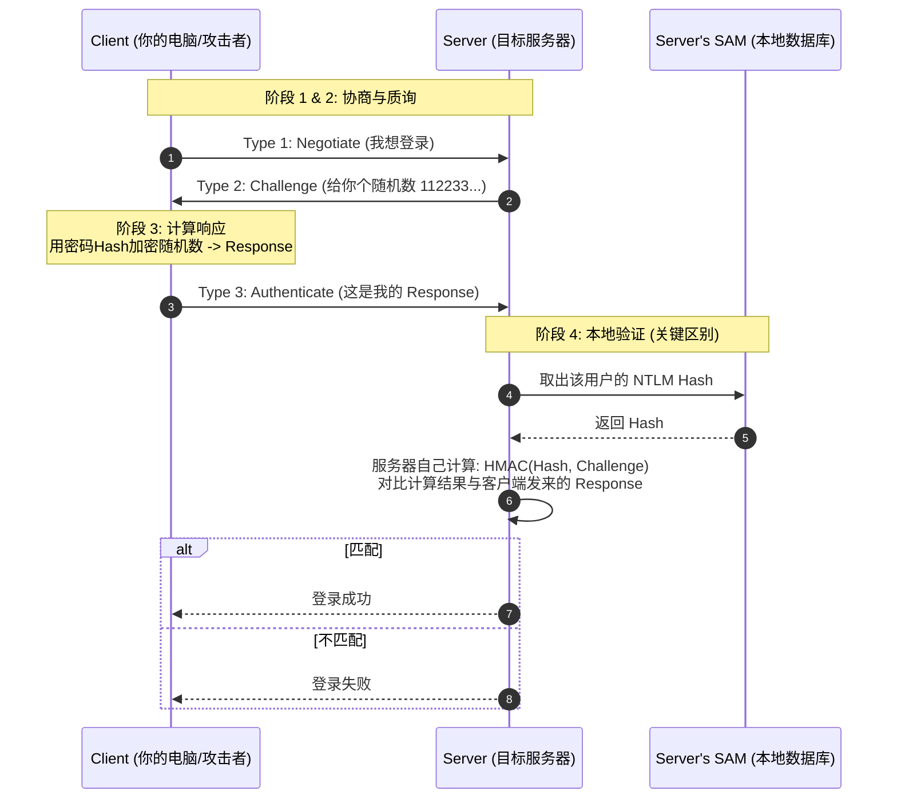

> 域渗透指的是内网环境下的Windows域体系渗透，在windows的认证体系中，涵盖有用户直接操作计算机登录（本地认证winlogin.exe->lsass.exe）、通过网络连接到工作组中的一台设备（网络认证）、通过域连接到域内的一台设备（域认证）
>
> 常言的PTH哈希传递、PTT票据传递、委派攻击等技术，都是基于windows域环境认证技术的攻击行为，这也是为什么在深入学习域渗透前要了解windows认证的原因。

# 本地认证

本地认证尤其简单，用户操作计算机输入密码，操作系统将其转换为NTLM Hash并与SAM数据库(%SystemRoot%\system32\config\sam)中的hash进行匹配，匹配成功则登录成功。

## NTLM Hash

NTLM Hash是支持Net NTLM认证协议及本地认证过程中的一个重要参与物，其长度为32为，由数字与字母组成

NT是New Technology的缩写，指代Windows NT内核。它是微软在90年代推出的全新操作系统架构，用于取代DOS操作系统。现在的win10、win11等其实骨子里都是NT架构。

LM是Lan Manager的缩写，是微软和IBM在80年代合作开发的一种早期的网络操作系统软件。

在Windows NT Hash的前身是LM Hash，是windows最早使用的加密算法，由IMB设计，其加密算法很脆弱，以硬编码密钥`KGS!@#$%`进行DES加密为核心，如今算力对其破解速度之快导致其不再被认为是一种安全的加密算法。

LM Hash的脆弱性显而易见，所以微软1993年在Windows NT 3.1中引入了NTLM协议。

> NTLM Hash = MD4(Unicode-LE(Hex(Password)))

使用python passlib模块可以快速计算

```shell
(py311) ┌──(kali㉿kali)-[~/Desktop]
└─$ python
Python 3.11.13 (main, Jun  5 2025, 13:12:00) [GCC 11.2.0] on linux
Type "help", "copyright", "credits" or "license" for more information.
>>> from passlib.hash import nthash
>>> h = nthash.hash('admin')
>>> h
'209c6174da490caeb422f3fa5a7ae634'
```

通过命令行也可以快速复现其加密算法

```shell
(py311) ┌──(kali㉿kali)-[~/Desktop]
└─$ echo -n admin|xxd
00000000: 6164 6d69 6e                             admin                            
(py311) ┌──(kali㉿kali)-[~/Desktop]
└─$ printf "admin" | iconv -t utf-16le | xxd                                                      
00000000: 6100 6400 6d00 6900 6e00                 a.d.m.i.n.   
(py311) ┌──(kali㉿kali)-[~/Desktop]
└─$ printf "admin" | iconv -t utf-16le | openssl dgst -provider legacy -provider default -md4
MD4(stdin)= 209c6174da490caeb422f3fa5a7ae634
```

其使用的MD4算法加密速度极快，现代GPU对其的破解速度是千亿次/秒为单位。如果密码少于8位，瞬间就会被hashcat等工具破解。

## 本地认证流程



在这个流程中，winlogon.exe负责接收用户输入的密码，lsass负责对密码进行NTLM Hash（使用MSV1_0.dll）然后与SAM数据库做比对。

在后渗透中，lsass.exe也是最大的受害者。因为其为了支持SSO单点登录或者WDigest等老协议，LSASS有时候会在内存里暂时保留明文密码或者是保留哈希，这也是mimikatz的sekurlsa::logonpasswords的攻击原理，它会直接读取lsass.exe的内存，把这些还没来得及清理的凭据转储出来。

# Windows网络认证

在内网渗透中，经常遇到工作组（WalkGroup）环境，而工作组环境是一个逻辑上的网络环境，隶属于工作组的机器之间无法互相建立一个完美的信任机制，只能点对点，是比较落后的认证方式，没有信托机构。一台windows机器不需要做任何配置它就已存在于一个工作组中。

假设A主机与B主机属于同一个工作组环境，A想访问B主机上的资料，需要将一个存在于B主机上的账户凭证发送至B主机，经过认证才能够访问B主机上的资源。

## Challenge / Response挑战/相应机制

微软提出了WindowsNT挑战/响应验证机制，称之为NTLM，是一种对C/R机制的具体实现。

Challenge / Response

这种机制的设计初衷是：在不通过网络发送明文密码（甚至不发送密码哈希）的情况下，证明用户知道密码。

其中，在工作组环境中这种机制的使用相对简单。因为在这种环境下只存在A主机登录B主机的情况，而被登录的主机SAM数据库中存在自身的用户名和密码hash，那么被登录的主机就作为这种机制中的Server角色。



这种信任模型讲究的是相信自身，本质上是零知识证明(Zero-Knowledge proof)的低配版。

零知识证明体系是一种密码学技术，允许证明者在不向验证者泄露任何额外信息的前提下，证明某个命题是正确的。

而工作组信任模型中使用C/R机制属于低配版ZKP的原因在于验证者其实拥有了密码的等价物NTLM Hash，也就是说验证者并不是零知识

真正的ZKP不需要知道密码、也不需要知道密码的hash，它只需要根据数学性质验证证明即可。比如区块链中的ZK-SNAKRS，及时验证者失陷，攻击方也拿不到私钥或密码。

所以工作组的环境中也可以使用PTH哈希传递这种攻击方式，但可能会受到UAC的制约。

