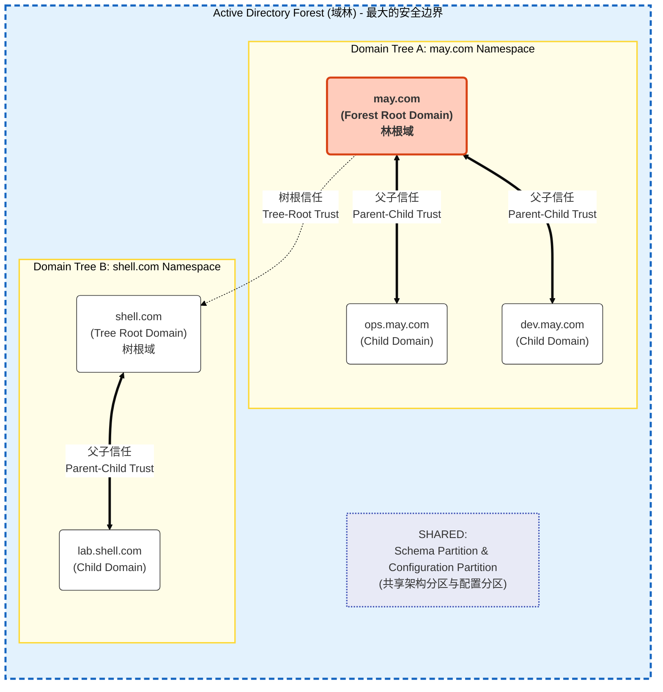
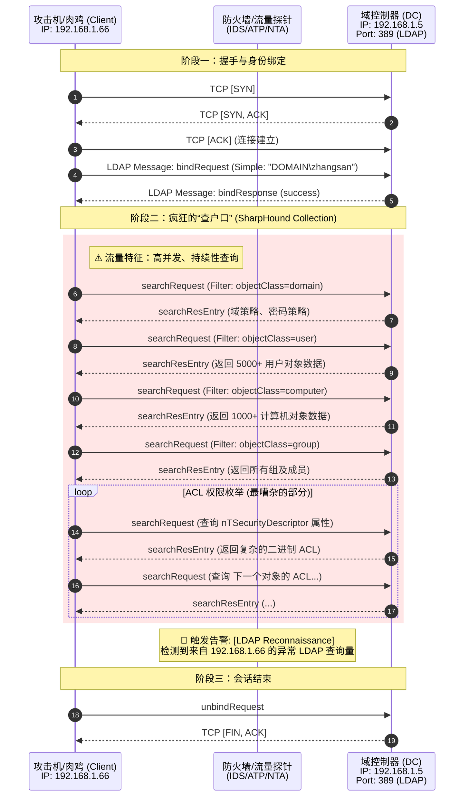
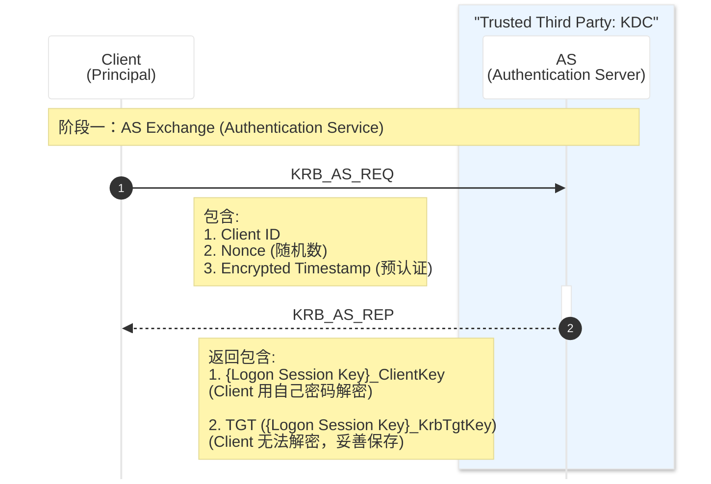
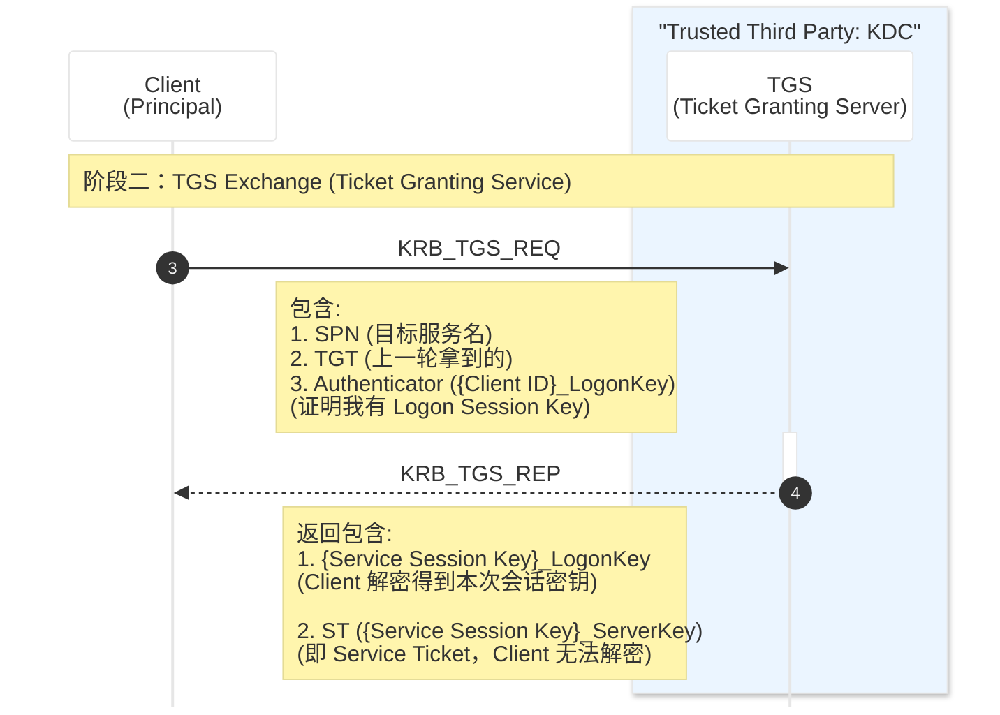
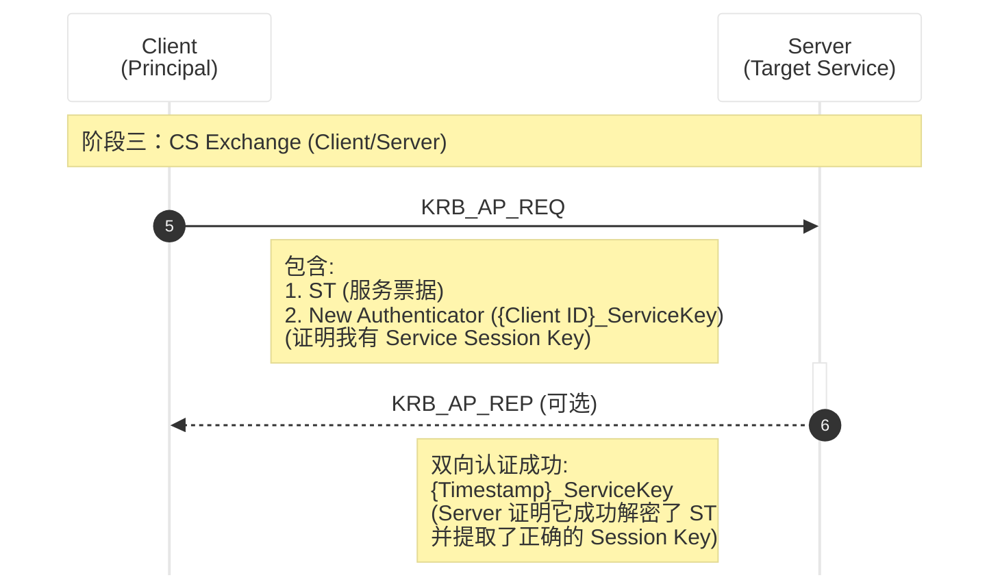
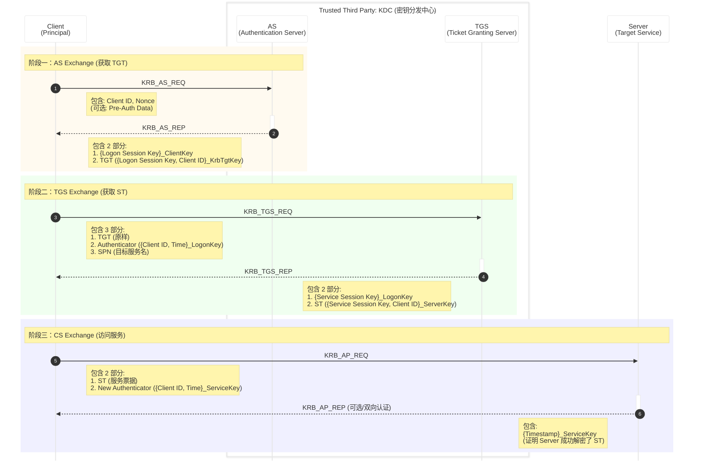

> 域渗透指的是内网环境下的Windows域体系渗透，在windows的认证体系中，涵盖有用户直接操作计算机登录（本地认证winlogin.exe->lsass.exe）、通过网络连接到工作组中的一台设备（网络认证）、通过域连接到域内的一台设备（域认证）
>
> 常言的PTH哈希传递、PTT票据传递、委派攻击等技术，都是基于windows域环境认证技术的攻击行为，这也是为什么在深入学习域渗透前要了解windows认证的原因。

# Active Directory

> 在以攻防为上下文的交流语境中会把AD和域一概而论，造成了AD渗透等于域渗透的混淆。
>
> 而在大型内网的场景下，区分这两个概念对攻击路径的规划其实至关重要。

当我们在谈论域渗透时，重心其实在于域内攻击，关注点是域管理员权限

而AD渗透的重心则放大到了跨域/林攻击，目标是控制整个AD的服务实现

为了能够更顺畅的学习AD渗透，这里把AD有关的概念和技术稍作了解

---

## AD
Active Directory是一种目录服务，它是一个技术体系，基于LDAP(轻量级目录访问协议)标准。

它包含了数据库（NTDS.dit）、认证协议(Kerberos/NTLM)、复制机制（Replication）以及名称解析服务（DNS）

其功能实质是提供身份验证、授权和资源审计

### 域

域是AD的一个逻辑管理单元和安全边界

它是AD架构中的一个容器，用于组织对象（用户、计算机、组）

管理员权限是它的默认边界，域管默认只管理当前域

### 域树

域具有域名，比如may.com，由一个或多个子域组成域树

### 域林

由多个域树组成域林

## NTDS.dit

NTDS的全称是NT Directory Services，dit后缀的全称为directory information Tree

它位于域控的%SystemRoot%\NTDS\ntds.dit

它存储了Active Directory中的所有数据，包括架构、配置、域三大分区的数据

其最核心的内容是存储了所有域用户的NTLM Hashes、Kerberos Keys以及历史密码记录

但它被内核级的文件锁保护着，无法直接复制，其数据也是加密的，解密它需要PEK（Password Encryption Key），而PEK被存储在域控的注册表中

## LDAP

上文中有描述到AD是一种基于LDAP协议的技术体系，但AD完全不是唯一基于LDAP的东西，LDAP甚至都不是微软开发的。

- LDAP(Lightweight Directory Access Protocol)是一种通讯协议，它规定了如何查询、搜索、修改目录数据库
- AD是微软开发的一个目录服务产品，它听得懂LDAP语言，所以可以用LDAP协议去操作AD

LDAP是一个工业标准(IEFT RFC 4511)，在非Windows的世界里它同样被广泛使用

LDAP在企业架构中的用途主要围绕集中式查询和集中式认证

- Linux服务器的统一登录
- 应用系统的后台认证 如VPN、Jenkins

在AD渗透过程中使用的SharpHound、BloodHound，它的采集器本质上就是在疯狂的发送LDAP查询，它不进行漏洞利用，只是不停地使用合法LDAP语法询问Domain  controller

# 域认证体系

在Windows域环境中，认证体系并非只有网络上讨论最多的Kerberos协议，而是由两套平行且互补的协议组成

1.Kerberos（主）：现代、安全、高效。基于票据体系

2.NTLM（备）：古老、简单、兼容性好。基于C/R体系，在上一篇Windows本地网络认证的文章中已有讨论。

决定使用Kerberos还是NTLM的角色是一个名为[Negotiate](https://learn.microsoft.com/en-us/windows/win32/secauthn/microsoft-negotiate)的Windows API。它的原则是能用Kerberos尽量用，用不了时降级使用NTLM，使用IP访问、SPN错误的情况会导致Kerberos无法使用，

## Kerberos

Kerberos是域环境的默认认证机制，也是最复杂的体系。

它由MIT（麻省理工学院）开发，诞生于MIT著名的[Project Athena（雅典娜计划）](https://en.wikipedia.org/wiki/Project_Athena)的一部分。

> 摘自维基百科
>
> [麻省理工学院](https://zh.wikipedia.org/wiki/麻省理工学院)研发Kerberos协议来保护[雅典娜工程](https://zh.wikipedia.org/wiki/雅典娜工程)（Project Athena）提供的[网络服务器](https://zh.wikipedia.org/wiki/網頁伺服器)。这个协议以希腊神话中的人物Kerberos（或者Cerberus）命名，他在希腊神话中是Hades的一条凶猛的三头保卫神犬。目前该协议存在一些版本，版本1-3都只有麻省理工内部发行。

这条三头保卫神犬在希腊神话中叫做刻尔伯洛斯，在神话中说此犬有50个头，而在后来的一些艺术作品中大多表现它有3个头，因此在汉语语境的通俗表达中也常称其为[地域三头犬](https://zh.wikipedia.org/wiki/%E5%88%BB%E8%80%B3%E6%9F%8F%E6%B4%9B%E6%96%AF#%E8%B5%84%E6%96%99%E6%9D%A5%E6%BA%90)

而MIT的开发者给这个协议取名为Kerberos并使用地域三头犬的形象logo，不仅仅是因为历史缘故，更是因为这三个头完美对应了Kerberos协议赖以生存的三个核心实体

### Kerberos的三个核心实体

在Kerberos协议的三角关系中，这三个头分别是Client、Server和KDC

Client是想去访问域内资源的计算机，Server是被访问的目标服务器

KDC是最关键的那个实体，全称为Key Distribution Center密钥分发中心，它是整个体系中的信托

而KDC主要包含AS、TGS和AD

- Authentication Server：负责验证用户身份，发放TGT
- Ticket Granting Server：验证TGT，发放ST
- Account Database：存储所有Principal（用户、计算机、服务）的长期密钥

### Kerberos认证过程

第一阶段，Client会携带Client ID、Nonce（随机数，防止relay攻击）、Encrypted Timestap向KDC发起KRB_AS_REQ请求，该请求会被AS接受并验证，如果验证成功，AS会返回KRB_AS_REP，其中包含Logon Session Key，是使用Client的Long-term key进行的加密，client也可以使用它来解密。其次返回TGT(Ticket Granting Ticket)，它是使用KDC自身的Long-term Key加密的(也就是KDC上krbtgt用户的hash)，client无法解密TGT，只能原样持有。

来到二阶段，client已经具有AS发放的TGT

Client利用TGT向KDC的TGS申请特定服务的Service Ticket，简称ST

其中会携带SPN(Service Principal Name)目标服务主体名称、TGT和Authenticator（是一阶段AS返回的Logon Session key解密后加密的时间戳，用于证明其是TGT的合法持有者）

TGS使用krbtgt密钥解密TGT，获取Logon Session Key，再用它解密Authentictor。若验证通过，TGS生成Service Session Key（服务回话密钥），并返回ST（Service Ticket）和Encrypted Service Session Key（使用Logon Session Key加密的新生成的Service Session Key 供Client解密使用）

最后到第三阶段，client已经取得了访问目标服务的ST，那么在这个阶段KDC不再需要直接参与

client携带ST和New Authenticator发送KRB_AP_REQ请求，Server接收到后使用自己的Logon-term Key解密ST，提取出Service Session Key，然后使用该Session Key解密Authenticator，验证时间戳

完整的通信过程如下

为了加深对Kerberos通信过程的印象，明确一下核心术语的精确含义：

- Session Key（会话密钥）

  由KDC生成的临时、短效的对称密钥。它用于在不传输Long-term Key的前提下，加密Client与KDC或Client与Server之间的通信

- Authenticator（认证符）

  由Client生成的数据结构，包含Client ID和Timestamp，并使用当前的Session Key加密。它通过证明Client拥有Session Key来验证身份，并利用时间戳防止Relay重放攻击

- Ticket（票据）

  一种将Client身份信息和Session Key安全的从KDC传递给Server的封装结构。Ticket总是使用接收方的Long-term Key加密

- Long-term Key（长期密钥）

  它是Principal（用户或计算机）与KDC之间共享的长期密钥，它被静态存储在KDC磁盘的NTDS.dit文件中，除非用户修改密码，否则它永远不会改变。

